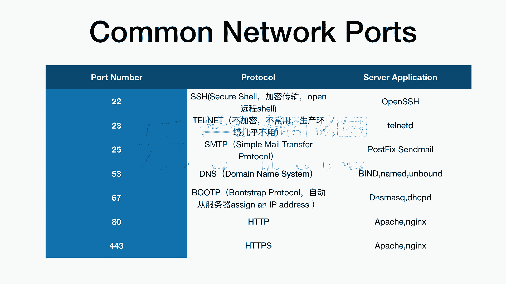

# 乐学偶得｜Linux云计算红帽RHCSA／RHCE／RHCA - P15：14.常见port端口及协议了解 - 爱学习的YY酱 - BV1ai4y187XZ

好了，上一节课呢我们讲到了这个ID。好了，上一节课呢我们讲到的这个IP address啊，就是我们每个电脑的一个IP地址。

还有呢就是port就是它的一个端口我们现在来看看我们常见的这个common network port我们这个互联网常见的一些端口端口的一些号码以及他们些 protocol还有 application啊首先我们看看有2223255367还有80还有43啊。

这些呢都是一些常见的一些端口的一些号码啊，这些号码的话一般都是约定俗成的，大家一般都不会改这个号码啊，比如说22啊port number22。

他们呢是使用的什么pro呢是使用的这个叫H协议啊H相当于就是叫做s啊，相当于是一个非常这个安全的一个he的一个通道啊，它这个平常是用在这个加密传输啊，比如说你有文件在本地，你想把它传到这。

服务器传到serv或者serv有一些文件的话，你要把它传到本地等等。这个它用在这个加密传输是非常非常多的一个方面啊，还有呢就是我们可以通过本地我们可以这个打开远程的这个啊，对远程服务器进行操作啊。

一般呢也可以通过这个SSH就是s shell进行这个操作啊，这个SHSSH，它对应的这个port啊，它对应这个端口的号码呢就是22号。呃，还有呢这个2323这个端口呢。

它对应的是叫做tenettenet它是一个不加密的啊一个一个protocol啊，所以说因为它不加密呢，它现在几乎运用几乎都不太常用了，你几乎都没有看到有人会用，但是我们时不时会测试一下。

就是为了测试这23这个到底有没有开以说我们在生产环境里几乎不用这种不加密的这个2323几乎不用啊再就是这个2525大家一看这个MTP就是s mail transfer啊觉得好熟悉啊。

是不是啊啊这个是我们运用的非常非常多的，就是一个邮件传输的一个pro就是比如说我们经常这个这个邮箱啊邮箱不是你在某一个地方去注册一个邮箱之后呢，你想通过这个手机也想把这个邮箱啊也要连上啊这个时候呢。

你要把这个邮箱这边MTP这个这个proto要开掉开了之后呢，你才能。进行这个传输啊，这是这个port twenty five25啊，53呢53就是DNS啊domain name system啊。

这个呢是也是大家应该看的很熟是DNS我们一看一个是IP一个是DNS觉得平常听的好多啊，是不是DNS叫做omain name system是一种这个我们不是每个服务器都有一个IP嘛。

包括每个电脑其实都有一个IP address都有个IP地址。但是呢这个我们平常访问网页的时候，从来不会记这个IP地址。因为有时候它这服务器的话，它这个IP的话还在变。

是不是它根据这种不停的这个进行分配的。所以说我们平常都是记记得3W点什么什么什么com或者到CN等等啊？我们平常记的都是这些东西。

这些东西呢它要通过这个doomain name system啊进行分配服务器啊，相当于这个DNS就是干这个事情的啊，它的这个port是53。像这个67呢叫做bo protocol啊。

就是bo啊这个呢是用这个自动的我们每个电脑可以自动的从服务器啊 assignign anip address服务器自动的去分配一个ip address的个这个我们在后面要用到现在的话我们就了解一下大家其实没有必要把这个东西去背下来啊。

大家只是做一个简单了解就可以了啊80和这个43分别是HT和这个HH我们知道这个平常经常你说有什么攻击啊什么的，经常找到漏洞。

就是HT的为什么因为它少了个SS就是Q嘛你是一个这个加密的一种版本是一个安全的版本的H传输啊你看他们在这个用的比较多的就是这帕还有这个啊这个的话也是非常非常多的一个运用吧这个的话我们在后面做这服务。

及后端的时候啊，肯定会介绍到这边的啊，大家先了解这个post number，看的眼熟，然后proical大家啊一看的话，不要以后说了之后完全不了解啊，大家看看眼熟就行啊。

目前我们就了解这些常用的network啊ports啊就可以了。

