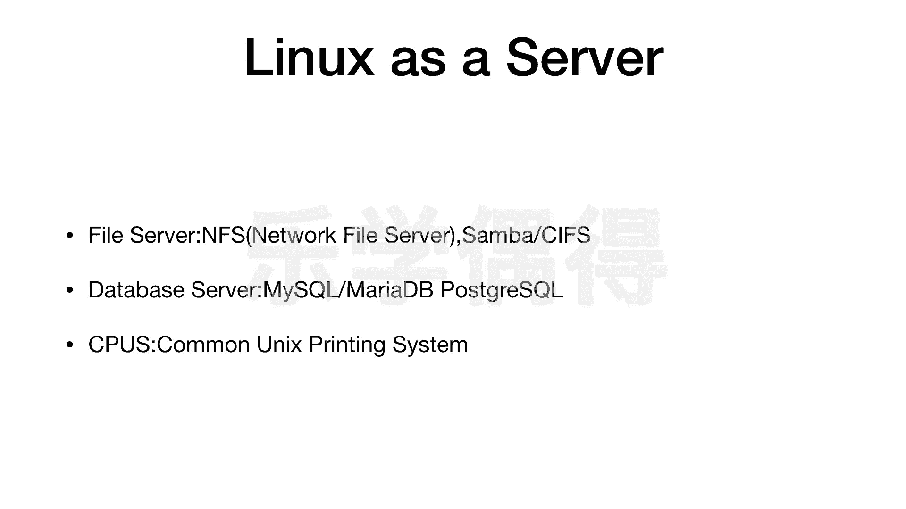

# 乐学偶得｜Linux云计算红帽RHCSA／RHCE／RHCA - P16：15.Linux作为服务器的运用 - 爱学习的YY酱 - BV1ai4y187XZ

好了啊，我们看了一些port之后呢，看了一些端口之后呢，我们再来介绍一下linux它如果作为服务器可以作为什么样的服务器呢？

是不是它 as a server what kind server lin我们可以看lin可以用作这以下三个方面啊。

这个都是非常非常常见的这用作服务器的方面以跟大家介绍一下大家了解一下第一个方面呢是叫做这个 server相当于是文件的服务器啊。

这边运用比较多的呢首先一个叫做这个 n f叫做network file server相当于是网络的这个文件的这个服务器这个呢是这个非常非常多的叫unix style system里面非常多的就相当于是个以这个ix作为分支各种各样分支的这种操作系统非非常常见。

这个叫做这FS的这个服务器啊相当于我们可以把这个服务器架起来之后的话在网上的。话去进行文件传输啊，作为一个文件传输的一个服务器。啊，还有一个呢就是这个3版。

还有这个CFS3版的CF嗯它全称呢叫做com file system啊，它是一个嗯microsoft的一个一个一个一个serv message block嗯，怎么说呢？

就相当于我们作为这个linux服务器的话，它可以呃通过这个microsoft的这个这个这个协议啊。呃，通过开源的这种情况下跟micsoft进行这个这个文件传输啊。

这个的话相当于是这个跨平台的一种传输协议吧。啊它用的是个micsoft的 server message block protocol是用的这个微软的这个文件传输的一个协议。呃。

还有一个呢就是用的比较多的叫做datbase server啊，相当于是数据处理的服务器啊数据处理的服务器用的比较多的就是my sql和这个marmy sq和呢。

它现在应该是甲骨文公司所拥有的吧是现在目前世界上最最流行的这个开源的数据库管理的一个一个一个软件my sq啊这个呢我们今后肯定要介绍的myq还有一个呢就是这个mar呢它其实跟my sql有点像啊。

我觉得其实说实话就是几乎就是把它这个克隆过来的但是呢它不是甲骨文公司所有的，所以看大家喜好吧啊，我觉得还是用这个my sq比较好像这个post grayq的话它是一个加更加高阶的一个版本也是一个开源的。

也是一个。对这个数据进行管理的一个系统啊，叫postgre SQL啊，这个我们后期跟大家介绍一下吧。这个先把这个my sQL先学了之后的话，再去介绍postg SQL比较好。

因为它这个还是属于比较高阶的内容。啊，当然了还有一个呢这个这个不是CPU啊，叫CPUS啊，这个CPUS呢叫做commonun printing system啊，是这个。嗯怎么说呢？

就翻译成中文应该叫普通的unix打印系统吧啊这个呢主要是由苹果公司去开发的一个叫print server啊，相当于是你可以把它放在远程的话，作为一个呃作为一个服务器。这个服务器呢可以跟你去打印啊。

它也是个开源的，主要是由苹果进行开发的啊所以说大家看一下，我们如果把linux作为一个服务器的话，它其实可以进行文件传输啊，也可以进行这个数据库的管理啊，当然也可以进行这个打印啊等等啊。

这些其实都是可以实现的。所以说它的服务器这方面运用的话，也非常非常广泛啊，我们再把基础的这个讲完之后的话，我们会跟大家去介绍一下这个以这个amazon啊，还有这个国内的这个阿里云啊等等。

这些呃云平台怎么在他们这些上面的话啊进行这个云计算啊，这样的话可以把我们这个本地的一些计算啊，全部在云端去完成啊，这样的话其实也算一个linux一个比较好的一个应用吧。这节课就讲到这。

