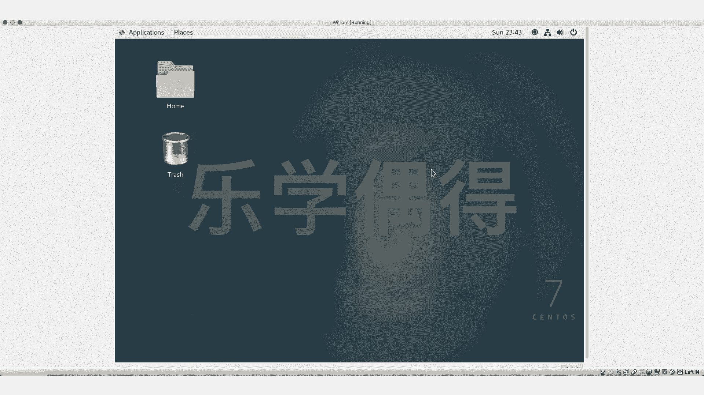

# 乐学偶得｜Linux云计算红帽RHCSA／RHCE／RHCA - P17：16.怎么从虚拟机里逃出来 - 爱学习的YY酱 - BV1ai4y187XZ

好了啊，有些同学呢可能比较着急这个他这个虚拟机里面东西一装好之后，他就开始自己操作了。操作的时候的话，他会点一下这个虚拟机里面这个页面啊，会出来一长串文字啊。

可能有时候就没具体这文点了cap发现我就在虚拟机操作的好突然我外面有个什东西出现了外面去看一发现鼠标移不出去了然后我们再按键盘按按什东发键盘跟虚拟机器进行交按东西其实都出不这个了就开重启了这个时候我们不要不要着急啊。

它其实有个scape键我们可以看这个虚拟机下鼠移不出右下个就个个相当于mac特有的一个conl相当于有m的wind那个键就是一个花的一个键我们按一下左边这键出现了两个鼠标是不是。

这个鼠标就是我们外面真实机器这个鼠标我就可以移出来了啊，进行这个放大缩小的操作，其实都是可以的啊，我们再点一下然后capture啊，那就捉进去了。

相当于我们到这个虚拟机里面去啊这个相当于是啊对真实机器和虚拟机器里面进行一些切换每个不同的电脑的话，就切换的键是不一样的 box它会在右下角进行提示，所以说当你进去的时候一定要注意看看右下角是什么键啊。

你要把这个键的话掌握清楚，要不然的话一下万一你一下子全屏全屏后的话就看不到这个东西。那你就那你就糟糕了，是是但是一般都是window的那个键或者是这个m它有一个这个mac的一个这个新的这个键啊。

一般有时候是左边有时候是右边个要每个机器它不一样，它会提示不一样的啊，这个相当于就是教大家怎么样这个按一下，然后就脱离出来然后再点一下就cap进去。啊，其实capture进去之后的话。

你的键盘里面输入的话，其实也被capture了，也被啊这个虚拟机里面的这个系统去捉住了。这样的话你所有的输入都不会对外界产生影响，只会在这虚拟机里面啊产生影响。

