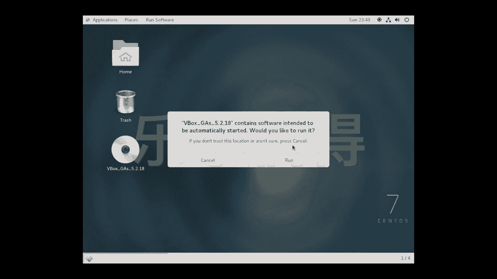
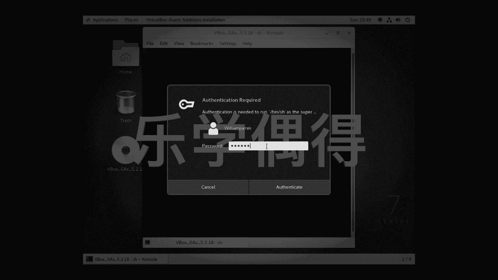
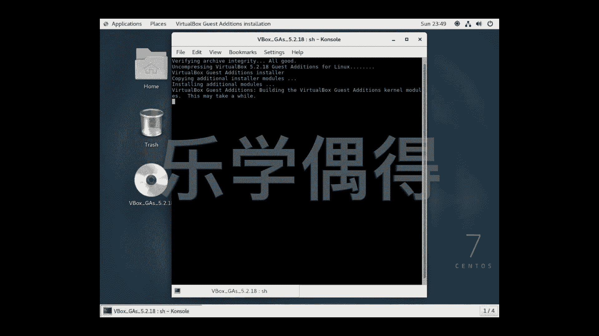
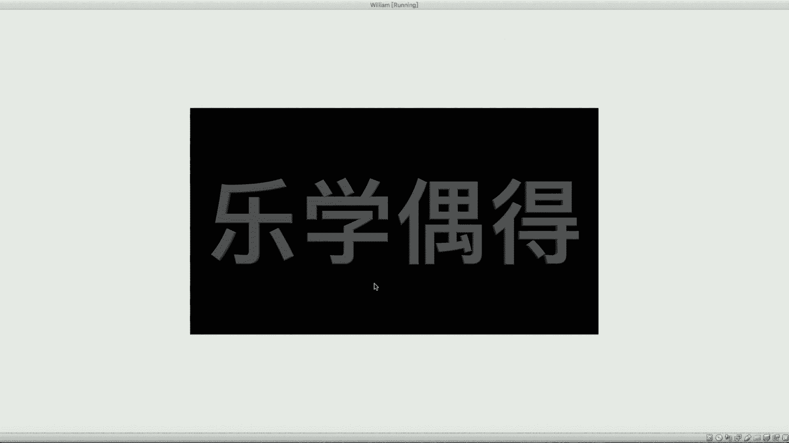

# 乐学偶得｜Linux云计算红帽RHCSA／RHCE／RHCA - P18：17.外貌协会的福音 - 爱学习的YY酱 - BV1ai4y187XZ

好了啊，我也知道很多同学可能是外贸协会的，是不是啊，觉得这个这个centOS的呃这个界面好像太小了，这个界面倒是挺好看的，是不是？但是这个太小了，分辨率太小了，的话感觉啊不好看啊。

这个时候呢我们应该怎么办呢？啊，ver box还有另外一个功能啊，我们先按exscape就上节课我们学学过了这个键呢。啊，按住这个键之后的话，我们就可以到我们真实机器的这个页面了啊。我们可以看上面。

上面的话这个我们打开是virtual box，是不是我们看这个device， deviceice里面有insert guest addition c the image啊，我们点一下这个。好。

点了之后的话，我们再切到这个里面来。大家发现没有？哎，说好像我们这个在虚拟机里面插入了一个光盘，然后呢。

他说这个contain software intended to be automatically started  would you like to run啊。

相当于他说这个呃相当于插进来的这个光盘呢，会自动进行运行的。我要不要去运行它呢，我当然是要运行它。好，我们这时候要输入我们这个这个管理员的一个密码啊。

这个密码就大家就输入大家自己最开始呃在安装界面的时候输入密码就可以了。好，一旦确认之后的话，我们就会自动开始安装。

好，这个安装呢可能大家要等一会儿啊，因为它相当于会把这个virt box里面啊它自带的一些东西，会把它啊安装进去。安装进去之后的话啊，我再给大家去截一个图，相当于中间的话，因为时间太长了啊。

我就不跟大家去耽误大家时间啊，最后安装完毕的时候，我们再来看到底会出现什么好了啊，我们这个安装完之后的话，就可以把它关掉了。关掉之后发现发现好像没什么东西发生，是不是啊啊，这个时候我们不要着急。

我们点一下这个右上角的啊，这个关机，然后让它重启啊。

Restar。啊，install pending software update update相当于我们要进行更新啊，这个大家选中，然后呢进行重启。好，我们就稍等待片刻，然后呢。

看看他重启之后会发生什么。

好了啊，现在呢就是我们整个重新启动之后的这个结果啊，大家可以看一下，我们整个这个界面是变得非常非常大，而且非常漂亮，分辨率也非常高，是不是啊，如果你的分辨率感觉还是有点不高啊。

很可能是你这个scale了之后的缘故，你可能之前进行了放大啊，这个时候我们scape出来出来之后，然后这边有一个这个view啊scale factor。比如说我们之前可能调的是150啊，大家可以看一下。

这样的话，其实就很花啊，这个时候的话我们就把这个150啊。就改成这个最开始的这个百分之百啊，这样的话其实就达到了它这个精准最最高的一个页面啊。这个话我们可以inject把它弄出去啊。

我们整个的这个呃dextop的环境配置的话，已经就配置好了啊。大家呢就可以在这个分辨率非常高的。因为我知道大家是外贸协会嘛啊，既然这样看的话，舒服的话，我们之后学了这些知识的话就会更加快啊。

我们就来这个页面下进行操作。

