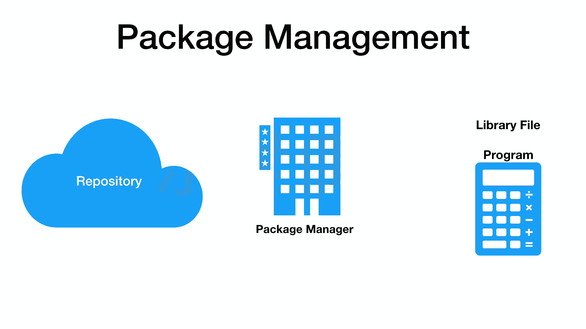
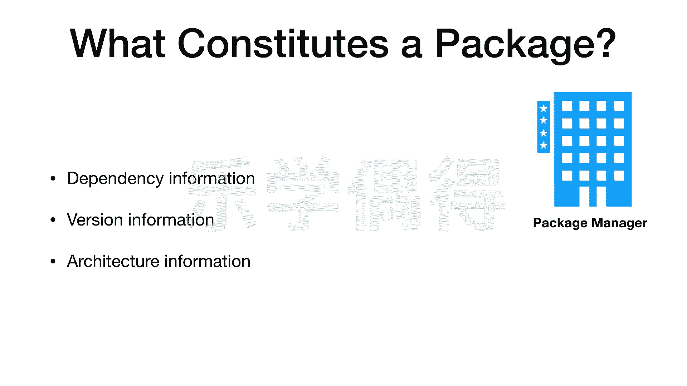
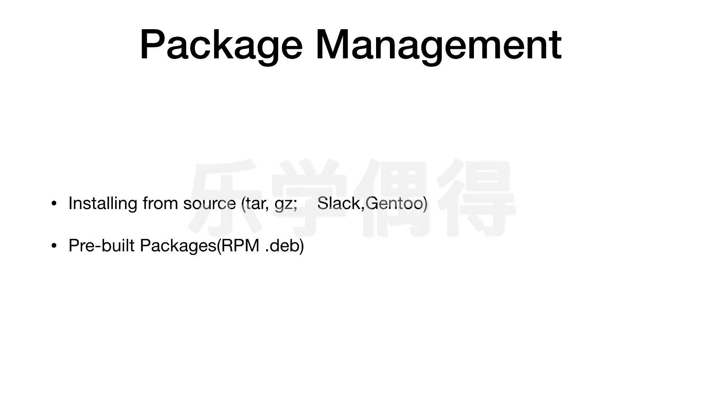
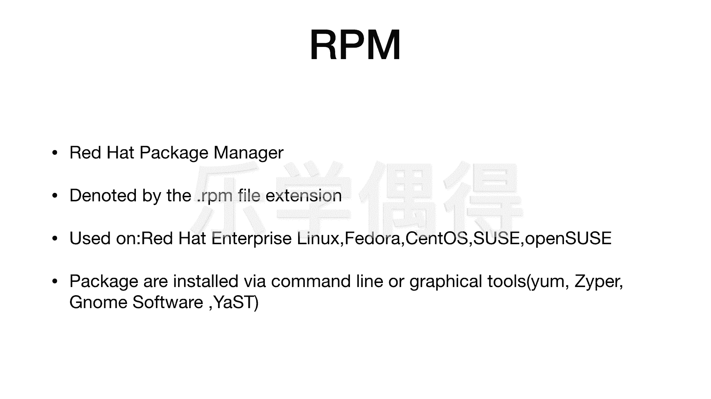
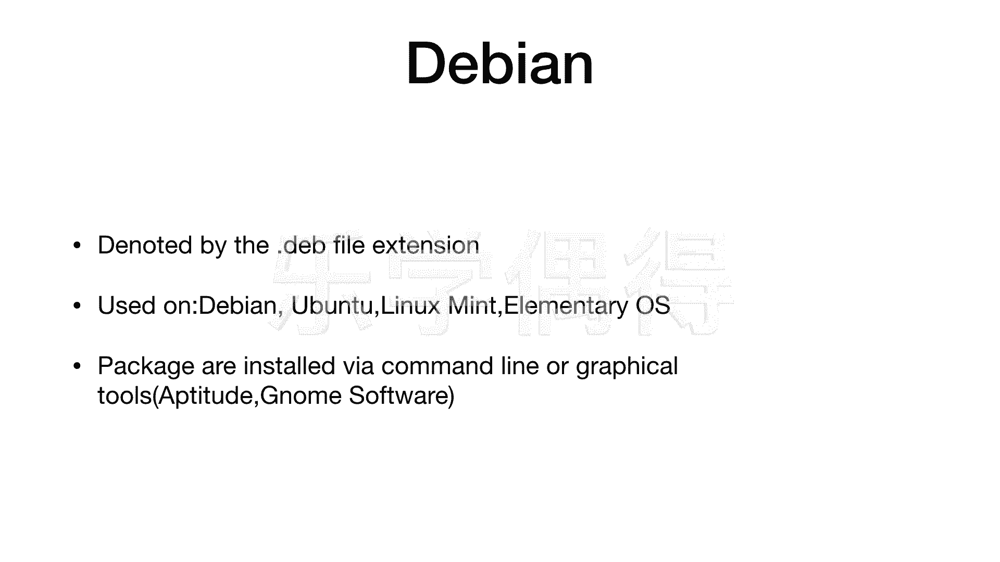

# 乐学偶得｜Linux云计算红帽RHCSA／RHCE／RHCA - P19：18.程序安装方法 - 爱学习的YY酱 - BV1ai4y187XZ

好了，呃，这节课呢我们主要来介绍一下package management啊，就是我们在这个linux系统里面的各种包的管理啊啊我们知道我们平常用这个windows或者是max系统的话啊。

安装文件的话好像非常简单，是不是像在这个windows系统上面的话，一般都会有一个安装程序，我们点开，然后呢一路点确定啊，之后的话就自动的就会啊把这个程序去安装在我们电脑上啊。

如果我们是用max系统的话，好像也挺简单的，是一个叫做DM机的一个啊一个格式的一个文件，我们把它打开，然后直接拖到application里面啊，这个更加傻瓜，更加简单，是不是？

但是linux它安装程序啊就不太一样啊，linux它有一个包概念，有个package的这个概念然后呢我们linux每一个dibution啊，它其实都会有一个repository，有一个仓库。

这个仓库呢是在云端啊，如果你去安装的时候，很可能还有就是找最近的这种镜像啊，它相当于就是离你最近的一个应该是物理物理地址最近的啊，应该也算速度最快的一个地方啊。

那个地方的云端会装到啊你这个linux这个你用的这个系统啊，你用的这个ditribution里啊，所需要的呃一些安装的一些程序都会在这个repostsitory在云端的这个仓库里面去储存的。

然后呢你电脑上啊啊如果是想要去安装这一个程序的话啊，你就要通过某种方法啊啊，然后呢像这个云端发行一个请发一个请求，相当于把这个东西从云端下载下来，是不是？

然后呢你这个电脑上呢专门还有一个叫做这个package manager啊，是专门一个这个包的一个管理的一个程序啊。这个程序呢负责去呃去追踪你这个电脑上有什么样的包，需要什么样的包安装。

如果从这个resory里面要安装一个新的这样包的话，嗯需要什么样的dependency，需要什么样的这个依赖的一些环境啊，或者是依赖的一些程序啊，它都会跟你一块下载下来啊。如果你要去删除的话。

或者是要更新的话，也需要用到这个包的一个管理器，就是这个package manager啊，所以说linux系统还是有一点跟我们之前用的不一样。不过呢它的学习曲线呢，就是非常非常陡峭的。

就是说我们最开始可能觉得有点不熟悉。但是一旦熟悉下来之后的话，我们的进步会非常非常快。好，我们这节课呢就还是从最简单的讲起啊啊，就简单介绍一下package management。

啊，我们刚刚一直在说这个package manager是不是？那到底它管理的这个package到底是个什么东西呢？

是不是就是说这个package它里面啊包含着什么样的信息呢啊其实主要就是包含这三个信息叫做dependency information，还有 information。

还有ectural information啊主要包含这三个第一个dependency information就是你这个包啊如果要正常的工作它要依赖着什么样的环境依赖着什么样的其他的文件啊。

所以说呃你如果要安装一个包的话，必须要这个package manager就会去识别这个包，它如果要正常运转，它需要什么其他的东西。比如需要A需要B需要C，它就会把这些这个需要的东西啊会列出来啊。

这样的话你就能明白。而且呢你每次安装的时候，这个package manager它会自动的把这些需要的一些dependency的话。

全部一并的安装安装上去这样话其实省去了我们这个平常配置这个环境需要操作不少心啊，这也是一个。我们时间的一个方法。第二个呢就是version information。

就是你用的这个是什么样的版本的这个这个程序啊，你在这个看这个package的时候，你在看这个包的时候的话，这个包它会有一个基本的信息，就是这是几几版的1。0点几几版的啊。

它一般会有显示这样一些这个版本的一些信息。version information啊，这个你相信大家平常应该也很熟悉啊，第三个呢叫做architectural information啊。

这个叫做构造的这个信息啊，构造的信息是什么东西啊啊，其实说实话他说的挺高深的。其实就是我们平常说的，比如说它这个这个CPU。CPU到底是这个这个32bits还是这个64bits啊。

它相当于是嗯这个package，它到底是为什么多少位的这个这个CPU啊去准备的啊，这相当于就是一个这样的信息，到底32还是64位的啊啊，这个其实都没有什么太高深的东西啊，就是它的一些基本信息。

那么我们如果想这个做这个package management啊，我们在不同的这linux系统上面的话，其实用的东西是不一样的啊。比如说我们如果要在linux上面去安装这个程序的话啊，有一种最简单的方法。

就是直接把这个这个从从source里面去进行安装，从这个源代码里面进行安装。比如说这个ta这种样子的啊，你直接把这个有点像一个打包的一个压缩文件吧啊，你把这个东西直接通过这种东西呃这种形式。

通过ta或者这个GZ这种形式去安装啊，这个的安装用的比较少啊，用的是这个linux里面特定的几个版本，像这个sack和这个genle啊，用的比较少，只有这个slaack gentle。

目前我觉得应该只有这两个在用吧，就是直接通过源代码里面去安装啊，所以说我们在这里就不展开介绍。因为毕竟还比较小众。呃，我们现在主要介绍的是这个叫prebutte packages啊。

相当于这个他把你这个包啊已经打装好打包好了。打包好之后的话，你直接通过它的一些这个呃格式化的一些东西，直接就可以去安装啊，主要分两大派系啊其实这也是这个lin它的di分的这个两大派系一个呢是红帽的体系。

一个是de的体系，红帽是 hat嘛包括我们今后也是走了这个ret这一条体系的道路。因为re有一个特别权威的一个世界级一个认证啊，就是红帽认证，从这个红帽的系统管理员到这个认证工程师到这个架构师啊。

一条非常光明的这个职业道路吧啊所以说这个我们还是着重介绍这个红帽。但是呢这个de的话因为大家用这个物邦图的系统的话也比较多啊，自己如果个人电脑的话，自己想玩也也会很多人也会装这个物邦图的系统，他。

两个去安装的这个方法稍微有点不一样。但是呢其实也差不多啊，你这个呃了解一下，我也会在这里会跟大家去介绍啊。

首先呢介绍这个PM这种方法。RPM它的全称叫做这个red hat package manager啊，大家一看red hat叫红帽体系，是不是啊它是虹贸体系的这个包控制器啊。

我们其实很简单就可以看看得出来它是这个这个红帽体系的它这个安装包它那个结尾啊t啊，你可以看它的这个扩展这个名啊是t结尾的你看到这个的话就知道啊这个安装包是红帽体系的安装包啊。

你肯定是用的这个红帽这个系的一个系统啊，我们如果是要在这个这个 hat就是 hat企业版本上去安装，当然就要用这个这个版本的，当然还有红帽体系的一系列的。

比如说这a欧洲用的比较多这个ie还有en啊这个呢我们在前面应该是最开始入门的那几节课应该跟大家都介绍过了。大家听这个名字应该听的也挺耳熟的，是不是。嗯。在这些系统上，如果你要去安装的话。

一般都是通过这个RPM这个文件去安装啊，我们去安装的时候的话，也可以通过两种方法，一种呢是直接通过这个命令行这com line方法去安装。还有一种方法是这个graph图，就是我们在这个这个桌面界面啊。

我们可以直接这样去点去安装啊。嗯，当然了，我们这个还可以用各种各样的命令。就比如说像这个ym啊，m我们后面直接会这个跟大家去演示的啊，用最多的就是这个y这个命令啊。

它是一个这个com line一个命令啊，我们用这个ym命令的话，一般用的比较多的是 enterprise当然这个是红体系下面的，是不是这三个的话都是用的这个m去进行安装的啊。

我之后的话会跟大家在这个s上面进行啊讲解。因为这还是入门。我们先以cent入门啊在今后的这个红帽认证考试的时候的话，我会跟大家在这个呃这个re hat这个enterprilin上面进行演示啊。

那是红帽这个企业版本的进行演示。呃，还有这个呃ziperziper其实也是一个com line是通过这个命令行进行安装的。它用的比较多是sie和 openen su啊。

我们现在因为嗯我觉得应该是欧洲这边用的比较多吧这个和 open，所以说跟大家也介绍一下，但是呢也不展开如果是大家在这个图形界面或者是这个desktop里面去进行安装的时候的话用的比较多的是g software还有这个yest啊。

其实 software在这个这个a里面其实就是它的一种桌面版本，桌面版本进行安装的一种方法这个y在这个和 open su里面用的比较多啊，我们也不展开，我们主要这个介绍鸿系的。

第二个呢无法忽视的就是呆的话，也占据了这个非常多的个人个人电脑的这个linux的市场吧啊就是它这个乌邦图呃主要是也比较好看而且呢我觉得在美国嗯这种做研究啊，或者是做这个编程的人员的话。

用邦图其实也比较多啊呆所以呆系统的话也是一个无法无法绕开的一个话题吧。呆的话我们跟之前的这个呃前面刚刚讲的这个红帽体系这个PM的话，它的这个exion它的这个扩展名呢稍微有点不同。

它是点b啊相当于是de的这个开头啊DEB啊，我们一看这个就知道哦它是呆体系下面的呆体系下面的话那举几个比较经典的。de啊无邦图linux min还有elementary OS啊。

我们用这个嗯mint还有无邦图比较多吧啊，应该我觉得这个世界上。我们在这个de系统里面去安装的话，可能就没有红帽那边那么多的选择啊，它其实只有两种方法啊，一种呢是这个通过命令行 line进行安装。

还有一个呢是个graph的进行安 line就是这个也是非常经典的一种安装方法还有呢是这个graphalgr software啊，其实你看 ground的就是很多图形的话其实这个这个所谓这个桌面的系统啊。

其实都 ground啊，只要是g的话差不多都是 software进行安装，所以说也有一个通信在里面，它相当于也跨了个因为内核并竟是内核嘛，是所以说还是有一点共共通之啊，其实就是命令有稍许点不同。

其实最终的话他们本质也都是一的大家用了，其实也不多这节课呢就跟大家先介绍到这。

