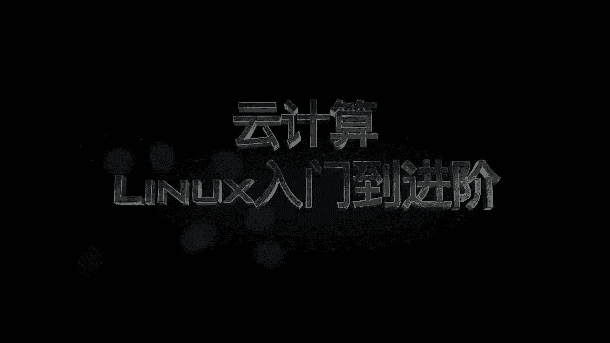

# 乐学偶得｜Linux云计算红帽RHCSA／RHCE／RHCA - P1：Linux介绍 - 爱学习的YY酱 - BV18p4y1X7AJ

🎼这是最好的时代。🎼从1969年互联网诞生至今。🎼近半个世纪。🎼这个世界。🎼已经得到了飞速的发展。🎼万物互联。🎼智能家居。🎼智能穿戴。🎼甚至在大叔据的下半场。

🎼我们开始探讨人工智能的可能性。🎼那么。🎼在这个日新月异的世界。🎼我们作为个人。🎼该如何提升自己的能力呢？

🎼大家好，我是微玉。🎼默取有得介绍前沿技术与各行业的结合点。🎼在这一系列视频中，我们会跟大家介绍支持大数据人工智能的基石技术。云计算中的lininux零基础入门到红帽系统进阶。

