# 乐学偶得｜Linux云计算红帽RHCSA／RHCE／RHCA - P20：19.实战操作如何安装httpd - 爱学习的YY酱 - BV1ai4y187XZ

好了各同学大家好啊，我们上一节课呢学了这个package management，相当于在linux里面怎么去把程序进行安装啊，我们现在就来实际的去演示一下啊啊。

我们先可以把这个plication点开然不是我们当然不会那么直接过图形安装了。我们当然直接通过命令行进行安装啊所以说大家就直接把命令行打开打开之后呢，我们直接通过命令行进行操作。

就不要这个直接通过图形安装了。因为我们毕竟要专业一点，是不是不能在这个上面去点点了，那就其实很不专业了啊，我们现在呢直接在个命令行里面进行安装啊，我们知道我们现在用的是s seven7这个版本啊。

跟这个红帽其实都是差不多的几乎都是完全一模一样的所以说我们安装的时候还是通过这样去安装再说这个安装这个也觉得有点奇怪，是是这的一个词，为什么会。作为这么正经的系统的个安装的一个嗯一个一个一个命令嘛啊。

要么呢它其实是一个。嗯，他是一个呃历史传统吧啊，当时在那个这个索尼这个索尼这个机器上面，它一个版本叫做这个yellow dog。yellow dog这个版本我给他打出来。

yellow dog当然它是一个这样的版本啊，然后呢，yellow dog它不是会有一个这个进行更新嘛，所以当时是yellow dogupdate。update，然后呢有个moddified。啊。

把这个东西进行简称呢，那就变成了这个要么了。这yellow dog update吧，那个这个yellow dog。好，young，然后M。啊，其实就是这样得来的，所以也也挺。也挺搞笑的啊。

就是历史的一个遗留的一个产物。然后就一直沿用到现在了。所以说现在所有的这个红帽体系里面要去安装的话，命令行几乎都是m开头的啊，其实它的原型是yel挺长串的，然后还是个什么黄狗的更新器。

而且是这个进行更改过的更新器。所以说这个大家了解就行，其实也不太重要啊。我假设我现在啊拿到了一台这个服务器啊，这个服务器是这个willm啊，我这个拿到服务器之后的话。

现在我想在我这服务器里面去架一个这个H啊，想把这个ache去安装在我这个服务器上面这个时候的话我们就直接去先我们先找一找吧 search。好，我们回去看一下。

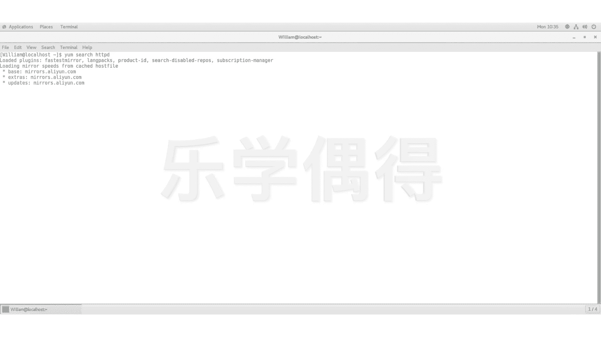

好，你看看啊。那相当于正在载入，你看看可以看到上面它是通过这个阿里云的这个镜像进行载入的啊。然后呢，我们这个就显示了这个以HTP开头的啊，有好多你看。HT凡是包含HTPD的全部都显示出来了。

而且呢他说这个嗯us show for everything啊，但是呢我们其实已经找到了，就是这个HTP然后阿HTP server啊，其实就已经找到了找到之后的话。

我们想看看是不是到底这个版本对不对啊什么的。我们就用就是in嘛，就把更多的信息显示出来啊，我们想显示什么？显示显示HTTPD啊显示这个信息。好，我们下面呢就看到了这个信息啊。

说这个pack的信息name啊HTPD啊，然后呢它这个 architectureitect啊这个呢我们上一节课啊跟大家说了构造挺就是说它是多少位的的24asesize一共有多ory么的lic等啊 server a powerful efficient and server就是我们想要找了这是所以说我们就已经进行了确认了我们通过这这这个in个信息去调出来调来之后。

们可以细看之得不这就是我需要安装我以进行安装了因为我们现在跟大家介绍这些命令大家可能一下得一下这些东西新了啊其实没有必要觉得说。因为我没有学过，所以说啊就不会做啊。

其实大家一块把自己电脑或者或者虚拟机也好啊等等的，把它拿出来跟着打一遍。我们只不过是想通过这个例子呢复习一下我们上一节的里面是操作。

大家着先一遍之后呢这些知识点我都会慢慢一一跟大家讲大家放我一遍啊我们查找了这个信息之后的话，我们就可以通过直接进行安装就可以了啊大家如果过是有实大家觉得差不多是不是也是这样的。

你可以这样理解直接按一下回车。

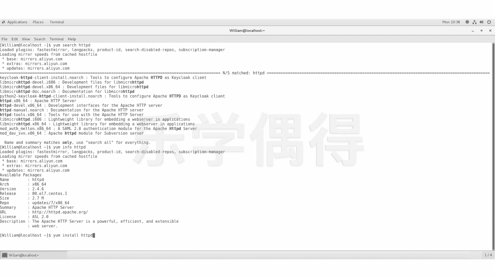

好。你看啊他会说这个you need to be rude to perform this command啊，相当于说还有我的权限不够啊，这个呢我们后面再去讲，但是大家就加一个s啊。

s就是superus do啊，你超级用户啊要去干一件事情的。这样的话他不是说我权限不够嘛，是不是那我就直接super user do啊，我们先通过这样的话，先把这个东西先直接往下面先呃先先走吧啊。

后期再跟大家去讲这个到底是怎么回事，包括一些权限问题啊，super user do。然后后面再把我们这个命令直接打进去you installstore。

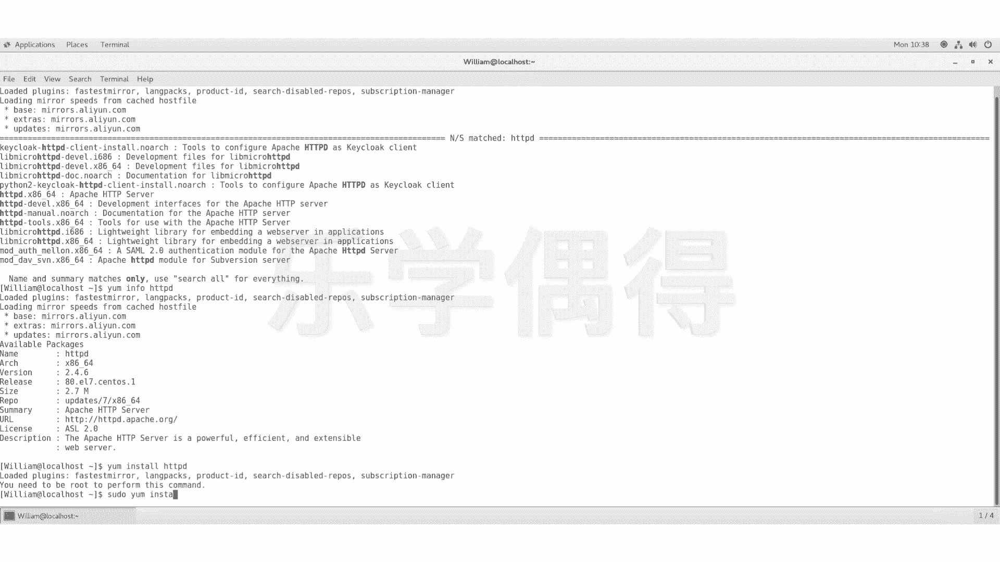

HTTPD好。好，他现在要我输入这个willian passwordsword啊，那我们就把我最开始的password输入进去。

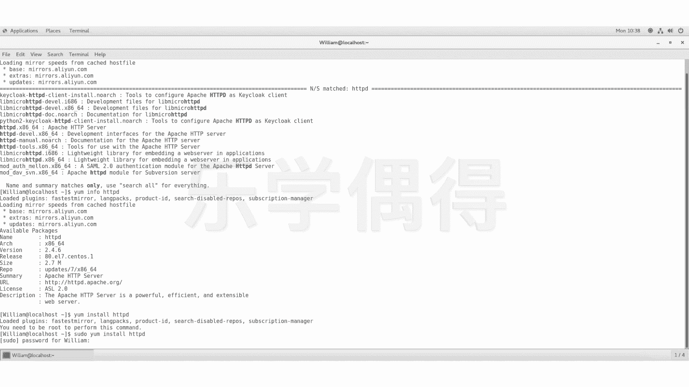

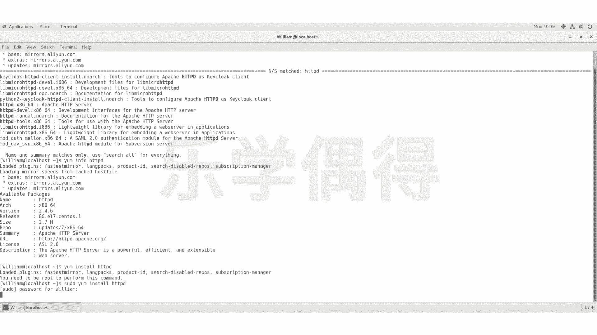

好，你看啊现在就已经开始这个安装了。

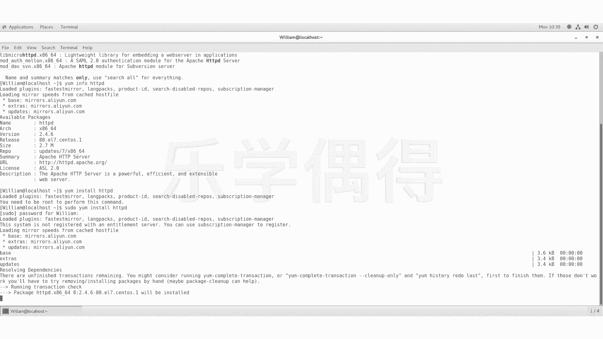

好，大家可以稍等一下，他正在安装。好，现在呢就是它的这个信息，你看package，就architecture version reository等等啊，size多多大啊。

我们现在相当于有一个这个给我们选择了这个界面啊，就是说嗯现在呢需要安装，但是他要你确认一下要不要安装呢，是不是啊，yes or no啊，我们当然是yes了，我们本来就是要安装，是不是啊啊。

我们就打一个Y啊，yes按一下回车。

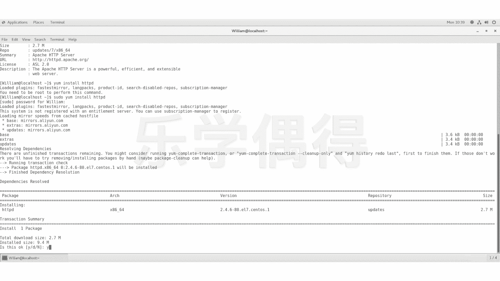

好，他现在开始这个下载，然后呢开始进行一些检测啊，最后的话啊然后再进行安装。

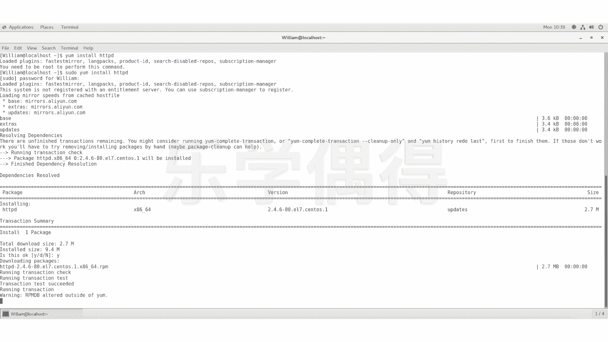

好啊，现在呢他们已经安装好了，是不是啊？好，安装好了之后的话，我们可以再看看它真是不是安装好了。我们要看看有没有安装在我们这个列表里面，是不是我们就浪要。

然后呢list list是把这个所有东西全部呃显示出来，然后inst。

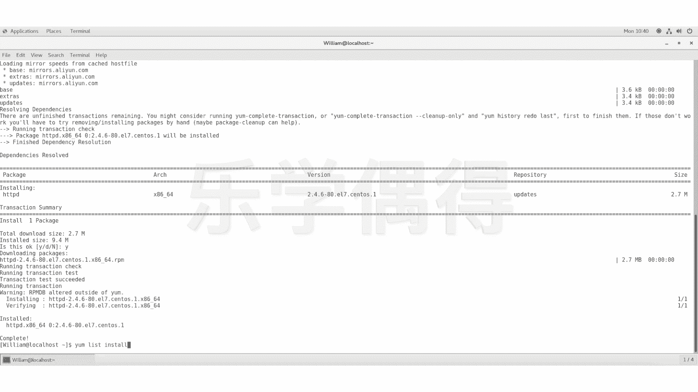

HTTPD。我们可以看看啊。

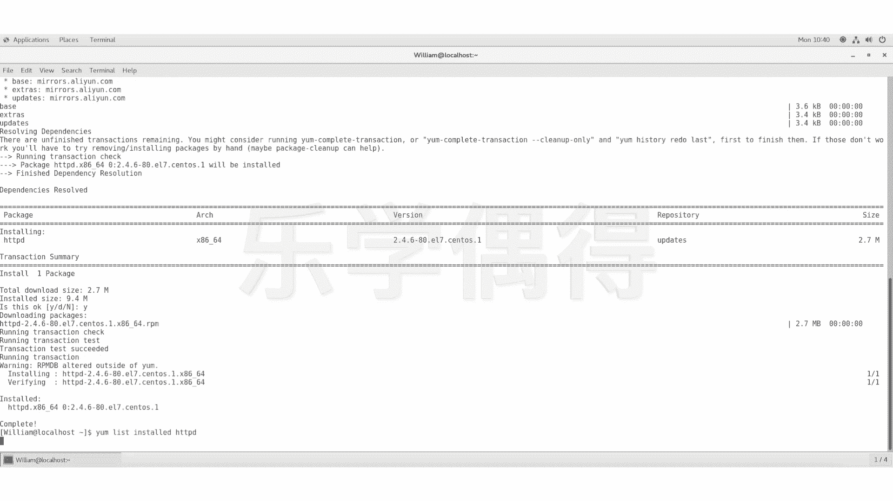

好，我们可以看一下啊嗯说已经安装进去了啊，大家可以看一下，我们已经安装好了啊，安装好了之后的话啊，它就会显示在这个listinstore hTPD里面了啊，相当于我们真正把它安装进去了啊。

我们相当于啊放心了，我已经安装好了HTPD了啊。

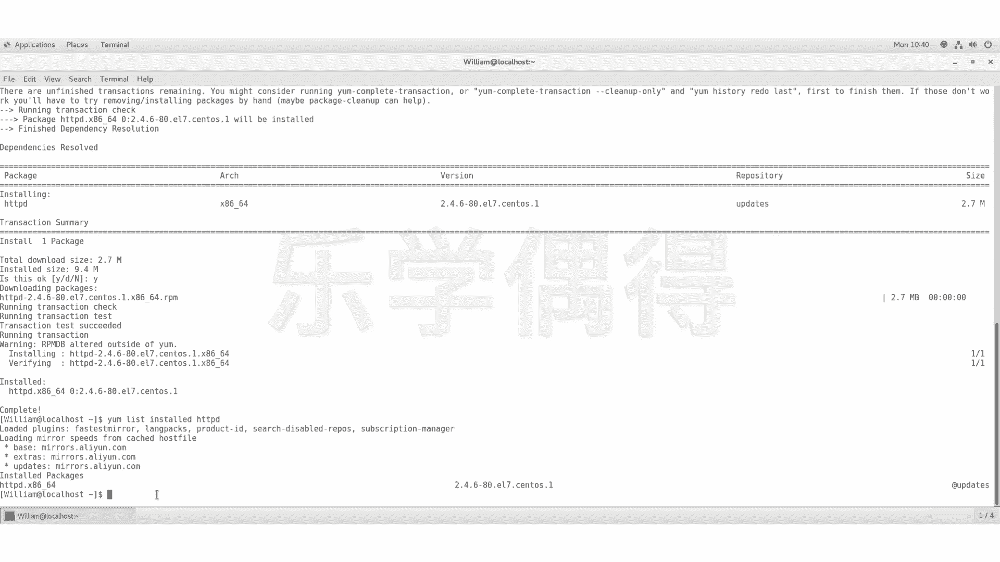