# 乐学偶得｜Linux云计算红帽RHCSA／RHCE／RHCA - P21：20.如何删除httpd及repo位置 - 爱学习的YY酱 - BV1ai4y187XZ

好了啊，记不记得我们在上上节课啊讲过我们这个package manager在安装你这个文件的时候的话，也会看看这个文件它有什么dependency啊，它相当于它依赖着什么其他的文件如果依赖其他文件的话。

发现你没有话，他也会帮你安装上是不是啊这个时候呢我们可以看我们刚刚不是安装了这个H我们可以看看这个P里面有什么dependency啊 dependency我们个简写是dep就它到底有什么dependencyHT啊。

这样的话我们就可以看出来啊发现哇有这么多dependency是不是啊所以说你说这个这个pack manager到底节省了我们多少时间啊。如果我们这一个一个的把他的这个所有的依赖文件全部都要下载下来的话。

那是需要一件多这个长时间的事情啊，是不是。

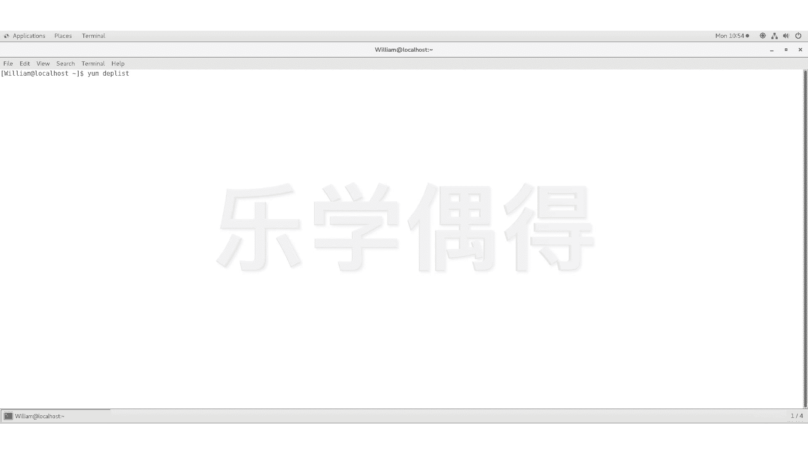

啊，我们现在呢如果我们想把它呃进行删除呢，假设我不现在不想用HTPD了，要删除。当然那就是s。首先我们要达到这个管理员的权限啊，然后要要么我们是可以直接removeremoveHTTPD啊。

这样的话就可以直接删除掉了。

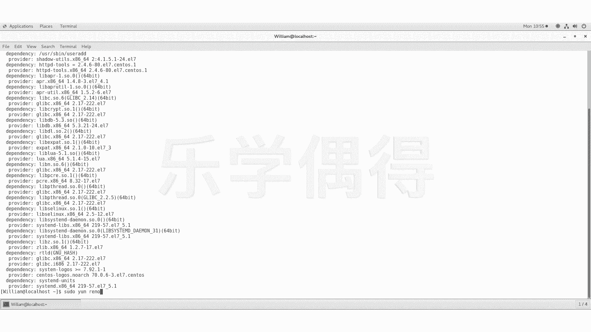

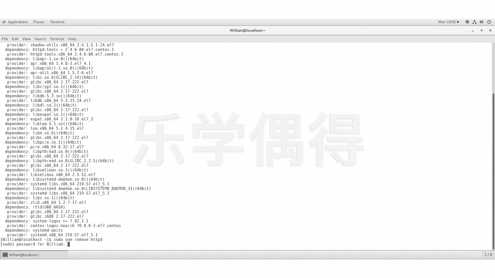

好，当然要输入密码了。

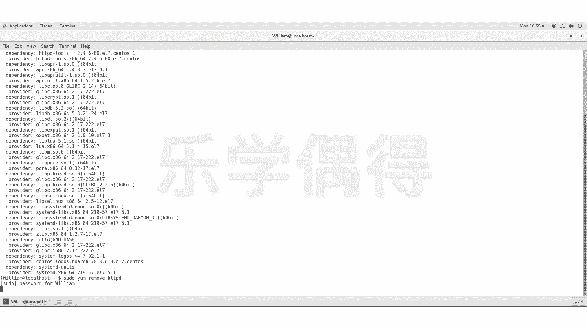

好，现在呢给我们一个选择啊，就是说你是不是已经确定了要把它删除掉了啊，我们后来就想一想，既然它跳出来，让我们想一想，我们就想一想呗。我们如果现在直接把HTPD删除掉的话，诶。

那那这个列表里面好像就没有我刚刚呃出出来那么多dependency是不是我现在不想只仅仅把这HTB删除掉。我刚刚他自带那么多dependency我想一块删除掉，是不是既然要删就要删干净。

是不是所以说我们当然就是说no no no no no，我们就还是不要去删除了。好，我们呢现在就回到了，我们就没有删除因为我们想一次性把它所有的不仅他这HTPD删除掉。

我们还要把它的dependency全部删除掉。这个时候呢我们要用这个这个。

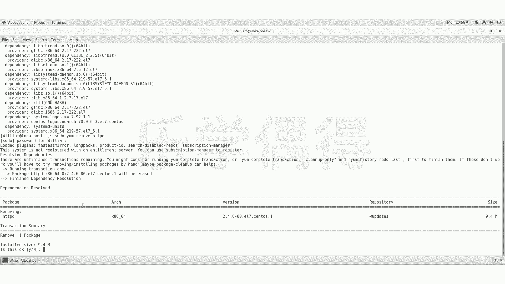

Oto。remove相当于啊它自动的呃删除的一个方法。HTTPD啊，当然呢这个时候我们还是要se。

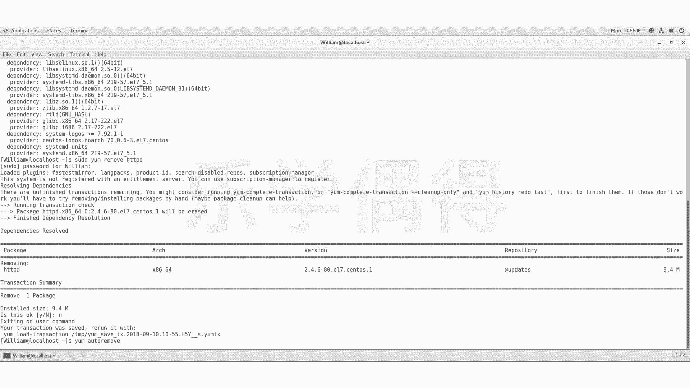

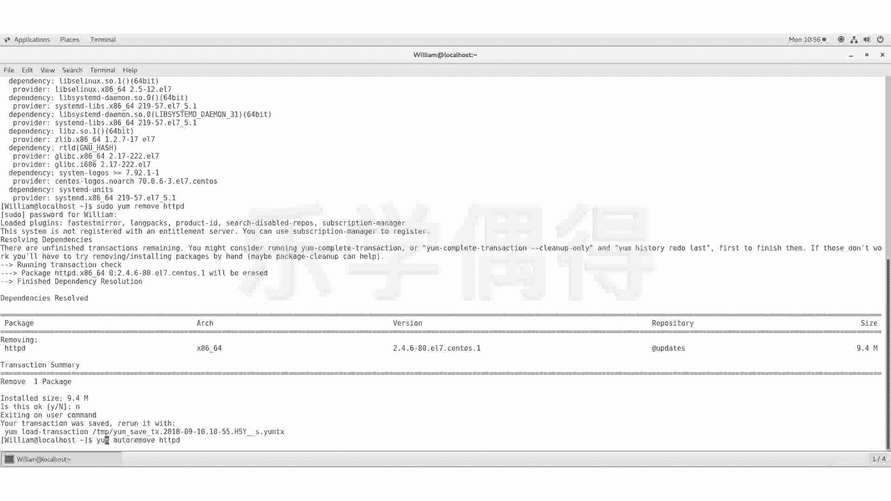

auto remove相当于它自动删除的呃这个方式，就可以把啊它所有的dependency全部删除掉。

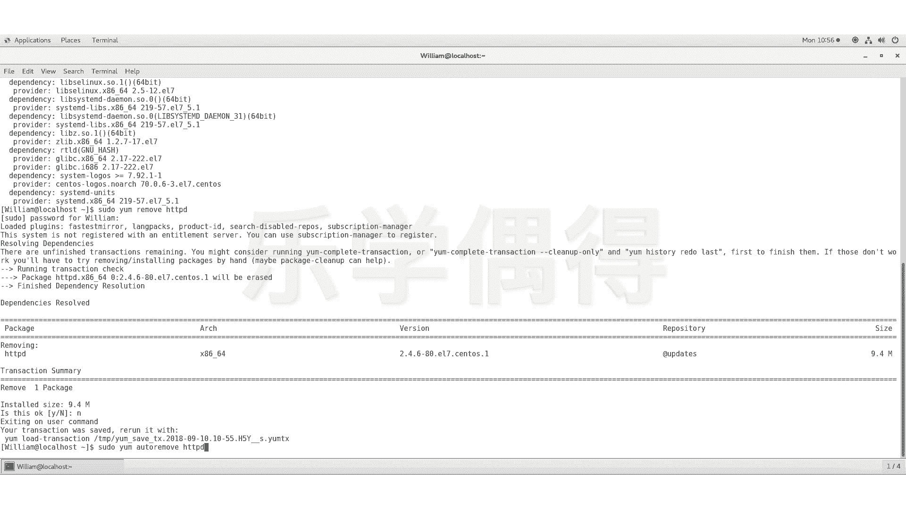

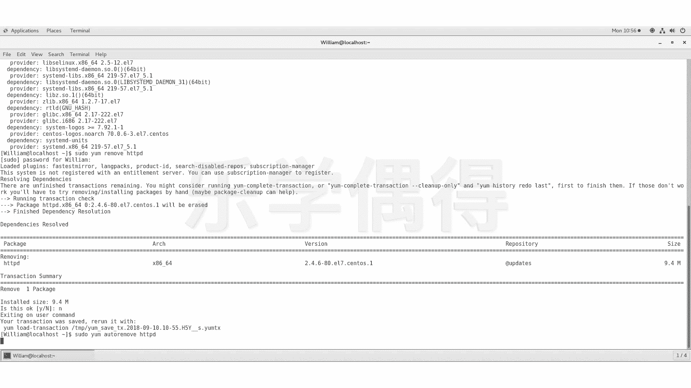

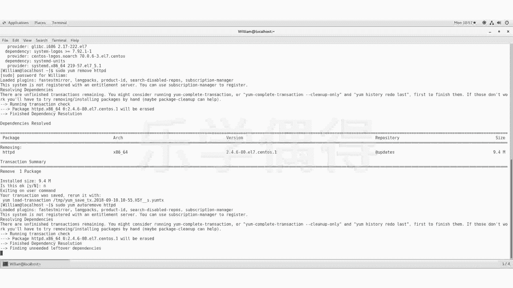

好，现在你看啊发现呢removing这个还有removing dependency，你看啊把我dependency也要删掉了啊啊，这个时候的话我们就可以大胆的啊选择确认，我现在就把它删除掉了啊。

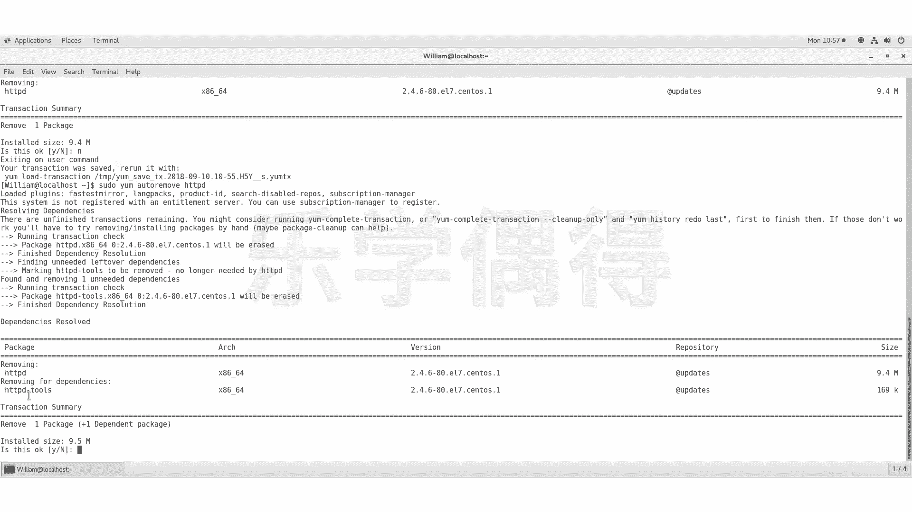

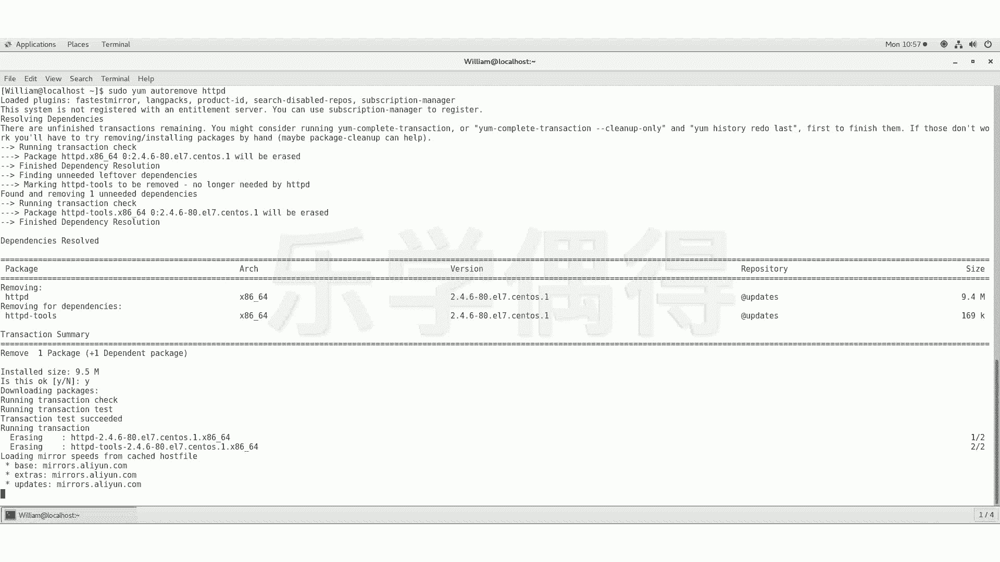

好，complete相当于它不仅remove掉了我们这HTPD还把我们的dependency也删除掉了啊。所以说呃这个方法的话，通过autoremo的方法，不仅可以把这个你想要删除的文件删除掉。

还还可以把它这种dependency全部删除掉啊，这个方法大家可以记牢。嗯，我们现在既然删除掉了，我们就要看看它是不是真的删除掉了，是不是啊？我们就用这个w。which这个命令which hTTPD啊。

这样的话可以看看有没有在不在啊，我们会发现这个no hTPD in相当于什么？相当于我自己早上没有HTPD了啊，相当于我真的删除掉了啊，我们还可以用另外一种方法就是yum list。

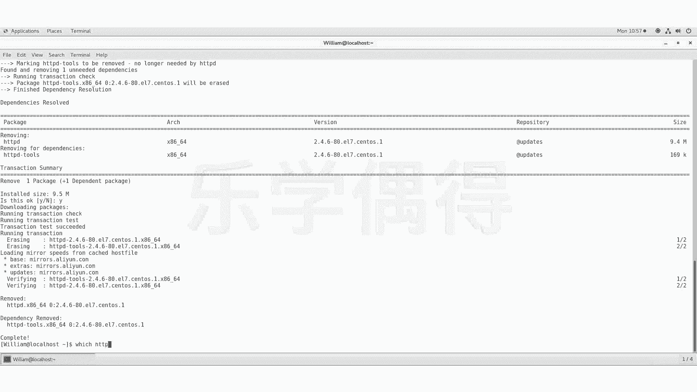

Installed。HTTPD。相当于我在要里面的话，想把我呃这个list hTBD所有的文件啊全部都显示出来。

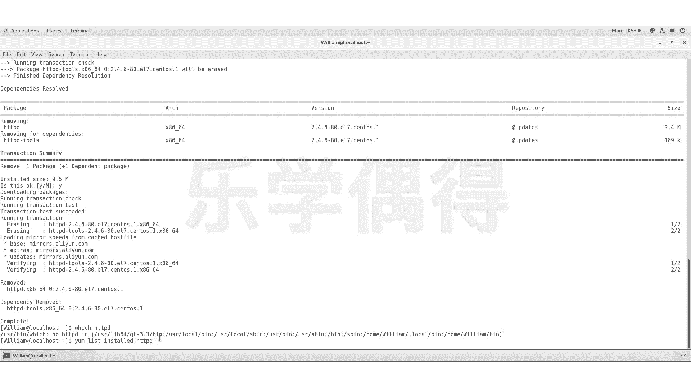

啊，这个时候的话会报一个错，然后说er no matching packages to list，相当于没有呃这个相应的相呃相符合的这个包啊啊，把它列出来，相当于就是说你真的把它删除掉了，是不是啊？啊。

这个时候呢啊我们就可以啊确信了啊，这个东西啊我们已经把它真正的去删除掉了。啊，我们知道啊我们去安装这个呃package的话，是从它repository里面去安装下来的啊。这个reposory是云端的啊。

大家可能眼尖的小伙伴呢已经看到了我们刚刚下载的时候，从阿里云这边一个镜像下载的，是不是啊啊，我们可以通过youm来看看我们这resory到底在哪儿youm rippo，然后呢list。

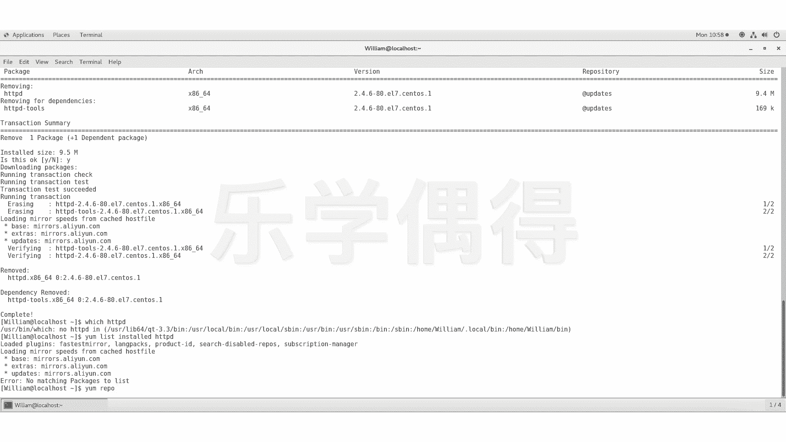

这样的话大家就可以看到啊，我们你看啊。就是从这个阿里云的这个镜像里面啊去下载的啊，然后你可以看这个reple ID是什么样的啊，我们这个base update啊。

有这么多1646个可以共下载还是挺多的我可以通过这所有的这个ory所有的仓库里面的这个这个文件所有的的话都可以显示出来它这个总量到底是什么。

有人说他怎么这个知道从这个这个mirr阿里云这边去下载下来啊这个时候的话我们就可以要看一下这个我们电脑里面本来这个配置啊下面这些命令的话，很可能你根本没有学过也不太熟悉。

不过没我只只不过想个m point相当这把我这个怎么说呢？就是说给大家先展示一下吧，我们今后的话会啊专门去学习，包括这么CD等等这些命令我们先。通过这样的话跟大家演示一遍啊。

首先呢我们先CD就是这个嗯换一个这个我们现在的目录啊CD因为我们现在相当于在它默认这个目录里面，我们现在换一个目录啊，这个目录大家跟着我打就行了，叫ETC。二74。然后呢，y。Dian。

Reippleles。

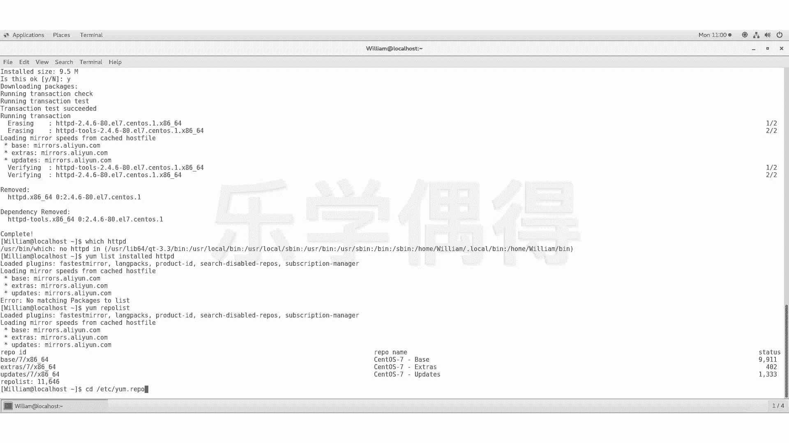

点D好，我们现在chandirecty到这个下面，到这个下面之后的话，哎，我们用这个LS。

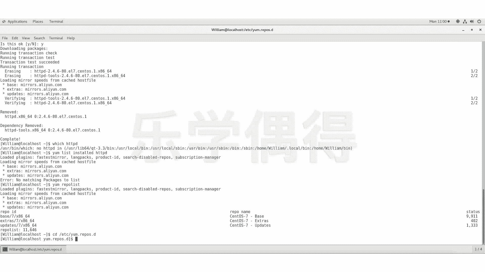

就可以看啊。你看啊有s base，还有s啊这个bu个fa等等等等啊，这相当于我们这个本机里面如果像要去去找这个ory话就会在这些文件里面进行设定啊。当然了我们后期还会学习怎么样去更改这些文件啊。

我们现在就知道其实我们电脑里面是有一个这样的这个啊有有这样一个list去存在的啊，这个list的话啊，它里面会注明一些信息啊，我们可以通过这个less啊，或者是直接通过ca吧不过less显示少一点。

大家可以看清楚一些。Sinceense。Als， base。啊，我们把这个list呃相当于把这个这个cent OS s base到reple这个文件呢啊显示出一部分。我们可以看一下这个里面是什么东西啊。

大家可以看我们怎么呃去找到我们的这个呃这个reple list，你看那个那个 mirrorrr list啊等等。

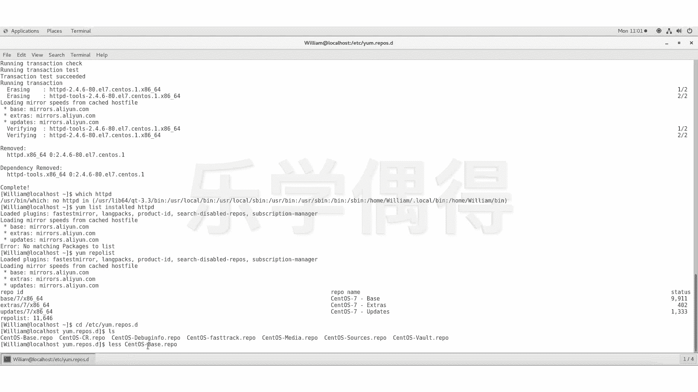

相当于就是在这个文件里面啊，它已经标明了啊，我们应该从哪里去找我们的repostitory，我们哪里去找我们的package啊，这个其实是一个呃电脑里它自带的一个东西啊。

我们知道啊我们呃这个东西存在就行。

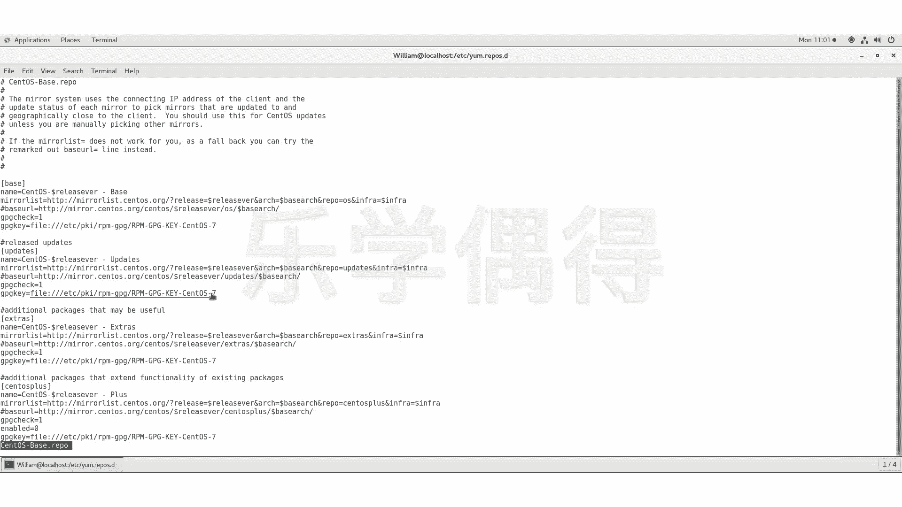

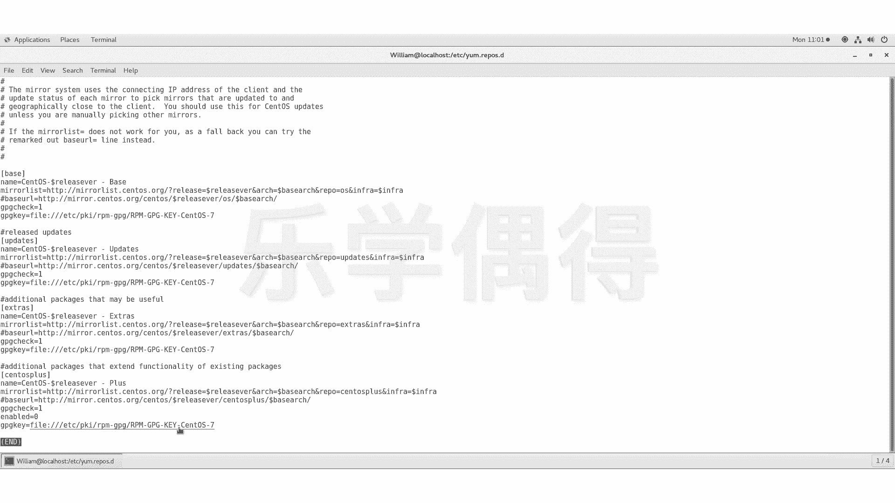