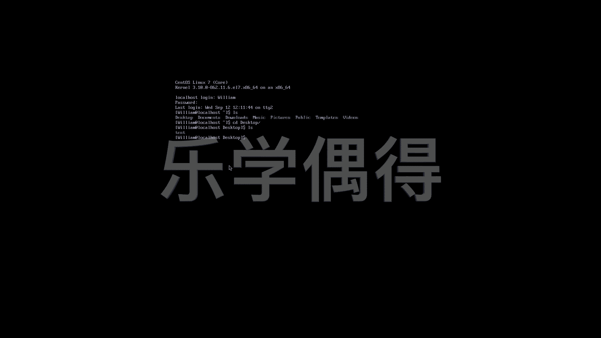

# 乐学偶得｜Linux云计算红帽RHCSA／RHCE／RHCA - P22：21.各种terminal之间切换 - 爱学习的YY酱 - BV1ai4y187XZ

好了啊，我们现在呢正式啊进行操作。啊，因为这个dessktop的这个桌面版本的话，大家其实就跟呃最开始接触这个windows和linux呃windows和mac系统一样的。

其实呃桌面版本就是可见其所得啊。好了啊，我们正式的在进行这个命令行的学习啊，我觉得像这个tro啊，最开始跟大家装成这种样子的话。

大家其实可以自己在啊这个操作系统的环境里面自己去玩一玩自己去安装一下程序啊进行一些操作，其实因为它是一个可视化的一个系统，所以说就跟当时大家学这个wind和m一样的也是没有任何教程啊。

都是自己在这个系统里面进行摸索。因为你毕竟看得到嘛，实实在在的啊，我们认知这个事物也是一样的。首先看得到摸得着啊，闻得了啊，这样的话我们就有一个感性的认识之后的话，我们再更深层次去操作啊。

所以说我这这边跟大家讲的话就直接通过这个命令行去讲起，从min里面进行操作，我们用这个的话是用这个。你看我把这个min打开啊，我就直接用这个进行操作。这样的话也可以带领大家了解一下，如果有些人一开。

这个很硬核啊，一开始可能装的根本就没有这个桌面这个desktop的这个桌面啊，可能一开始就是个serv这样的版本啊，所以说呃可能一开始就不知道怎么操作了啊。

因为毕的只有黑屏一整个是黑的这字的话只有文字只有这个命令必须强这命令操作能力才行以说跟大家演示一下之前上几节课跟大演示的在这个命令里操作的话。

这个其实是个但是一个模拟出来你看面还有一方框个程序就是个小程序这程序连接到跟模拟出来真成这种过我们在这个大家操作一下之前如果听过python的课和的话应该知道最基本的一些命令说print directory看在哪是不是？

然后你可以看这个前面这个william啊，是我这个用户名啊，到时候我们要记住的啊啊。然后呢呃比如说我们还有LL list，啊可以看我这个电脑里有什么东西，是不是还有CD比如说CD到desktop啊。

这些都是可以的。desktop。然后看我现在到桌面了，桌面L啊，看看桌面有啥东西哈，啥都没有好，就相当于我们可以在这模拟的命令行里面话进行基本的操作啊。

但是呢我们整个这个电脑呢不仅仅只有这一个模拟的命令行，我们还可以到其他的一些界面去。比如说我们要把这个这个界面进行切换，我们怎么切换呢？按住ctlLOT加上F2。😊，哎，大家发现没有？

我们现在到了一个黑屏的界面了，是不是啊啊？这个界面的话就是很多这个小伙伴如果是嗯安装的时候嗯，选择了这个服务器版本的话啊，它就是进入到直接进入到这个界面的啊，如果是大家做运维的朋友的话啊。

很可能你拿到一个这个公司这个服务器的话，其实就是一个这样的版本，它是没有这个图形界面的。因为图形界面不稳定啊，且会占用很多的这个内存啊。我现在想要这个local host login。

我现在想这个登录进去啊，记得我刚刚跟大家说的这个登录这个用户名啊，一定要把自己的用户名记牢啊啊。比如说我这个是vim啊。然后password这个是自己设置的password嗯，根据你刚刚设置的不同。

其实不一样的。你看啊last log，我现在就已经登录到我这个呃这个系统里面来了啊。同样的我也可以这个 print working directory是不是LOS等等。

然后我们还可以change directory啊，这个change directory到我们的desktop。然后再看哎，啥都没有，我们还可以这个make directory。

比如说我想建立一个新的文件夹啊，test啊，这样啊，然后我们再看哎，已经成功创建了啊，我们还可以chandirect到这个test里面去啊，都是可以的，我们还可以退到。

或者是这个退到我们最开始默认默认界面啊，都是可以的。啊，相当于就跟大家基本演示了一下啊，就是具体应该怎么样操作啊。如果是我现在想把这个啊这边的啊命令行，然后切换到原来这个界面应该怎么切换呢？啊。

我们直接按住这个LT加上F啊，直接就切换到我们这个界面啊，大家可以看一下，我刚刚不是桌面上这个创建了一个tex是不是啊命令行里面的话创建的东西。在这边的话也会同时显现啊，相当于我们在那边进行操作。

变成图像化的，就是这样的啊，是不是很神奇啊啊，所以说啊我们其实有很多各种各样的这个tminal可以进行操作进行选择啊，比如说我现在还可以切换到这个从这边切换到min的时候的话。

一定要按住ctrlLT加FR。然后切换回去的时候，直接按LT加F1就可以切换回去。然后我不仅可以wo，我还还有three four等等等等啊，其实很多很多产品都可以选。

假设我现在又想进呃又想操作另外一个命令，那我LT加alt，然后加加这个F3，我切换到第三个啊，同时我还是需要这个log in，所以说还是要log in微列。输入密码。好，我又进来了。

是不是我们可以看看我们现在在哪儿，我们还可以chan director到呃dextop然后看看啊那个test就是我们在这个terminal two里面创建的。

在我们现在这个tminal three里面也看得到这个terminal one这个图形界面也可以看得到啊，相当于你在这些界面做了一些操作的话，其实是这个通用都在你电脑上进行的操作啊。

只不过你用的这个 terminalminal是不一样的。

