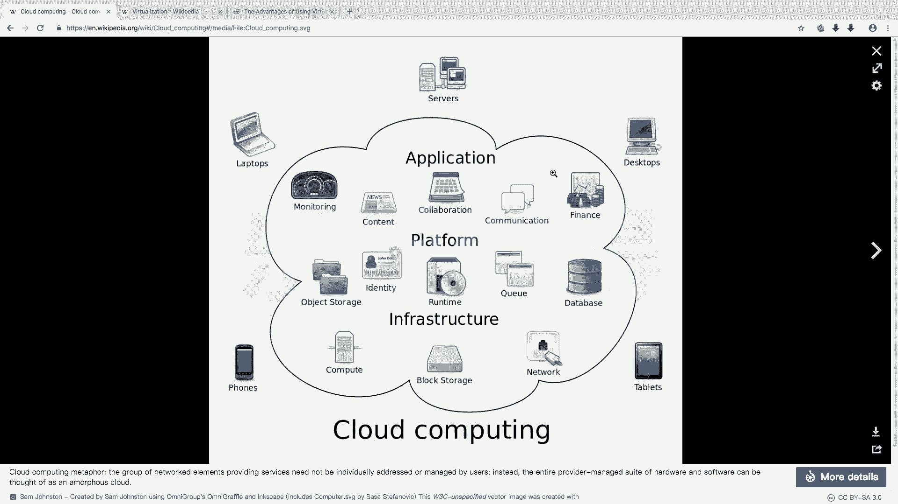
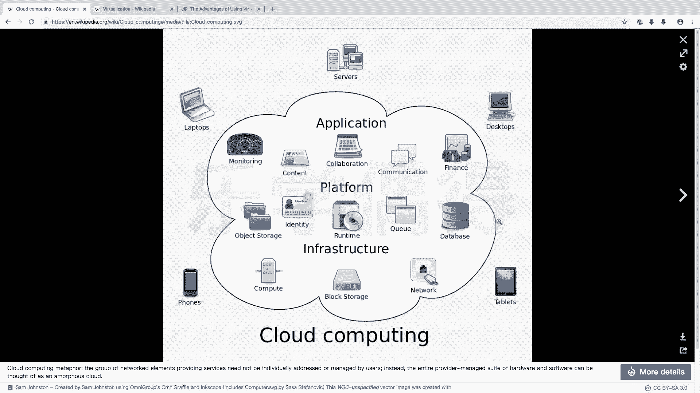
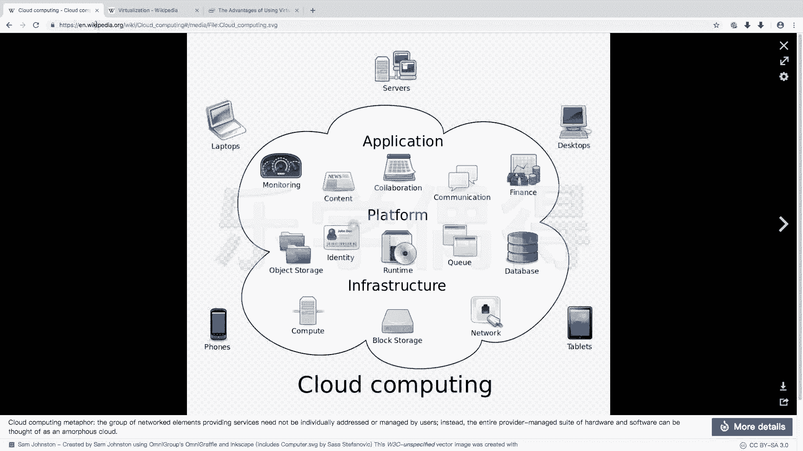
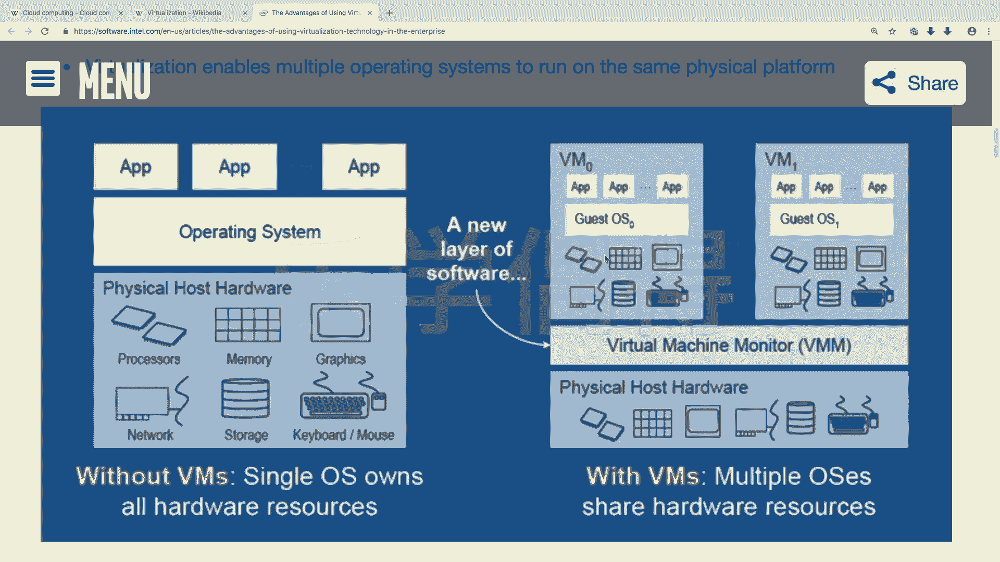

# 乐学偶得｜Linux云计算红帽RHCSA／RHCE／RHCA - P23：22.云计算与虚拟化知识补充 - 爱学习的YY酱 - BV1ai4y187XZ

好了，呃，在接下来的时候的话，我们会接触到两个概念，就是linux运用比较多的两个方面。一个呢是叫做这个cloud computing，就是云计算。

还有一个呢叫做 virtualrtualization，相当于是虚拟化啊，首先云计算的话，其实呃提的比较多呃，在很久之前可能根本没有云这个概念。但是呢自从有了互联网，其实说实话就有了云计算。啊。

云计算其实就是there is no cloud，根本没有什么云这个东西，其实就是远程的一个别人的这个电脑啊，所谓云计算的话，就是本来最开始是你自己有一台主机，你可以在你自己主机上进行计算。

但是呢呃这个云计算的话，就是把这些东西全部放在云端进行处理。比如说像这种各种内容放在云端，还有各种这个储存各种计算的东西啊等等全部放在云端进行计算。然后呢我们每个其实就是一个终端。

比如说呃我们想去查询一下什么东西，或者是想对一个。

数据进行处理。我们都可以在我们终端发一条这个指令，你在手机上发也好，在这个个人电脑上发也好，发给云端。然后那个语音端这个相当于就是个大型的这个处理器进行处理。处理之后，直接把结果的话就返回到你这边。

相当于你自己手上那个东西就是个显示屏而已啊，这个就是云计算啊，这边的这个处理器服务器以及这些这个基础的架构的话，它都是在linux呃的运用比较广泛的。

还有一个呢就是viualization就是虚拟化啊。虚拟化的话，大家看这样一个图。我觉得这个图写的非常好。我们最开始的就是我们的硬件就是硬件。

就是physical hardware然后我们操作系统就是操作系统。然后呢我们的APP就是我们各种软件啊就是APP建立在操作系统上面的啊，操作系统是建立在我们这硬件上面的。但是虚拟化是什么意思呢？

虚拟化就是我们的硬件还是硬件。但是呢我们中间有一个 virtualr machine就跟我们现在在电脑上装这个 virtualrtbox一样。在这个虚拟机上面的话，再装很多的虚拟硬件。

就是virt hardware啊，相当于你可以在一一台电脑上或一台服务器上装十几个啊二十几个甚至成百上千的虚拟的硬件。然后在这些虚拟硬件上的话。

在这个加上这个 system在这个客户的操作系统这这APP呢全部在这个 system上面去运行啊，这样的话就。相当于有很多层这个呃保护。

而且呢把一一台这个服务器的话可以分成很多很多的这个虚拟的这种操作系统啊，这个的话啊也是lininux非常广泛的运用。我也觉得是未来的一个发展的趋势啊，一个是它非常安全。第二个的话，它可以很快的进行调整。

它的这个呃这个可操作性是非常大的。

