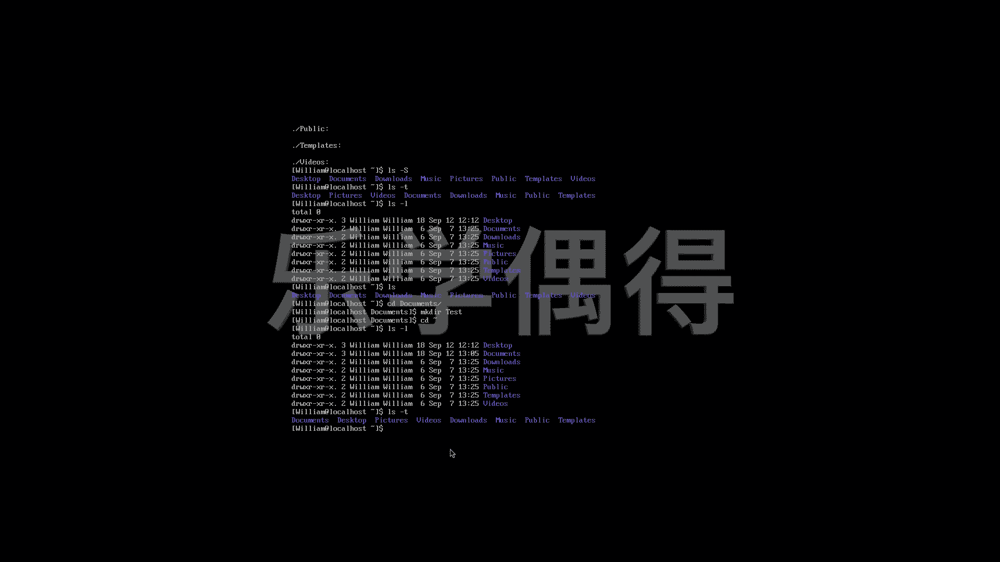

# 乐学偶得｜Linux云计算红帽RHCSA／RHCE／RHCA - P24：23.ls显示的运用 - 爱学习的YY酱 - BV1ai4y187XZ

好了啊，上一节课呢跟大家写了一下，比如说LS print director等等啊啊，这也是非常基本的一些命令啊。我们一个一个来看啊。首先呢这个L的话跟大家详细介绍一下相当于是list一个简写。

可以把我们现在我们这个 director目前我们正在的一个工作的地方的所有东西全部都列列举出来。比如说你看我现在这个 directory之后的话。

就相当于我现在在home和william这个下面这个下面之后我按一下之后就把这个william下面所有的这个文件全部都显示出来。比如说dextop document download music等等啊。

相当于所有各种各样文件夹都显示出来了。但是这个显示的信息比较少我们可以用这个然后加个小横杠小横杠之后话，我这样话我们就可以把具体的信息全部都显示出来。比这个面的话我先不管时候会跟大家介绍什么意思。

用户然后微链组，然后这个的话是你的这个呃操作系统的一个具体的一个设置啊，是多多少位的呃，这个我们也不管，我们可以看时间是不是啊啊，时间啊具体是什么时间进行修改的dextop啊。

doment download publicub等等啊，它这个就呃更加详细能跟大家显示出来啊，一个是这个long list。然后我们list还可以做一些其他的一些改变。比如说我现在呢。

想把这个所有的东西全部都显示出来哦。就按照这样显示出来。哎，你看大大家可以看一下，把这两个做一下对比，我们最开始这样L显示出来只有这么一点是不是？但是我加了一个杠A那就把所有东西全部显示出来。

然后你看有些东西一般的这是看不到的。比如你看这个这这为他是个dot开头的t开头是一个隐藏的一个文件我有过这个才能显示出来我们一般看不到因为我们平常说实话也不太会用到计算机他也觉得我们平常不会用。

所以干脆我们隐藏了我判是是是个命令我们还以通过这设直接这个再加个小横杠加一个大R啊这个这个显示所有的这directcur个回溯示什是回。那我们先看一看就知道了。啊，大家可以看一下，相当于什么？

相当于这下面所有的东西里面有什么东西全部都可以啊显示出来。比如说我们刚刚在desktop上创创建了一个test啊，这个的话。

它相当于desktop里面所有文件全部显示出来这个呃test里面所有文件全部显示出来document文件显示出来。download music等等，全部会显示出来啊。

它是会这个一直往下回溯到你这个呃目前的这个地方的所有东西全部会显示啊，相当于是这样一个命令。嗯，还有呢还有一个比如说我们想进行一个排序哎，从大到小的排序，并且呢还想把它显示出来LOSS杠。

我们排序呢是这个呃相当于是一个s，相当于是一个这个。相当于是个shot，怎么说么就就就用中文怎么说，相当于一种清理的这种感觉，就是s sorttedever sorted。

是不是所有的事情已经被处理完毕了，清理完毕了。所以说这个sted是个S开头，我们就记得啊，我们要进行一个排序，就是这个杠一个大S。好，这样的话大家就可以看到我们把这个已经进行了排序啊。

相当于这个是由这个嗯由大小进行排序的啊，最大的在前面，然后最小的是在后面然后由这样进行排序。我们还可以这样的进行排序。比如说我们想进行这个嗯看看这哪些文件是最近进行修改的。

我们这个修改的话就是这个时间以时间进行排序，是不是啊，就LS杠T啊，这个的话就是你按照修改时间进行排序的啊，这个的话具体信息，大家可以在上面看得到啊，我给大家看一下，可以在上面看得到。

上面不是有一个这个。把所有的东西全部显示出来，是不是啊杠 long啊，大家就可以看一下，你看他按照这个修改时间进行的那个desktop12。12，然后picture picture是这个13点25。

然后这后面的话其实说实话修改时间都一样，是不是？但是你看这个do修改时间，怎么说它可能是按照先按照时间排，然后再按照这个这个首字母的这种顺序再再开始排的话啊，也可能他这个显示的这个时间啊。

后面其实还有很多这种几分几秒啊，它没有显示出来。所以说我们啊人现在看不出来啊，但是我们比如说在这个download里面进行修改了之后的话，他这个就更加那个明显，我跟大家先演示一遍吧啊。

比如说我们现在这个list。呃，然后呢我们想把这个。这个document要不进行一下修改。比如说我们现在可以change到document里面去。Documents。到doment连续之后的话。

我们重新创立一个文件或啊我们重新创立一个make directory吧。make directory是test，还是一个test。大 test。好，现在的话我就进行修改，是不是啊？这样的话。

我这个时间就不一样了。我们再到最开始的这个界面去，然后再使用list。 list的话还是按照这个long list吧。好，大家就可以看一下这个时间已经变成修改了。

因为我刚刚在这个doment里面进行了修改啊，所以说是13。05进行了修改啊，所以说这个时间就不一样了。不一样了之后的话，我们再进行一下排序啊，大家就可以看得清楚一些。比如说我现在还是这个list。

然后排序是按照这个小写的这个T时间进行排序的啊，大家就可以看一下啊，是doment是最近进行修改了。因为我刚刚不是增加了一个test这个这个directory在里面嘛。

然后在dtop在picture video等等等等啊，就按照这种形式进行排序的。

