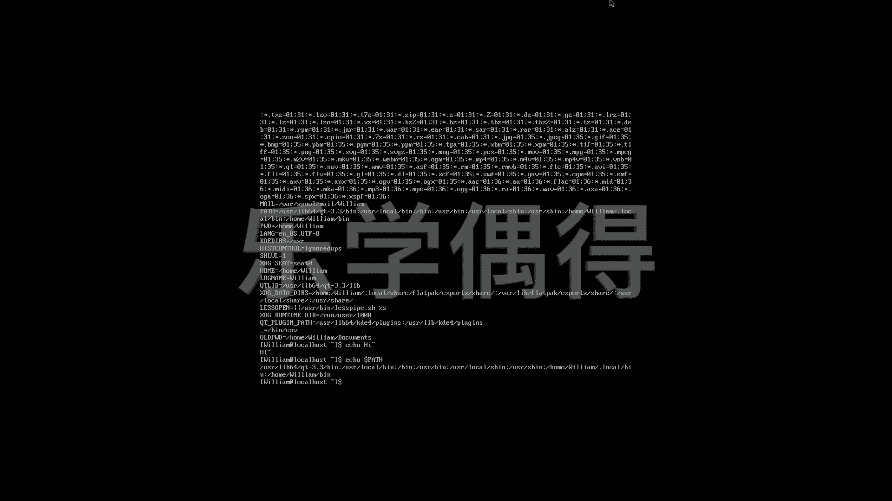

# 乐学偶得｜Linux云计算红帽RHCSA／RHCE／RHCA - P25：24.环境变量与PATH - 爱学习的YY酱 - BV1ai4y187XZ

好了呃，有些人可能会觉得很奇怪，就是我们打这个LS，然后它就会出现一些这些显示的东西啊，可是我们想一想这个LS它到底是个什么东西呢？啊，我们假设这个电脑啊，它根本不知道LS是什么。

你打出1个L它就会显示这个list那那肯定L它是一个内置的一个什么样的程序，它已经编好了，在电脑里面，是不是啊，这样的话，你打出LS它自动的就去执行那个程序，然后那个程序的话，它执行的命令。

就是把这些东西全部打印到也不叫打印，就是list，把它列举在你的屏幕上面，然后再显示出来所以说我们可以看一看这个这个L它这个命令到底在哪啊。

这个时候呢我们就需要看这个它设置了这个environment啊，我们可以看一下这个呃LS它到底是在哪的？比如说whichS。相当于啊我们在整个这个电脑里面去找这个LOS它到底是在哪的一个命令。啊。

大家可以看一下，它是在这个BL。所以说我如果直接把它的这个路径。打出来。相当于我直接执行这个BLS这个命令，相当于我运行一下这个程序。它实现的这个结果的话，其实跟我打这个LOS是完全一模一样的啊。

相当于LOS就是一个程序。我按这个LOS，或者是我通过这个并L把这个L打开，其实它运行的这个程序，它的结果是一样的。嗯，那么这个LOS它这个程序到底是在哪呢？啊，当然它不仅仅是在这个BLOS啊。

相当于呃你说这个电脑它怎么会知道我们这些命令应该是储存在哪的，它应该有个地方去储存的，是不是啊，我们这个时候的话可以打一个这个environment environmentvironment这开头就是ENV啊这个打进去之后的话啊这个电脑的话就可以把所有的这个environment variable。

就是我们的环境的这个变量的话啊，我们都可以一次性全部显示出来。啊，大家可以看一下哇，这么多的这个environment是不是啊，它到底在哪找的呢？我们只需要看这边有个pass。

你看user然后等等等等等，非常非常长的一圈啊，其实所有的这种环境变量的话，它都是在这个pass里面去找的啊，相当于我们可以通过呃这个把这个东西储存在这儿啊，把这个东西写好，储存在这之后的话。

我们都可以在这个全局的这个hell environment。我们这个he的这个环境里面的话，都可以通过非常简单的命令进行操作啊，这个呢是environment啊ENV这个命令。呃。

当然呢我们呃还知道这个pass呃，它相当于是呃一个大的一个文件夹，它储存了呃各种各样的这个呃directy啊，就相当于我们每次在这个b share里面去打命令的时候的话。

它都可以去这个pass里面去寻找。呃，那么我们。再来一个啊，我们假设啊想把这个。这个pass到底是具体是什么样的啊，每一次我们都把它想显示出来，我们要用的这个echo这个命令，e呢就相当于是回音嘛。

比如说你echo可以e任何一个东西啊，比如说echo嗯 echo hi。啊，它就会显示hi是不是？相当于他把后面这些东西全部都显示出来了啊，这个是一个新的命令。

就跟嗯这个这个thon里面不是有个print一样的，那相当于啊print print之后的话，他把这个print这个括号里边的这个东西全部会打印出来啊echo也是一样的。echo的话。

它可以把啊你想这个e的后面这些东西全部都啊这个print打印到这个我们这个这个这个显示屏这边。呃，然后呢我们可以这样。比如说我们echo。我们可以把这个pass来e一下。我们以这种方法的话。

就可以看一下我们这个pass到底具体是个怎么回事啊。当然了，我们这边的话要加一个这个呃这应该是个美元的符号啊我们这个要把这个东西加上啊，之后为什么要加的话，我们之后再讲啊啊，大家先把这个东西先打进去。

敲进去。好啊，相当于的话我们就把这个pass直接就打印出来了啊，相当于就是啊我要它e这个pass，然后这个pass就把它打印出来，打印到我们桌面上面啊，这个呢也是一个怎么说呢？也是一个方法吧啊。

我们就相当于我们可以在这个user local等等。然后这边去储存啊，储存了我们原来这个命令储存在这个里面啊。比如说我们现在想弄一个新的命令，我们把这个新的命令可以储存在这里面。

然后呢呃可以直接去调用啊，然后我们想看这个命令储存在哪，可以用echo啊，看看它是储存在哪里的。

