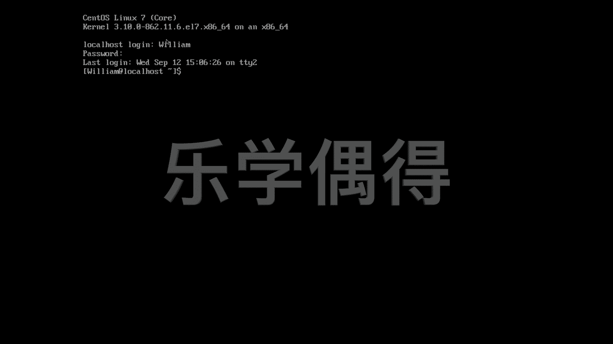

# 乐学偶得｜Linux云计算红帽RHCSA／RHCE／RHCA - P26：25.我是谁和如何切换用户 - 爱学习的YY酱 - BV1ai4y187XZ

嗯，好了啊，首先呢有些同学可能说这个太小了，字太小了，看不太清楚啊。你自己在桌面上的话可能也看不清楚啊。这个时候呢我们要调整的话啊，有一个方法，最快的呢就是直接通过放大来调整啊。

这个呢大家应该也知道就是sll factor啊，你可以把它放大一点，放在这个175%。啊，这样的话，它这个页面的话就已经非常大了啊。这样的话我们就可以看得非常清楚啊，之后我们再讲的话。

怎么样这个在命令行里面通过其他的这个方法进行调整啊，那个稍微复杂一点啊，现在我们把这个字先调大，然后呢不影响我们这个学习就好了啊，我们现在先log in Williamm。pass输入进去。好。

现在呢我已经到这个以这个威廉这个身份啊进入到这个系统里面来了。啊，现在呢呃不知道大家有没有经历过这样的情况，就是呃工作了一天或者学习了一天啊，脑袋都是懵了啊。这个时候呢呃走在路上的时候就开始。

开始想一想这个人生的呃意义啊，以及我是谁，我将去哪儿等等啊，开始思考这些哲学问题啊，当然我们在编程的时候的话，经常也会编得这个头晕脑胀的。然后开始思考一下哲学问题就是。我到底是谁？who am I。

who am I？我到底是谁？哦，你回回车发现哦，我是william啊，知道了，我是willm，然后我就继续开始我的生活了啊。这个麦的意思就相当于你是呃在系统里面啊，你在系统里面时候的话。

你有时候这个系统并不是你自己的操作系统啊，可能是这个你是一个专家，然后到别人地方啊，别人这个邀请你过来说这个地方系统出了问题，或者你让你进去排查然后你现在你可以做一个事情，就是。

你看看你是以什么样的身份去登录这个系统的，它的权限到底怎么样。所以说这个是个非常有用的一个命令啊，你打出麦之后的话，这个桌面上就会显示啊，你到底是以什么样的身份啊，这个lock。

你到底是以什么身份去登录的。当然呢，如果你现在发现是以威廉身份进入，你现在想这个呃换成另外的一个用户啊，你就换成这subute，就是一个替代性的这个s user开头就是替代。

然后你后面可以打一个比如说任何乱七八糟的一个人的这个名字都可以比说假设这假设这里有一个叫的用户啊，但是这个没有所以说我这这样回车这个 doest exist。

但如果你这个系统上有多个用户登录进去的时候的话，你可以通过S然后呢再把另外一个us name打进去之后的话，你就可以换到另外一个us果那个user name的话，需要输入这个密码等等的话。

你这边在输入密码之后就会切换到另外的一个用户的个界面，这是一个方法然后呢我们假设这一段操作操作完之后的话，我现在想退出相当于这个注销我们这个用户这个时候我们就直接打ex。啊。

这个时候因我们要知道这个he的话，它这个K sensitive，它是一个大小写啊，非常敏感的。所以说我们呃不能打打打成大写啊ex。点点了之后的话，哎，刚刚特别快的闪过一个log out，然后呢。

我们又变成了这个loc host log in。我们现在相当于已经退出了我们刚刚这个vim啊，现在我们再要重新登录才行啊，william。密码。啊，这样的话就可以重新这个登录到我们这个界面了啊。

log这个log out log in啊，log out的时候是这个退出exit啊，log in的时候的话，就是你直接把你的这个啊想登录这个用户名和这个pasword输进去就可以了啊，大家会发现啊。

我们输入这个用户名的时候啊，一点提示都没有，是不是啊，这也是这个linux比较安全的一个地方。就是他如果不知道你用户名啊，你别说这个密码啊，你连用户名都不知道，你根本不知道怎么登录到你系统里面来。

是不是？

