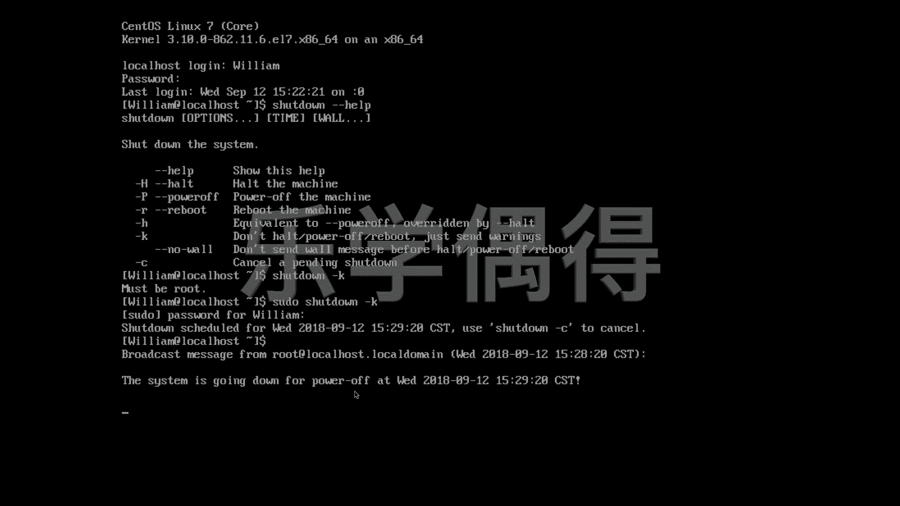

# 乐学偶得｜Linux云计算红帽RHCSA／RHCE／RHCA - P27：26.如何实用关机命令 - 爱学习的YY酱 - BV1ai4y187XZ

好了呃，接下来呢我们再学习一个非常常见的一个操作吧。就是呃咱们不是从虚拟机里面进行开机，是不是开机了之后的话啊，到这个系统里面来的时候的话，进行了一段操作之后的话，我现在想关机怎么办啊？

如果你在这个命令行的界面的话，想关机，其实命令也非常简单啊。首先呢就是你可以hot。啊，相当于你把整个这个stem整个系统啊呃这个突然停下来，停下来后本意就是停下来，是不是啊。

其实也是一种呃一种关机这种方法吧啊有点像休眠一样的感觉。呃，当然了你可以最简单的这个power。Power off。power of意思是断电呗啊断电的话也是啊这个关机的一种方法啊。

有时候很可能你这个没有root的权限的话啊，你输这个命令的时候啊，他他会让你说你要这个获得这个root权限啊，我们先不演示，要是一演示的话，这个就关机了。啊，还有一个方法呢就是sut down啊。

sh down。sut down会有非常非常多的选项啊，我们可以先看看ut down有什么样的选项，我们加两个那个呃dash，然后再加一个help啊。

这样的话它会这个蹦出这个 down的各种各样的选项啊。因为你说相当于help你相当于在翻他的这个说明书，是不是比如说你这个 down，我们之前不是说可以直接打这个hot啊。

然后让这个系统的话是呃就相当于停止，是不是？我们 down。然后呢一个小横杠，然后再搭打一个H的话也可以达到这个hot这个操作啊，同样的还有这个小横杠这个P，那就是power off。

也可以达到我们最开始这个power off操作啊，当然呢还有这个呃这个小杠H啊，相当于跟power off的。这个这个行动其实是一样的，相当于达到效果是一样的啊，但是呢呃它是呃被这个这个hold的话。

它是可以over的。它是可以把呃可以相当于这个权限比它要高吧啊，如果是这个小杠 k啊，那就是don't hold power of just send warning啊。

相当于就是给你一个 warning啊，我们可以到时候看一下它的个 warning到底是什么啊，还有这个C就是cancel啊。如果你这个 down的话是一个倒计时的 down的话。

你可以把这个 down的话呃，正正在执行的这个ending，就是正在等待执行这个 down的话啊去取消掉。嗯，比如说啊我现在想要这个sht down。好，我们先试一下啊啊。

然后呢我们刚刚不是说有这个K嘛，就send warning啊。加一个K让他呃让我们知道一下那K估计是no的意思吧，就是让我们知晓。啊，must be rude那就super use do吧。

先先我们都都用这个命令啊，拖过来需 done，然后K。输入密码。好。然后呢，这个下当。这个要在这个时间内啊预计会st down，然后用这个st down杠C tocl。

