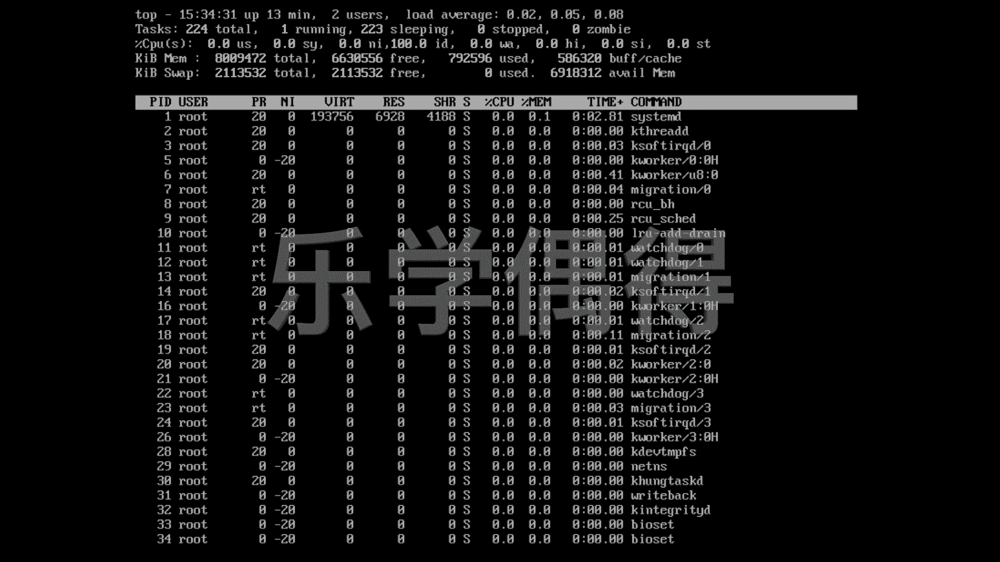
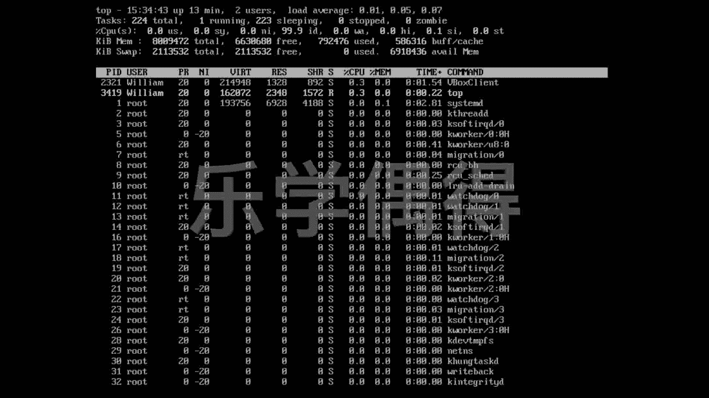
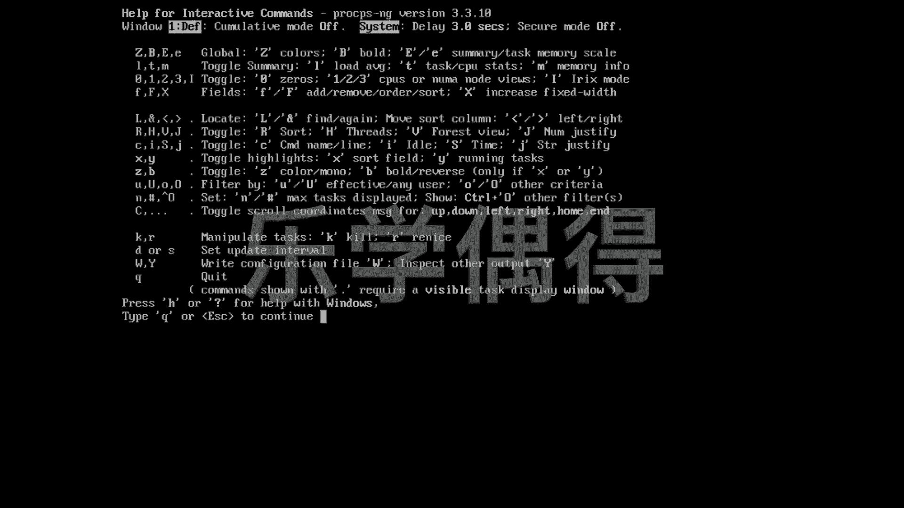
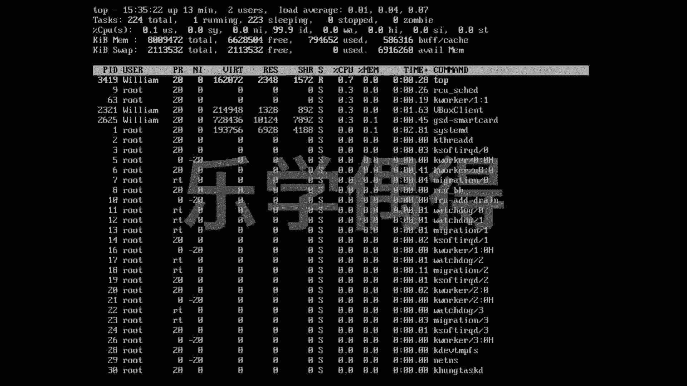
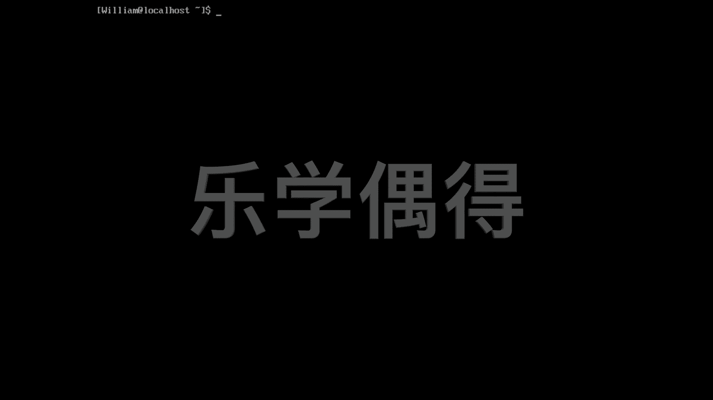

# 乐学偶得｜Linux云计算红帽RHCSA／RHCE／RHCA - P28：27.top查看系统正在运行的程序 - 爱学习的YY酱 - BV1ai4y187XZ

好了，最后呢跟大家介绍一个命令就是top top这个命令就是我们现在程序里面不是呃有很多程序正在后台正在跑，是不是我们可以看这个最top的那些程序啊，它到底是最占空间，最占这个资源的这些程序的话。

到底是什么啊，这个时候呢我们就把它toptop一下。大家可以看一下啊相当于这边的话有各种各样这个id还有user啊，后面还有各种各样的东西啊，我们现在可能还不了解啊，不过没有事情，我们之后的话会1。

1点去介绍啊，那家看这个东西有点像什么，有点像我们在windows或者m里面这种资源管理系那样的感觉，是不是啊，就相当于我们后台有什么东西正在跑啊。

这个呢在我们做这个系统管理员或者是我们在做这个比如说你你这个这个服务器，很可能有人会正在入侵的这个时候的话，我们用这个这个top命令是非常有用的比如说你可以看有。有一个user。

假设你这个user他又不认识，或者是它正在占用你这个电脑的大量的空间，或者是后台一直有个程序正在跑。但是你这个程序也不知道是啥啊，这个时候的话很可能你这个服务器或者你电脑已经被入侵了啊。

我们就可以通过这个前面这个ID，然后来反查这个到底发生什么情况啊，当然这个是我们后面会学习到了这个东西啊，所以说我们这可以呃这个通过这个top这个命令看我们这个电脑正在run什么样的程序。

而且呢这个的话还有help，是不是我们按一下H。

假设你不会用的话，你可以在这个呃按下H之后，在这一条信息里面去找啊，这个相当于是help。help里面的话会出现很多很多，你具体怎么样去找怎么样上下这个上下移动，怎么样去定位啊。

或者是呃怎么样把这个那个各个程序，假如想把它Q把终止掉啊等等等等啊，我们都可以通过在这个页面进行查找，就是help我们现在如果想退出的话，就是按Q是退出或是按退出键退出，我们按一下Q，就退出了啊。

比如说退出现在还没有退出话，我现在还想退出啊，我们就可以再按下Q退出啊，大家看我们这个东西是实时在变化，是不是啊，它这个东西相当于实时的，应该就是个一两秒钟的这个延迟啊。

它都是实时再更新的我们按下Q退出上面就已经没有更新了。我们又这个回到我们这个命令行了。比如说你说这个太花了，我不喜欢从下面开始打，这样的话，我们就clearcle就是把这个页面清理一下我们按一下回车。

相当于全部清理了，我们又从第一行开始打。

