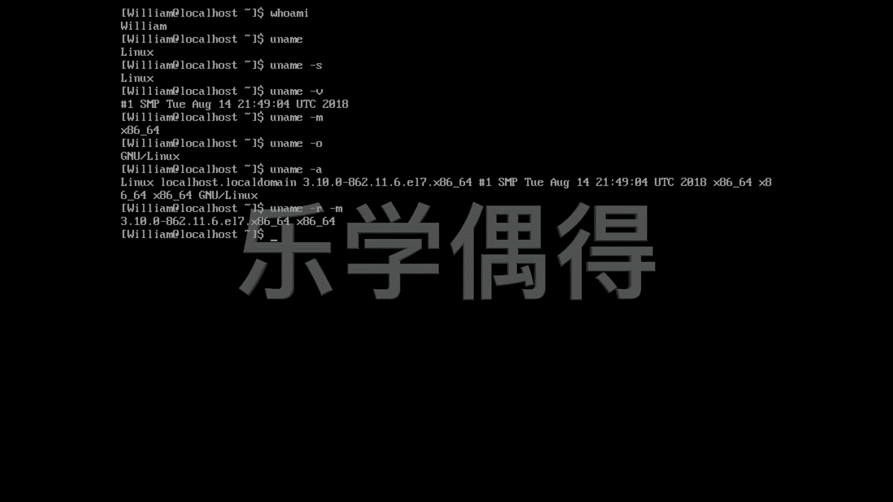

# 乐学偶得｜Linux云计算红帽RHCSA／RHCE／RHCA - P29：28.uname显示系统与机器信息 - 爱学习的YY酱 - BV1ai4y187XZ

我们之前学过户外卖是不是啊ho外卖。啊，这个我们就知道我们是谁了啊，这个时候的话，我们除了知道我们这个用户是谁，我们还想知道我们整个这个用户他所在这个系统到底是什么样的啊，这个时候还是问名字呗。

所以说我们就用U name啊，你的name是什么呀？是不是我们再看啊，你的name是linux证明的话，这整个嗯我们的这个操作系统的内核啊，是linux的这个内核啊，同样的我们还可以用这个U name。

然后加一个小横杠，小横杠加一个S啊，以这种方式的话，其实也可以得到这个linux它的这个呃操作系统这个内核的名字叫什么un name都是可以的。呃，当然了。

我们还可以通过这个un name然我直接这个按一个向上的符号的话，可以把上一条命令直接复制下来，我偷个懒啊呃，U name的话，如果我们再打一个V啊，V的话。

我们知道是这个versionion是不是这个呢就是我们这个linux的内核，它的这个version是什么样的啊，这个内核的versionion。呃，我们还可以可以看啊。就是呃我们。这个内核知道了。

我们还要知道我们这个machine，我们虽然这个machine是个虚拟机器啊，但是我们也可以看一下啊，因为说实话现在的这个操作系统，这个这个虚拟机里面这个操作系统并不知道自己是一个在虚拟的操作系统上啊。

在虚拟机上啊，所以说他还以为我们我们有各种各样的这个硬件的配置。所以说我们可以看一下它认为我们的硬件配置，我们的machine它这个type到底什么样子的啊，可以看哦，它是就是64位的啊。

相当于呃我们这个这个虚拟机里面这个lin6位它是跑在这个64位上面的啊，其实都是在这个这个虚拟机这个viual box里面的我们还可以用name的话可以看这个我们的操操作系统到底是什么样的。

opering system到底什么样的这个是。啊，相当于是这个这个g的这个linux的操作系统啊，也是linux。说实话啊，这个倒没有什么太大的一些嗯，没有让我们什么吃惊的地方，是不是啊啊。

所以说我们还不如一次性把所有东西全部显示出来呗。哦，所有东西全部显示出来。啊，相当于我们各种各样的信息以上所有的信息全部能够一次性显示出来。而且呢我们还可以显示部分信息。

比如说我们又想显示我们的这个嗯内核的这个这个number，比如说这个。内核的这个number又想显示我们的这个呃machine type。而这个杠R杠M。这样的话。

我们可以对以上的这些信息这个进行组合啊，比如说别人说啊想你想问别人一个问题，别人说哎那你到底是在什么版本上这个ro呀，是不是你到了你这个的系列这个版本到底什么样子的话。

你就可以按照啊你自己想要的显示的信息的话，把这些信息输入进去。然后这个跟在这个U name后面按下回车啊，以下的信息就是你想查到的信息。

