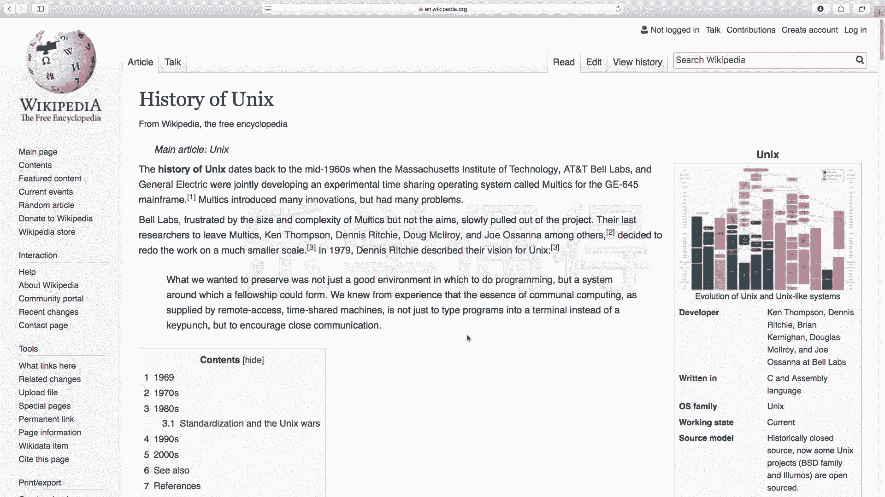
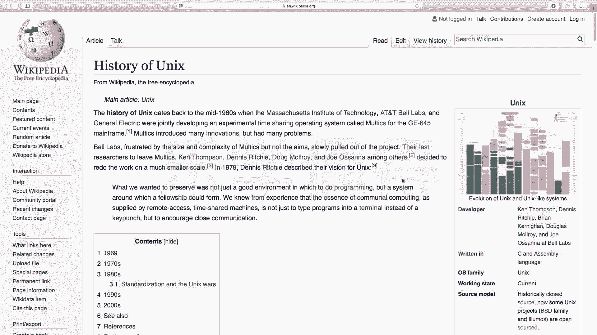
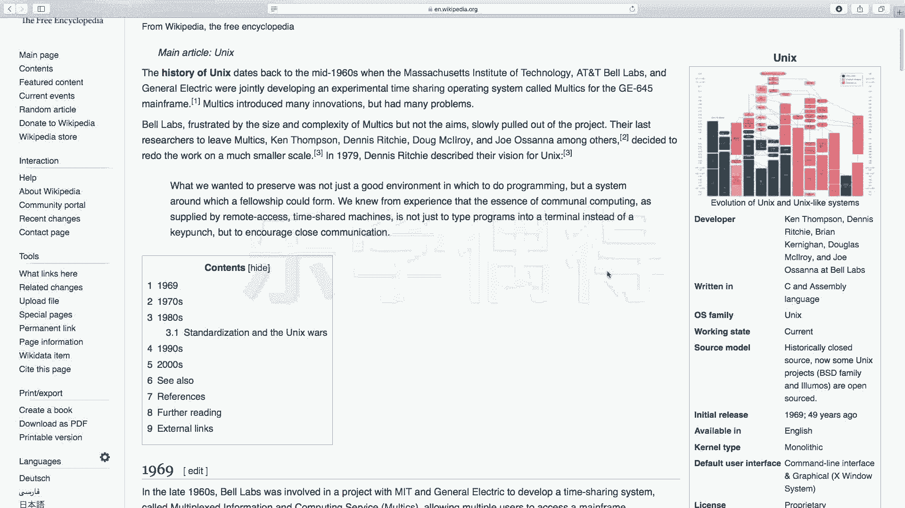
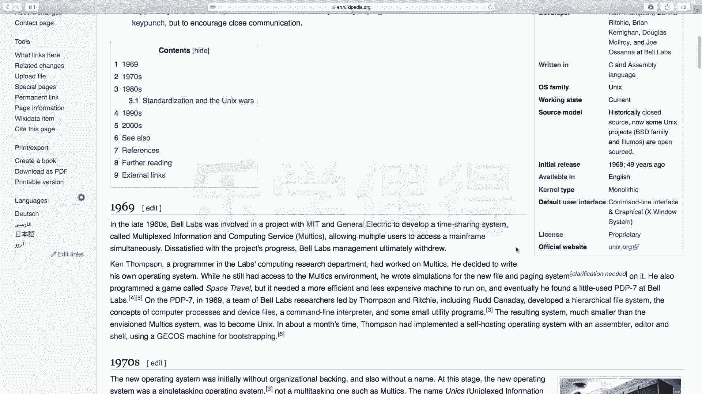

# 乐学偶得｜Linux云计算红帽RHCSA／RHCE／RHCA - P2：1.Unix的历史 - 爱学习的YY酱 - BV1ai4y187XZ

好，各位同学大家好啊，我是威廉。在这一系列课程中呢跟大家讲一讲关于linux的入门。嗯，相信大家都是不少啊，都是通过先跟我一块学习python。

然后通过那个视频来开始了解这个linux当然你也可能第一次这个听我跟大家分享啊，所以说你可能也是对这个呃linux比较有兴趣，所以开始学啊，这个课程呢是专门对于这个零基础啊。

就是说根本都不知道什么是linux，然后呢我们跟大家从零基础慢慢慢的啊去让大家去了解这个linux系统。嗯，相信大家应该听过除了linux还有unix这种东西好像好像很多很多。

是不是啊大家都根本搞不清楚这个道底谁是谁啊，我们先来比较两个观点啊，一个是这个linux，还有一个是unix啊，什么是linux，什么是unix呢啊，我们可以把这个linux。

unix比较成一个一对父子的关系啊，大家可以呃有空到这个wikipedia这个history of unix这个配置来看一下，这个右边啊有一个很很非常完整的一个图吧啊，跟大家看看一下。

最开始它出的这个系统啊，是叫unix。然后其他的都是基于这个unix在这个unix的版本上啊进行这个不断的改动，不断的开发的啊，大家可以看看这个绿色的是开源的。像这种这个橙色的吧。

叫mix or shared source啊，就是啊半开源又半不开源这种样子的。像这种红色那就是估计就是商用版的，那叫close source啊，它是不开源的。啊，大家可以看看啊。

你看我们的这个平常用这个这个mintosh的这个macop system，它其实就是基于什么？基于这个free BSD啊，BSD呢其实又不断的往上追溯啊，最终得到了unix其实都是嗯怎么说呢？

叫类unix的操作系统。嗯，大家可以看看嗯，这样的这样的话，这个图我觉得特别好啊。啊，你看这个左边是时间年限，一直到现在2017年。嗯，相当于我们可以从1969年从刚刚刚刚开始Uinix诞生的那一刻。

到现在各种各样的分类，各种各样的版本呢，大家相当于心中有一个数。嗯，大家可以到这个hunix这个VKP page，大家可以看一下，讲的是非常非常详细的啊。

如果大家嗯对这个背后啊这个unix它的历史背后呃有特别多的兴趣的话，大家可以买相应的书来看啊，我在这边呢就大概跟大家讲一讲这个unix，还有这个linux它的发展史，毕竟呢我们是要学习这个东西。

这个东西它怎么来的？它最初是为了解决什么问题，现在要发展成什么样了？为什么我们要学，是不是啊啊，这是我们每当学一个新的知识都需要了解的一个问题。啊，首先跟大家介绍一下这个unix的发展历史啊。

我们最开始知道unix和linux相当于是一个父子关系。unix是老爸，是不是啊？linux我们现在要学到啊，它相当于是它发展到很后面的一个一个一个版本吧。好。

首先跟大家介绍一下ixix它有几个发展的阶段啊，我把它分为这个应该是三个阶段啊。第一个阶段是1965年啊。

1965年的时候在上写196年的个中期其实说实话就是1965年在这个麻省理T of technology啊麻省理工还有个通用电器啊。

就是GE还有这个ATATT有一个叫这个 lab贝尔实验室相当于T通用电器，还有这个ATNT的贝尔实验室。

他们一块联合想开发一个这个工程叫做叫做ss我们知道像这种s这种相当于就是很多种是不是就相当于有多道同时处理的。

比如说ling就是这个人会出很多种语言相当于它是想处理一个这个多闹程序处理的这种分时操作的一个系统。

你看又是就是mtic，然后就是tick tick就是时间嘛，就是分时操作。它两个这个相对于把这个词弄在一起啊啊，他这个呃一看这个名字啊啊，如果你直接看他的这个中文翻译名字，特别长。

叫做交互式多道程序处理能力的分时操作系统，所以它这个是mtic这个工程。你一看光看这个名字觉得很长，是不是啊啊，这个项目是特别特别复杂的。你看光参与的啊。

这几个都是呃这个可以说当时顶尖的这种开发的一些团队吧啊，他们想做一个这个很大的一个工程的项目。呃，但是呢呃这个maltics它太过于复杂了啊，所以说这个它的项目当时进度啊是特别特别落后的啊。

就相当于比如说你要完成这样，他又没有完成，是不是这种时候在我们做开发的时候很容易出现这种情况啊，你看当时这种大神也出现这种情况。所以说呢这个贝尔实验室也就是呃这个ATNT当时下面一个叫贝尔实验室。

他就慢慢慢慢的slowly put the project慢慢慢慢的就退出了啊，退出之后呢，没有完。你虽然说贝尔实验室退出了，但是呢当时在这个这是第二阶段了，刚刚是第一阶段就是贝尔实验室退出。

在1965年在1969年的时候啊，虽然贝尔实验室退出了，但是呢他那里面贝尔实验室工作的有一个工程师啊，叫做这个ken thommpson。

就是这个kent姆森，这个也是大名鼎鼎的，这是大牛。我可以给大家看一下这个图片的。ken thmpson and这个d斯叫ri就丹尼斯理查丹尼斯李奇丹尼斯 rich丹尼斯李琦啊，就相当于都是两个大神啊。

到时候我后面再跟大家去介绍啊呃就是目前呢就是是在1969年的时候呢，贝尔实验室当时有个工程师叫kentomson这个人呢他。觉得哎呀这个嗯。

退出了这个计划也不太好，是不是？然后他当时是应该是去玩一个什么游戏吧，玩一个游戏，在一个这个操作系统上去玩完了之后呢，然后就觉得这个这个个好像写的不太好。这个程序。因为为什么？

因为玩这个游戏时候觉得这个游戏很卡，于是他就说哎到底是什么原因呢？他就去想到底是什么原因。后来他经过一系列的排查，竟别人是大牛嘛，他排查之后呢，他发现的话原来是操作系统有问题啊。

所以说他就利用他之前学的这些知识然后呢，在这个叫叫DC叫dPDP杠7这个这个系统上啊，他自己就写了一个操作系统啊，他相当于自己就开发出了最最最初的这个unix的操作系统。啊。

这个呢是这个整个unix发展的这个第二阶段。嗯，后来呢在这个。就到了这个1971年的时候，这个cantomson就是他写unix操作系统啊，还有一个他的一个同事。

当时他的同事叫叫叫dennis rich。啊，相当于叫丹尼斯李奇啊，他们两个人呢呃一块工作的时候呢，发明了一个叫做C语言啊，这个也是编程史上的话特别特别啊重要的一笔。

就相当于现在的很多语言说实话都是受了这个C语言的影响的，都可以看到怎么说就你可以看到C语言的影子在各种语言里面嘛啊。

这个C语言呢就是在1971年的时候是kenomson和他的一个同事叫d rich他们两个去发明的啊，在197年的时候，他们发明C语言之后呢，在1973年的时候，他们就这个在unix系统上啊用。

这个C语言去重写了大部分的源代码啊，这样的话，你看现在我们各种操作系统几乎都是在这个C语言的系统上去去运行的。所以说它当时在1973年的时候，把unix系统也通过C语言全部进行了重写。

所以说这个unix的操作系统的话，它的可移植性就非常强。说实话它就是一个呃大多数的这个语言都是C语言去啊去写的。所以说它的移植性啊，它的各种各样的机器上其实都是可以进行运转的，大部分都可以运转的。

