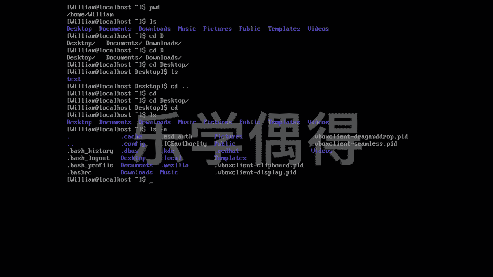

# 乐学偶得｜Linux云计算红帽RHCSA／RHCE／RHCA - P30：29.自由的在系统中穿梭 - 爱学习的YY酱 - BV1ai4y187XZ

好了，这一节课呢我们再开始在这个系统里面进行进进出出啊。呃这几个命令应该之前大家都有见过啊，也是非常常见的命令print working director这个的话就是我现正在什叫是我现在正在工作的这个目录到底是什么样我们按这w话就我进行工作的我们还有这个之这我们刚刚上上节课讲过可以把所有东西全list列表列举出来啊。

会有desktop document music public等等等等是是我们会了这命之后的话，还有个当于可以进去也以出我如果想去这个destop我要注意这个是 sensitive是一个大小写有关的所以说我们还是看该大写写小写小写我们destop大家看我怎么。

突然一下就打出来了，这个并不是我掉帧了，这个是我按了一下这个tab。比如说你就打一个D，你按t的话，它是出不来的啊，你按这个D，你看啊突然按多了，它是出不来的啊。

因为这个D的话有top document download，全部都是以D开头的需要你选一个。以说你看到下面之后话，你再写个一啊。

这样的话就能这个按一t的话就可以补充补充进来了啊我们再可以看看这下面有什么这个是我们上好几节课的时候重新新建的，是不是我们进去我们还想出来出来的话，我们有两种方法。首先呢我直接啊这个按一个D空格。

然后按两个。按这个两个小点啊，小点的话就是往上一级。啊，现在我就到了我们最开始的这个初始这个默认的界面啊，比如说我们还可以直接什么都不打这个CD这样的话也是默认回到这个界面的。

比如说我可以先先到这个desktop啊里面去啊，我按下CD自动的就会回到我们这个呃最开始初始界面啊，相当于我们可以通过这种方式的话，就进去出来。

然后呢我们看我们进去有什么东西就list全部看一下就可以了。比如说还可以list这样的话详细信息啊，不是详细就是就是把这个呃和非常详细的所有的都显示出来。无论它是隐藏的还是非隐藏的。

都是可以显示出来的啊，这样的话我们就可以非常自由的去navigate our system啊，我们就可以在我们系统里面自由的进行出出了。

