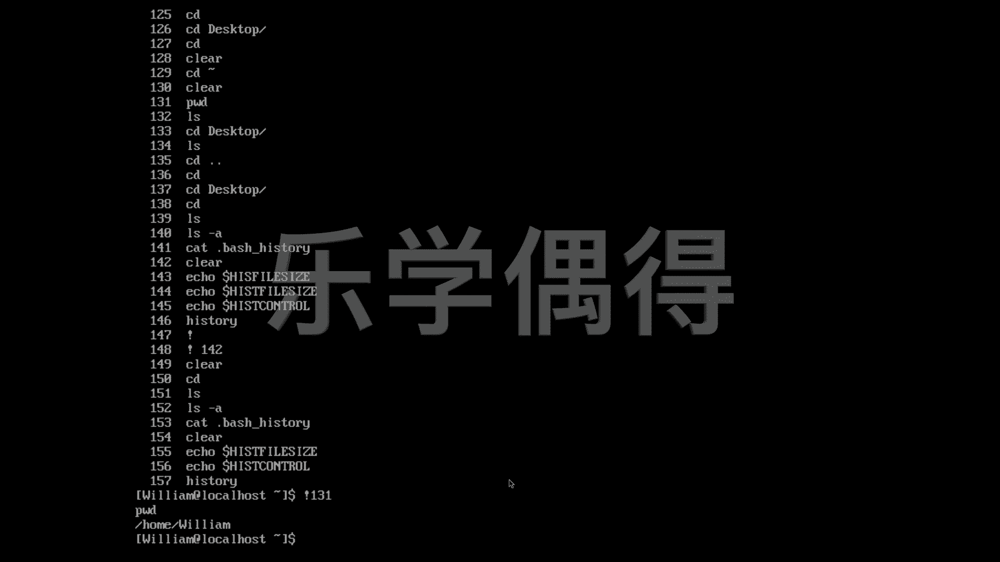

# 乐学偶得｜Linux云计算红帽RHCSA／RHCE／RHCA - P31：30.linux在记录你的一举一动 - 爱学习的YY酱 - BV1ai4y187XZ

🎼好，各位同学呃，我们经常会在电影中看到一个这样的情节，就是呃黑客也好，或者是这种白客也好啊。啊，他呃要么是做这个电脑防护，要么是要入侵别人电脑啊。

这个时候呢我们就会说唉我们入侵电脑不是会打一长串指令嘛啊，如果是我们呃正在防护的时候的话，发现有一长串指令，我如果把这个黑客这个指令拿到之后的话，我就知道他想来干什么，是不是啊，这个时候的话。

这个log啊，或者是我们这个所谓历史记录就非常非常重要了，是不是啊大家不要一听历史记录的话，就抖三抖啊，觉得啊这么涉及隐私的东西的话呃是不是我们平常一般都会把它删除掉啊。

但其实我们如果是这个企业的服务器或者是啊大家的话自己在这个linux系统上的话，这个这个服务器的话log和hory是非常重要的啊，我们先保留历史记录啊，之后的话，我们。在做这个非常要呃安全性能非常高。

或者是呃做一些这个参数调整的时候的话，大家其实自己可以把它的这个历史记录啊，相当于无痕浏览一样的，把这个所有的历史记录全部都删掉。呃，我们知道比如说我们这个打什么这个CD啊L啊等等这些命令的话。

其实都会啊把这个记录保存下来。比如说我们可以这个L我们现在是在这个默认的这个文件。我们打一个让所有东西全部显示出来，有些东西是我们看不到的。

比如说大家可以看这个dot history我们知道我们这个这个是叫b shell是不是是最著名这个用的最广的一个我们这个b shell里面敲的这些这个其实全部都储存在了这个b history里面相当于它是一个文件。

这个文件呢是专门这个历史记录的啊，所以说我们可以把这个b shell打开看看里面有什么历史记录我想把它打开的话，就是ca这个ca在就是个猫一样的，是不是？然后呢，把这个bash。

然后下划线history。把这个东西打开。好，大家可以看一下啊，这就是我们之前给大家这个演示的各种各样的这个记录啊，全部都会被记录下来啊。相当于我们可以查看之前的这个记录啊，比如说我现在不想看了啊。

我现在cle啊，全屏就已经清好了。我们还可以这样看，比如说我们想知道这个记录啊，它到底有多大啊，我们可以通过这个echo。echo这个命令。echo相当于就是print打印的一种感觉，是不是啊？

我们echo，然后呢。用一个这个美元这个符号啊，e，然后全部都要大写，这个大家不能这个打错了，hes因为它是这个叫嗯大小写非常sensitive的，它相当于对大小写大小写很敏感。

这个hsist就是history的意思，就是历史的意思。然后呢，file。然后我想知道它这总共能保存多少条历史记录。所以说我们echo historyory file size。好，大家可以看一下。

我这个电脑上可以保存个1百千1000条你曾经操作的这个记录啊，这个记录保存都是可以记这个进行更改的。我们可以把它变成零，这样的话它就完全不保存了啊。如果可以把它保存，你想让它保存多一点的话。

你可以比如说1万10万都是可以的啊，这个东西的话，其实都是可以自定义化啊，同样这个e还是history啊，但是呢我不想看它这个大小，我可以想看它的这个conttrol。啊。

就history control打进去之后的话啊，我们可以呃看下面出现了一个这个东西，这个东西大家一看的话，不要觉得它是个很长的单词啊，它是ignore duplicatelics。

相当于这个重复的命令的话啊，它都不会啊进行这个操作。相当于你如果这个命令打重了的话，它是不会操作的。就是这个dlicate重复了，它自己会忽略掉啊，这个相当于也是一种呃说实话也是调参吧。

你把这个各个参数进行调整呗啊，相当于你这个e的形式，看看你这个参数到底是什么样的。查看一下啊，这个倒没有什么太重要的。我们还可以最简单的啊，我们可以直接看history就可以了呗。His。

historytory。我们打这个history之后的话，直接就会蹦出我们之前的所有的操作命令啊，大家可以看一下啊，包括我刚刚说的这个echo这个history fire size。

还有echo historyory controll等等的话，其实前面都会有一个编号啊，这个编号就是你是多少多少号命令。如果呢你想这个再次执行多少多少号命令的时候的话，你可以直接这样。

你按一下这个感叹号，然后把你想执行的这个号打进去。比如说我想让它执行print working director啊，131号，我就写131号。按下回车，我就会执行上面这个131号命令。

就是print working directory，你看print working directoryhome Williamiam他就执行了啊，这也是个非常嗯非常方便的一个方法吧。

你可以指定去让电脑执行哪一个命令。

