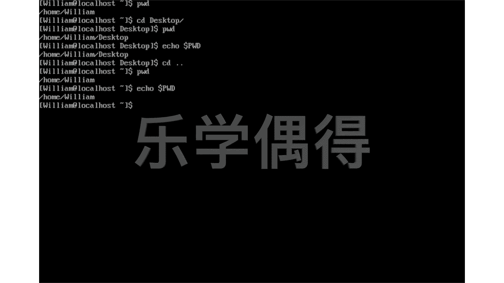
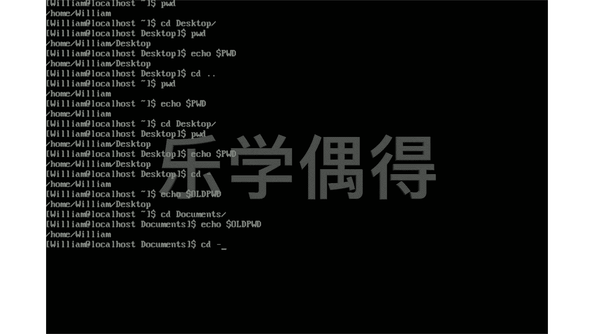

# 乐学偶得｜Linux云计算红帽RHCSA／RHCE／RHCA - P32：31.命令与变量 - 爱学习的YY酱 - BV1ai4y187XZ

呃，之前呢我们学了一个非常有意思的命令啊，就是这个print working directory啊，我跟大家打一遍。就是小写的啊，因为我们这是命令，不是环境面料啊，printntworkdirect啊。

小写PWD好，打进之后的话，我们就知道我们在哪了，是不是我们现在呢正在这个home will这里面啊，然后呢你想想啊，比如说我现在想这个CD相当于chan director。

我们把我们这个位置啊发生一下改变。比如说我们想去desktop。Desktop。现在呢我们在这个PWD。哎，你会发现的话啊，同样你输入这PWD的话，之前它会返回home willm。

现在呢它会返回home william desktop。哎，你想想这个PWD它本质上说说实话它就是一个一个变量，是不是啊？它相当于呃你输入进去之后的话，它相当于执行了某一个什么东西。

执行了什么什么东西之后的话，它会给你返回一个值。你可以把它想象成一个按钮，这个按钮上就写着这个PWD你按一下它第一次返回的是home Williamm，你又按了一下的话。

它又返回是homewilliam，这个时候是为什么？因为你想想它这按钮的话，它是不会变的。按钮上它贴了1个PWD的标签，是不是？但是呢它后面发生的东西啊啊，后面这些变量发生了改变。

所以说这个按钮上面标签没有发生了改变，后面的东西发生了改变。这个时候我们可以通过echo来进行啊，看看它后面发生了什么？比如说啊我们先 echocho一下。Echo后面加上这个环境变量的时候的话。

要加上这个呃这个相当于美元的一个符号。这个你在这个41234的4，你键盘的这个上面。然后呢，我们这个时候要把这个print working directory要进行这个大写啊。

这个时候的话就相当于看看这个它环境变量，它后面是什么东西。我们先回车看一下。啊，你可以看它是现在在这个homewilliam desktoptop，是不是？然后呢。

我们如果是在上面那个时候使用这个echo PWD的话，它就不会显示这个，它会显示home Williamm。比如说我们可以先试一下，我们先chan director。

我们现在先回到我们这个home William啊，我们可以用这个两个小点，两个小点相当于是回到上一级，是不是啊啊，就相当于回到了home Williamm。好。

我们现在呢printwork directory啊，这是个命令啊，我们再一看哎，我们现在在homewilliam这边是不是我们再 echo一下呢，再看看这个环境变量有没有发生改变PWD啊。

我们 echo一下哎发现哎我们也变成了home相当于你同样是这个printwork director这个W它后面的东西发生了改变啊，非常重要的一点啊。

就是我们这个printwork directory这个只是一个变量，这个变量的话可以通过我们这个echo，然后把这个变量全部大写，然后放在一个doll sign放这个美元符号后面。

我们可以看这个变量它的值啊，它的value有没有发生改变。你看啊我们如果再chan，我们再把这个这个路径啊再变一下。比如说我们chany再到这个dextop。

现在呢我们print working directory。printwork director就会变成homewilliamtop同样我这个 echo，后呢相相当于可以通过这个do sign。

然后大写printwork director可以看这个PWD它这个它这个变量，后面这个value这个值有发生改变啊，一看它这个值也同样发生了改变啊。

这个呢其实就是我们每一个指令啊其实都是一个变量都是个的一个思想啊，就像这个PWD一样的，它每次执行的都是不同的这个都是一样的指令，但是呢它这个后面这个value发生了改变。

所以说我们每次的话这个print director它显示的东西的话会发生不一样的变化啊，同样的我们还有一个向前面的就比如说我们这个CD小写的CD我可以向前走一步啊。

比如说我CD加一个小横杠这个就相当于走到上一步去就是说我这个前一个direct什么样的话，我们可以走到前面去这个时候的话你说。他走到前面这一步，他这个前面一步它是放在哪个地方了呢？哎。

放在了一个这样的这个变量里面，就是echo。echo呢，然后后面加一个这个doll sign，加一个美元的符号，然后呢是这个叫做ode。printnt walking directory。

相当于你这个路径前面一步是发生了什么？比如说你看这个。我们的前一步是在dextop里面，是不是？然后我们现在这一步在这个home Williamiam这边啊，比如说我再做一下变化啊，我再再做一下CD啊。

CD，我这次的话，我不到dextop，我比如说想到doments。Documents。Docu。Documents。好，我们现在已经到了do是不是？然后呢。

我们可以再echo一下echo echo这个out print working directory就会发现我们上一步不是在这个homewill里面嘛，是不是我们现在在这个doment里面。

所以说我们上一步是在home William。然后呢，我现在再想CD回去啊，CD到这个home Williamiam，因为我没打这个CD一个小杠的话。

它就会掉出这个old printwork director。这里面的我们相当于上一步的一个历史记录一样的，我们再按一下回车的话，哎，我们就到了home Williamiam。

