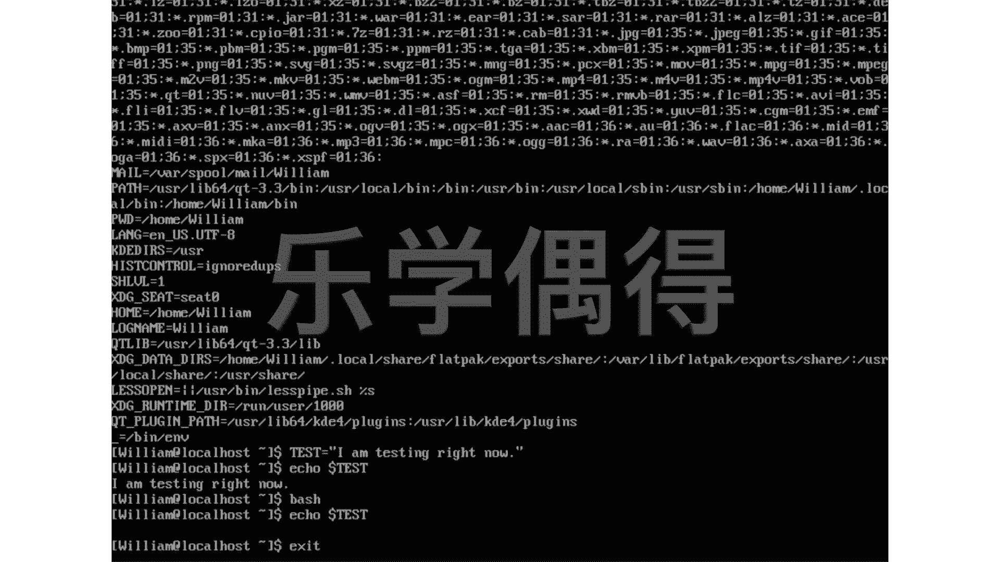
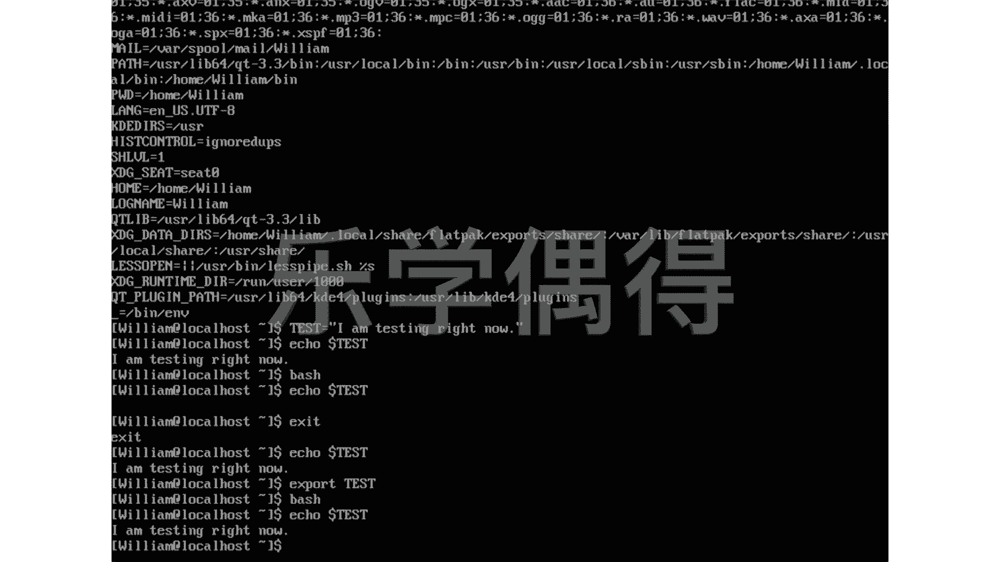

# 乐学偶得｜Linux云计算红帽RHCSA／RHCE／RHCA - P33：32.变量导出 - 爱学习的YY酱 - BV1ai4y187XZ

上一节课呢我说了一个词，可能大家的话之前没有接触过叫做这个环境变量啊，就是environment variable啊，那什么是环境变量呢？我们先把这个environment打出来，大家就知道了哎啊。

Environment啊，这个呢是不是说环境保护那个environment啊，这个也是说我们操作系统这个环境啊，我们这个ENV是个environment环境的简称。

我们打进去打进去发现哎好像有很多东西我们很熟悉啊，比如说啊大家可以看一下嗯，这边有一个这个history control啊不知道大家看到没。叫这ist control啊。

这个之前我们在说这个linux系统在记录我们的这个一举一动的那一刻，我们讲到过啊说啊其实我们每一个都有这个lock啊，每一步其实它都记录下来了。

你看 control后面是ore这个之我们好像也看过是不是大家看我们的home是homem啊lock name是william是不是啊这些我们好像其之前都有看看到过啊。

也就是说啊你看我们其实打这个print director时候的话，它后面的话是一个这的一个一个value这个value的会不断变化也就是说我们每次打这个PWD的时候啊。

它都会调出后面这个值这个值的话会发生变化啊，所以说我们就相当于可以知道我们每一个指令啊，每个命令它后面发生了什么啊其实都是储存在个相当于环境面里面就是vironment里面的。呃，那么如果是这样的话。

我们知道lininux系统的话，它好就好在它是一个非常这个呃灵活的。而且呢所有东西都是可以自定义的。那么我想一想我能不能自己也定义一个这个这个变量呢？相当于我每次打一个这个命令的话。

我自己就能让他去操作一定的操作，是不是？这个时候的话，我们就需要自己去定一个变量。比如说我们先有一个test。搞一个test，然后每次输入test的话，它都会啊有一个这样的定义啊。

大家可以看看前面呢它有个这样规律，是前面是一个这个比如说啊hist control，然后一个等号，然后后面是一个什么东西，是不是？

那我们就test就等于然后后面等于搞一个嗯I am testing right now，比如说I am搞个小写的吧，Im。testing rights now好，相当于这个test这个命令的话。

就会显示i'm testing right now，是不是啊啊，我相当于自己定义的一个变量啊，这个如果大家有这个其他的变语言的变程基础的时候，你看相当于有点像这个负值一样，贴个标签。

Im testing right now，然后贴一个test这样的一个标签啊。好，我们按一下回车啊，应该是已经输入到电脑里面去了，是不是啊？好，现在呢我们就直接echo一下啊。echo。

然后呢一个dollar sign，然后test。好，我们按一下回车，发现I'm testing right now，是不是啊啊？好好像我们就已经已经把这个变量已经这个贴了成功了。

我们每次打这个test就会这个显示出I'm testing right now。但是呢我们这个呢是我们刚刚编的一个啊指令，我们如果重新打一个这个b shell。你看我打个bsh，然后回车。

相当于我现在重新打开了一个b shell之后呢，我再echo一下。同样的还是ec上面一模一样的啊。好，我回车，大家看一下。哎，啥都没有发生，是不是啊？哎，发生了什么发生了什么问题？

我明明刚刚这个说这个test，就是I'm testing right now。我现在打一个 echocho，你看这个eccho跟上面这个 echocho，我所有东西全部一模一样。

只不过重新打开这个b shell这个东西它就没有显示了啊啊我们这个时候的话我们先退出，这个时候我们要需要用到啊一个export这样一个技巧。比如说我这个exit啊。

这个是退出这个这个b shell的一个方法，你点一下exit啊，回车啊，我们相当于就退出了我们这个b shell。

然后呢，我们之前不是已经有这个testing，我们比如说再再 echo一下吧。这样的话大家就看得清楚了。好，大家看一下，你看I'm testing right now，相当于什么？

相当于我退出到原来那个那个那个操作这个界面的时候的话， echo test它就会出来。但是我重新打开一个b shell的时候的话，它就不会出来啊。

这个时候我需要把我原来那个环境里面这个test去把它export，去把它导出导出到啊这个大家都可以通用的，大家都可以调用的。这个时候的话啊我们再打开b shell的时候就可以调用了。

于是呢我们就先把它export。Export。export有点像出口这种感觉，是不是啊，你把你自己定义的东西去出口掉啊，export这种时候我们就直接打test。好，这样一回车之后的话。

我们就把我们刚刚命名这个test等于Im testing right now全部都出口出去了。这个出口出去之后的话，我们再打开best shell。这就完全不一样了。

比如说我们再打开blashsh shell，打开bsh shell之后的话，我们再echo一下也是一模一样的。Echo test。好，我们按下回车。

你看就出现了I'm testing right now啊，这个呢相当于我们可以export variable。我们可以把这我们这个变量啊进行export，相当于导出来呃。

相当于我们可以把这个he这个我们刚刚命名的一些变量的话啊，导出export to other这个to other shells。我们可以把这个嗯 shellll里面的这个变量啊。

我们的这个命名的一些value的话，去导出到另外的 shellll里面去啊，相当于在另外的 shell里面，你去调用你自己刚刚编的这个东西的话，也是可以用的啊，这个呢是一个小技巧。

