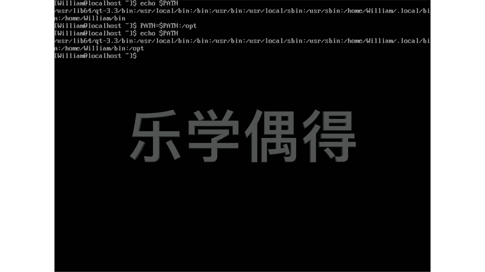

# 乐学偶得｜Linux云计算红帽RHCSA／RHCE／RHCA - P34：33.实际例子增加opt - 爱学习的YY酱 - BV1ai4y187XZ

啊，我们再来看一个比较实际的例子啊，我们在平常的这个工作中呢，如果是用lininux系统，经常会安很多很多的一些三方的一些文件啊，或者三方一些程序到我们这个电脑上啊。如果我安装程序的时候，那个程序啊。

它会有一个默认的呃这个跑的一个路径啊，那个路路径呢，比如说我们先看看我们默认的路径到底是什么样子的啊，我们先到这个屏幕里面来。首先我们先e echo呢，我们用一个现在的路径啊，这个一定要大小pass。

好，大家可以看一下啊，我们目前它显示出来这个是william是不是啊啊，是这个路径。但是呢啊往往呢如果我们是安装了其他的一些程序啊，他默认去run这个路径的话。

不是这个并它是在并后面还加一个就是O啊就相于后面还有个lash有一个斜杠，然后再O啊。因为应该是opional嘛啊就相当于是这个三方就可以选择了这种路径啊。

所以说我们应该把这个这个pass要发生一些变化。相当于我们这个pass应该变成一个新的这个pass这个pass是在原来这个pass上面后面再加一个lash，再加上一个O啊。

这样的话我们程序去跑才会没有问题啊，所以说呢我们需要把这个passpass相当于就是个变量，是不是我们相当于要把这个原来这个变量变成一个新的这个变量啊。

所以说我们现在呢就需要用到这个pass一个新的一个变量，就是pas这个要大写。pa用新的这个pa等于原来这个pa啊，我们一定要加一个doller这个符号啊，为什么要加这个dollar呢？

因为我们如果不加这个的话，那就变成了这个呃现在这个路径了。我们加这个的话，就是原来啊它现在正在用的原来的那个路径啊，然后呢我们再加一个这个呃两个点啊，相当于就是啊我后面应该加上一个什么东西。

加上一个这个slash，然后OBT啊，这个OBT应该是小写OBT。啊，相当于什么？这句话的意思就是我们现现在这个新的这个pass等于原来这个pas。

因为我加了个原来这个doar sign啊啊就加了一个这个美元这个符号，美元符号就代表我现在正在用的这个pass啊，后面再连接上一个slash一个小斜杠，再加个OPT好，我们按一下回车。

大家可以看看会发生什么。啊，好像什么都没发生，是不是啊？这个时候我再重复上一条命令，就是echo，然后再是pass啊，大家可以看看现在发生了什么变化。啊，大家可以看一下啊。

我这个下一条命令和这上一条命令就完全一样啊，但是呢同样是echo，然后一个美元符号，一个pa，一个是没有1个OPT，一个呢是有1个OPT相当于什么？相当于我们把这个pas啊变变化了嘛。

把这后面加上1个OPT证明我们呢就已经这个弄成功了。

