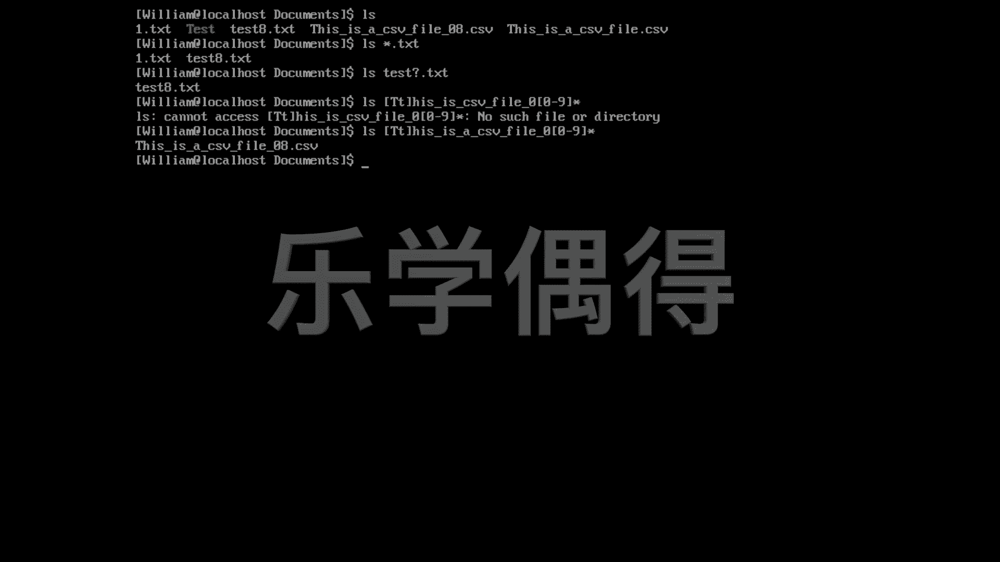

# 乐学偶得｜Linux云计算红帽RHCSA／RHCE／RHCA - P35：34.忘记文件名怎么模糊查找 - 爱学习的YY酱 - BV1ai4y187XZ

好了，我们再来举一个实际点的例子啊。比如说你看啊我现在在这个doment里面，已经啊我跟大家先存进去了很多文件啊。这个文件呢因为呃一些关系呢，我只能打一些文件进去，我不能跟大家打这个成百上千的。

但是大家在日常生活中的话，很可能会会在一个文件夹里面有成百上千这个文件。而且这个文件的话，你很难去找，但是呢你知道你某一个文件是储存在这个文件里面的，也可能是这个文件夹里面东西你并不熟悉。

因为我们可能是其他的服务器啊，这样的话里面东西你是不知道的，你想去找一个东西啊，这样的话我们就需要用到一些技术手段去找它。比如说啊我连这个东西它这个名字是什么，我都搞不清楚。

但是呢我知道它是以TX做结尾的，这个时候呢我们就可以用一个这个所谓wdcard就是什么就是一个星号一个星号点TX这样的话，星号能代表前面所有的东西啊，无论这。前面是什么，我都能把它找出来啊。

这个时候我就用LS，然后空格，然后一个这个小的一个星号点TXC就可以把所有以TXC结尾的文件全部找出来。比如说我按个回车。好，大家可以看一下啊，你看我们上面这个文件，有些是以这个dot cSV结尾的。

有些是以这个TXT结尾的啊。所以说我用这个新点TXT的话，找出来就是一点TXT和这个test eight点TXT是不是啊？啊，有些时候呢我知道这个有一个texax文件存在。

但是呢我搞忘了这个text文件，它到底是以这个第几个版本一个结尾的，它可能是tex onetex twotex three是不是它会有各种各样的这个数字作为结尾，但肯定是个数字。但是呢我搞忘了的话。

它是以什么作为结尾的。这个时候呢，我们可以用这个就是你搞忘了，你就是一个问号呗text，然后一个问号。然后是啥呢？点TX。好，以这种方式的话，就可以代替一个这个呃一个字符。你看啊，我们这样的话。

还是能够把这个test eight找出来啊，尽管我搞忘了到底是以什么结尾的，我还是能把它找出来，是不是啊，这相当于就是通过一个是新的方法啊，一个是这个问号的方法可以去找一些我们搞忘了一些东的东西。呃。

我们再来一个实际的例子，假设呢我们是想找这个this is a cSV file，然后是08啊点CXV。但是呢我完全搞忘了这个道理它是嗯比如说啊它到底是以什么开头的啊。

我搞忘了它是以大写的T开头还是小写的T开头啊，这个时候怎么办？这个时候我们用一个这个小框啊，应该是中括号把它这样框住啊，这样框住的时候的话，比如说我知道它可能是大T，也可能是小T啊。

只要满足这里面的任何一个，其实都可以进行选中。然后呢，this。然后再就是is。然后CSV。File。然后我又搞忘了这个是零几啊，这是01020304还是09啊，是不是这有这么多多种可能，是不是？

所以呢我把它全部都框进去，0到9啊，都可以，0到9里面任何一个数字都可以。然后后面呢我也搞忘了他是以CSV结尾，还是以TXT结尾，还是这个PDF结尾，我真的是搞忘了，是不是？

这个时候呢我们就用一个这个星号代替所有的它任何以这个任何的东西结尾的话，我都可以把它找出来。好，这个时候呢我们再按一下回车。呃。This is a CV file，0哎。

他没有找到this is2 c sfi哦，这有个typo，我少了个A。啊，要不然的话真的是找不到了啊，少少了个A。好，你看我们这样的话就可以把这个this is a CSSV file。

然后it点CSV就可以找出来了。

