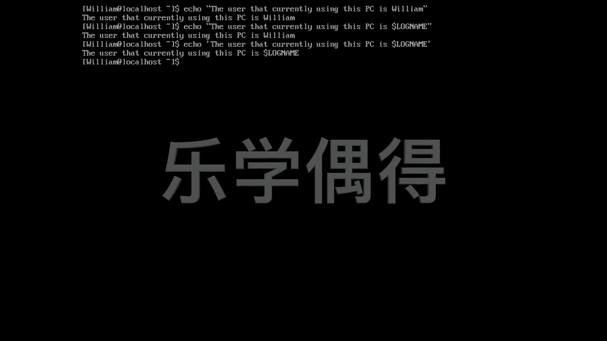

# 乐学偶得｜Linux云计算红帽RHCSA／RHCE／RHCA - P36：35.单引号和双引号的区别 - 爱学习的YY酱 - BV1ai4y187XZ

好了，这节课呢我们来介绍一下一个叫做double quotes，一个叫这个这个single quotes啊，我们知道 quotes就是引用嘛，我们经常喜欢引用别人说的话啊。

你像这个double quotes相当于是双引号啊，single quotes相当于是单引号啊，像这种样子的。呃，那么你想想啊，我们在做这个这个sha description里面的时候，哎。

经常会用到这个echo这个命令echo就是显现这个后面是什么东西，它就 echocho出 echo出来，是不是像个回音一样的呃，那么我们如果这个echo后面是一个非常长的一个句子，句子里面呢。

又还有一些这个这个variable，句子里面不仅有这个str，有这个字符串，还有一些vari，还有一些变量啊，我想又显示字符串又显示变量，这个时候怎么办？比如说我现在举个例子。

echo echocho里面说你的。Use sir。That。Just currently。You think this。呃，this computeruter computer怎么拼啊？

computer。computer哎呦哎，我的拼写太差了。computer。是这样拼什吧？啊，D是PC吧。呃，this PC is好，就是说我们现在正在用这个电脑的人士啊，现在这个是呢是谁呢？

我们就用一个呃可以变得变量在里面啊，就相当于虽然我们知道是威廉，我们可以直接这样威廉，这样就可以把威廉打出来，是不是？但是呢我们想的话，我们万一这个user，它不是威廉呢，他是一个其他的人呢啊。

这个时候我们就有个dolo sign dollar sign，后面加一个log name，这个要大写。lock name相当于我们哪一个用户正在登录这个系统啊，是哪一个人用户登录这个系统的时候。

它就会显示是哪一个人。比如说我现在一看哎，你看我明明打的是dolock name，它这个显示的是william啊，那是因为我这个lock name它是个，它是个变量这个变量它对应的这个值的话。

其实是william相当于是这个william，就是我他登录这个系统是不是？登录这个系统，大家可以看这个local host前面是william是不是william at local host啊。

所以说我登录这个系统，所以说这个我作为这个用户现在正在用这个personal computer好嗯我们假设啊再调皮一下，把这个双引号改成单引号。啊，大家看一看会这个出现什么。嘿大家会看到啊。

我们真的就变成了一个美元符号log name是不是？它相当于就是litterally它直接把这个文字全部都这个显示出来了。也就是说我们双引号里面可以加上字符串，可以加上stream。

也可以加上一些viable可以加上一些变量。而且这些变量的话，它真的还是可以变的。它不是说怕把这个变量就当做它的文字直接把它显示出来的，是不是？如果是单引号，单引号的话。

那就是 literally它相当于就以文字的形式会把它这个显示出来。所以说呃你像这种这个美元符号啊等等。这些作为开头的，它其实是有functionction，它其实有一有一定功能在里面的。

但是呢如果我用单引号把它框起来。那我就默认它只是一个文字啊，它没有任何功能啊，所以说这就是单引号和双引号之间的一些区别。

