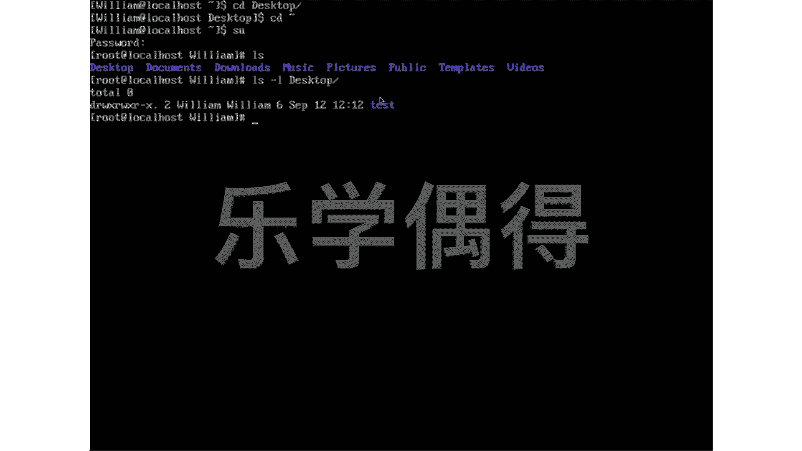

# 乐学偶得｜Linux云计算红帽RHCSA／RHCE／RHCA - P37：36命令行语法规则 - 爱学习的YY酱 - BV1ai4y187XZ

好了，我们现在呢就可以简单的看一下我们在这个linux系统里面的一些这个语法结构啊，以及它这个呃每个部分的东西代表什么样的含义。你看我这个登录到我这个系统里面的话，是以这个william登录的。

所以说这个william的话，是我这个user name啊，比如说你另外一个名字，你以这个tom名字去登录，或者你自己的这个英文名字去登录的话啊。

它这个前面就是你这个正在登录的这个user正在使用这个电脑这个user，它的这个name到底是什么啊，后面这个local host代表的话，我是啊这个在我的本机上去使用的。管我这个是虚拟机。

但是呢这个linux系统它并不知道它是这个run这个虚拟机上的，所以说它也是这个local host。嗯，这个后面这个小波浪啊小波浪的话，我们之前比如说这个CD。

然后CD到这个小波浪D到我们这个小小波浪这边的话啊，其实就是CD到我们这个这个叫root相当到我们这个根目录啊。

比如说我这个CD本来先想D到这个destop然我现在的话要回到这个这个这个root我跟目录实就按下个个相当于一个小波浪你看就可以回到了你看比如说我这个小波浪这个地方啊。

它代表的是你现在正在的这个你现在正在的一个地方是哪比如我刚刚到top边就变成top相当于这个地方代表你现在在哪这边不是还有一个这个请的你看这个美元的符号是不是美元的符号代表什么呢？

美元符号代表你现在是以什么样的权限去登录这个电脑就比如说是个美元的这个符号的话就代表你现在输入这个命令都是以你一般的这种。叫regular user，就是普通用户这种权限去输入的啊，当然了。

如果有些时候你打一些命令，然后呢，这个电脑告诉你说权限不够，这个时候的话你可能要更换到管理员权限啊，管理员权就是super userer叫SUsuper userer超级就相当于超级用户啊直译过来。

比如说你看啊我现在这个想变成超级用户啊。然后呢，你看要输入pasword，这个password是在安装的时候，咱们输入进去的。所以说你把这个密码打进去，你看它这个link系统，它保护还挺安全的。

你输入多少多少位，它都不给你显示，其实你已经输入进去了，按一下回车。好，你看啊就变成root了root的话就咱们刷机的时候就突然拿到这个root权限嘛啊，就相当于拿到这个superus管理员这种权限。

然后呢你看啊啊root权限之后的话，这边就由这个doll这个符号啊变成这个应该是叫井号啊，井号，你看这边打的话，这个命令的话就拿到了这个这个电脑或者这个服务器也好的最高权限啊，你可以这所谓为所欲为了。

是不是有时候这个黑客啊这个黑进去的话，这个也是想拿了这个root权限相当于能够在你这个电脑里面做很多事情啊啊，这个相当于的话，这个doll这个美元符号和这个井号啊。

是代表你现在是以这个re user还是以这个这个最高权限的这个root user啊这个表示的一个地方然后呢我们再来看看我们比如说平常去打这个命令啊。打命令的时候，嗯，经常会有，比如说像这个LOS啊。

相当于说这个里面有什么东西，是不对？LOS相当list，然后list我们还有这个list，比如说杠L杠L之后的话，然后呢我想假设想把这个dktop这个呃显示一下，然后我们我们看看按一下回车，哎。

你可以看一下啊，相当于这个非常长的呃这个跟我们去显示出来具体的这个呃一些信息其实都有了。你看这个包括这个时间等等。嗯，这个是什么意思呢？我们再来分析一下我们这个stax。

我们在这个link系统里面操作一些语法啊，你看LLOS它其实在英语里面这个东西叫做comman。然后呢，这个杠L杠L是叫option啊，这个dextop就后面呢叫做argument啊。

之前我跟大家去教编程的时候，其实不太想让大家去背这些专业的词汇啊啊，我觉得以前没有必要其实你就把它就跟大家去学语言一样，你就把它当做这个婴儿这种这个学语我们就把这些东西这个这个按照别人怎么说。

我们怎么做是不这个用熟了，大家慢慢就知道了但现在的话咱们既然这个选择这条道路的话，一定是非常专业的道路啊，那我们就按照这个啊正儿八经的要把这些东西它到底是个什么样的东西。它的语法是什么样。

就跟我们这个普通的比如说大家去说这个呃说话，大家都会说，但是呢比如说你是要做这个国学的研究的啊，那肯定要从这个我们这个语言这个语法等等这些角度要从这方面去入手。所以说你看这个LS是命令嘛。

那LS这个com叫什么意思呢？其实用白话就说这个LS就。说啊what to do？你现在想要去干什么？比如说你你现在想要做这个L这个命令，相当于你想让这个电脑把它这个list这个相当于列举出来。然后呢。

这个杠这个一个杠啊一个杠一个L啊，这个呢叫做op相当于是个选项你要去做这com你要去做这个list这个动作的时候的。

你还需要你要通过什么样的方式去做这个是你要通过这个杠L这个op相当于有几个选项可以去做嘛？你要选择通过杠L的方式去做做了之后的话。

你说这个动作肯定有一个承受的是是承受者就这个desktopgument什么意思呢？好像你跟别人去吵架是ar是是 argument就是说你要做这个动作。

但是呢你这个动作承受者ment啊就相当于你这个L的动作是个发生在你想让他实行在一个身上的啊这句话的话就是说我这个动作L这个动作是实行在这个desktop上啊所以说大家要稍微记。

我在后面的话会不断提及到啊，呃就是这也是一个非常这个基本的一个基本功。LS是comd，这个杠L是option，然后argument就是dsktop。

