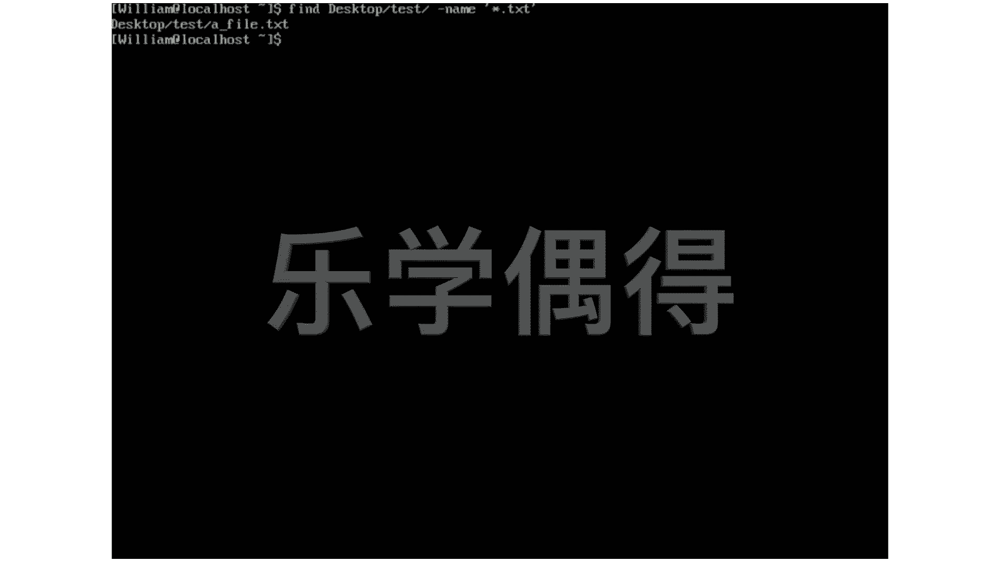
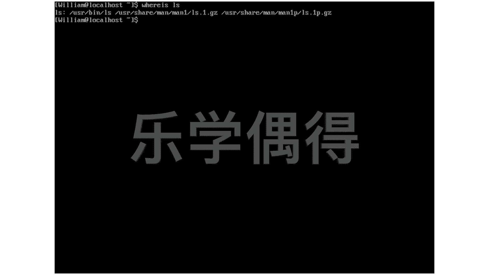

# 乐学偶得｜Linux云计算红帽RHCSA／RHCE／RHCA - P38：37.系统中查找文件 - 爱学习的YY酱 - BV1ai4y187XZ

好了，我们再看看怎么在这个linux系统里面进行查找。而，我们知道查找最快的方法的话啊，当然就是lowcate。最快的就是locate。locate是相当于就是查询我们整个这个嗯系统系统里面。

它有专门有个数据库，有个database啊，这个database它相当于是每天进行更新的，它相当于这个呃按照daily base进行更新。也就是说他去这个查找的时候会更加快。

比如说我想locate嗯locate嗯。嗯，L吧啊，我们像这个命令，你看它locate。哇，大家可以以看一下啊，这么多东西，你看它速度运转速度特别特别快。

相当于我们在这个嗯整个link系统里面所有的这个directory啊，所有的这个file所有的啊，只要是我们目前啊使用这个这个命令的这个用户有这个权限的话，它其实都可以去呃寻找到。

而且呢它这个寻找是非常快速寻找，并不是说直接在这个fi system，在这个文件管理系统里面进行寻找。它相当于啊是这个把这个文件管理系统里面的所有文件专门放到一个datbase放到一个数据库里面。

然后你去寻找这个数据库，所以说它这个这个速度啊是非常非常快的。大家可以看一下啊，几乎这个嗯这个应接不暇的给你是不是啊啊，我现在想停止它啊，没有必要停止啊，他已经它自己已经弄好了，就没有必要去停止了啊。

大家可以看一下，我设cle。我们我再往上移一下。好，嗯，相当于啊我们就可以很快速的进行查找。嗯，稍微慢一点的查找方法的话，那当然你既要找一个东西，那就是find吧。find findd的话。

它是直接去搜寻我们这个这个fin system文件系统。所以说它比这个lowcate要稍微慢一点。而且呢啊你比如说就要去查找的时候的话，你可能需要呃这个阐述一下，你要让他去哪里去找。

比如说我想让他去这个desktop的呃这个text文件夹啊，这个test文件夹是我们前几节课就创建那个文件夹啊。呃，test文件夹里面去查找一个什么东西呢？呃，我们要把这个name。要写出来呃。

写这个name的时候的话，我假设要这个用一个这个嗯相当于这个wild code。比如说这个新，相当于这前面什么名字我搞不清楚。但是呢我只想让它呃专门去搜寻这个结尾是以TXC结尾这种文件啊。

我们需要用用这个小的这个啊单括号把它框起来。框起来之后的话啊，大家可以看一下。哎，发现我在dextop test这 a file啊，找到了一个这个ETX结尾的这个文件，这个文件名字叫做a file。

同样我们如果还需要这个查找这个文件，它到底在哪几个目录下面有的话，我们还可以用另外一个命令叫做这个where is。Where is。嗯，比如说我们经常用的这个LSD啊等等的话。

其实它会存在于很多路径下面的啊。比如说我们就拿这个LS作为一个例子啊，我们把这个加上家可看一下我们发现的话他在这us里面后面还有个us manman一点个us个是相当于相当于不仅找了个在们us面我们其实还有个man两个man下面的话其实都是有的这的话不知道大家这个前面有没有这个记住啊man其实就是manu啊。

其实相当于是这个系统它是自带说明书的们有时候个命令具体的一些op具体一什东西搞了，我们直接把个打开然后面去接我们。命令，然后就可以在M里面去找到。

