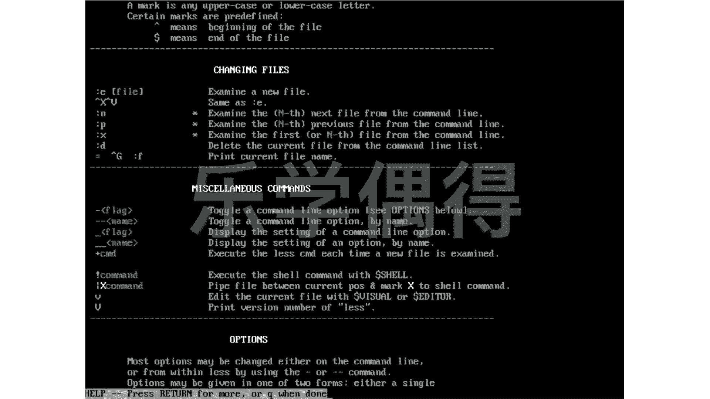
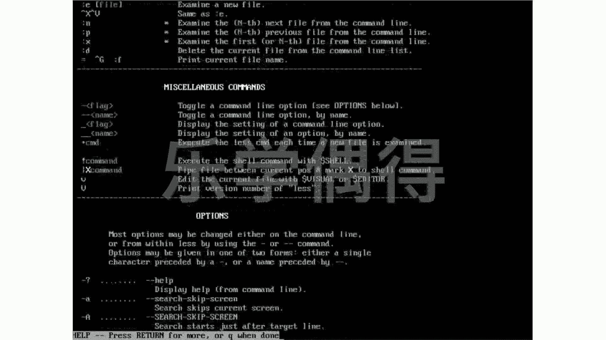
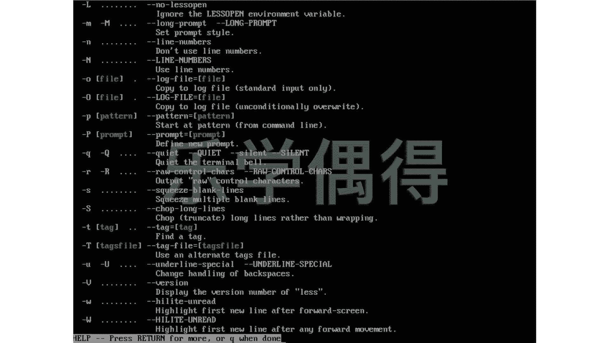
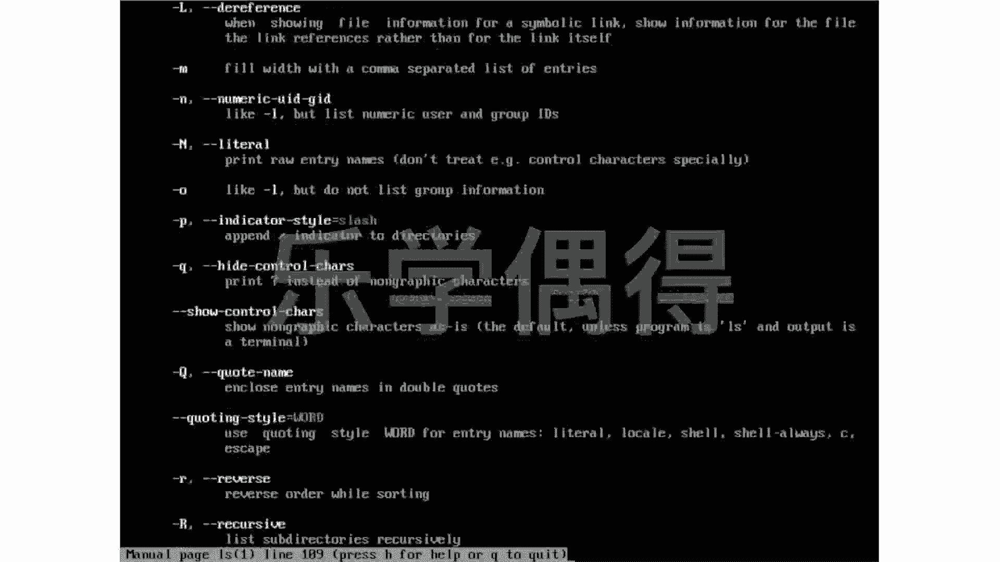
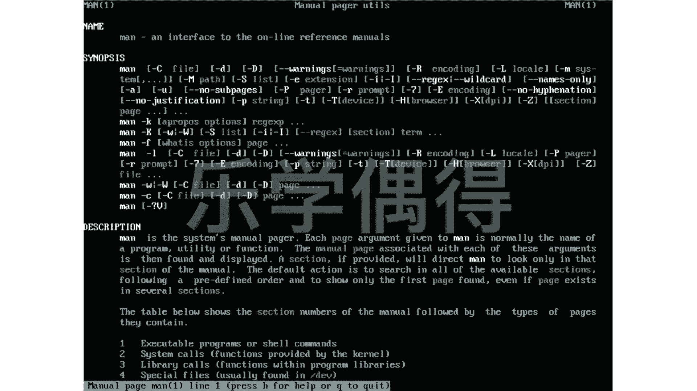
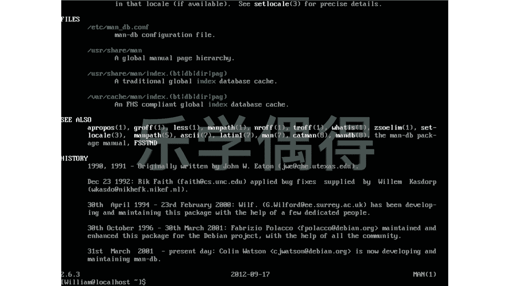

# 乐学偶得｜Linux云计算红帽RHCSA／RHCE／RHCA - P39：38.linux自带的说明书 - 爱学习的YY酱 - BV1ai4y187XZ

各位同学大家好啊。嗯首先跟大家说一下啊，在我目前遇到过的所有人中啊，牛人当然也不少。但是呢我从来没有遇到过一个人说能够啊自己能够打包票的说，哎我把linux系统里面所有命令全部背下来了啊。

相当于把所有命令不仅背下来，还把这个命令的各种option全部都背下来了啊，几乎没有这样的人，我觉得如果真能够把linux系统里面所有东西全部背下来的话，那这个人的话肯定是这个记忆的天才啊。

那其实就不用学linux啊，他可能这个智商已经达到这个世界顶尖的，包括他记忆力已经达到世界顶尖的水平了啊。

所以说那么我们怎么样这个去学习linux里面这么多的这种命令了因为人嘛他总会忘啊这个时候的话我们linux系统话其实是非常好的。他其实自带说明书的啊，就跟咱们去买一个买一个这个电器一样的话。

他其实就会自带一个说明书，你不懂的话，直接去看这个说明书嘛。不过现在的话你像苹果啊等等。这东西越做越傻瓜了啊，相当于根本不用说明书啊，直接拿着这个所见即所得，自己去点啊拖啊等等啊。

相当于非常这个呃非常嗯就是你觉得应该怎么操作，你就怎么操作，它其实非常方便的。但lin的话，它毕竟还是要去打命令。所以说我们当有些命令去忘了的时候的话，或者是有时候我们搞忘了这个命令。

它的option到底是选什么样的option。比如说我们这IOS它有很多的这option可以去选。这个时候的话我们怎么办呢？我们可以用一个这个manmman其实就是manu啊。

我们在link系统里面把什么东西都缩写的很短啊。manu就是这个我们的说明书的意思。我们man man，然后呢，后面加上我们想要查的命令，比如说LOS的list，我们可以看看这个呃list命令啊。

到底这个说明书是什么样子的啊，大家可以看一下。哎，你看啊这个写的这user command，然后这LOS，然后它后面有个小括号一啊，证明它是一个section one，然后你可以看这个names。

然后这个下面descript等等。然后下面不是有什么杠A啊，杠大A啊，杠auther啊啊，然后B啊等等啊，相当于啊你这个上下可以这个不断这样去看，相当于啊各种各样的option，你都可以在里面去查找到。

而且每一个下面都有一个非常呃简短呃的一个说明啊，我们这个man menu这个配置啊啊，更多的情况下，它不是不是说教你去怎么去做啊啊，有人说哎，那既然的话所有东西全部都可以去查的话，我们是不是不用学了。

不是这样的，嗯，就跟咱们去学个外语一样的。你如果你说哎我有一个字典，你你你这个字典里面的话会有这个每个这个词这个用法啊，是不是你就不用去学这个外语呢？那不是的啊，就是说我们这个就算是个u这个配置的话。

首先你要读得懂啊，这是第一点。第二点的话就是它更多的时候是用作一个像这个字典这种样子的一个啊一一种查找的一种方法。

也就是说呃它并不会教你怎么去在lin里面进行操作实际的问题而是说你这个命令你记不太清楚了。你可以查一下，一查之后，你就想起来他应该怎么做啊，更多的是采取这样的一个一个方法啊。比如说你要看看完之后的话。

你现在想退出，你就按这个Q就可以退出。比如说你想看更多的这个hel你就按一下H按下H的话，他就会告诉你在这个help在这个menu这个这个查找了这个说明书的这个配置里面应该怎么。

样啊进行这个比如说moving啊，seararchching啊等等的话，你其实都可以去看的moving啊上一页下一页你可以整页的去翻啊，比如说WZ这种样子啊，是相当于是翻页的。

然后你要 search一个什么样的东西的话，就可以按一下这个嗯这个小斜杠，然后把后面的pan啊输进去就可以。然后你现在包括还要怎么ju啊，然后还有各种各样你可以这个上下这样去看一下啊。

因为这个命令太多太多了，我就不一一跟大家演示了，大家也可以自己在这个自己电脑上进行操作一下啊，其实读一读也挺有意思的，有点有点像咱们去学一门语言的话，你读一下这个文档也是挺有意思的。

这里面还有很多很多好玩的东西，包括还有一些这个命令的一些历史啊，一些小的一些这个啊可以说是彩蛋嘛，就就就埋在这里面了，你可以去看看，挺有意思按Q退出按Q退出退到上一个上一页了。

是不是上一页这个其实就是manu的这个这个配置，比如说我可以按这个W和Z刚刚不是看了吗？WZ可以这个快速一页一页的这样去翻啊，这个也是小技巧按Q，然后退出啊，退出之后的话，你可以看下面的话。

这个啊命令行又出来了啊。

啊，我们cl一下，把把这个整个命令在上面。嗯，同样的啊，你假设想查一下这个嗯比如说我们再来查一个吧练习一下pass wD啊，你看哎这个好像很长很长，是不是啊啊。

如果是我想查这个passWD里面的这个某一个section的命令啊，就比如说啊它这个pass wD里面啊，其实它在第五个 sectionction里面是专门讲这个configuration的。

所以说我直接想跳到第五个 sectionction就man，然后呢中间呢是你想跳到这个section，然后后面呢是你想查找这个命令啊，你可以看一下哎，大家可以看这个左上角啊。

左上角这边的passwD然然后然后有个小括号，一个5，就证明的话它是已经跳到了第五个 sectionction啊，相当于呃怎么说呢？就相当于它是一个一个这个说明书里面有很多很多的部分，是不是啊。

你刚刚看的是第一部分，你看现在我可以直接。这个查找的时候，就直接说哎，我想看第五部分，哎，他就跳了第五部分，你就可以去看了啊。然后呢，我们再再退出吧。同样的啊，有时候你说哎。

那我哪知道它这个configuration，你是之前知道它是第五部分，是不是？那万一我不知道它是每个section是什么样的内容啊，这个时候的话我们应该用什么命令呢？啊，我们可以先查一下。

通过what is查一下这个passWD。然后呢我就可以看它每个 sectionction啊是什么样的内容。比如说啊你看这个它这个pass wD，然后5这个第五个 sectionction。

它的内容是password file啊，比如说它这个pas w第一个 section是up uses tokens啊，比如说这个第二个SSL这个pas呢这个是computer password啊。

相当于你可以知道啊知道之后的话，你就可以按照上面这个命令，比如说这个man我现在想到第一个或或者想到哪一个啊，你就这样一输输了之后就跳的那个啊这样的话也是一个当你忘了的时候的话啊。

可以通过这样查一查你想去哪的个叫个命令啊同样的我们还可以通过这个man还是在man里面进行man里面可以选各种各样op你用这个F这个小小横杠一个F，然后pas。pass WD啊。

其实也可以达到刚刚那个效果。其实这个man，然后杠F passWD其实就是这个what is pass WD。其实这两个命令的话，其实的效果完全是一样的啊。然后呢。

我们嗯假设我们现在想找一个能够嗯比如说能够search的这样一个命令。但是我搞忘了一个具体命令连名字我都不知道了，那连名字都不知道，你肯定不能man，然后后面一个命令是不是啊？

因为你这个命令你就搞搞忘了叫什么了啊，你可能就大概知道它能够做什么样的功能。比如说它能够search，能够去查找这样的功能的话，那怎么办呢？啊，那这个这个一定要记住啊，你如果这个没有记住的话，那。

完全你就就根本不知道这个命令怎么打了啊，这个比如说app propose。apple pose applele pose后面接的是你大概有点像模糊查找的感觉，就是你大概觉得这个嗯这个命令能够干什么的。

比如说嗯你想find啊这个命令假如是查找这个find。然后呢，这个apple pose它就会去搜索所有的这个命令啊，以及他们这些解释啊什么的，就是只要有你这个find在里面的。

它就会把这个命令全部列出来，这样的话，有助于你去查找，有时候你想知道啊你你想知道这个命令到底叫什么，但是呢呃你只知道它能够干什么，就相当于这个命令它能干什么，你是知道的。

但是你不知道它这个命令具体怎么怎么说啊，这个时候你可以用apple pose。啊，你可以看一下，它相当于把所有的各种各样的这个关于这个命令这种解释啊，包括这个命令啊，里面有fin的全部都给你找出来了。

这样你看比如说呃你看这个呃你可以看这个find a wide character memory假设你是想找这个这样一个实现这的效果。

然后你会知道原来前面的话是个WMHR然后在这个3P这个里这样话你可以过man后再去找到这个然你就可以它具体是怎么操作的。因为在man page里其实还有各种各样的这个例子啊所以说也是挺方便的。

就是只要你记着这个就可以了啊，同样的比如说我想看看man page到底是怎么样查的我可以man man就相当于自己看自己man其实也是个命令是不是你就看这个man这个命令它自己里面是什么啊这可以看一下你可以看它的各种各样的这个用法啊。

你可以这个向上向下，然后这样去看大家可以看一下啊，最下面有一个叫做istory。

啊，相当于说这个命令到底是最开始由谁去把这个命令去写成的。你看originally written byjo W Eton啊，然后还有他的这个邮箱，是不是啊？这个是你应该挺有意思的。

你还看可以看这个命令是谁写的然后呢，有些什么样的历史等等啊，其实也挺有意思的，有点像埋着这个系统里面一些小彩蛋啊，好了，我们现在要退出的话，就按一下Q就可以退出了啊。

