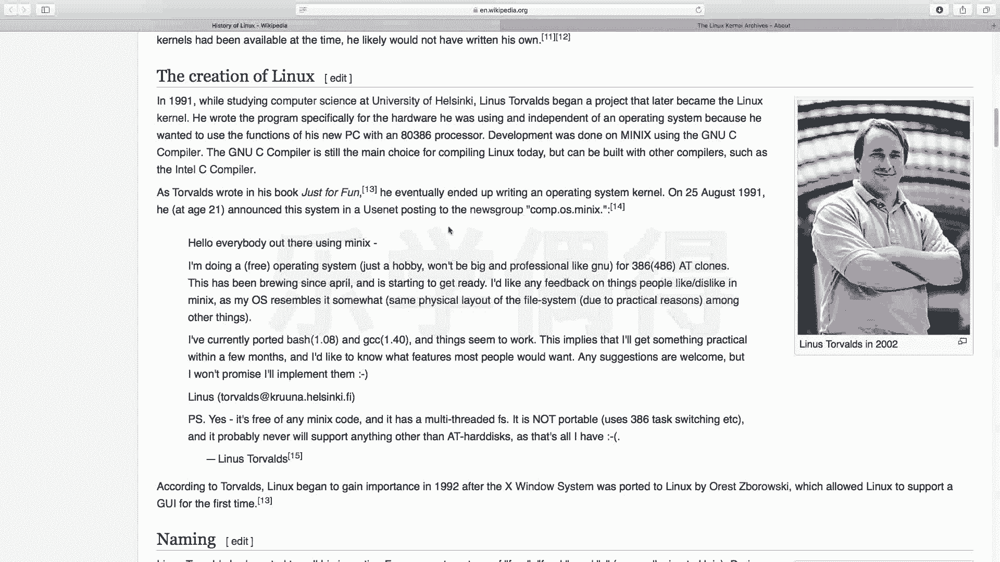
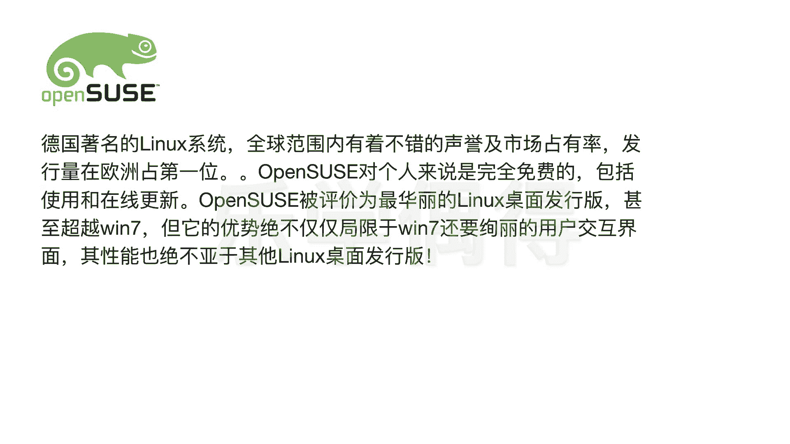

# 乐学偶得｜Linux云计算红帽RHCSA／RHCE／RHCA - P3：2.Linux的历史和各种发行版本介绍 - 爱学习的YY酱 - BV1ai4y187XZ

好了，嗯，这一节课呢我们再来讲讲这个linux的这个发展历史。就对the history of linux。嗯，我们知道这个unux和linux它相当于是一个父子关系，是不是？相当于先有这个unux啊。

作为基础啊，而这个linux是在这个unux上面进行开发的。嗯，他这个历史呢其实也是一个很传奇的一个故事啊，反正我们看这个大神的各种操作，其实都是很传奇的故事啊。

这个整个这个linux是由这个叫做嗯李纳斯啊，中中文应该翻叫李李纳斯，它应该叫做linux。

有这位大神呢，他现在还健在啊，有这位大神的话，他进行这个嗯开发的。他当时呢是在1991年的时候在芬兰读这个大学就大学的时候呢也挺有意思的。

他们当时的一个教授啊嗯是自己写了一个你看当时写了一个叫minix他那个教授的话自己也教一门这个有点像计算机科班必须要学的嘛，叫做这个opering system，个计算机原理嘛。

计算机这个操作系统的原理，叫design and implementation，就如何去设计计算机的系统，然后如何去实施计算机系统啊，当时呢他这个linux就这个李纳斯。

他在选修这门课的时候呢然后就看这个教授他必须要在他他教授自己写的一个操作系统叫minixix其实就是一个unix like system，是由他教授自己写的也是相当于。

于类unix的一个系统啊，专门是用于学术的。但是呢虽然这整个系统啊呃它的这个源代码是可以呃可以，我们是可以看到的。呃，但是呢这个教授他不让你去改这个源代码，也不让你去这个分享这个源代码。

而且当时它这个minix的嗯最开始它的设计是16贝的设计啊，你如果是把它放到这个3232贝的的话嗯。相当于就不太适用，不太适用的话嗯，说实话，你如果要去买这个能够去跑这个系统呢，其实当然是非常贵的啊。

所以说这个时候啊这个李纳斯啊就相当于我们这个写这个linux的这个大神，大神的话，他一个的精神，就是一个是开源是不是你既然又把源代码又给我们看，但又不让我们去改，又不让我们去diribute啊。

那他肯定特别不爽，一个是这个第二个的话就是这东西太贵了呀，你这个东西最开始是写的16位的，现在都是32位了，是不是你这个历史是不断前进的，东西又老旧，是不是又不让我进行更新。

而且呢你这个跑这个机器的话还很贵他当时也是个学生嘛，是是他是芬兰的那个一个学生。于是呢他自己就写了一个写一个操作系统啊，而大家也可以看看他这个名字啊。

叫做linux你看啊这个linux跟这个linux其实有点像啊，李纳斯和lin。是不是？那个李娜斯的话，他写这个linux相当于就是想说这个unux是我李纳斯自己用的这个linux。

所以说他就把它变成这个linux而不是unux。他自己L开头嘛，他就把这个unix稍微改了一下啊，他发起了这个project之后的话，他当时写了一个嗯写了一个这个ha。你看这个如果大家有兴趣的话。

可以去这个VkiP家来看一看，或者是去买他的这种自传去看啊，也挺有意思的。啊，他发起了这个项目之后的话，会有越来越多的这个众多的爱好者啊，就一块就形成了一个社区。

大家一块去开发共同嗯共同去完成了一个大型的一个project。

而且呢它的精神就是嗯linuxlinux它是一个开源的一个软件。也就是说它是所有源代码全部开放的这个unix，任何人都可以对这个系统进行修改啊，这也是它的一个非常嗯非常精妙的一个地方嘛，它就是用开源。

呃，包括这个名字这个后面他讲了一个这个名字啊。呃，是一个呃你看我们一说linux就是一个企鹅这个形象嘛，相当于一个musscot，就相当于这个mascot，就是它的一个吉祥物了，是一个企鹅啊。

有很多很多种传说啊那呃有些传说说。这个托s这个去。去极地的时候，曾经被企鹅咬了一口，所以说他就把这个记恨在心哦，于是就把这个企鹅作为它这个linux这个标志啊，当然呢嗯还有一个说法呢。

我我我个人呢还是比较喜欢第二种说法了，就是说你看看在极地啊。这个极地的企鹅企企鹅只有在极地才会存在，是不是？但是呢你要想极地它是不归任何一个国家所有的，也就相当于它是一个完全共有的啊。

相当于有点像完全免费完全呃公共所有的一种精神，一种开源的精神在里面。所以说他这个李娜斯啊，他最开始写这个linux的呃linux的时候的话，就想说这个计算机操作系统，就是所有人都可以去用。

所有人都可以去改啊，不归任何一个公司或者任何一个国家所有啊，大家任何的爱好者都可以加入这个社区对这个东西进行更改。啊，他也是一种开源的思想在里面吧，我更相信第二种版本。呃。

然后呢我们再看啊它这个linux它自己其实是有一个内核的，就是叫 kernelnal啊，我们可以到这个网站上，就是 kernelorg这个网站上是它专门发布最新的内核的一个网站。呃。

这个是由这个叫linux foundation，就是这个linux专门的一个基金会所运运行的吧。就是它每次的这个嗯最新的内核如果进行了更新的话，你看这个release就是每次的更新。

大家可以去看这个网站的话不断会有新的版本更新更新出来。你看现在到了应该是到了4。19的版本。

啊，然后呢他每次有新的更新，有新的更改之后就会往这上面来放，会嗯往这上面进行更新啊。大家相当于后期的一些比如说linux有很多的dibution嘛，有很多di啊，有很多发行版本其实都是基于这个内核。

因为那个 kernel相当于就是你要吃这种坚果啊，它那个坚果里面的那个很坚硬的这个东西，那个就是内核啊。

我们之后还会学这个hell shell的话相当于就是外壳是不是我们内核其实就是linux的内核 shellll的话，也是你跟它内核进行操作，进行交互的一个界面，就是我们这种命令行啊，其他的说实话的话。

你花里胡哨的进行改的话，其实都可以。但是呢一个he一个 kernel啊，这两个的话是必不可少的吧。嗯，下面呢跟大家介绍一下这个linux它主要发行的几个版本啊，因为呃这个是大家在学习的时候的话。

经常会啊特别是新手啊，就是最开始了解这个linux经常会弄混掉，就是说哎呀，我到底用什么样的版本比较好，或者是啊我去各种这个论坛啊，各种问答的一些网站啊，然后去看啊，各种高手大神不知道是真的还是装的。

是不是他他们总会出来说哎呀这个版本好，那个版本不好，是不是啊有些真正做运维的，他们也不太会说啊，他们说这个呃我们是做运维的，所以说我们觉得什么版本更稳定啊。

但是呢这种其实大家可能会觉得哎呀这个还是比较酷炫的版本比较好，所以说最开始大家很可能都很迷惑到底哪个发行版本比较好啊，这里就系统跟大家说一下，这linux他目前在现在主要的发行的版本呢？

呃，有两两大派系吧一个呢是red hatre hat相当于这个红帽啊。大家可以看这个这个我这个PPT的这个呃左边这个有一个人戴着红帽子啊，这个相当于是红帽的一个系嗯，红帽这又是另外一个故事，红帽的话。

他是也是一个开发者的话，特别特别尊敬的一家公司。嗯，他相当于他也目前应该也是美国一家上市公司嘛，应该是美国的成分指这个500成分指数里面的一家公司吧。应该还应该目前还在，还没有被移出去啊。

如果我记得没错的话，嗯，他。它是一家非常开源的一家公司，它就是证明了我这个公司运营模式，就是我不像windows，也不像这个呃这个苹果。我所有东西全部开源。但是我也能赚钱，而且我能活得很好的一家公司啊。

这个red hat是一家特别特别好的公司在学到后面的时候的话，我们如果像这个做运维或者是做这个啊云计算等等方面的呃，一定要把这个linux学好把linux学好之后的话，一个非常这个高阶的一个认证的话。

就是red hat啊，那边会有一些工程师的一些认证啊。这个到时候我们学到后来的时候，我再跟大家去讲解这方面的东西啊。但是呢我们把整个嗯跟着我们1。1点的把东西去学好之后的话，这个red hat啊。

最高级一些架构师的一些证的话，我们也能够去拿下。因为毕竟说实话就是一些知识嘛，你把知识掌握牢了，其实一通百通的。啊，好，这个redhead这个系的话呃有好几个好几个分支。

首先呢最主最最主要的就是readdhead这一个主要的版本叫做这个redhead enterpriselin。啊，这个相当于是。嗯，redhead它发布的一个对于企业服务器专门出的一个版本啊。

这个版本的话它是收费的啊，现在应该出到了7左右吧啊，它的稳定性是非常好的。也就是说嗯你如果是想搞个服务器。你一直不关机，一直放在那边。而且这个服务器的话呃，也不用升级，就是一直。不需要怎么做维护。

就不停的要去嗯接受很大量的访问，不能让他死机，不能让他出任何问题。啊这种时候的话呃一些公司的话就会选用这red hat一个版本啊，当然这是官方的说法啊啊，还有一些说法就是因为你选择这个。

Red hat enterpriseter Linux。万一出了什么问题，这个rett的话，他虽然说。虽然说他这个呃他收费啊，他收了其实是咨询费，也就是说你如果出了什么问题。

你这个服务器你可以叫他过来给你售售后的，他们是对自己的这个技术是非常有把握的。所以说你一旦出什么问题，他们就帮你去去解决。但是呢我们往往有一些金融机构你用这个版本的话，其实就是让他们过来背锅的啊。

那就是他们技术出了问题，是不是啊，也是一种背锅的方式嘛，他们收了钱会会进行背锅的，也也是一种他们的盈利模式吧。我就先开源先免费，所有东西都是可以那个但是出了问题的话，你找我。

你如果是买了这个收费版本的话，我可以给你进行售后，我可以给你进行这个解答问题解决问题啊，这也是 hat公司非常非常精妙的一个解决的一个么盈利的方式下面呢是叫其实就是d hat的一个一个desktop desktoptop。

版本就相当于ret它我们刚刚讲的这个rett enterprise，它这个是个服务器版本呢，它几乎没有交互页面啊，相当于就是通过命令行进行嗯进行交互的啊。但是呢我们这个fdoa的话。

它相当于是ret有一个桌面的版本。桌面的版本的话是可以就点有点像我们的这种windows这种样子的。我们可以通过嗯相当于一个一个交互界面，我们可以去点，是不是啊，这个叫叫gu意的一个操作系统啊。

gu意的一个操作界面。然后呢，这个dora core的话，它相当于是嗯re可以桌面操作的一个版本。然后后来的话它进行了分支，它也是免费的。但是呢我们知道我们如果用linux的话，呃，再用鼠标去点啊。

有用这种交互界面的话，它的稳定性的很差，而且特别占这个资源啊。所以说这个fedora的 core的话，它是嗯怎么说呢？就是说最好只用于桌面应用，也就是说个人我们去应用就可以了。

但是你要把它作为服务器的话，那就太不稳定了。嗯，接下来第三种的话，其实也是属于这个rehead系的，叫叫centent oil。

其实就是community enterprise operating system啊，有人也可以叫做这个cent。cents其实就是redhead。但是它是一个社区版本的，也是也是免费的啊。

之后我们的视频中的话就会采用这个sent跟大家进行讲解啊，因为我们相当于可以无缝对接这个rehead的一些这个资格的工程师的认证嘛。所以说我们平常就先用这个s进行练手。

它是一个免费的版本跟这个rehead这个enterprise lin几乎都是一样的啊，而且呢它的稳定性是非常非常好的。呃，在国内的话，一些大型的一些网络公司呃，应该也是用的send作为它的操作系统的。

因为它其实说实话就是嗯你可以把它看作是没有售后的rehead的这个enterprise lin啊，所以说你也可以直接把它作为服务器自己在上面进行改动啊，只要你对自己的技术觉得过硬的话。

也可以使用这个版本啊。当然我们的教程也是通过这个s这个进行学习的。而且呢呃国内目前就是大家都是用s进行。造程。所以说嗯因为你说这些运维人员都是经过centOS进行学习进行训练，然后进行工作，是不是？

所以说整个体系也都是centOS的一个体系。你要是呃学的是乌邦图或者怎么样的话，你到时候去呃应聘的时候很可能发现哎这家公司是用的cent或者是用的re这个体系的啊，那你其实就很不习惯啊。

这个反正也跟大家介绍一下吧。

接下来有一些这个嗯。我们不太听说的，但是呢在国外也比较有名的，这个是open这个SUSE这个是德国的一个lininux系统，非常著名。它主要是在欧洲欧洲那边的话比较好，它主要是什么？它就是它很华丽嘛。

因为个人用嘛，它占着这个嗯。占着市场率还是比比较高的，市场占有率比较高。因为它是桌面桌面的版本的话特别华丽。

啊，还有一个呢叫这个叫个箴土啊，箴土的。它应该属于比较高阶的吧啊，如果是最开始的话，不太推荐用，它是非常非常有高的一个定制性的。嗯，你相当于各种各样的东西，你都可以进行定制啊，这个是怎么说呢？

就是你到玩的特别后来的时候，你再去用这个版本吧啊，你说定制的东西多，那就是要你掌握的东西要很多，而且你必须要非常了解才能去定制你如果不了解的话，你这个定制其实很多很多配置都配置不过来啊。

所以这个我不太推荐啊，不过大家玩到后来的时候可以去换成这种样子的啊，进行。

进行你写出你自己的操作系统。然后再就是这个deen这种系列的deen系列的话，最著名的一个ditribution就是乌邦图啊，相当于乌邦图吧，应该翻译成中文。而且这个在国外应该也特别有名啊。

我想大家如果自己有尝试过装这个linux系统的话，估计也是装的这个乌邦图。因为乌邦图它。嗯。它的这个页面非常友好啊，然后就是嗯如果你最开始是用windows或者用mac的话，你转过来啊。

最开始用这个物邦图的话，其实也没有太大的这个学习学习难度，学习的坡度嗯几乎跟你们一样的，而且它这个交互界面也做的特别好看。嗯，而且呢我们如果是要去运用一些包的话，它有一个这个app to get啊。

这个的话也是特别方便的。你如果要安装什么东西的话，直接就app to get就可以把这些东西全部嗯全部装上去了。这个是特别方便。但是这个redhead其实也有个y啊，其实用到后来的话，其实你只要弄熟了。

它这两种安装方式其实也都差不多，大同小异的。嗯。所以说我还是推荐最开始的话入门的话，自己作为个人电脑可以用这个wo to。如果你要做高级的运维和云计算的话啊，还是从这个red test体系去学比较好。

