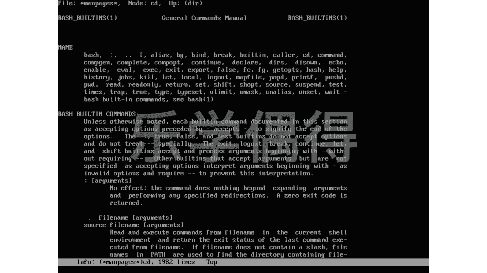

# 乐学偶得｜Linux云计算红帽RHCSA／RHCE／RHCA - P40：39.更强大的man，info - 爱学习的YY酱 - BV1ai4y187XZ

有时候啊咱们在这个linkux系统里面的话，光看这个man page的话，可能还觉得有点不够，是不是？你就是在这个p里面呃看到了一个东西。然后呢，想在man page里面有个东西又不知道怎么办呢？

这个时候你要退出这个man page，然后有有点像你这边假设你读这个说明书里面，你这个说明书里面还有一些单词不认识，或者你查这个字典，这个字典里面解释这个单词的单词，你又不认识这个时候怎么办呢？啊。

如果我们是在电脑里面的话，应该有种叫做跳查功能，就是你点点了以后，它有个 hyperlink啊，相当于是一个这个。相当于一个一个一个一个一个超链接嘛，你一点点了之后它要点到另外一个配。

然后它那个配置的话会进行解释，是不是我们在man page的话，那就不能实现这个功能。那我们就要退出退出之后，然后再重新把你这个要查个后面再把这个东西去写上去以说也是个特别不方便的个方。

里有个看到假命你退出，再打能进行查询这个时候呢其实有一个很好的个功能就是个的话有这个高阶版的这个 page，因为它有一个非常显著的跟不，就是它里面有link我可以就打是出出你我可以在这里面进行选。

你看有个小光标到没有凡是这种有这个小星号的，我都可以去选比说这个我按下回车按回车之话，其实就可以跳到另外的一个地方。说我现在想选中一个东西按下回车，是不是？然后它可以跳到另外一个地方。

就有点像 hyperperlink。你看啊这这边的话，比如说这个introduction tutorial，我再一按哎又到t里面去了。凡是有这个小星号的，你其实都可以进行选中。嗯。

比如说我现在想退出退出的话，其实就按这个呃这个退出键Q。就可以退出了啊，退出了之后的话，我们要再次进行这个进入的话，其实啊就再次这个写这个info就可以了。同样的话，我们这个info的话。

其实还可以在嗯这个查一下。比如说CD这种样子的，其实也可以给这个in这个信息但是它相当于是打开了这个这个 page相当于通过这个info打开 page，有点像通过另外一个软件打开原来一个软件这样感觉的。

后你可以看这边有个node node就是我们在info里面的各种的这个说明的每个信息就是一个每个小节点，这个noode有点像整个互联网每一个计算机就是一个小no，就小节点一样的啊。

每个小节点通过互联网把它这个串串起来，这个连连起来，就跟这个in里面一样in里面所有的东西的话，凡是能够跳转的话，它都会加一个这个小星号，有点像每个小星号，就是个ode啊。

可以通过node把各种各样的信息串起来。

