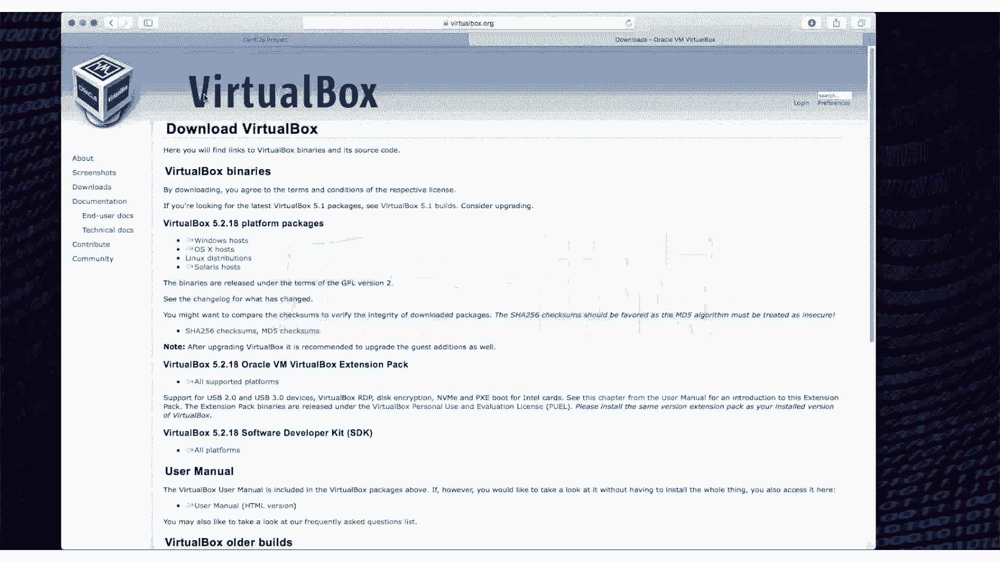

# 乐学偶得｜Linux云计算红帽RHCSA／RHCE／RHCA - P4：3.下载Linux系统及虚拟机 - 爱学习的YY酱 - BV1ai4y187XZ

各位同学大家好啊，我们现在开始这个安装我们这个系统，以及配置我们的一些环境。嗯，无论大家是呃用这个windows系统也好，或者用这个max系统也好。

或者你干脆你就本来就是用的这个linux系统也好我们最开始其实都需要配置一下环境。如果你本来就是用这个lin系统，那你根据不同的这个di不同的这种发行版本的话，可能会稍许有一点点不一样。

但是总的这种大的方向还是几乎一模一样的啊。如果大家我相信更多的人应该都是用的这个windows或者是这个mac系统。所以说我们在这种情况下的话，最好还是要装一下虚拟机啊，因为我们要学这个lin系统的话。

我不太推荐去装这个双系统或者是这个直接把你这个系统说你要够硬核你把个系统都卸了，然后重新装一个装一个linux上去我们最好不要这样做，为什么呢？一个是我们会调很多很多的参数。啊，如果我们这个一招不慎。

是不是啊把这个这个这个系统弄坏了呢，那怎么办？是不是你又不知道错在哪，这个时候就非常非常的这个沮丧，而且呢非会非常烦，我也找不到问题，我也无法解决。而且我平常的办公也办不了，是不是。

如果是双系统也会出现各种各样的问题啊，所以说我们在这个学习的过程中的话，最好还是通过实验环境，就相当于通过虚拟机进行操作啊。虚拟机如果嗯有些小伙伴不太了解，或者之前没有用过的话，虚拟机就是一个一个程序。

就是在一个系统里，它可以再run一个系统啊。你再比如说你是用windows也好，用mac系统也好，你相当于把虚拟机打开这个虚拟机就是一个程序，只不过这个程序它可以模拟出一个一个环境。

后呢这个环境里面又可以去装一个操作系统。而这个操作系统的话，它并不知道它是在一个虚拟环境下进行ro啊。所以说嗯这个我觉得也是个所以把。百百利而无一害的一个东西，是不是？有些人他挺鄙视虚拟机的时候，啊。

这个虚拟机不好，虚拟机还有另外一个好处，就是我们可以调很多很多种环境。我们甚至可以直接在这个电脑上把硬件的配置进行更改啊，这样的话我们就可以在很多环境下进行测试啊，而且就算你弄坏了。

你可以这个像一个快照一样，你把它呃恢复到之前的一个快照啊，这样的话其实很嗯。怎么说呢？很利于我们学习，而且呢呃也不会担心各种各样的这个后果一起麻烦啊。我们既然要学这个的话，肯定不会自己跟自己找麻烦。

是不是啊？这也是我的一个观念，就是说不要给自己找麻烦，大家可以去这个官网啊叫做这个virtbox啊，我推荐大家用这个virtbox因为我这边是用vibox跟大家做演示的啊。

当然这个讯拟机也有各种各样的版本，你去网上去搜啊，各种各样的版本其实都是可以的啊，只不过有些是需要所谓很多破解啊这种样子的啊，我跟大家演示还是不要拿破解的版本。

所以说我还是推荐大家先用virtbox virtualbox它是一个oracle应该现在是应该是个oracle这个项目嘛。这个甲甲骨文这个公司它这个一个项目啊都是免费的。

无论你是用这个wind还是用这个mlin其实都是可以下载的。而且呢配置几乎都是一样的啊所以大家根据自己版本，如果是windows就这个wind这下载啊这个这个mac的话就在这个这边下载。

下载之后的话大家就会打开一个像这样的一个东西啊，我们先把这个下载下来。然后我们用的这个嗯这个linux这个ditribution呢，我们是用这个sentOS啊。

因为sent跟我们之后要讲的这个re的一些版的也是非常非常相像的。他们两个几乎都是一样的。只不过这个sent是一个完全开源，而且免费的啊，所以说呃我觉得还是先从这个sOS入手比较好啊。

有些不少的这个教程的话是是这个这个乌邦图系统这个入门的邦图的话自己玩也可以啊，但是咱们毕竟是正儿八经的学啊，所以说还是通过这种re这一系啊去入门比较怎么说呢？这个今后的这个用处可能比较多吧。

当然自己玩的话，这个这个其他的一些版本其实都挺好的这个看个人喜好，而且呢sOS在国内的运用也特别广泛啊，这个其实也是有个历史渊源在就是。嗯，可能国内的这种培训的这些教教材啊。

都是根据sentOS啊进行编写的。所以说培养了一一大批这个呃这个用非常顺手的呃sOS的一些运维人员啊。你说这些人他到时候工作了之后的话，他当然是用自己最顺手的。所以说那些大型的一些企业。

国内一些大型企业的话，百分之八九十啊也是用的这个re和啊，所以说这也是一个有点像自我的一个循环吧。你这个运维人员多了，运维人员用这个版本后呢你这个业就多了就需要更多这版本的人去去进行操作。

而且还有一个好是几乎是同一系的，我们把这个东西学了之后的话，我们在今后高级课程，了解红系统红这大家弄熟了之话，大家可以参加这个红帽的一些考试啊，这也相当于是一最权威的认证当大家也是个一举两得的事情。

大家再把这个下载下来就可以了t大家可以下两个镜像一个是一个最小的安装镜像和版本个是部都包括大家先。或者包括这都一次下下来吧，免得自己调试啊安装啊等等啊，很多麻烦事情啊，一次性下载下来。这样的话。

不过你你的版本空间啊，你的磁盘空间可能需要大一点啊。不过我还是推荐啊这个尽量给自己今后啊减少麻烦，一次性下载下来算了。好啊，大家把这两个弄好之后的话，我们下一节课就开始讲如何配置，以及如何安装。😊。

