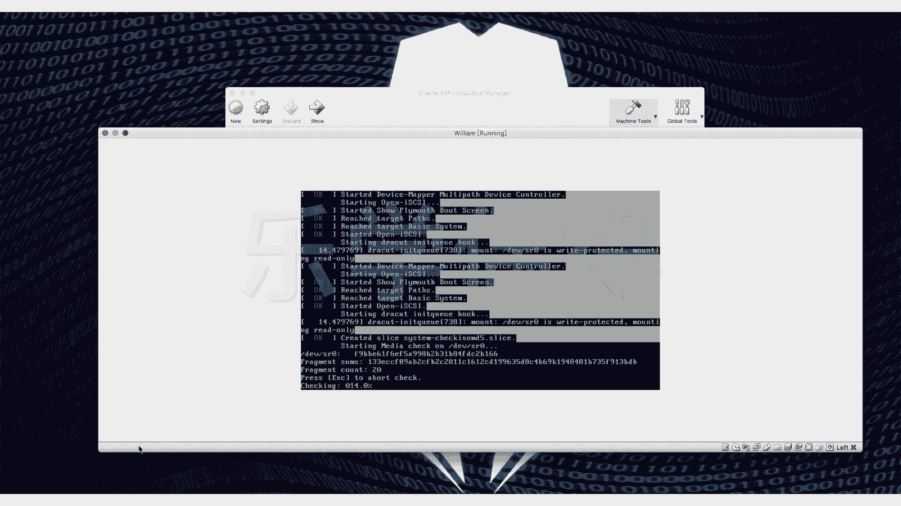
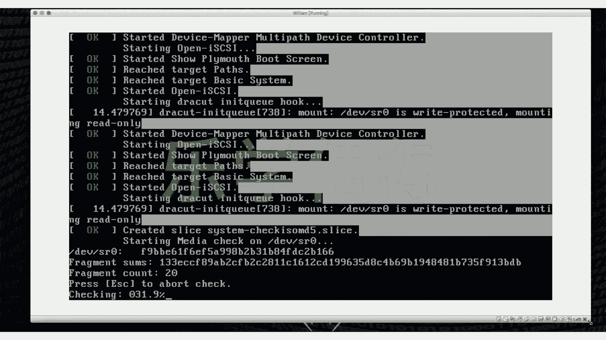

# 乐学偶得｜Linux云计算红帽RHCSA／RHCE／RHCA - P8：7.画面太小，scale一下 - 爱学习的YY酱 - BV1ai4y187XZ

那我们应该怎么样调整这个大小呢？啊，这个的话，你看我们因为这个安装是非常漫长的一件事情，我特意把这些东西留在了让它不不断载入，不断安装的时候跟大家讲一讲啊啊，就是我们在这个它放到旁边去。

它这个东西太小了，大家可以看我如果把它放大的话，它其实占不了我们整个这么大的一个空间。它只有这么点小。于是呢我们需要把它放大一点啊。这个时候的话选中我们这个虚拟机，然后setting。

s这边有个di，有个叫scale factor你看上面这种东西都不能调了。因为我现在已经是一个这个生产环境了，现在已经启动了，它就不能调了啊。

我们 factor以它放大一可放到200倍大家调皮话试一下最大的一个大小你看200这话差不多了这合审美是是你再再大还是不，最多只能到200倍实这个大小应该也不多。

大家后期的话需要一边看这个或者一边看我这个视频的话我们可以把它缩小一点放到旁边这样的话相当于一边放这个一边放这个这样话大家可以对照的去看有时候查一些东西一些指令啊或者因为这个lin不能QQ能用微信放到你真实机放到这一跟大家聊这里面去进行练习和输命令其实我觉得这也是。

用这个虚拟机非常好的一点，你甚至可以这边弄一个虚拟机，然后用虚拟机和你自己的电脑进行交互，你还可以弄个这个计算机个集群啊，开很多虚拟机。只要你电脑足够厉害啊。

你可以开好几个窗口在这边然后进行交互和计算等等啊，其实这也是非常有意思的事情啊啊，所以说我们可以这个用讯拟机，然后创造出多个环境啊。你看这个最开始因为我这个安装是这个everything这个版本的。

因为跟大家演示的东西比较多，还不一次性全部跟他弄好，大家可以装呃这个它本身的这个镜像文件，也可以装everything版本也可以装这个min就是最小的这个版本。但最小的话嗯大家会折腾很半天。

而且会查很多东西，对于初学者非常不友好。所以我还是推荐大家先这个装这个everthing这个版本，或者是直接装这个官方这种镜像光盘文件这种版本啊啊现在我们就先跳过这一段吧。因为它这个毕竟比较长啊。

我这个等他这个弄好了跳。下个界面的时候再跟大家讲。