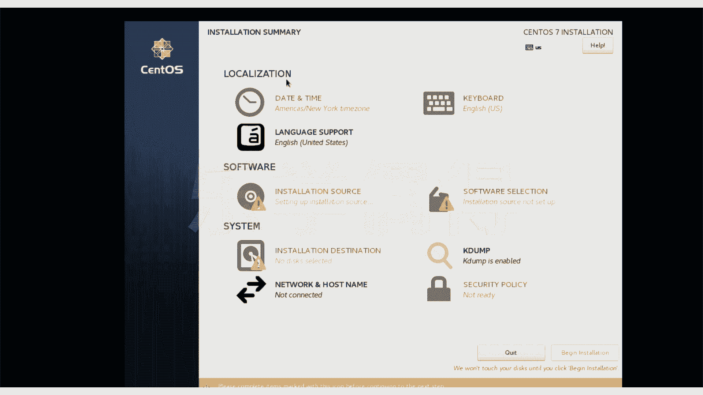
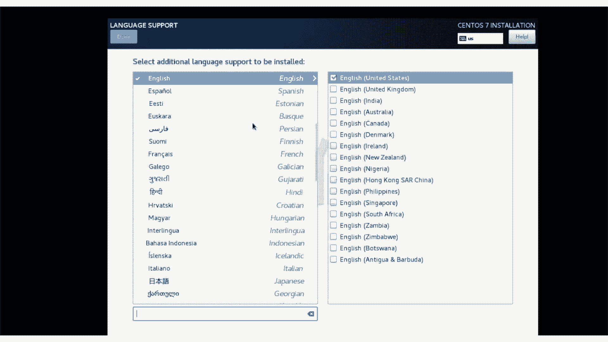
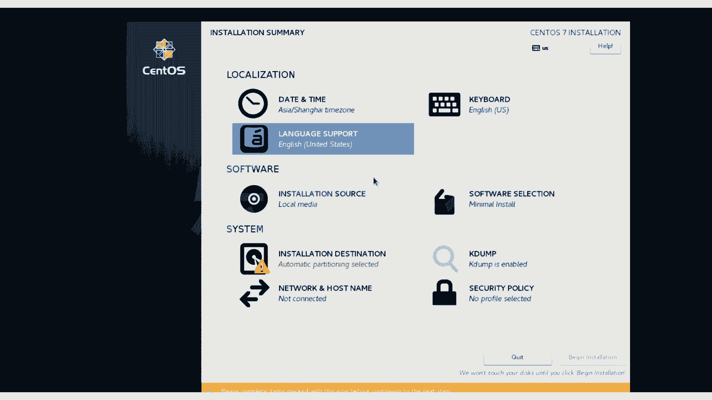
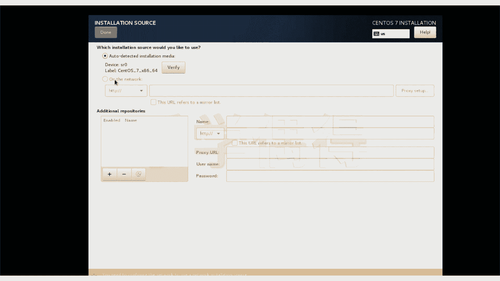
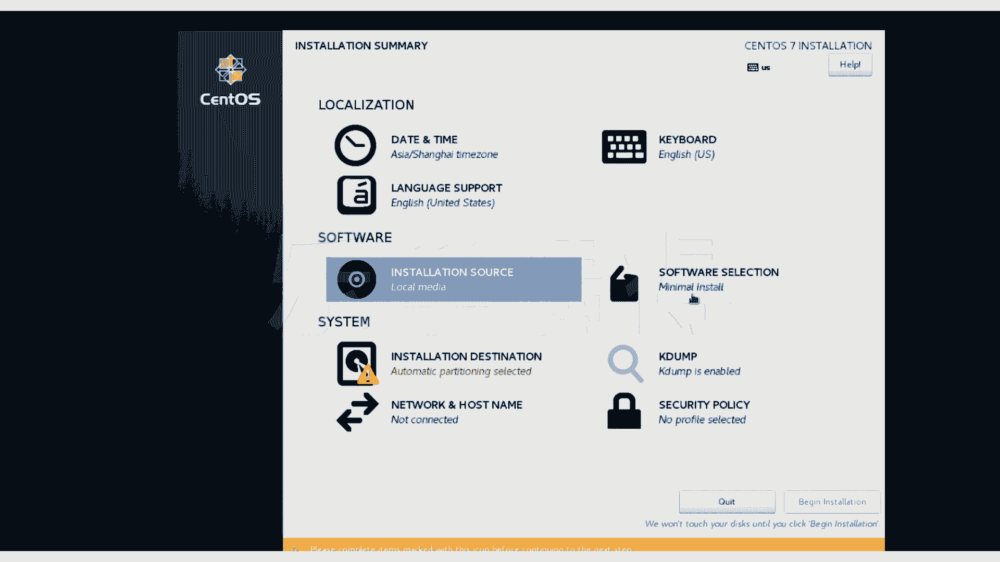
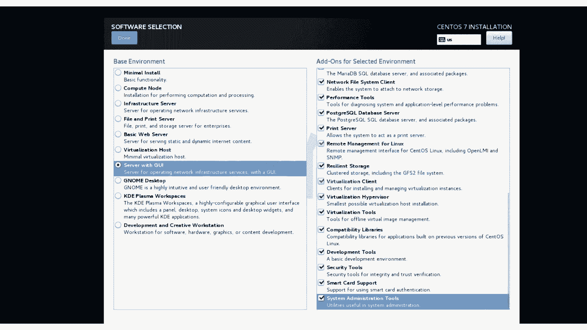
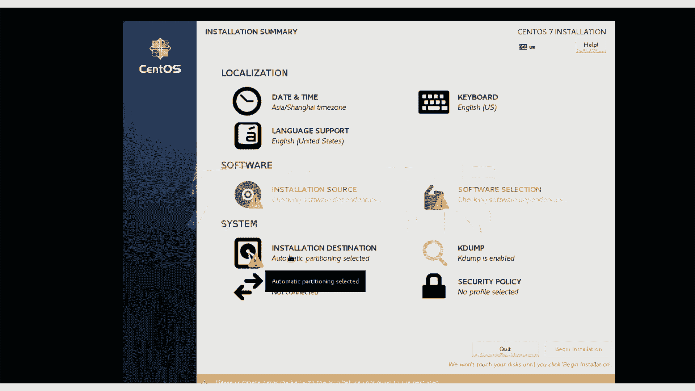
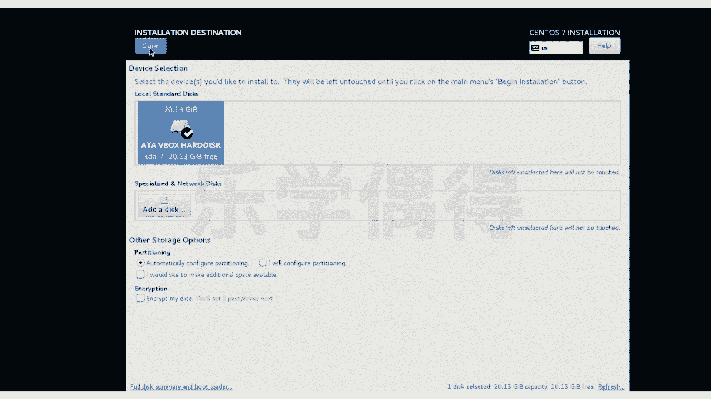

# 乐学偶得｜Linux云计算红帽RHCSA／RHCE／RHCA - P9：8.Linux安装系统参数设置 - 爱学习的YY酱 - BV1ai4y187XZ

好了当大家这个把刚刚那个黑屏的那个东西啊，等完了之后的话，我们就会到达一个这个安装界面啊，我们到安装界面之后的话啊，就可以把它点进去啊。你看啊我们首先要注意点。

因为我们是个 box你看我这个鼠标跟这里面这个鼠标是两个不一样的，就是说我这个鼠标是可以在我们外界的这个操作系统里面进行这个不断移动的。但我如果点到了这个这个虚拟基里面这样的话，它就会出现一个提示啊。

一旦你选择capture，相当于它就把你这鼠标就抓住了，你就鼠标就出不去了啊，如果你选择cl的话，你又可以这在外面操作又可以在里面操作。我们还是以这个capture进行操作。

因为我们外界的参数已经设置好了之后的，我们就可以完全进到这个虚拟机里面去了啊，我先cl一下，我先把这个先进行全屏，然后再让它capsw到全屏。好，到全名之后的话。

我们就可以直接在讯拟机里面完全进行操作了。就跟我们真实呃安装的这个系统是完全一模一样的啊。你看我们选择这个english united states啊，这些都没有必要这个去更改。

就按照它这个最开始的这个参数来就行。continue。好，现在我们要进行一些选择。比如说这个date time啊，这个的话我们可以改成我们。

中国的这个时间啊，不论你去怎么选择，最后的话，你开机的时候，它都会自动的进行这个时间调整的。其实也没有什么太大的关系啊。

我们就先确认当keyboard和这个language support的话langu我们还是用默认的这个英语啊，作为我们这个language。

因为我还是跟大家最开始就解释过了这个编程的还是英语作为主要语言啊，计算机里面东西全部都是英文的啊，包括你打命令行。

所以说这个我们在学这个linux时候也把自己英语做一下提高啊啊这个instulation source这个local media啊，这个的话我们已经选中了，所以说这个也没有必要进行这个改变啊。

我们这边的话要进行一下更改。他说这个minim installstore当最小化的安装，这个当然不是最小化，是不是我们想学的呢，我们就这个选中一个这个server。

啊，毕竟我们相当于是想把这个呃通过学习linux专门学习这个呃服务器方面的服务器就是serv嘛啊，包括一些云计算方面一些东西。所以说我们还是选择server，但是也不要太硬核啊，完全没有估意的话。

其实大家如果第一次接触的话，也受不了啊，所以说我们就选择这个server with啊，把这些东西都勾选上吧。因为我这个课程非常非常内容非常丰富啊，跟大家涉及的东西的话，非常广泛啊。

所以说啊会都会涉及到这些东西啊，包括javajava的话，大家可以看我其他的课，在linux系统里面也可以进行操作啊，所以说呃把这些东西全部都先勾选上啊，要不然的话有些东西又没有安装的话。

后期会非常麻烦以说我们都先把它全部打勾打上。然后呢我们后期会一个一个跟大家去演示他们的一些功能啊，当然呢也是一个呃。走马观花性质的演示吧，你不能说所有东西全部跟大家去讲的很透啊。

跟大家把每个地方入一个门之后的话，后期就靠大家自己去专研和研究了。啊，我们选择server school。后面这种的话，全部都选上之后的话，按一下当。

按档之后，它会这个进行一个这个check啊，这个的话不用管它，我们继续往下面啊来选。你看这个installation destination相当于我们把它安装在哪里啊，这个安装呢当然是我们虚拟这个盘。

我们已经这个最开始选定了所以说我们就没有必要这个用其他的方法啊，包括这边有个 my data啊。这个嗯如果要安装很快的话，最好不用选啊。如果你要安装慢一点的话，你可以把你的所有东西进行加密。

当然我们只是做一个教学演示，所以说根本没有必要去把它选上去啊，按下档就可以退出了。

