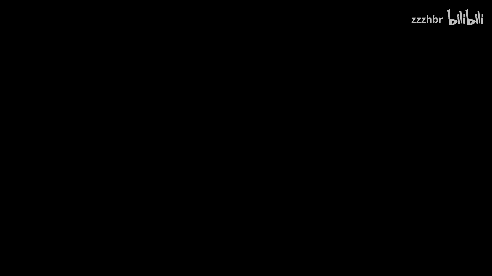
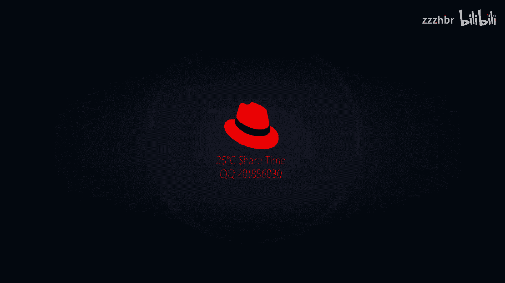
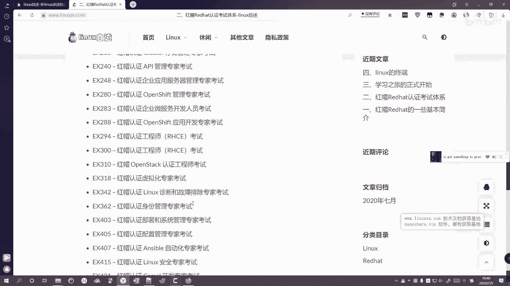
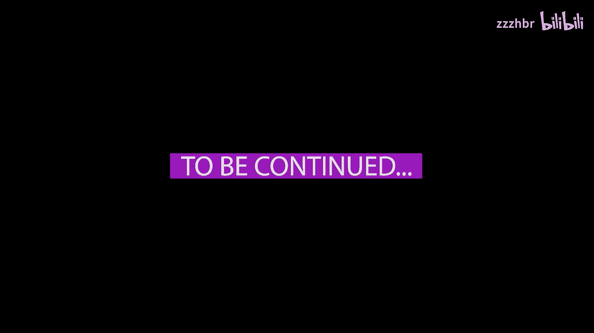

# 二、红帽认证体系介绍 - P1：二、红帽认证体系 - zzzhbr - BV1bk4y1q7cd

大家好，我是25摄氏度。那在接下去讲今天的内容之前呢，我先来说一下几个比较。专业的一些就是比较常厅的一些概念吧。就首先就是这个unux系统。un系统呢就是咱们linux发展的一个前端。

unux是一个系统。然后咱们的linux呢就是一个类unux系统。然后还能经常听到的就是1个GPL，还有1个FSF，然后还有个GNU。这个GPL呢是一个许可协议。

就是咱们这个一些软件啊都都要需要遵循的这么一个许可协议。然后FSF呢就是一个自由软件基金会，就是一个基金会。然后GNU呢是一个项目。这就是咱们另事啊经常会听说的几个概念吧。如果你想要了解详细的呢。

可以去在网上再稍微搜一下，能够了解的更多一些。然后我们今天来分享来的就是这个rehead的认证体系。我们来接着来说一下这个洪贸的认证体系。那补充一点呢，就是在2018年的时候，这个IBM呢。

就把这个redhead已经收购了，它的总价值约为340亿美元啊。那他这个认证体系呢？在业界其实他是算是比较权威的。所以他的这个认证体系呢，就叫鸿茂认证，就叫鸿帽认证。他有三个级别的认证。但第一级别呢。

也就是常说的这个初级，就是正式点的叫法呢，就叫虹茂认证系统管理员，就是虹帽认证系统管理员。然后。咱们也叫做HcA。然后咱们这个第二级别的那就叫做中级，也叫做红贸认证工程师。是咱们也叫做HHC1。

然后第三个级别呢就是高级高级的话就是红贸论证架构师。然后简称的话我们就叫做HCA。那这三个论证呢都是用都是操操作题啊，就没有做入判断和选择之类的题目全都靠你的操作而且呢他这个证呢是不能直接跳到高级的。

必须从初级考到中级再考到高级，不能越级考试。然后这个HC是A呢和HCE基本上都是捆绑考试的，就是一起考的，一个上午考，一个下午考。他们的考试费呢也都是捆绑在一起的，培训呢也都是捆绑在一起的。

然后这个认证啊，它的方向呢其实分很多种来嗯，尤其是HCAHCA和HCE呢，他们的方向基本上不变了就是这么一个。但是HHCA的方向呢就是架构师，它的方向有很多。比如说就是下面这些就全都是你可以考的一些。

就是方向。而且他这个认证呢都比较紧跟时代的。就比如说现在比较火的，叫要自动化就unsable，所以他们也就推出了unsable。也就HHCE的时候呢，也就。主主考了。有自动化了。那根据发行版本不同的。

考试内容也不会也会不一样。比如说咱们77。0的那个时候啊，就和现在要考8。0的时候呢，就是认证的内容呢也就不一样了。那我就是8和7对比而言，就是做了哪些改变。那这里就简单的总结了一下。

就我们可能会预上的，就是对我们来说比较重要的。就是2区128呢就可能默认安装了一个web控制台。然后它的内核版本呢以及支持的最大内存呢，还有支持的硬件架构呢以及防火墙都做了一些改变，就是做了升级。

然后软件管理呢，就是以前是从亚姆以前是亚母，然后现在改成DNF就读奶粉。然后咱们的网络啊，现在H118呢，他默认就用了这个netnetwork manager。像以前的话就是在network。

那现在的话这个nettwork这个包呢是默认不装了，像6的时候呢，用的是nettwork。然后7的时候呢，可以两者兼顾，就是你既可以用network，也可以用netnetwork manager来做。

那到了8的时候呢，他默认的话就是netnetwork manager就是。这样子的就是7的话就相当于6和6到8的一个过渡了。然后八的话就摒弃了6的六的内容。当然如果你要用的话，也同样可以的。

只不过是需要你自己去手动再安装了。那这就是我们最开始会用到的，就是后面的话，就你越越往后面学习，你就可能感觉到改变的还挺多的。像docker、高可燕之类，他也有做了升级改变。那7和8的论证呢。

考试内容呢也就发生了相应的变更。那首先7他的考试考试代码和课程代码呢，它的课程代码叫做H14H134。这两个对应的呢是HCE级别的呃，HC是A级别的。一课程代码，然后H254呢是HC1课程的代码。

然后HC考试代码为EX200，然后HCE的呢为XX308的考试就变了。他虽然说HCA的代码没变，但是HCE的代码已经变了，他课程内容变成294了，H294。然后HCA的考试代码呢也没变。

HC1的考试代码呢就变成了也是变成了exX294。那看着你HHC4A的代码没有变，但是内容呢已经发生了一些改变了。就比如说以前的话都是以系统管理为主的。但是H1128呢。

那就新增了就是H以前IH254里面的一些需要脚本内容，以及HH442里面的一个系统条约的内容。那HH442呢，还是IHCA有过这么一个论证的。Yeah。有如说他内容的话就增加的多了起来。

然后相对来说会难一些。然后HHCE的考试呢，就从期的服务啊完全变更成了unable自动化。那全部的考题全部都与unable有关。那根据就是这两天看的时候，就就有以下的这些认证科目。

比如说15183200这些东西就是现在可以考的认证，就是HCA的一些认证，可以考的。Yeah。所以说其实HC呃红应该说红帽红帽认证的体系里面的内容呢是非常非常多的。那关于就简单的考试体系呢，就说到这里。

然后说一下就是红帽考试的。那个总分以及他的就是及格线，我们可以拿证书的线总分的话是300分。然后如果我们能拿到210分呢，就能就相当于咱们过了就可以拿证了。然后HGCSA考试时间呢，上午的话是2。

5个小时，下午的话就是咱们班的话，ES294的话暂时定的应该是4。5个小时。考试时间是比以前的I区，就是验300的时候啊稍微长了一些。以前验300的时候是3。5个小时。然后HC18呢。其实嗯到下个月呢。

就是8月份就已经算是正式开始执行了。因为咱们本来本来的话是5月份还是4月份就正式开始执行的啊，然后因为疫情的关系呢，咱们就推迟到了8月份。

