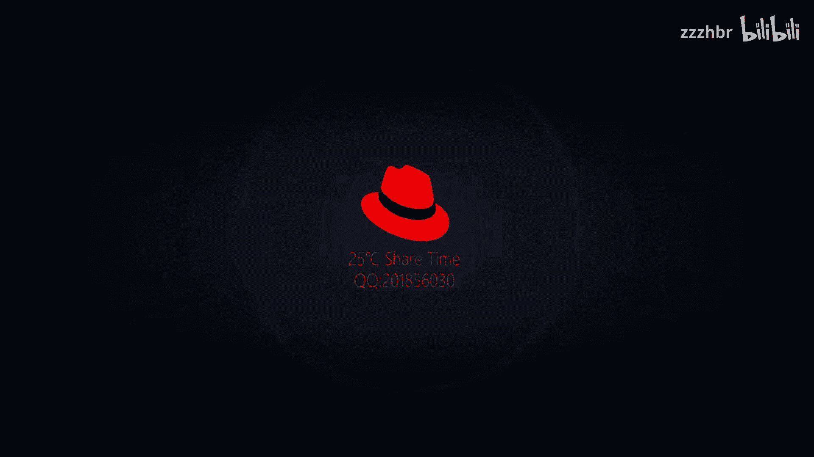
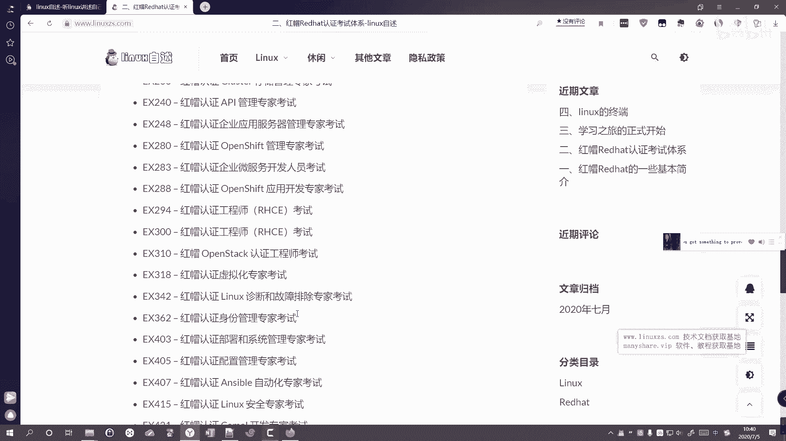
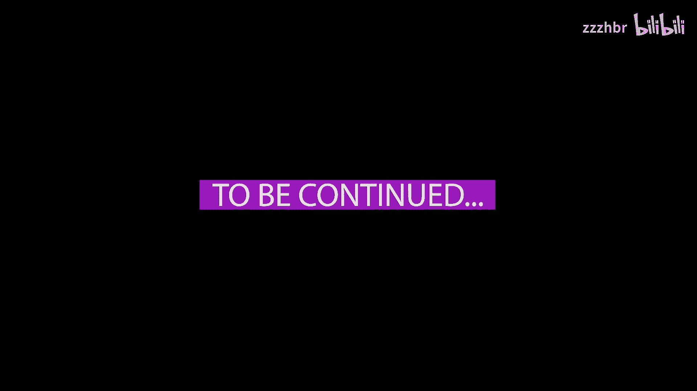

# 红帽认证体系介绍：P1：红帽认证体系概述 🧭

在本节课中，我们将要学习红帽认证体系的基本概念、认证级别、考试内容以及从RHEL 7到RHEL 8的主要变化。通过本节内容，你可以对红帽认证有一个清晰、全面的认识。

## 核心概念澄清

在深入了解红帽认证之前，我们先来明确几个与Linux相关的常见概念。

*   **Unix系统**：Linux发展的前身，是一个操作系统。
*   **Linux系统**：一个类Unix系统。
*   **GPL（GNU通用公共许可证）**：一个软件许可协议，许多开源软件都遵循此协议。
*   **FSF（自由软件基金会）**：一个致力于推广自由软件的基金会。
*   **GNU项目**：一个旨在开发一个完全自由的操作系统的项目。

如果你想了解更详细的信息，可以在网上进一步搜索。

## 红帽认证体系

上一节我们澄清了几个基础概念，本节中我们来看看红帽认证体系本身。首先需要补充一点背景：IBM在2018年以约340亿美元的总价收购了红帽公司。

红帽认证在业界被认为是比较权威的认证体系。该体系主要分为三个级别，且**不能越级考试**，必须从初级考到中级，再考到高级。所有级别的考试均为**操作题**，没有选择题或判断题。

以下是三个认证级别的详细介绍：

*   **初级**：官方名称为**红帽认证系统管理员**，简称 **RHCSA**。
*   **中级**：官方名称为**红帽认证工程师**，简称 **RHCE**。
*   **高级**：官方名称为**红帽认证架构师**，简称 **RHCA**。

其中，RHCSA和RHCE通常是捆绑培训和考试的，一般上午考RHCSA，下午考RHCE。RHCA则包含许多不同的专业方向。

## RHEL 7 与 RHEL 8 的主要变化

认证考试的内容会随着红帽企业Linux发行版本的更新而改变。从RHEL 7 到 RHEL 8，系统发生了许多重要变化，这也直接影响了认证考试的内容。

以下是RHEL 8相比RHEL 7的一些关键变化：

*   **Web控制台**：RHEL 8默认安装了Cockpit Web控制台。
*   **内核与硬件支持**：内核版本、支持的最大内存和硬件架构均有所升级。
*   **防火墙**：防火墙服务也进行了升级。
*   **软件包管理**：默认的包管理工具从 **yum** 改为 **dnf**。
*   **网络管理**：默认的网络管理工具从 `network` 服务改为 **NetworkManager**。在RHEL 6时代使用`network`，RHEL 7是过渡期，两者均可使用，而RHEL 8则默认仅使用NetworkManager。`network`服务包需要手动安装才会提供。

此外，在Docker、高可用性等方面也有升级和改变。随着学习的深入，你会感受到更多的变化。

## 认证考试代码与内容变更

由于系统版本的升级，RHEL 7和RHEL 8对应的认证考试代码和内容也发生了变更。

以下是RHEL 7和RHEL 8认证的对比：

*   **RHEL 7 认证**：
    *   RHCSA课程代码：RH124 / RH134，考试代码：**EX200**
    *   RHCE课程代码：RH254，考试代码：**EX300**

*   **RHEL 8 认证**：
    *   RHCSA课程代码：RH124 / RH134，考试代码：**EX200**（代码未变，但内容已更新）
    *   RHCE课程代码：**RH294**，考试代码：**EX294**

虽然RHCSA的考试代码`EX200`没有改变，但其考试内容已经融合了原RHCE（RH254）中的部分脚本编写知识，以及原RHCA方向中RH442课程的部分系统调优内容，因此难度有所增加。

而RHCE的考试则从RHEL 7时代的各种服务管理，完全转变为围绕 **Ansible自动化** 进行，所有考题均与Ansible相关。

目前，红帽认证体系下可考的科目非常多，例如`EX151`、`EX180`、`EX200`、`EX280`、`EX294`、`EX342`等，涵盖了从系统管理到云、自动化、安全等多个方向。

## 考试分数与时间

最后，我们来了解一下红帽认证考试的评分标准和时间安排。

*   **总分与及格线**：红帽认证考试总分为300分，达到210分即可通过并获取证书。
*   **考试时长**：
    *   RHCSA（EX200）：2.5小时。
    *   RHCE（EX294）：4.5小时（此前RHEL 7的RHCE考试`EX300`时长为3.5小时）。

根据计划，RHEL 8的认证体系已于近期（原计划2020年春季，因疫情推迟）正式全面执行。

---

本节课中我们一起学习了红帽认证体系的三个级别（RHCSA、RHCE、RHCA）、RHEL 8相比RHEL 7的核心变化、对应的考试代码与内容更新，以及考试的分数与时间规则。理解这些基础信息，将为你后续深入学习具体的红帽技术打下坚实的基础。