# Linux系统管理：2.05：SELinux调试 🔧

在本节课程中，我们将学习如何排查和解决因SELinux安全策略导致的常见服务启动问题，特别是Web服务器（HTTPD）在非标准端口上无法启动的情况。我们将从检查YUM源配置开始，逐步深入到SELinux的核心概念、排错工具的使用以及最终的解决方案。

---

## 检查YUM源配置

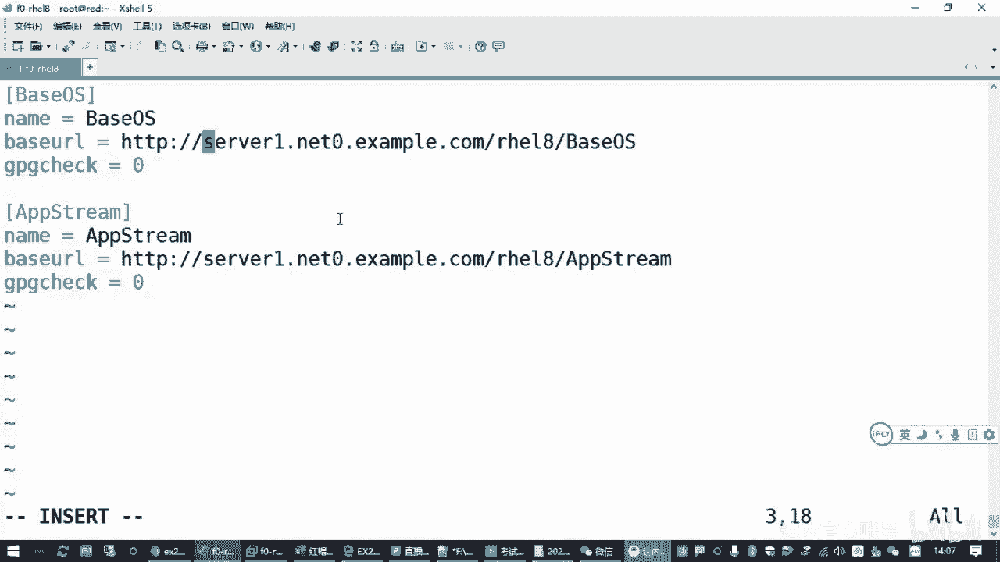

如果YUM源配置不正确，执行 `yum repolist` 命令时会报错，而不是显示正常的仓库列表。最直接的检查方法是尝试安装一个软件包，例如 `yum -y install`，如果安装失败，则说明源不可用。

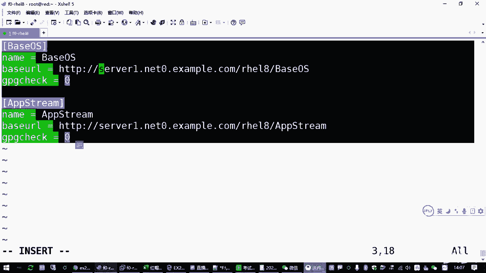

以下是可能导致YUM源无法访问的三种原因：

1.  **服务器端问题**：提供的源地址对应的服务器未开启或不可用。在考试或标准练习环境中，这种情况较少见。
2.  **客户端网络配置问题**：客户机（即你的Linux主机）的IP地址、子网掩码、默认网关或DNS服务器配置错误，导致无法解析或连接到源地址。
    *   检查命令：`ip address` 或 `nmcli`。
    *   检查网关：`ip route` 或 `route -n`（需安装 `net-tools` 包）。
    *   检查DNS：`cat /etc/resolv.conf`。
3.  **配置文件错误**：`/etc/yum.repos.d/` 目录下的 `.repo` 文件内容有误，例如多余的空格、拼写错误或格式问题。

如果发现配置错误，最快的排查方法是删除所有 `.repo` 文件并重新创建。删除后，可以执行 `yum clean all` 清除缓存，再执行 `yum repolist` 测试新配置是否生效。

---

## SELinux 核心概念与排错方法

上一节我们介绍了系统软件源的检查，本节中我们来看看如何调试SELinux。SELinux（Security-Enhanced Linux）是一套由美国国家安全局（NSA）开发的内核级安全增强机制，它为系统中的进程和文件提供了额外的安全标签和访问控制策略。

### SELinux 运行模式

SELinux 有三种运行模式：
*   **Enforcing**：强制模式。违反策略的行为将被阻止并记录。
*   **Permissive**：宽容模式。违反策略的行为仅被记录，不被阻止。
*   **Disabled**：关闭模式。

查看当前模式：`getenforce`
临时切换模式（Enforcing <-> Permissive）：`setenforce 0`（宽容）或 `setenforce 1`（强制）
永久修改模式：编辑 `/etc/selinux/config` 文件，设置 `SELINUX=enforcing`（或其他模式），重启生效。

### 问题场景：HTTPD服务在82端口启动失败

考试题目要求Web服务（HTTPD）在82端口运行，但默认SELinux策略只允许HTTPD绑定如80、443等标准端口。在Enforcing模式下，直接启动服务会失败。

**排错流程：**

1.  **安装排错工具**：首先安装SELinux故障排除工具，以便生成详细的错误日志。
    ```bash
    yum -y install setroubleshoot
    ```
2.  **触发并查看错误**：尝试启动HTTPD服务，此时会失败。然后使用系统日志工具查看具体的SELinux拒绝信息。
    ```bash
    systemctl restart httpd # 此命令会失败
    journalctl | grep -i sealert
    ```
    或者使用更简洁的命令直接获取解决方案：
    ```bash
    sealert -l "*"
    ```
    日志中会给出类似以下的修复建议命令：
    > `semanage port -a -t http_port_t -p tcp 82`

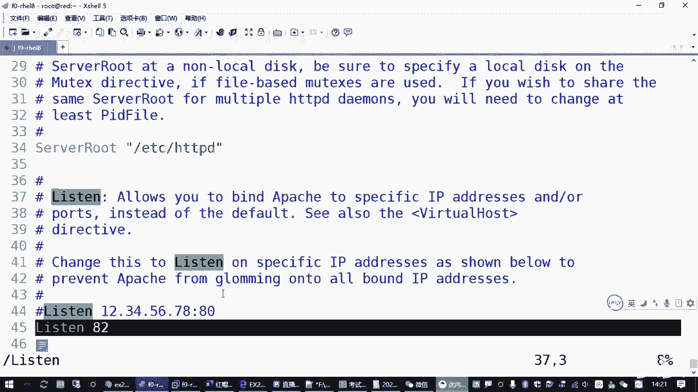

3.  **应用修复策略**：执行日志中建议的命令，允许HTTPD服务绑定到TCP 82端口。
    ```bash
    semanage port -a -t http_port_t -p tcp 82
    ```
    *   `semanage port`：管理SELinux端口策略。
    *   `-a`：添加。
    *   `-t http_port_t`：指定策略类型为HTTP服务端口。
    *   `-p tcp`：指定协议为TCP。
    *   `82`：指定端口号。

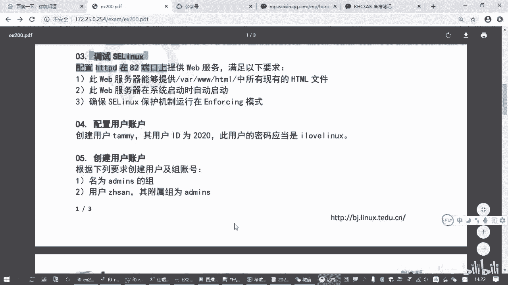

4.  **验证端口策略**：可以列出所有已允许的HTTP端口，确认82端口已添加。
    ```bash
    semanage port -l | grep http_port_t
    ```

### 其他辅助命令

*   **查看文件/目录的SELinux标签**：`ls -lZ <文件或目录路径>`
*   **管理SELinux布尔值开关**：SELinux有许多细粒度的开关（布尔值），用于控制特定功能。
    *   列出所有布尔值：`getsebool -a`
    *   设置布尔值：`setsebool -P <布尔值名> on/off` （`-P`表示永久生效）

---

## 配置HTTPD服务与防火墙

在解决了SELinux端口策略问题后，HTTPD服务应该可以正常启动。但为了完整实现题目要求，还需进行以下配置。

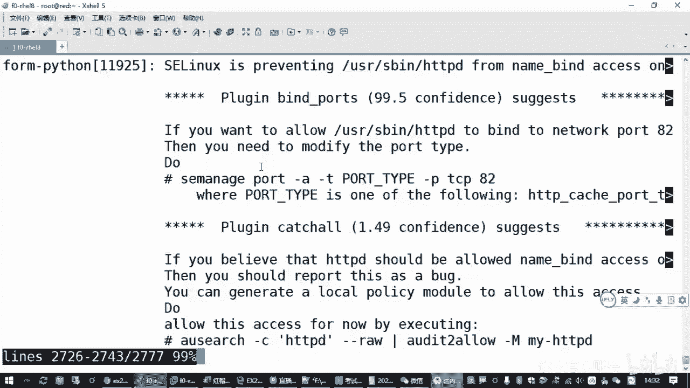

### 禁用默认欢迎页

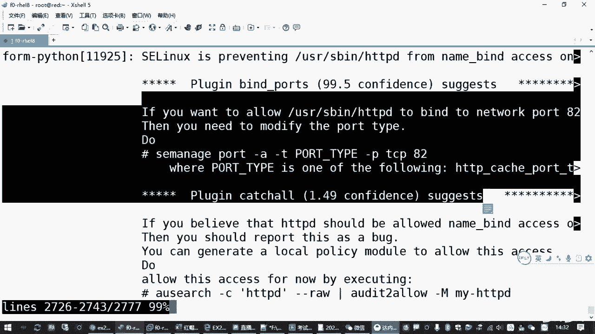

默认配置下，如果网站根目录（`/var/www/html/`）没有 `index.html` 文件，HTTPD会显示一个默认的测试欢迎页。题目要求能列出该目录下所有现有的HTML文件，因此需要禁用这个欢迎页。

方法是删除（或重命名）欢迎页的配置文件：
```bash
rm -f /etc/httpd/conf.d/welcome.conf
```
然后重启HTTPD服务：
```bash
systemctl restart httpd
```

### 关闭防火墙

默认开启的防火墙（firewalld）会阻止外部对82端口的访问。为了测试，需要临时关闭防火墙并禁止其开机自启。
```bash
systemctl stop firewalld
systemctl disable firewalld
```

### 设置服务开机自启

确保HTTPD服务在系统重启后能自动运行。
```bash
systemctl enable httpd
```

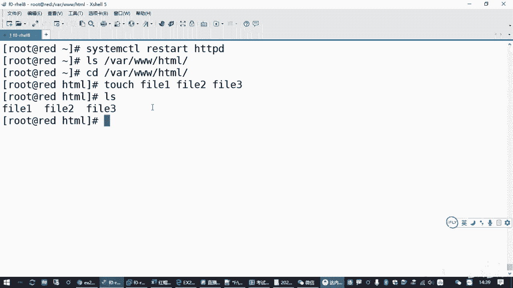

---

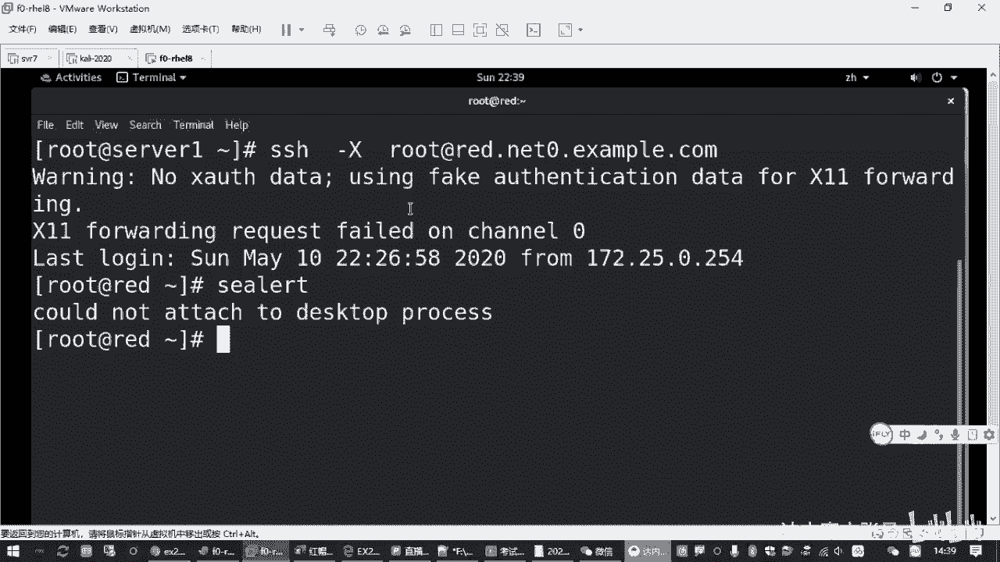

## 最终测试

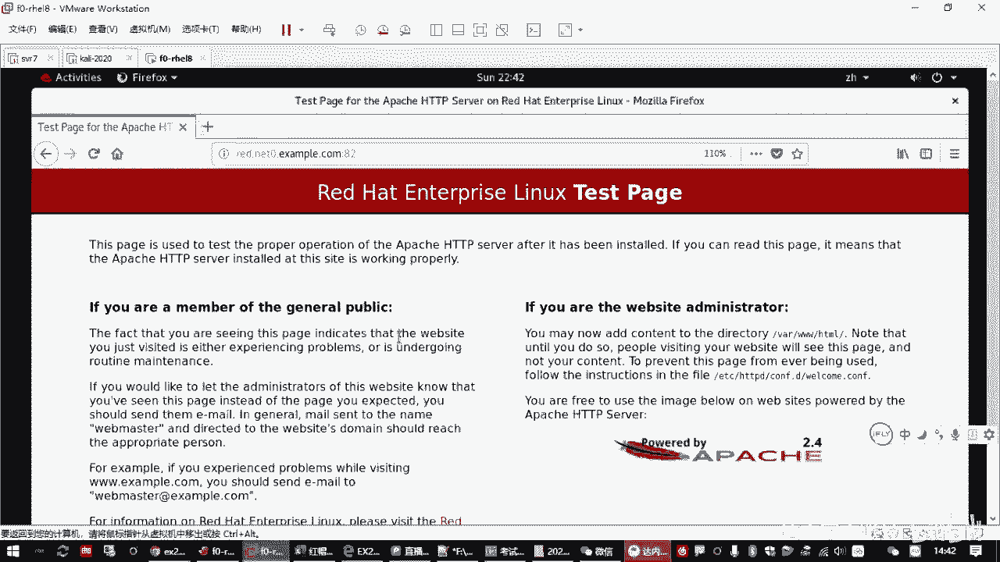

完成所有配置后，进行最终验证：

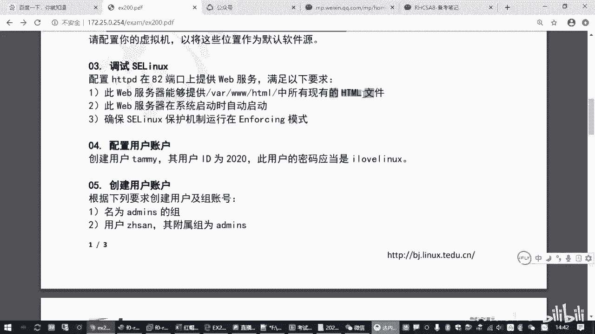

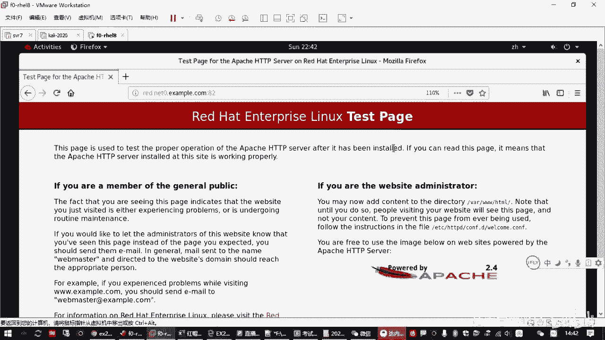

1.  确保SELinux为Enforcing模式：`getenforce` 应返回 `Enforcing`。
2.  确保HTTPD服务正在运行：`systemctl status httpd`。
3.  在网站根目录创建测试文件：
    ```bash
    cd /var/www/html
    touch file{1..3}.html
    ```
4.  从浏览器或使用 `curl` 命令访问服务，应能列出 `file1.html`, `file2.html`, `file3.html` 等文件。
    ```
    http://<你的服务器IP>:82
    ```

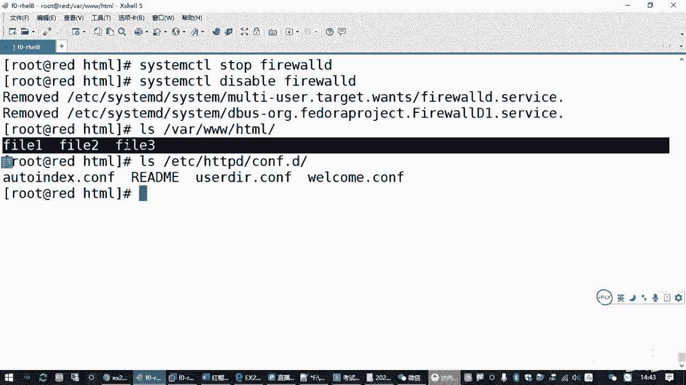

---

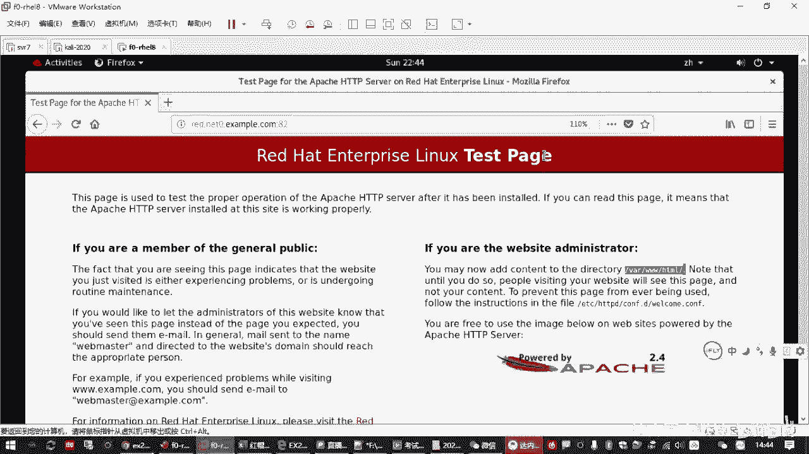

## 总结

本节课中我们一起学习了SELinux的调试方法。核心步骤包括：
1.  **理解问题根源**：SELinux强制策略阻止了HTTPD绑定非标准端口（82）。
2.  **使用排错工具**：通过 `setroubleshoot` 和 `journalctl` / `sealert` 获取具体的错误信息和修复命令。
3.  **修改安全策略**：使用 `semanage port -a -t http_port_t -p tcp 82` 命令添加端口例外。
4.  **完成服务配置**：禁用默认欢迎页、关闭防火墙干扰，并设置服务开机自启。

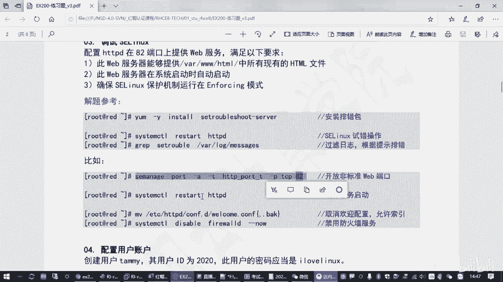

通过这一流程，我们不仅解决了具体问题，也掌握了在Enforcing模式下，如何合规地调整SELinux策略以允许必要的服务运行，这是Linux系统管理员的一项重要技能。