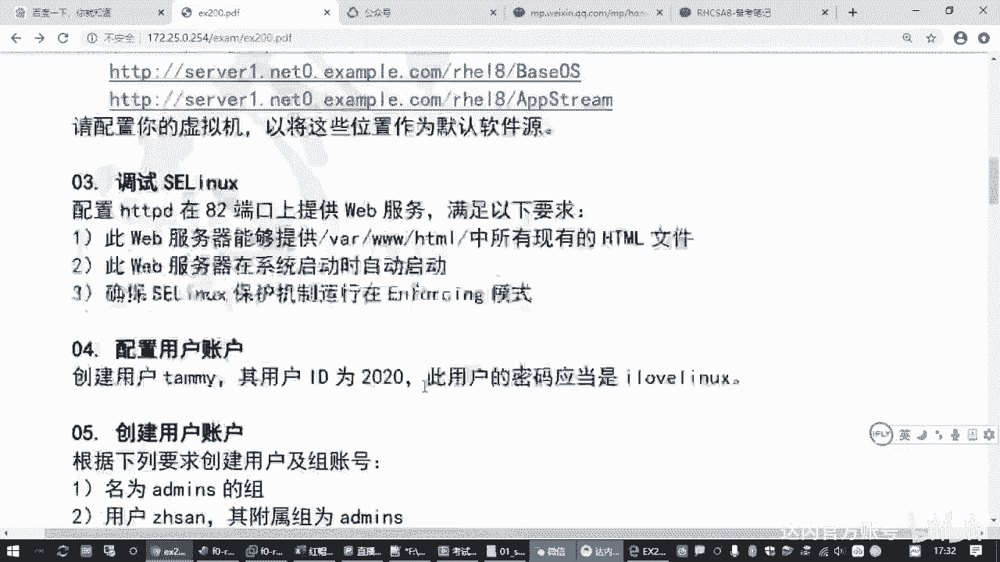
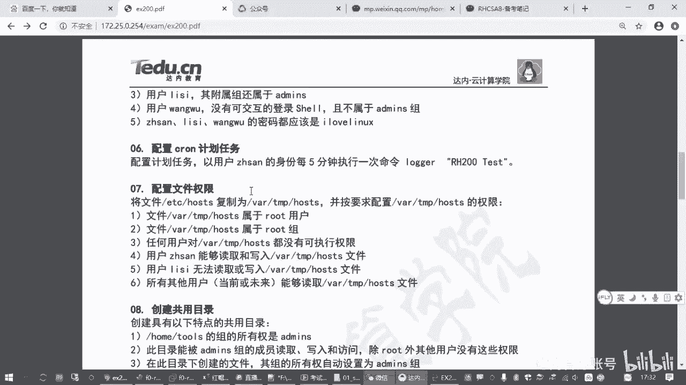
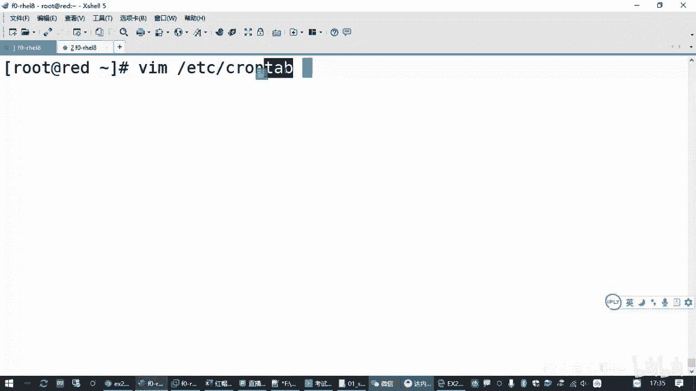
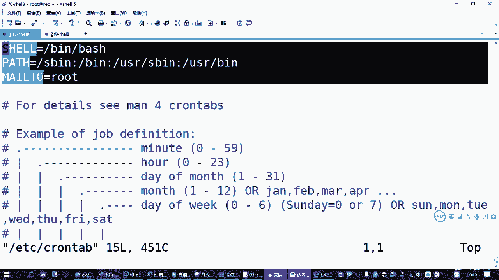
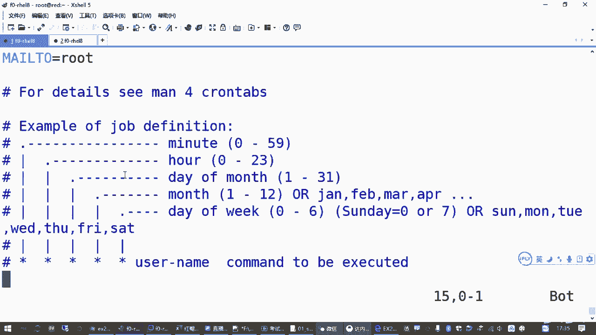
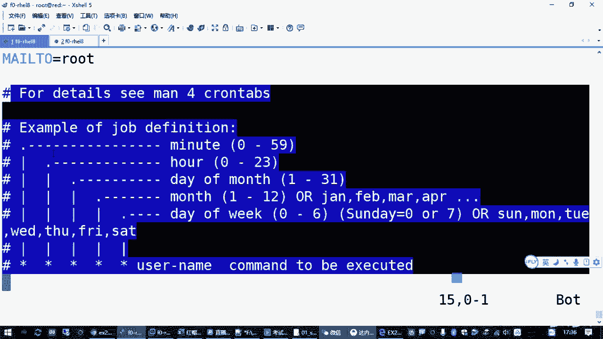
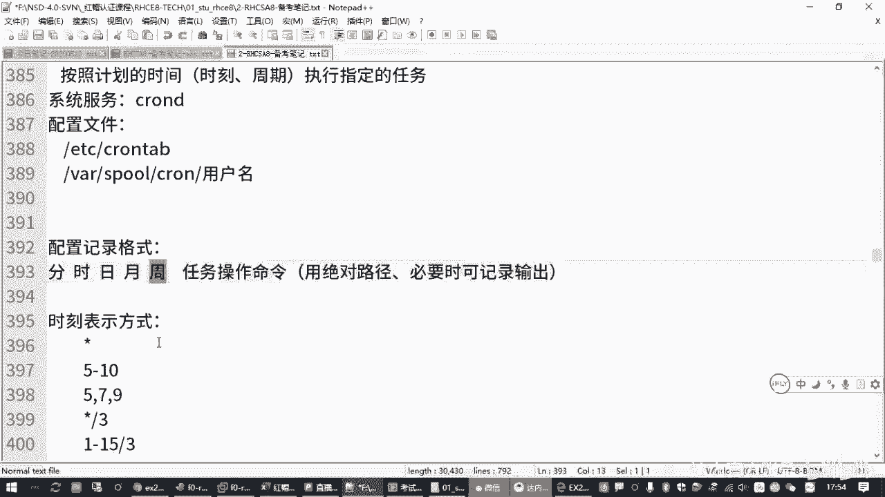

# Linux计划任务：2.09：cron计划任务配置与管理 🕐





在本节课中，我们将要学习Linux系统中一个非常实用的功能——计划任务。我们将了解什么是计划任务，如何配置它，并掌握相关的管理工具和命令，确保你能够独立完成计划任务的设置。

## 概述

计划任务，顾名思义，就是由管理员预先规划好，让系统在指定的时间点自动执行特定任务的功能。例如，每周六晚上自动备份数据，或者工作日早上自动开启防火墙策略。在红帽（Red Hat）系统中，这个功能主要由 `cron` 服务来实现。

## 计划任务基础

上一节我们介绍了计划任务的基本概念，本节中我们来看看实现这一功能的核心组件。

### cron服务与软件包

实现计划任务功能需要一个名为 `crond` 的服务。这个服务在红帽系统中通常是**默认安装并自动启动**的，对应的软件包是 `cronie`。你很少需要手动安装它，但需要知道如何检查和管理它的状态。

**检查服务状态：**
```bash
systemctl status crond
```







### 配置文件



`crond` 服务读取一个全局配置文件来执行任务，这个文件是 `/etc/crontab`。理解这个文件的格式是配置计划任务的关键。

**查看全局配置文件：**
```bash
cat /etc/crontab
```

在这个文件中，你会看到类似下面的示例行，它说明了计划任务条目的标准格式：
```
* * * * * user-name command-to-be-executed
```

这五个星号（`*`）从左到右分别代表：

1.  **分钟** (0-59)
2.  **小时** (0-23)
3.  **一个月中的第几天** (1-31)
4.  **月份** (1-12)
5.  **一周中的第几天** (0-7，其中0和7都代表星期日)

## 时间表示格式详解

了解了配置文件的结构后，我们来看看如何具体表示时间。这是配置计划任务的核心。

时间字段的表示非常灵活，以下是几种常见格式：

*   **星号 (`*`)**：代表该字段的所有有效值。例如，在分钟字段使用 `*` 表示“每一分钟”。
*   **具体数值**：指定一个确切的值。例如，在小时字段写 `22` 表示“22点”。
*   **范围 (`-`)**：指定一个连续的范围。例如，`1-5` 在“一周中的第几天”字段表示“周一到周五”。
*   **列表 (`,`)**：指定多个不连续的值。例如，`0,15,30,45` 在分钟字段表示“每小时的第0、15、30、45分钟”。
*   **步长 (`/`)**：指定间隔频率。例如，`*/5` 在分钟字段表示“每5分钟”。`1-30/2` 表示在1到30分钟内，每2分钟一次。

**重要提示：**
“一个月中的第几天”和“一周中的第几天”这两个字段是“或”的关系。如果同时指定，只要满足其中一个条件，任务就会执行。为避免混淆，通常只使用其中一个字段来定义日期。

## 管理计划任务

虽然可以直接编辑 `/etc/crontab` 文件，但更推荐使用专门的工具 `crontab` 命令来管理用户级别的计划任务，这样更安全、更方便。

`crontab` 命令的常用选项如下：

*   `crontab -e`：编辑当前用户的计划任务列表。
*   `crontab -l`：列出当前用户的计划任务。
*   `crontab -r`：删除当前用户的所有计划任务。

对于系统管理员，如果需要管理其他用户的计划任务，可以使用 `-u` 选项：
```bash
crontab -u username -e  # 编辑指定用户的计划任务
crontab -u username -l  # 列出指定用户的计划任务
```

当你使用 `crontab -e` 编辑时，系统会调用默认的文本编辑器（如vi）打开一个临时文件。编辑完成后保存退出，`crond` 服务会自动加载新的配置。

**注意事项：**
在编写要执行的命令时，**强烈建议使用命令的绝对路径**（例如 `/usr/bin/ls` 而不是 `ls`）。因为计划任务在后台运行时，环境变量可能与用户登录时不同，使用相对路径可能导致命令找不到。

## 实战：配置计划任务

现在，让我们通过一个实际例子来巩固所学知识。假设我们需要完成以下任务：

> **要求**：以用户 `zhangsan` 的身份，每5分钟执行一次命令 `/bin/echo “hello world”`。

以下是操作步骤：

1.  以root管理员身份，为用户 `zhangsan` 编辑计划任务：
    ```bash
    crontab -u zhangsan -e
    ```

2.  在打开的编辑器中，按 `i` 进入插入模式，添加以下一行：
    ```
    */5 * * * * /bin/echo “hello world”
    ```
    **格式解析**：`*/5`（每5分钟），其余字段为 `*`（每小时、每天、每月、每周），最后是要执行的命令。

3.  按 `ESC` 键，然后输入 `:wq` 保存并退出编辑器。如果时间格式正确，你会看到类似 `crontab: installing new crontab` 的提示。

4.  验证任务是否已添加：
    ```bash
    crontab -u zhangsan -l
    ```

## 检查计划任务执行情况

配置完成后，如何知道任务是否真的执行了呢？你可以通过查看系统日志来确认。

`crond` 服务会将执行记录写入日志文件 `/var/log/cron`。使用 `tail` 命令可以查看最新的日志条目：

```bash
tail -f /var/log/cron
```

等待几分钟，你应该能在日志中看到以用户 `zhangsan` 身份执行 `echo` 命令的记录。

**错误排查：**
如果在使用 `crontab -e` 保存时时间格式写错（例如小时写了25），系统会给出 `“bad minute”` 或 `“bad hour”` 等错误提示，并拒绝保存，直到你修正错误为止。

## 总结

本节课中我们一起学习了Linux计划任务 `cron` 的配置与管理。我们首先了解了 `crond` 服务及其全局配置文件 `/etc/crontab` 的结构。然后，深入学习了计划任务中核心的**时间表示格式**，包括星号、数值、范围、列表和步长等用法。

接着，我们掌握了使用 `crontab -e`、`-l`、`-r` 命令来编辑、查看和删除用户计划任务的方法，并强调了在命令中使用**绝对路径**的重要性。最后，通过一个“每5分钟执行echo命令”的实战例子，完整演练了配置和验证计划任务的流程。



记住关键点：理解时间格式、使用 `crontab` 命令管理、通过 `/var/log/cron` 日志验证执行结果。掌握这些，你就能熟练地使用计划任务来自动化你的系统管理工作了。