# Linux基础操作：P16：3.02-find查找及grep过滤

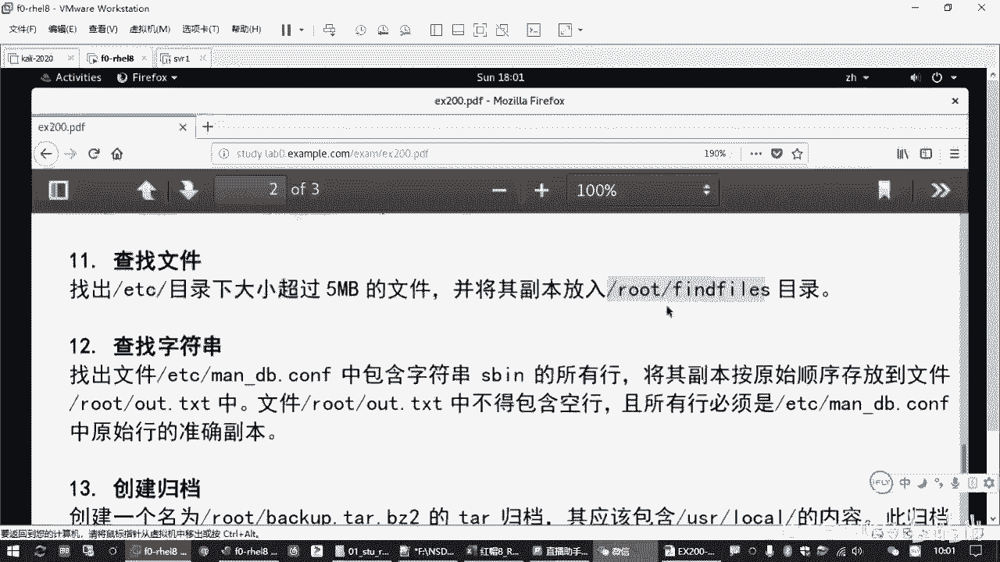

在本节课中，我们将要学习两个在Linux系统中非常实用的命令：`find`和`grep`。`find`命令用于在文件系统中查找符合条件的文件，而`grep`命令则用于在文本内容中过滤出包含特定字符串的行。掌握这两个命令是进行系统管理和文件操作的基础。

## 🔍 find命令：查找文件

上一节我们介绍了课程概述，本节中我们来看看如何使用`find`命令查找文件。`find`命令的基本格式是：在指定的目录范围内，根据给定的条件搜索文件。

其基本语法结构如下：
```bash
find [目录路径] [查找条件]
```
*   如果不指定目录路径，则默认在当前目录下查找。
*   如果不指定查找条件，则默认查找所有文件。

以下是`find`命令一些常用的查找条件：

*   **按名称查找 (`-name`)**: 查找文件名匹配特定模式的文件。支持通配符，如 `*` (匹配任意多个字符) 和 `?` (匹配单个字符)。
    *   示例：`find /etc -name "*.conf"` 查找`/etc`目录下所有以`.conf`结尾的文件。
*   **按类型查找 (`-type`)**: 查找指定类型的文件。
    *   `f`: 常规文件
    *   `d`: 目录
    *   `l`: 符号链接文件
    *   示例：`find /dev -type b` 查找`/dev`目录下的块设备文件。
*   **按大小查找 (`-size`)**: 查找文件大小符合条件的文件。可以使用 `+` 表示大于，`-` 表示小于。
    *   单位：`c` (字节)， `k` (KB，小写)， `M` (MB，大写)， `G` (GB)。
    *   示例：`find /etc -size +5M` 查找`/etc`目录下大小超过5MB的文件。
*   **按修改时间查找 (`-mtime`)**: 查找在指定天数前被修改过的文件。
    *   `+n`: 超过 n 天前
    *   `-n`: n 天以内
    *   `n`: 正好 n 天前（24*n 到 24*(n+1) 小时之间）
    *   示例：`find /var/log -mtime +30` 查找`/var/log`目录下超过30天前修改过的文件。
*   **按用户/组查找 (`-user` / `-group`)**: 查找属于特定用户或组的文件。
    *   示例：`find /home -user alice` 查找`/home`目录下属于用户`alice`的文件。

## 🔗 组合条件与处理结果

上一节我们介绍了`find`命令的基本查找条件，本节中我们来看看如何组合多个条件，并对查找到的结果进行处理。

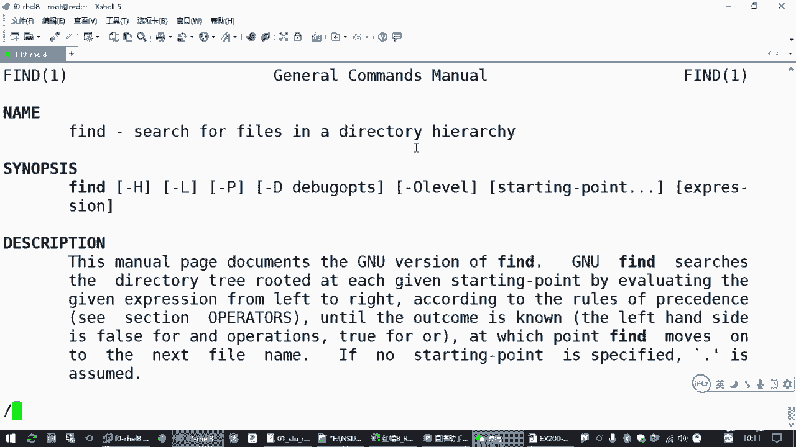

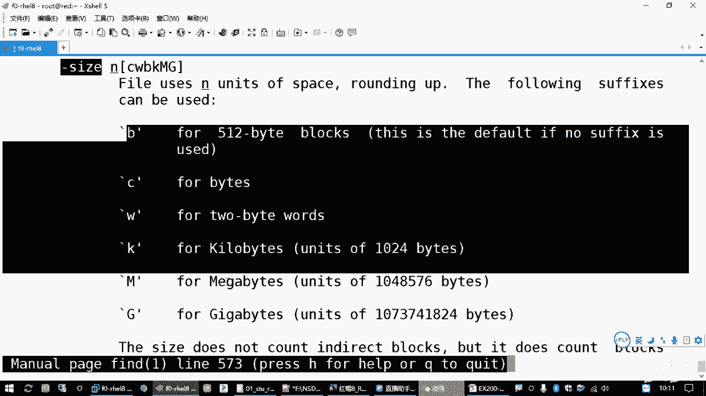

多个条件可以通过逻辑运算符进行组合：
*   **与关系 (`-a` 或 默认连接)**: 同时满足所有条件。`-a` (and) 通常可以省略。
*   **或关系 (`-o`)**: 满足任意一个条件即可。
    *   示例：`find /tmp -size +1M -a -name "*.log"` 查找`/tmp`目录下大小超过1MB且以`.log`结尾的文件。

查找到文件后，我们经常需要对这些文件执行进一步操作。`find`命令提供了`-exec`选项来处理每一个匹配的结果。

其语法如下：
```bash
find [路径] [条件] -exec 命令 {} \;
```
*   `{}` 是一个占位符，代表`find`命令找到的每一个文件的路径。
*   `\;` 表示`-exec`操作的结束，反斜杠`\`用于转义分号，避免被Shell误解。

例如，要查找`/etc`目录下所有超过5MB的文件，并用`ls -lh`命令详细列出它们，可以执行：
```bash
find /etc -size +5M -exec ls -lh {} \;
```

## 📝 实战：查找并复制文件

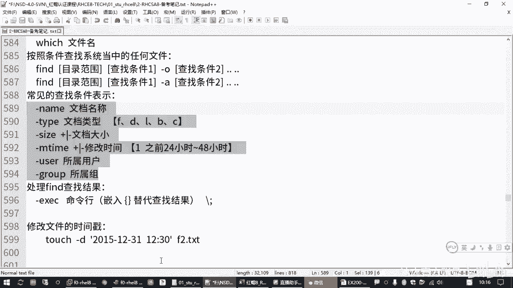

现在，让我们应用所学知识来解决一个实际问题：在`/etc`目录下查找大小超过5MB的文件，并将它们复制到`/root/findfiles`目录中。

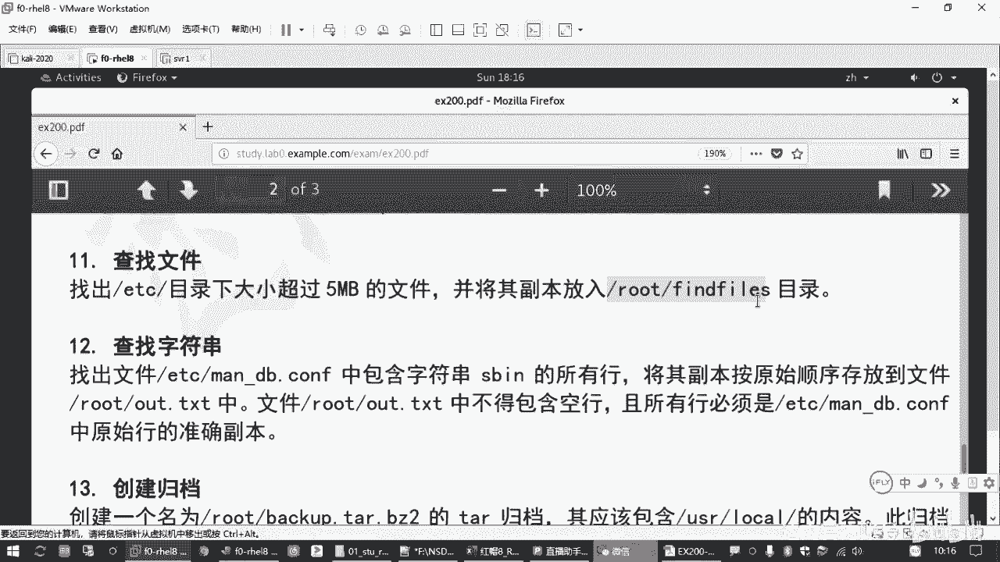

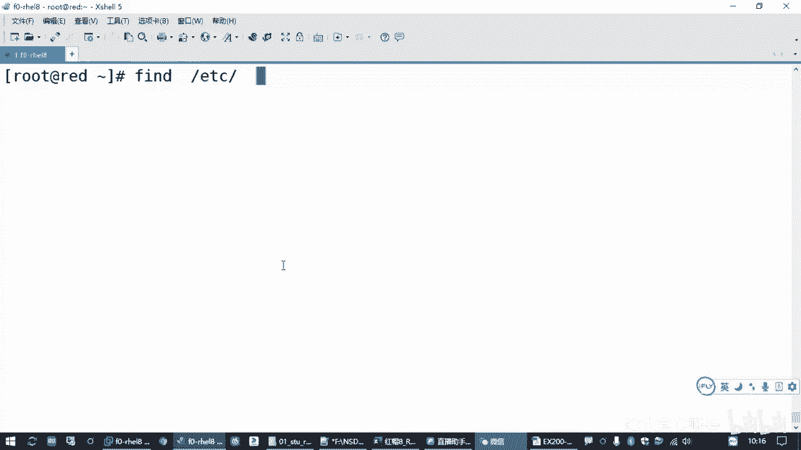

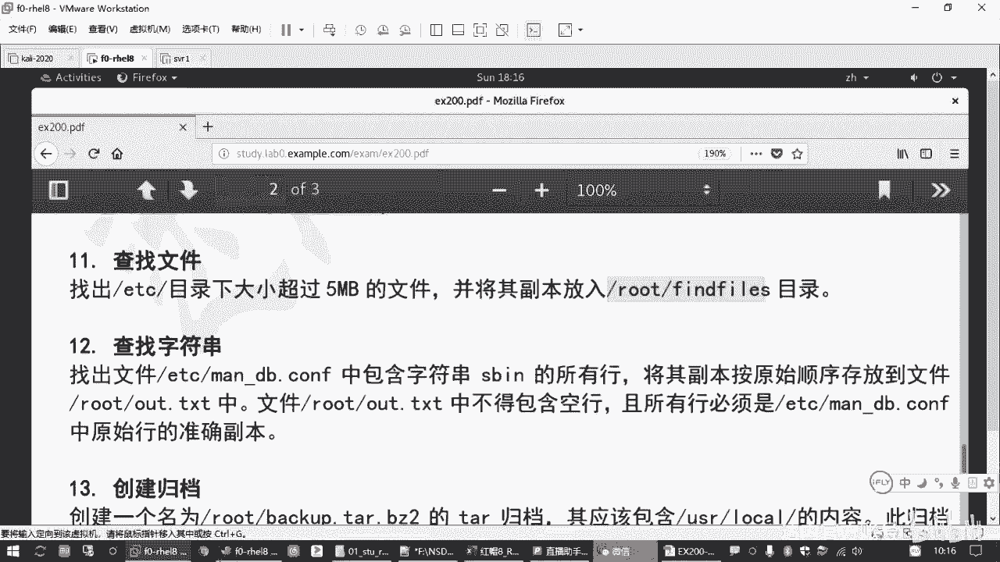

操作步骤如下：
1.  首先创建目标目录（如果不存在）：`mkdir /root/findfiles`
2.  使用`find`命令查找并复制文件：
    ```bash
    find /etc -size +5M -exec cp -p {} /root/findfiles \;
    ```
    *   `-p` 选项用于在复制时保留文件的原始属性（如权限、时间戳）。
3.  验证结果：`ls -la /root/findfiles/`

## 📖 grep命令：过滤文本

上一节我们完成了文件的查找与处理，本节中我们来看看如何使用`grep`命令在文本内容中查找特定的字符串。`grep`是一个强大的文本搜索工具。

`grep`命令有两种基本用法：

1.  **在文件中搜索**:
    ```bash
    grep [选项] "搜索字符串" 文件名
    ```
    *   示例：`grep "127.0.0.1" /etc/hosts` 在`/etc/hosts`文件中查找包含`127.0.0.1`的行。

2.  **对命令输出进行过滤** (结合管道 `|`):
    ```bash
    命令 | grep [选项] "搜索字符串"
    ```
    *   示例：`ip addr show | grep 'inet '` 在`ip addr show`命令的输出中，过滤出包含`inet `（注意空格）的行。

**注意**：如果搜索字符串包含空格或特殊字符，建议用引号（单引号或双引号）括起来。

## ⚙️ grep的常用选项

`grep`命令提供了一些有用的选项来调整搜索行为：

*   `-i`: 忽略大小写进行匹配。
*   `-v`: 反向选择，即输出**不包含**搜索字符串的行。
*   `-n`: 显示匹配行在原文件中的行号。
*   `-c`: 仅统计匹配行的数量，而不显示具体内容。
*   `-o`: 仅输出匹配到的字符串部分，而不是整行。
*   `-E`: 启用扩展正则表达式。等价于使用`egrep`命令。

以下是使用这些选项的例子：
```bash
grep -i "error" /var/log/messages # 忽略大小写查找“error”
grep -v "^#" /etc/ssh/sshd_config # 显示不以#开头的行（过滤注释）
ps aux | grep -c "nginx" # 统计nginx进程的数量
```

## 📝 实战：过滤并保存结果


现在，我们来解决另一个问题：在`/etc/man_db.conf`文件中，查找所有包含字符串`sb`的行，并将结果**按原顺序、无空行**地保存到`/root/output.txt`文件中。

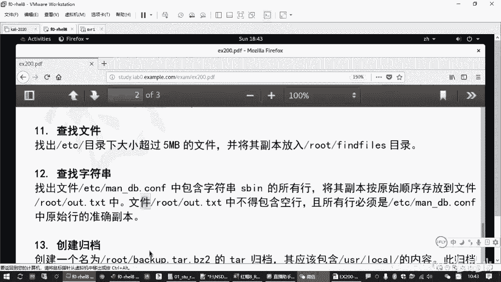

最可靠的方法是使用**输出重定向** (`>`)，它将命令的标准输出直接保存到文件，避免了手动复制粘贴可能引入的错误（如多余空行或内容缺失）。

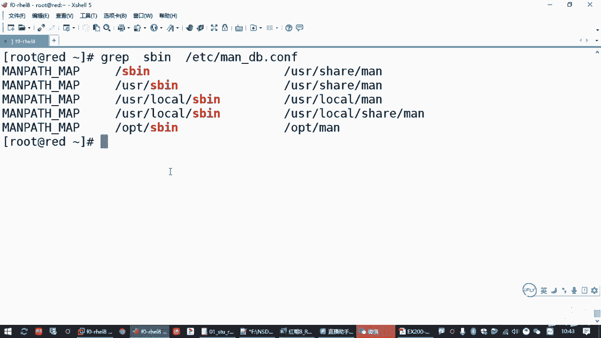

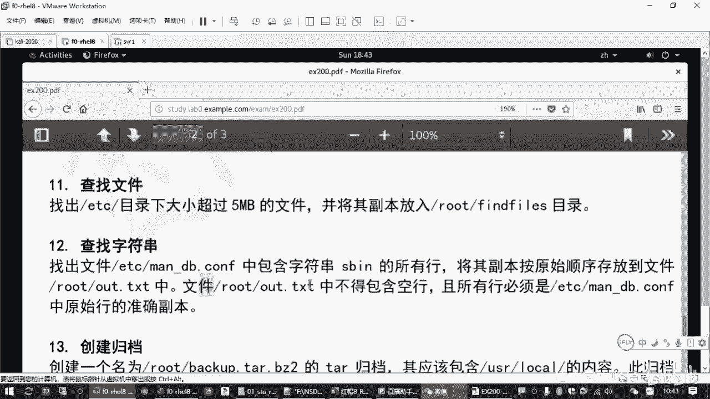

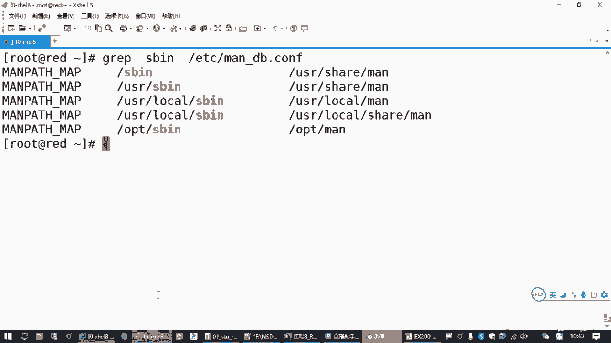

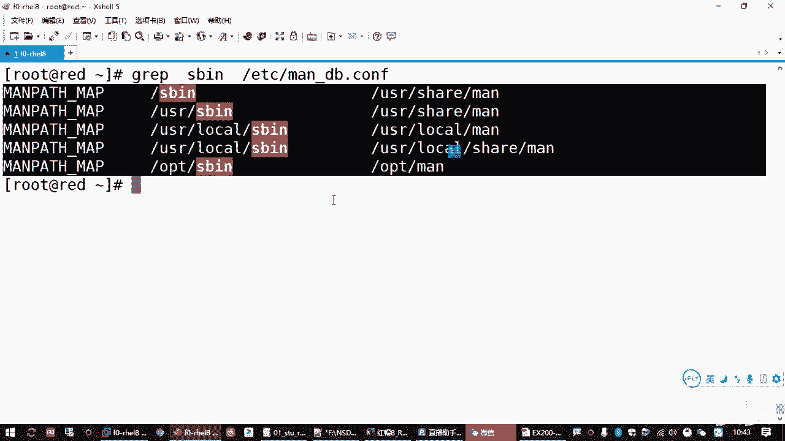

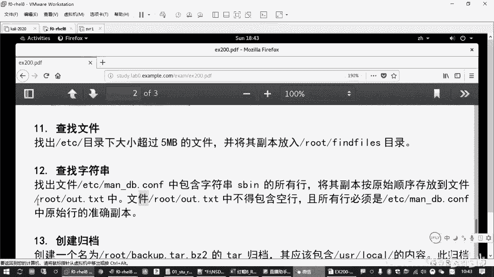

操作命令如下：
```bash
grep "sb" /etc/man_db.conf > /root/output.txt
```
*   `>` 是重定向符号，它会将`grep`命令的输出写入`/root/output.txt`文件。如果文件已存在，则覆盖；如果不存在，则创建。
*   若要追加内容而不覆盖原文件，可以使用 `>>`。

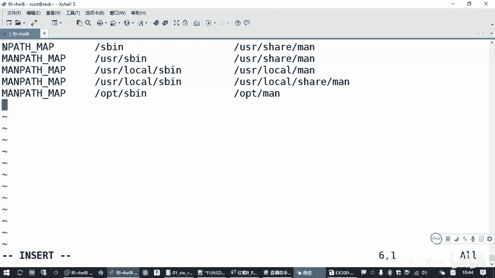

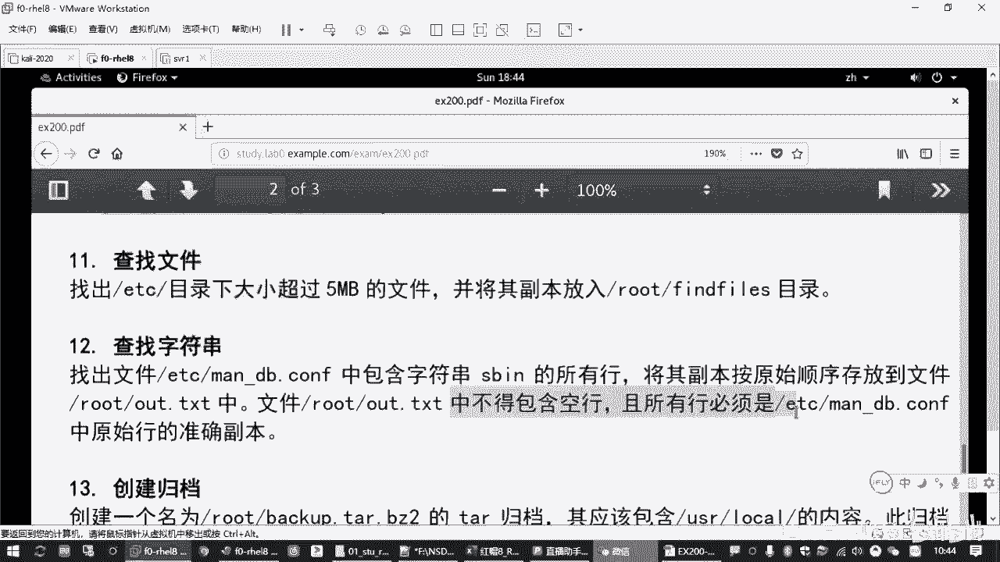

验证结果：`cat /root/output.txt`

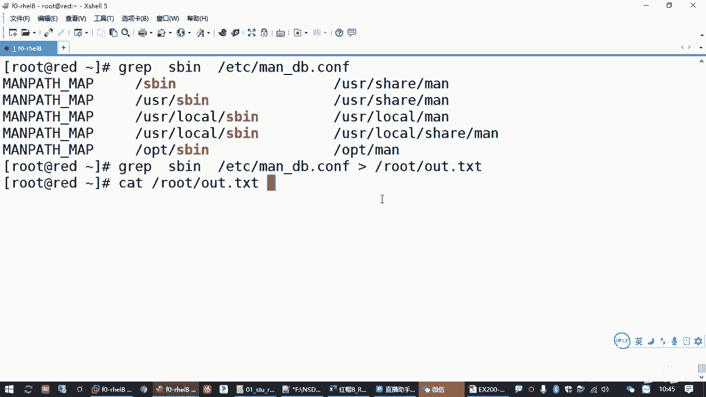

## 🎯 课程总结

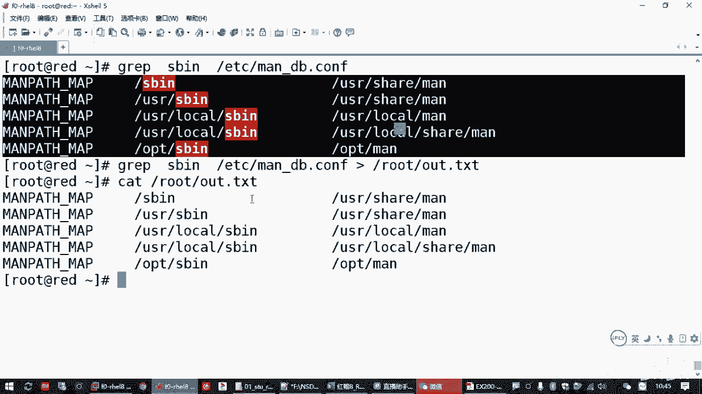

本节课中我们一起学习了Linux中两个核心的命令行工具。
*   **`find`命令**：用于在文件系统中根据名称、类型、大小、时间等多种条件精准定位文件，并能通过`-exec`选项对找到的文件执行后续操作。
*   **`grep`命令**：用于在文本或数据流中快速过滤出包含特定模式的行，支持大小写忽略、反向匹配等选项，常与管道(`|`)和重定向(`>`)结合使用，实现高效的数据处理。

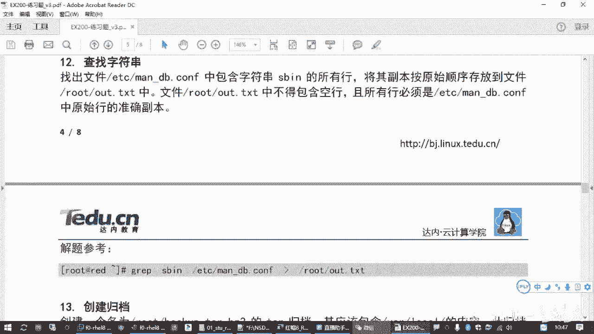

掌握`find`和`grep`的组合使用，能够极大地提升你在Linux环境下进行文件管理和日志分析的效率。