# Linux系统管理：P19：3.05：重置root密码 🔑

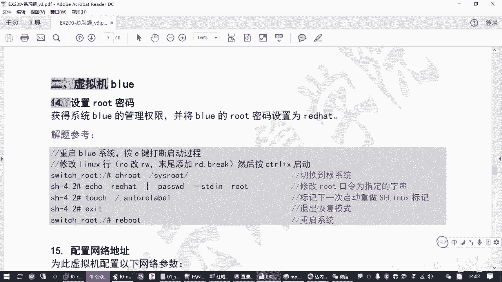

在本节课中，我们将学习如何在Red Hat Enterprise Linux 8系统中，当忘记管理员密码时，通过修改系统启动参数进入恢复模式，从而重置root用户的密码。这是RHCSA/RHCE认证考试中的一个重要技能点。

## 概述与背景

上一节我们介绍了基础的系统配置，本节中我们来看看一个关键的故障排除场景：重置root密码。在考试或实际工作中，你可能会遇到需要访问一台密码未知的Linux服务器的情况。本教程将分步讲解如何绕过密码验证，获取系统访问权限，并安全地修改密码。

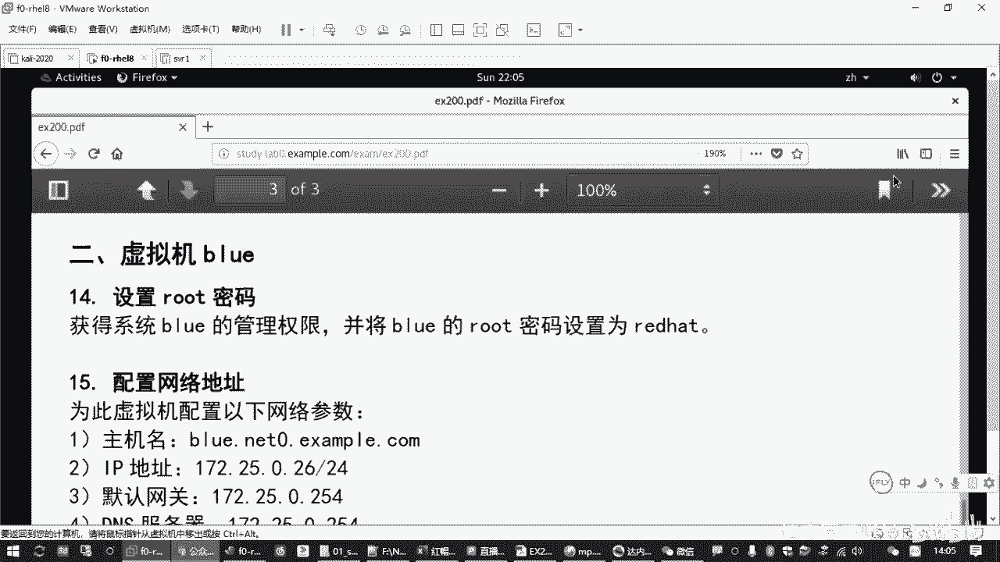

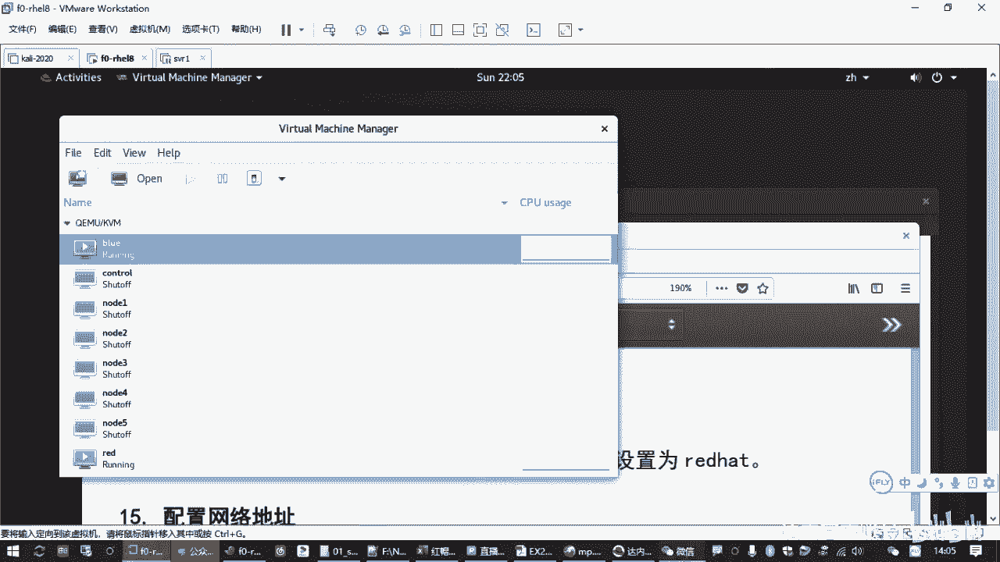

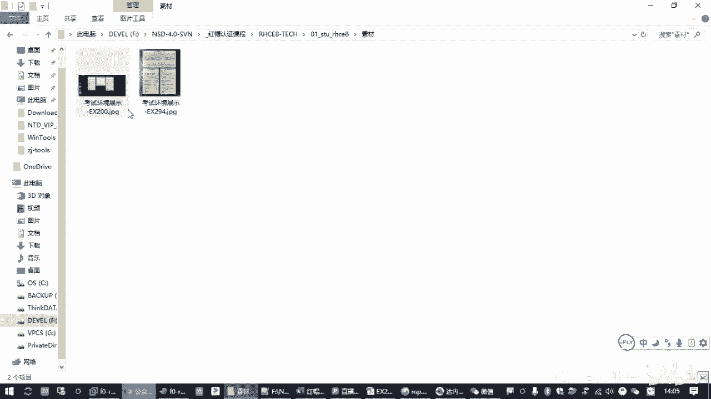

此操作主要针对考试环境中的第二台虚拟机（例如名为`blue`的机器）。核心思路是：**中断正常启动流程 -> 修改内核启动参数 -> 进入无需密码的恢复模式 -> 修改密码**。

## 操作步骤详解

以下是重置root密码的完整流程。

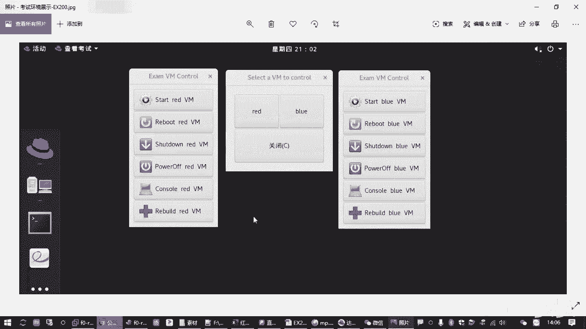

### 第一步：重启并中断启动过程

首先，确保目标虚拟机（如`blue`）处于关机状态。如果已开机，请先将其关闭。

1.  在虚拟机监控界面中，启动目标虚拟机。
2.  启动后，**迅速**点击打开虚拟机的控制台窗口。
3.  在控制台窗口中，**快速连续按两次 `e` 键**。
    *   第一次按 `e` 是为了打断正常启动，显示隐藏的启动菜单。
    *   第二次按 `e` 是为了编辑默认选中的启动项。

### 第二步：修改内核启动参数

成功中断后，你会看到以 `linux` 开头的一行配置信息。我们需要编辑这一行。

1.  使用方向键将光标移动到 `linux` 这行。
2.  找到参数 `ro`（表示只读挂载根文件系统），将其修改为 `rw`（表示可读写挂载）。
3.  将光标移动到行末，添加参数 `rd.break`。
    *   这个参数告知内核在启动初期中断，进入一个特殊的恢复`shell`，从而绕过身份验证。
4.  修改完成后，按 `Ctrl + X` 组合键使用修改后的参数启动系统。

### 第三步：在恢复环境中操作

系统将启动到一个临时的恢复`shell`，提示符为 `switch_root`。

1.  重新以读写方式挂载真实的根文件系统：
    ```bash
    mount -o remount,rw /sysroot
    ```
2.  切换`chroot`到真实的系统环境：
    ```bash
    chroot /sysroot
    ```
    执行此命令后，提示符会变为 `sh-4.4#`，表示你已进入真实的磁盘系统环境。

### 第四步：修改root密码并处理SELinux

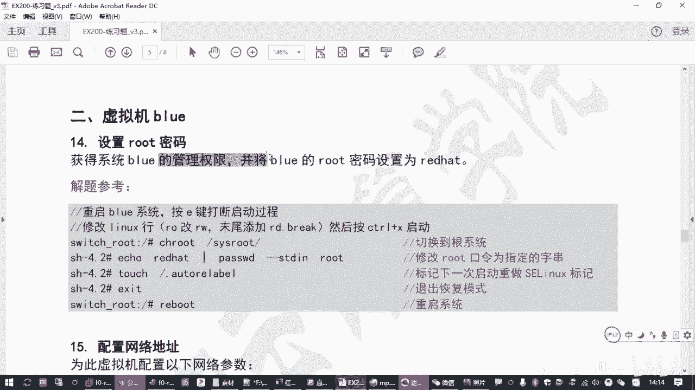

现在可以修改root密码了。

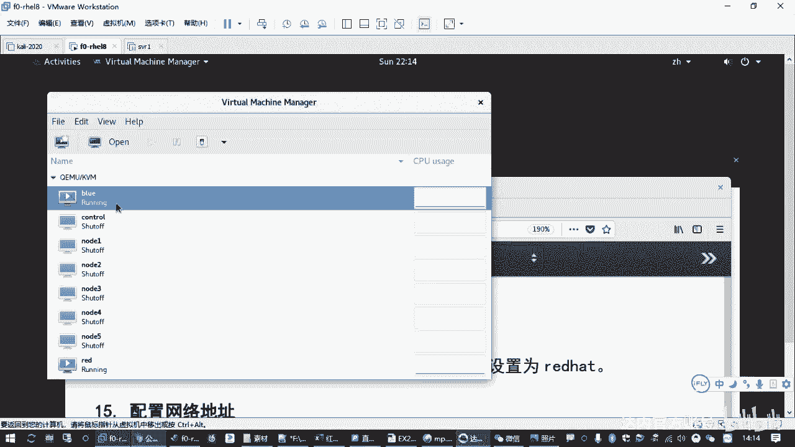

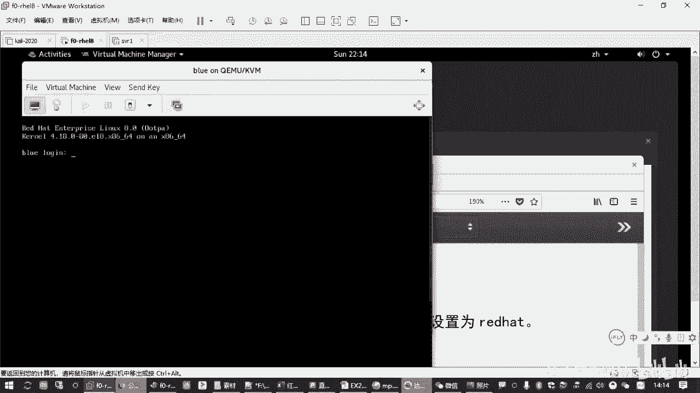

1.  使用 `passwd` 命令修改root密码：
    ```bash
    passwd root
    ```
    然后根据提示输入两次新密码（例如：`redhat`）。

2.  **关键步骤**：如果系统启用了SELinux（默认启用），必须创建一个标记文件，否则重启后可能因安全上下文错误而无法登录。
    ```bash
    touch /.autorelabel
    ```
    这个文件会在下次启动时，触发系统为所有文件重新打上SELinux安全标签。

### 第五步：退出并重启

完成上述操作后，退出并重启系统。

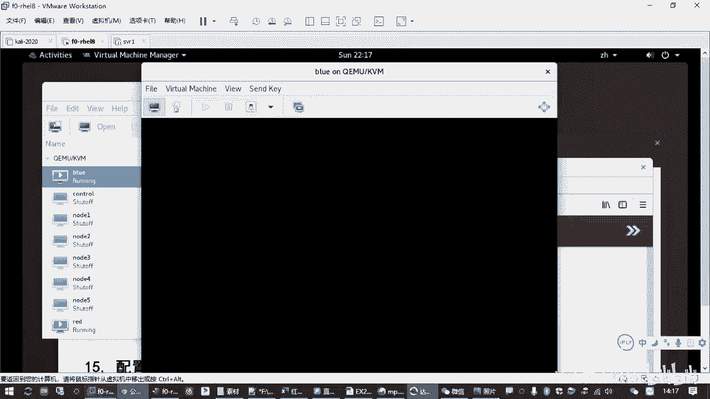

1.  退出`chroot`环境：
    ```bash
    exit
    ```
2.  再次退出恢复`shell`并重启：
    ```bash
    exit
    reboot
    ```
    或者连续按两次 `Ctrl + D` 然后执行 `reboot`。

系统重启后，即可使用新设置的`root`密码登录。

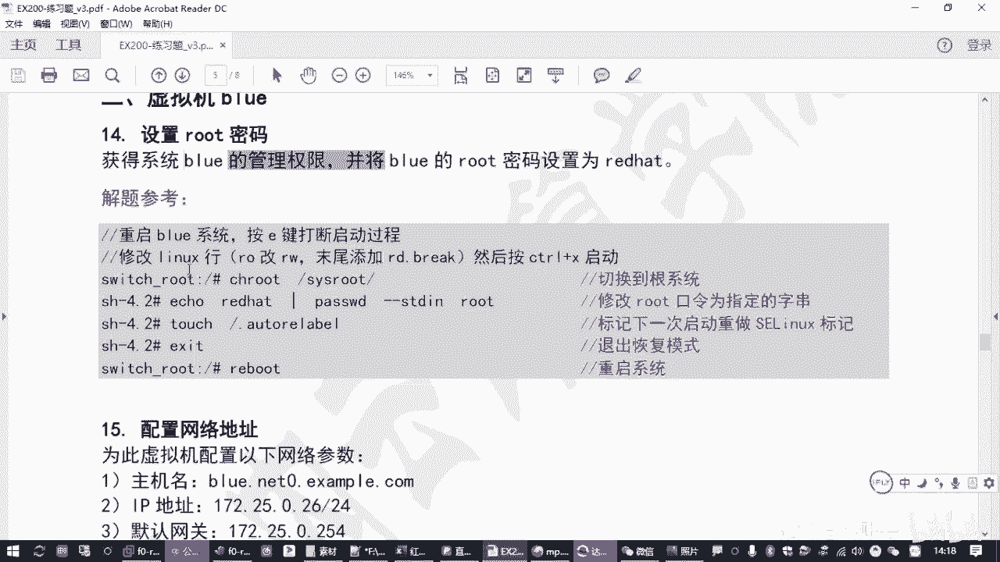

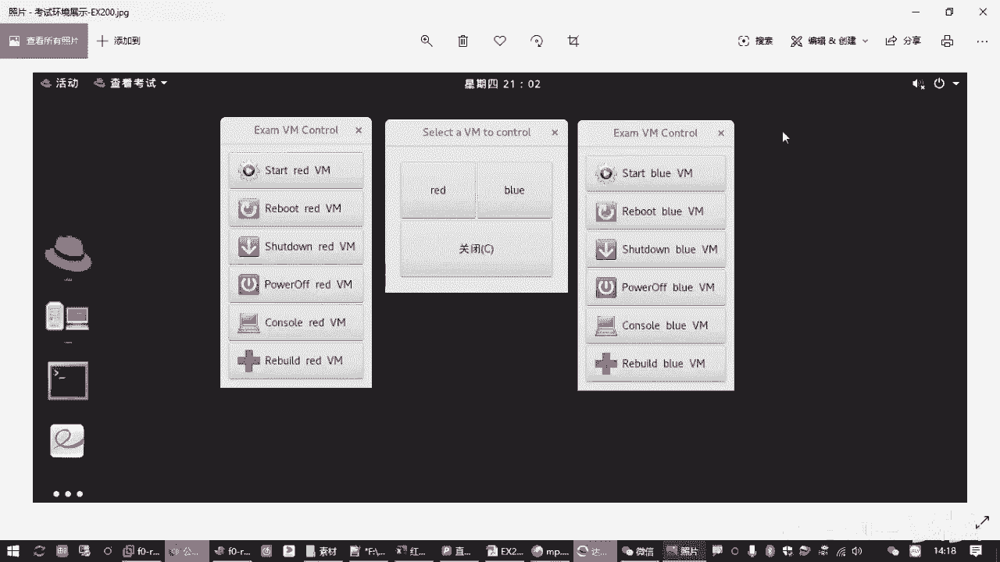

## 后续配置（针对练习环境）

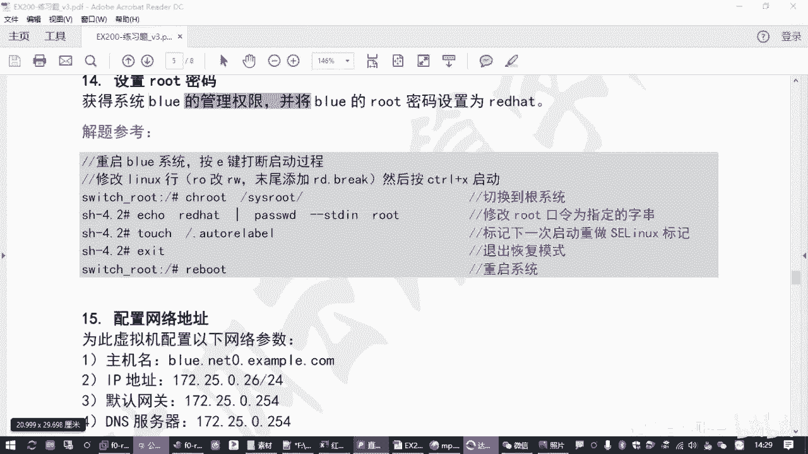

成功登录`blue`虚拟机后，建议完成以下基础配置，以便后续操作。

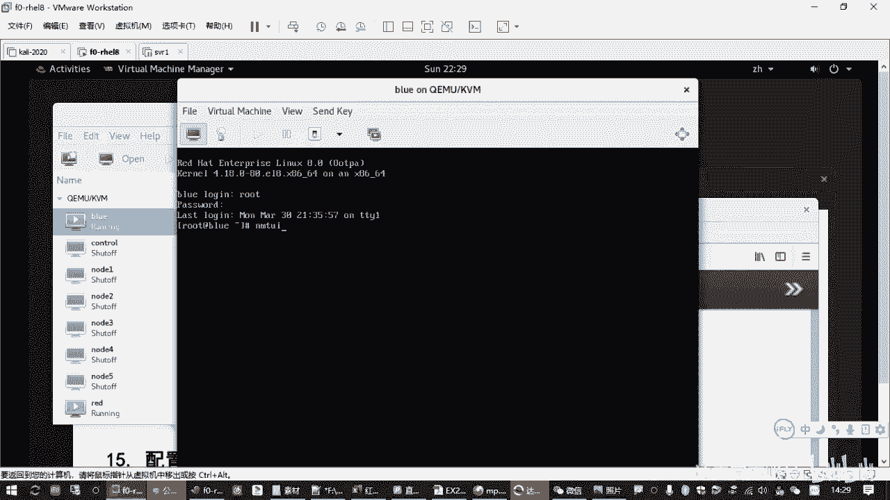

### 配置网络与主机名

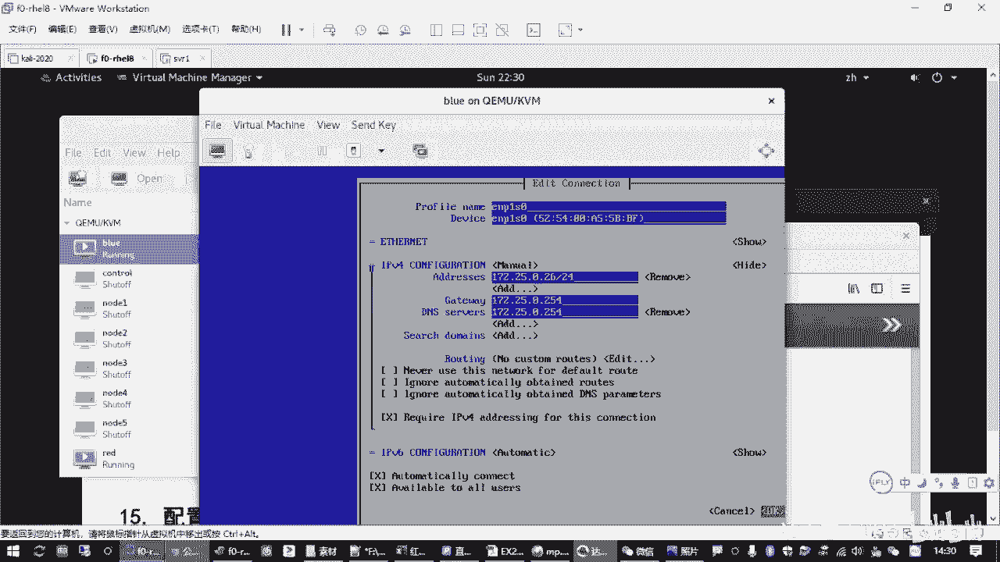

以下是使用`nmtui`文本用户界面配置网络的步骤。

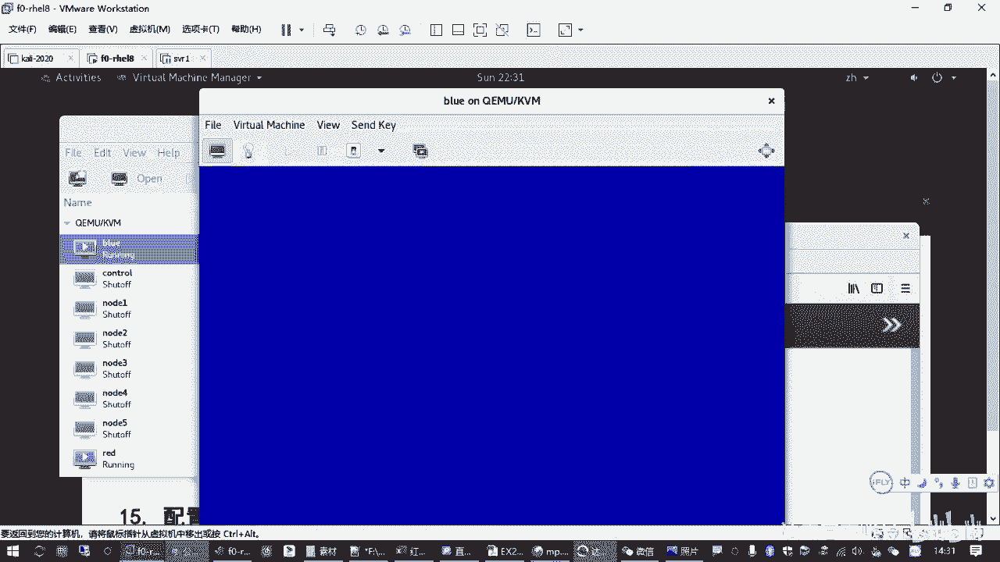

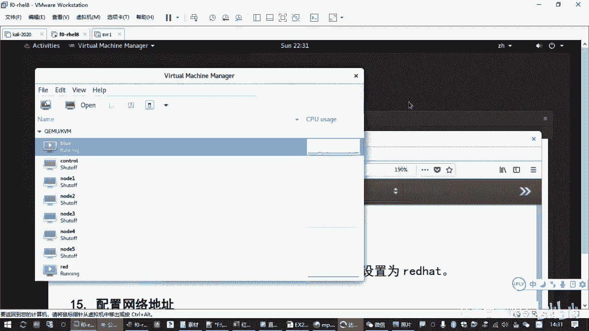

1.  运行 `nmtui` 命令。
2.  选择 “Edit a connection”。
3.  编辑相应的网卡（如`eth0`），将IPv4配置改为手动（Manual）。
4.  添加IP地址（如`172.25.0.11/24`）、网关和DNS（如`172.25.0.254`）。
5.  确保选中“Automatically connect”选项。
6.  返回主菜单，选择“Activate a connection”，先停用再激活修改后的连接。

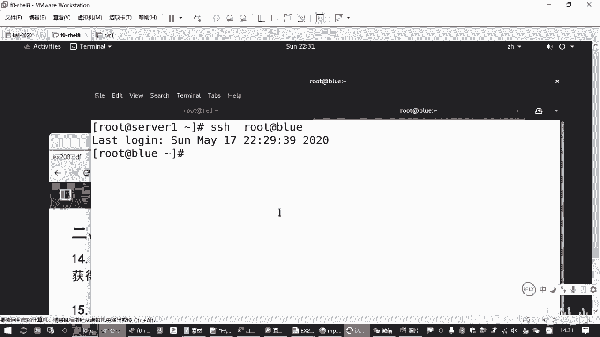

### 配置Yum软件源

可以手动创建配置文件，也可以从已配置好的机器（如`red`）直接复制。

使用`scp`命令从`red`机器复制已配置好的Yum源文件：
```bash
scp /etc/yum.repos.d/*.repo root@blue:/etc/yum.repos.d/
```
输入`blue`机器的`root`密码即可完成复制。之后在`blue`上执行 `yum repolist` 验证源是否可用。

## 总结

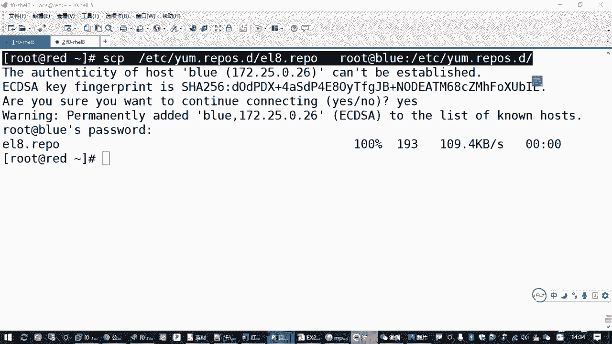

本节课中我们一起学习了重置Red Hat Enterprise Linux 8系统root密码的完整流程。我们掌握了通过按 `e` 键编辑启动参数、添加 `rd.break` 进入恢复模式、使用 `chroot` 切换环境以及修改密码的关键操作。特别需要注意的是，在启用了SELinux的系统上，修改密码后必须创建 `/.autorelabel` 文件，以确保系统能够正常重启。这是一个非常实用的系统恢复技能，也是RHCSA认证考试的必备知识点。