# RHCSA考前串讲：3.09：RHCSA考试环境与应试策略详解 🎯

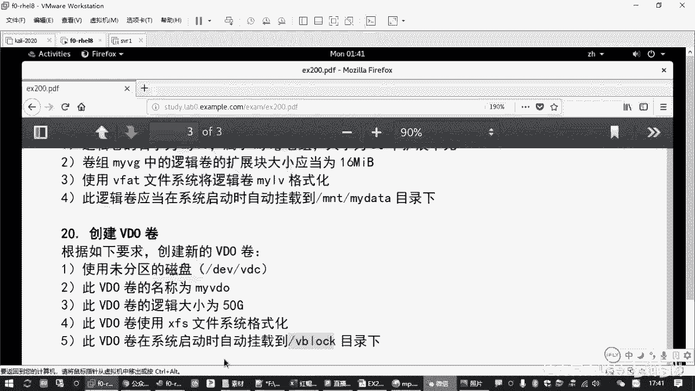

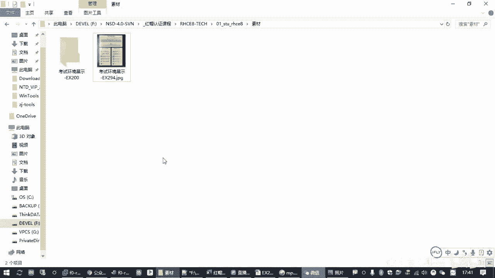

在本节课中，我们将系统性地梳理RHCSA考试的整个流程、考试环境的具体操作以及关键的应试策略。我们将确保你熟悉考试界面，了解如何高效答题，并掌握避免常见错误的技巧。

## 考试环境概览 🖥️

上一节我们介绍了RHCSA考试的整体框架，本节中我们来看看具体的考试环境。每位考生会操作一台真实的物理机，其桌面环境如下图所示。

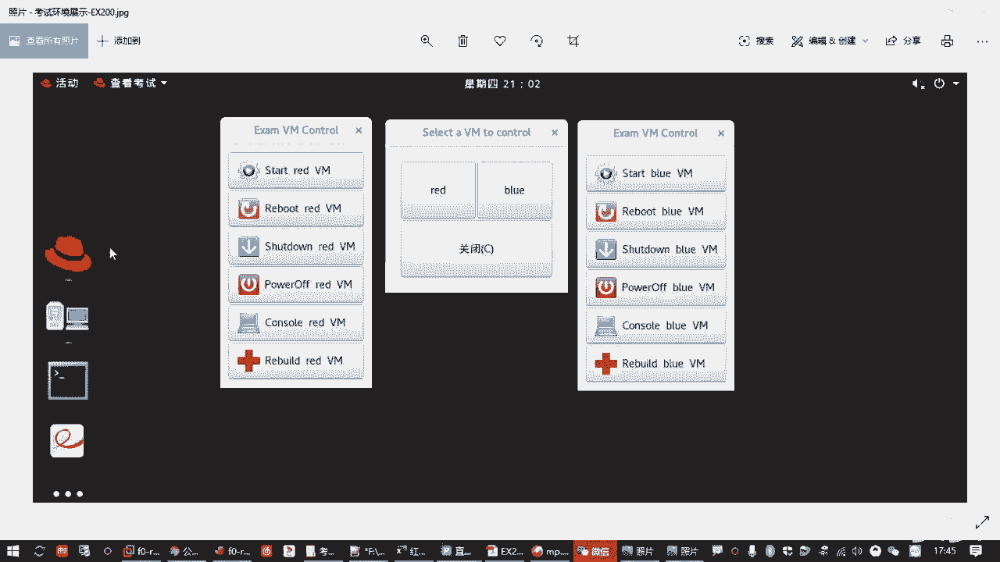

进入这个桌面后，你需要使用三个核心图标来完成所有考试操作。

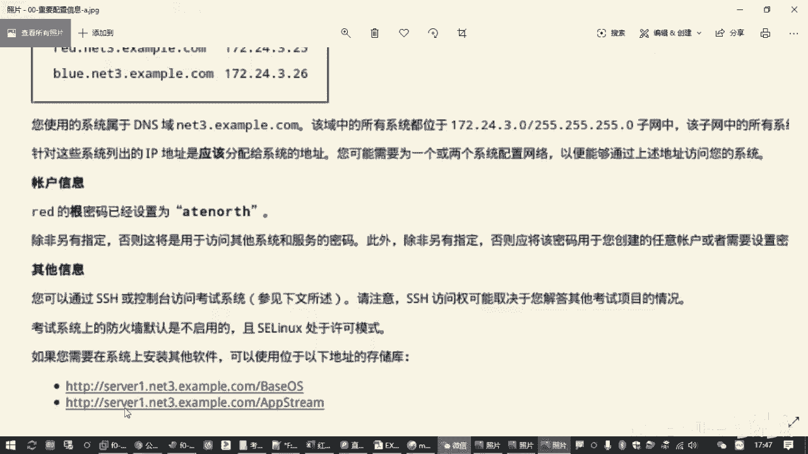

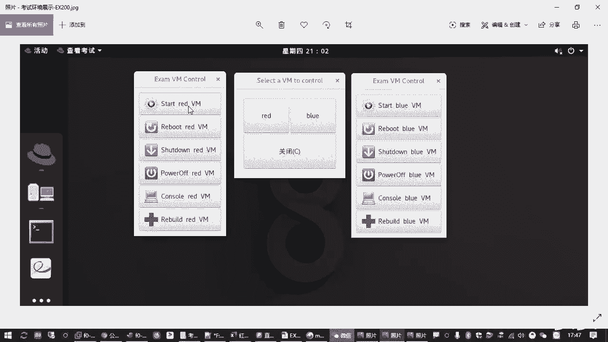

以下是三个核心图标及其功能：
*   **红帽图标**：点击后查看详细的考试要求和题目。
*   **虚拟机控制器图标**：位于红帽图标下方，用于控制考试中使用的虚拟机（如开机、关机、重启）。
*   **终端图标**：用于打开命令行终端。

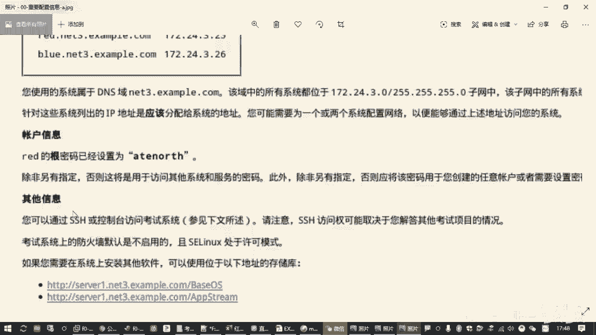

在物理机环境中，你以普通用户身份登录，没有管理员权限。所有与考试相关的配置和操作都必须在指定的虚拟机中完成。

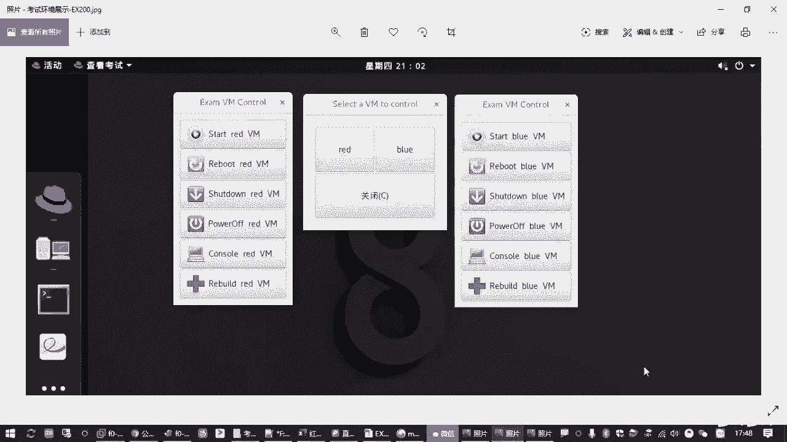

## 考试虚拟机与题目分布 💻

RHCSA考试部分需要操作两台虚拟机。

以下是两台虚拟机的典型分工：
*   **第一台虚拟机**：通常完成一系列相对基础的题目。
*   **第二台虚拟机**：通常完成与磁盘分区、破解root密码等相关的题目。

**重要提示**：考试时虚拟机的名称（如 `red`, `blue`）、IP地址、用户名和密码都可能发生变化，请务必以考试题目中给出的信息为准。

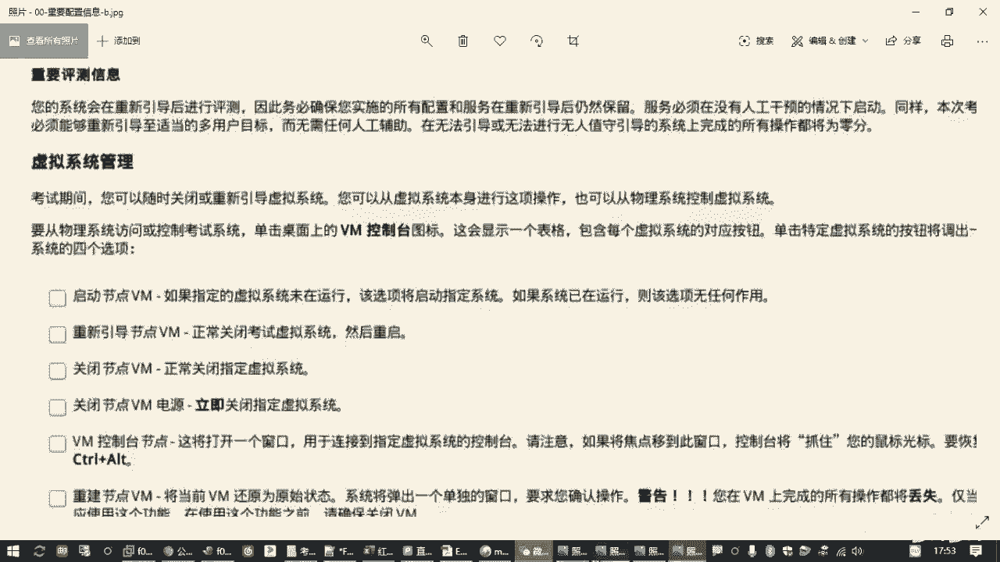

## 重要配置信息解读 📋

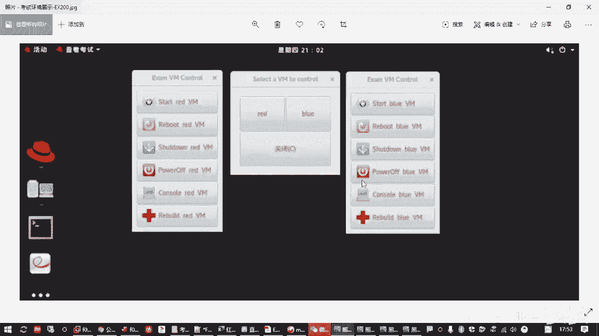

点击桌面上的红帽图标后，会打开一个浏览器页面，其中包含“重要配置信息”部分，这是你答题的基石。

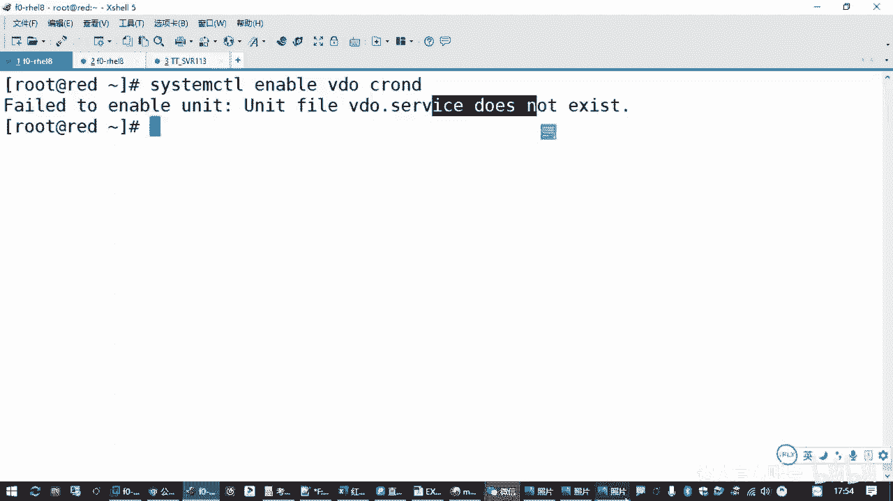

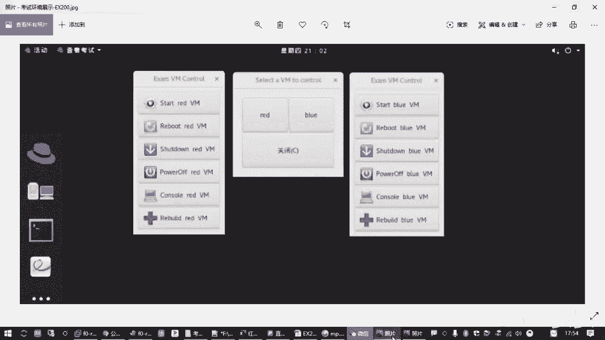

该页面通常包含以下关键信息，你需要仔细阅读并理解。

以下是“重要配置信息”包含的核心内容：
*   **虚拟机列表**：明确列出考试中会用到的虚拟机的主机名和IP地址。
*   **网络区域**：说明你的主机属于哪个网络区域。
*   **管理员密码**：提供虚拟机的root密码（考试时密码会不同）。
*   **访问方式**：说明可以通过SSH或控制台访问考试系统。
*   **防火墙与SELinux状态**：告知默认状态，但需根据题目要求调整。
*   **软件源地址**：提供安装软件包所需的YUM仓库地址。

**强烈建议使用SSH方式连接虚拟机**，因为通过控制台（Console）界面无法进行复制粘贴操作，而SSH可以方便地从题目中复制命令、路径等信息。

## 考试流程与答题策略 📝

了解了环境后，我们来看看具体的答题流程和策略。考试题目会明确指示每道题需要在哪台虚拟机（如 `red` 或 `blue`）上完成，务必仔细核对，避免做错机器。

对于有一定风险的操作（如分区、破解密码），建议先完成，以防后期时间紧张导致系统无法恢复。

所有服务配置完成后，必须确保其能在系统重启后依然生效。这意味着你需要将服务设置为开机自启，并正确配置持久化挂载等。

以下是确保配置持久化的关键操作：
*   使用 `systemctl enable <服务名>` 启用服务自启。
*   在 `/etc/fstab` 中配置挂载时，对于VDO卷等特殊设备，需添加 `,netdev` 或 `_netdev` 挂载选项。
*   对于SELinux相关配置，确保修改了正确的策略文件。

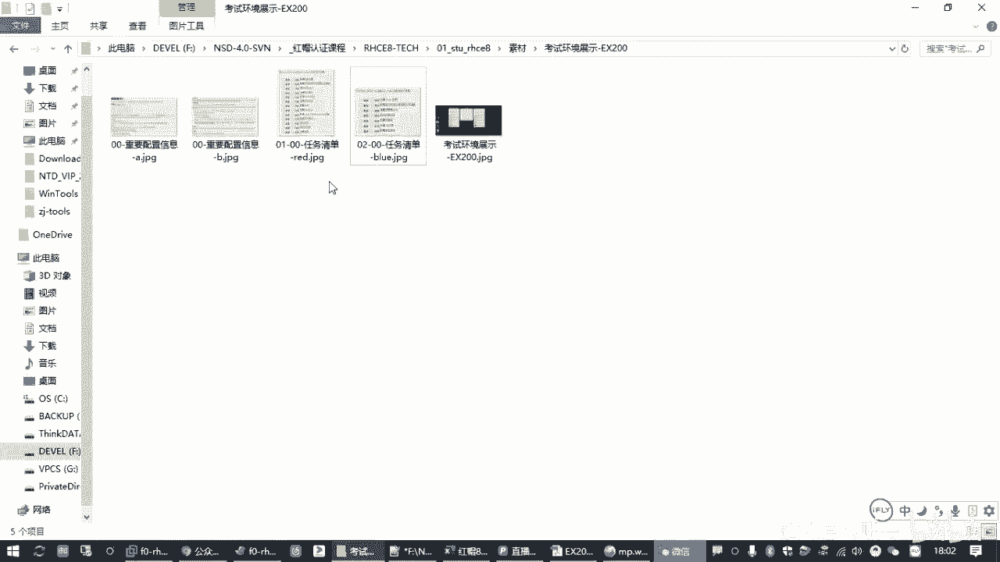

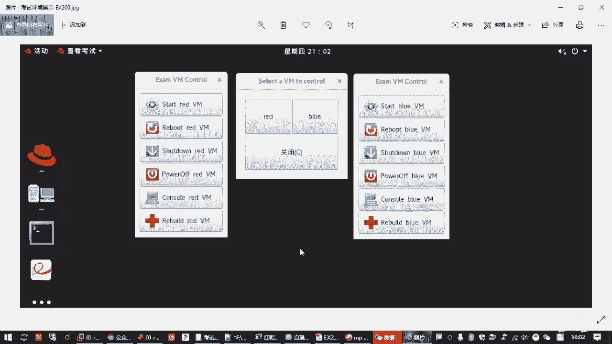

## 交卷前的检查与注意事项 ✅

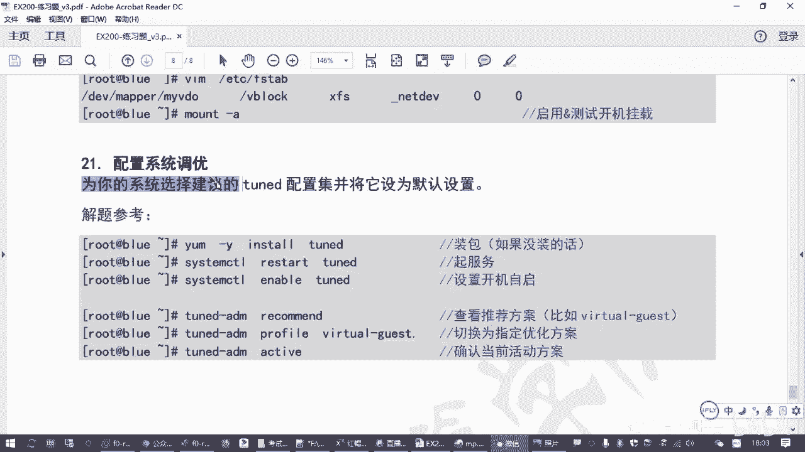

完成所有题目后，强烈建议执行以下检查流程，这是保证成绩有效的关键一步。

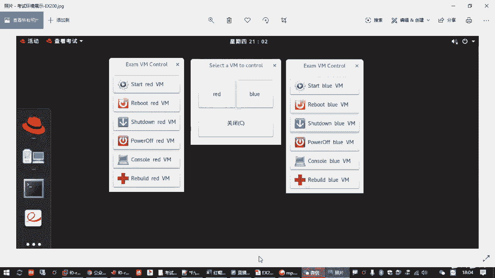

以下是交卷前的标准检查流程：
1.  通过虚拟机控制器，手动将两台虚拟机关机（`Power Off`）。
2.  再将两台虚拟机开机。
3.  通过SSH重新连接到虚拟机，逐一核对每道题目的要求是否仍然满足。
4.  确认无误后，方可示意考官交卷。

**考场纪律**：
*   考试期间，身份证需放在座位前，只能携带一支笔，考场会提供草稿纸。
*   交卷后，草稿纸不得带出考场，否则成绩可能作废。
*   严禁携带手机、资料等物品，严禁任何形式的作弊。
*   考试结束后，不得与其他考生讨论考题，红帽对此有严格的保密要求，违规可能导致禁考。

## 模拟考试与成绩查询 🔍

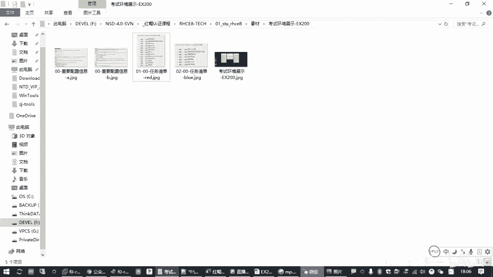

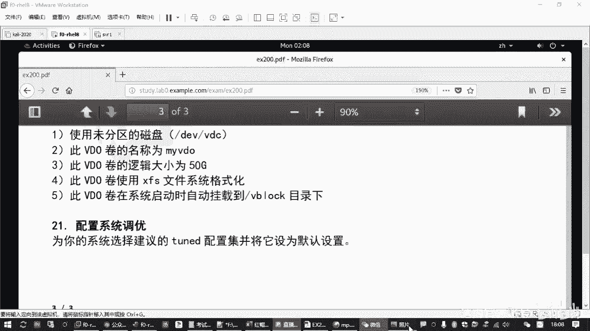

为了帮助你更好地备考，可以使用模拟考试脚本进行自测。

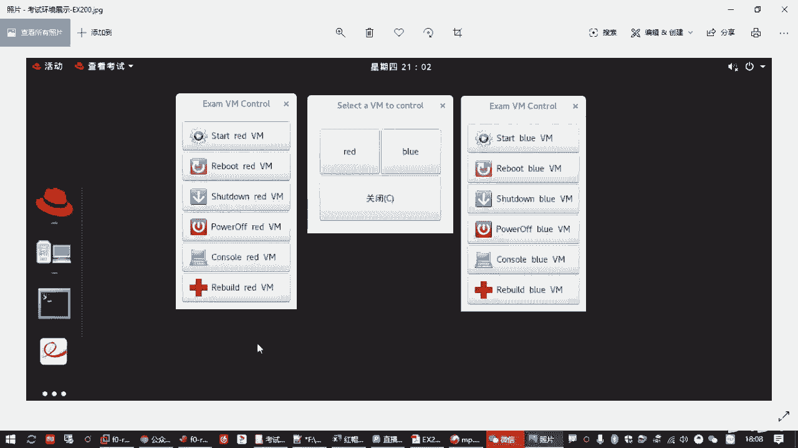

在提供的练习环境中，有一个名为 `RHT-lab-check-8` 的压缩包。将其上传到虚拟机并解压后，在root目录下会得到 `RHTcheck-CE` 和 `RHTcheck-CSA` 脚本。

执行 `RHTcheck-CSA` 脚本可以自动检查你的答题结果。脚本的反馈结果具有很高的参考价值。理想情况是连续多次练习，都能在1小时内完成且所有题目检查结果为绿色对勾。

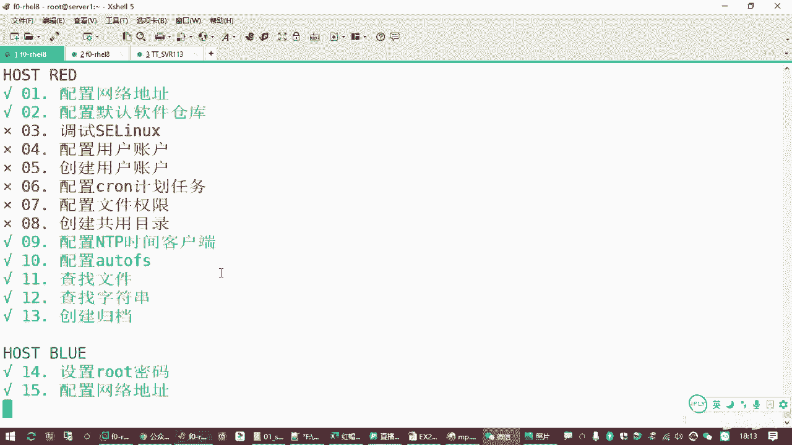

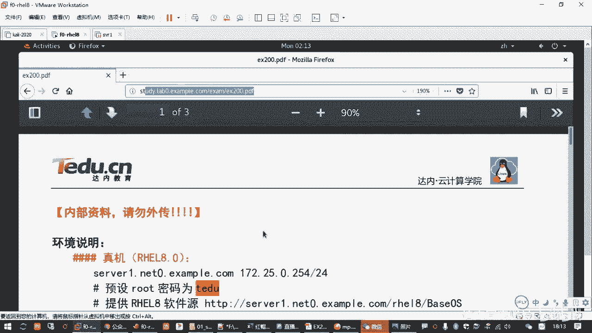

考试成绩通常在考试结束后的三个工作日内，通过邮件发送。

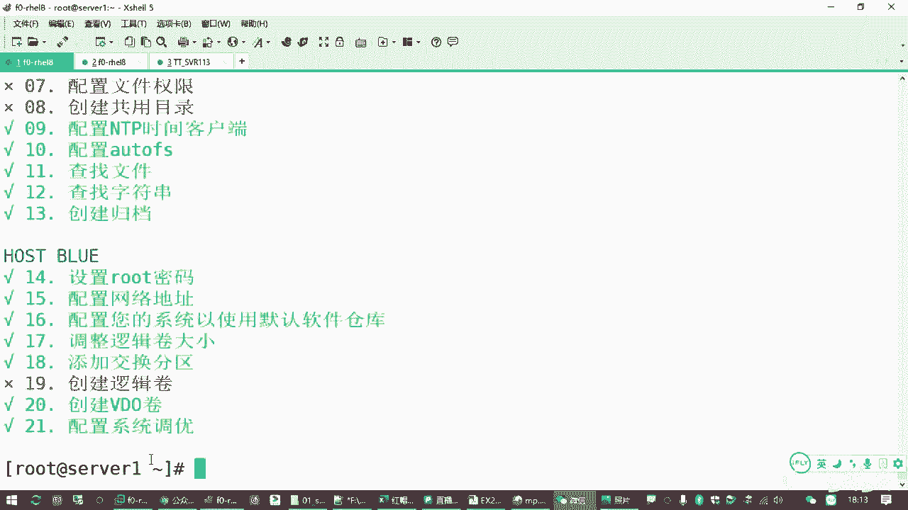

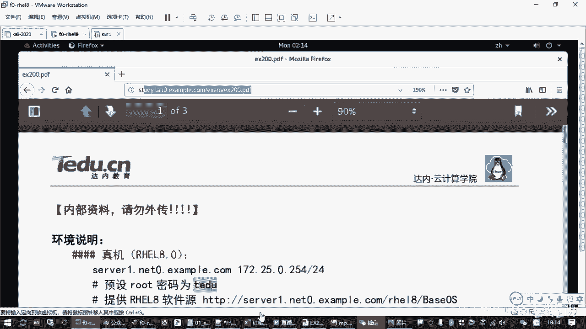

---

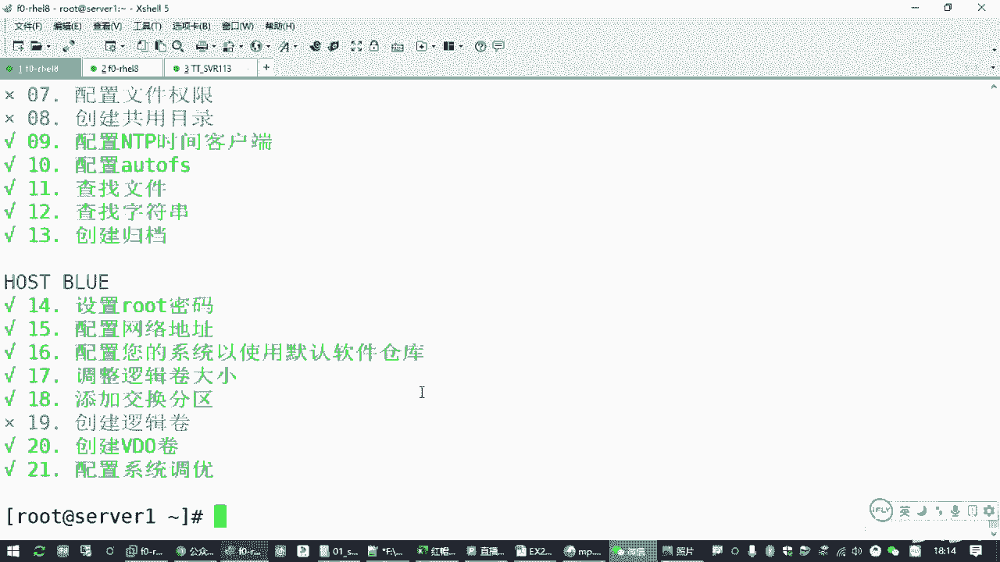

本节课中我们一起学习了RHCSA考试的完整环境、操作流程和核心应试策略。关键点包括：熟悉考试界面三图标、仔细阅读重要配置信息、使用SSH连接虚拟机、确保配置重启后持久化、以及交卷前进行完整重启检查。通过充分的模拟练习，你将能自信、从容地应对考试。祝你考试顺利！