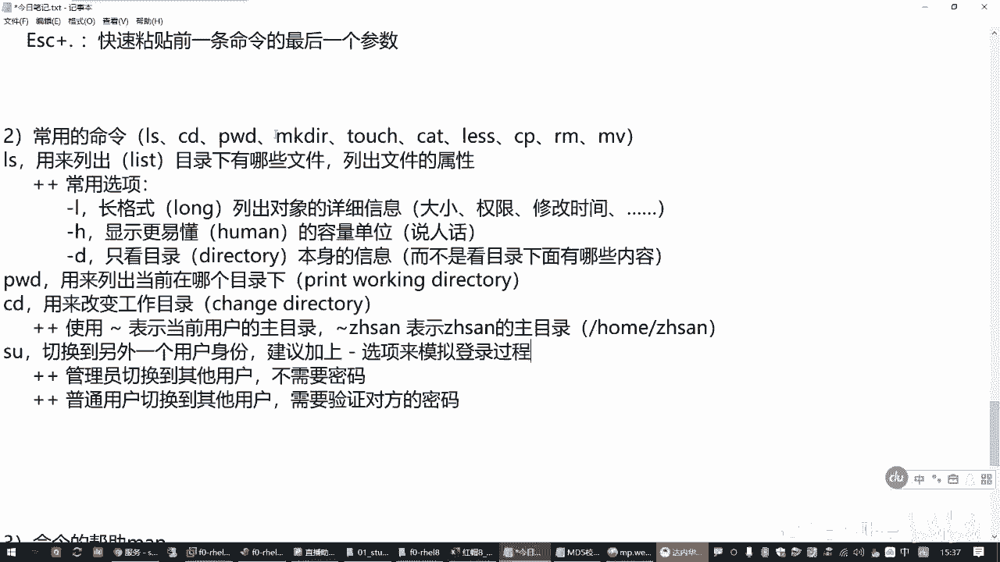
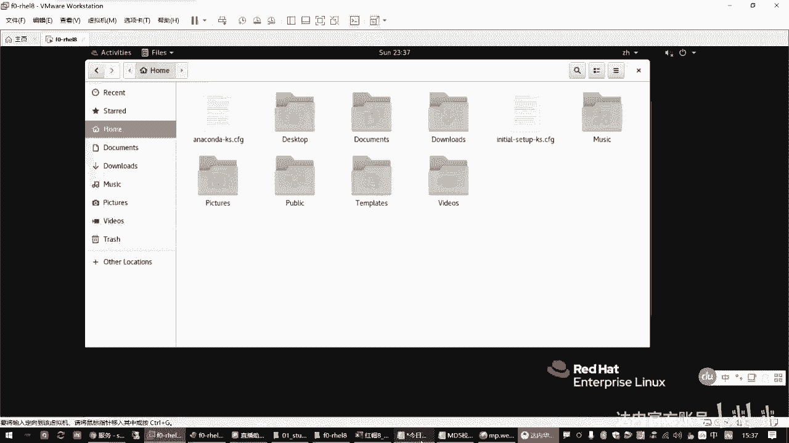
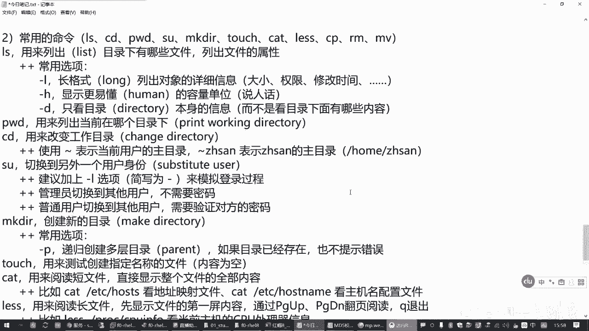
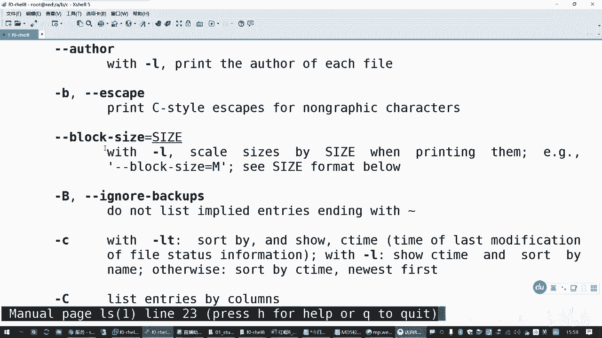
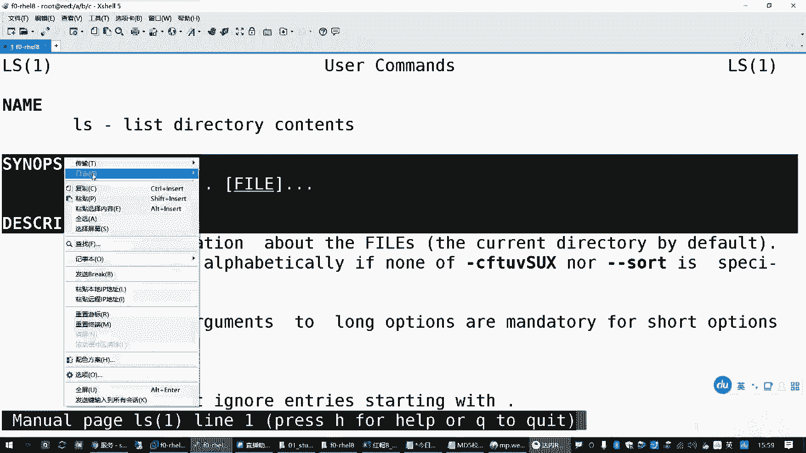
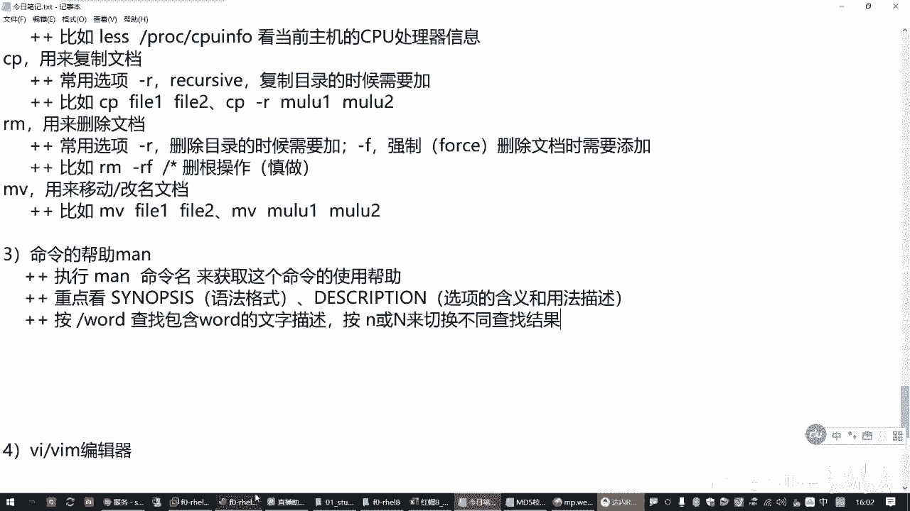
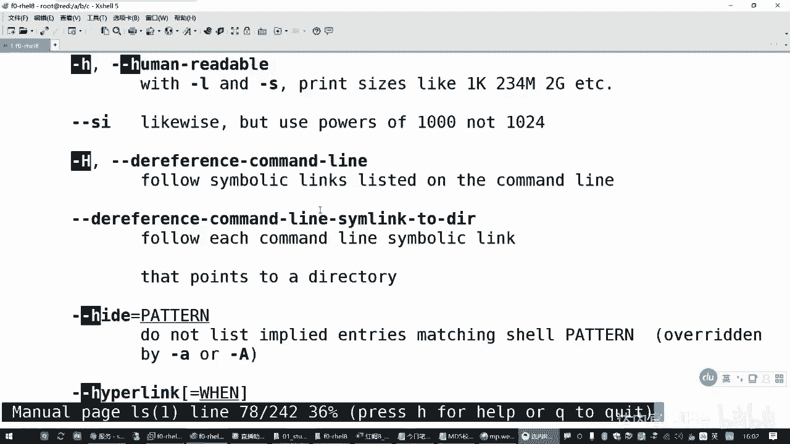
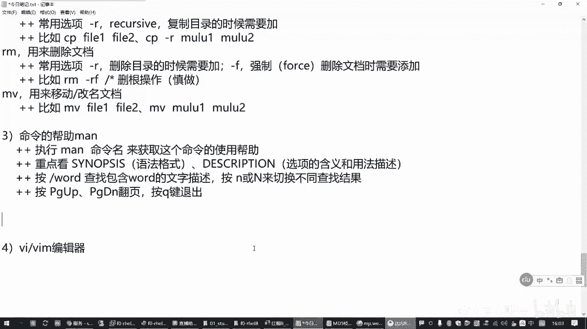

# Linux入门：1.02：文档管理常用命令 📂

在本节课中，我们将要学习Linux系统中用于文档管理的一系列基础且核心的命令。这些命令是操作Linux文件系统的基石，掌握它们对于后续的学习至关重要。

上一节我们介绍了Linux命令行的一些基本概念和目录结构，本节中我们来看看如何具体地查看、创建、移动和删除文件与目录。

---

## 常用命令概览

以下是Linux文档管理中最常用的一组命令，我们将逐一进行讲解。

### 1. 目录探索三剑客

这三个命令通常被合称为“目录探索三剑客”，用于在文件系统中导航和查看。

*   **`pwd`**：打印当前工作目录。
    *   **作用**：显示你当前所在的目录路径。
    *   **示例**：`pwd`
*   **`ls`**：列出目录内容。
    *   **作用**：显示指定目录下的文件和子目录。
    *   **常用选项**：
        *   `-l`：以长格式显示详细信息（权限、所有者、大小、修改时间等）。
        *   `-h`：与 `-l` 结合使用，以更易读的单位（如K, M, G）显示文件大小。
        *   `-d`：仅显示目录本身的信息，而不是其内容。
    *   **示例**：`ls -lh /boot`
*   **`cd`**：改变当前工作目录。
    *   **作用**：切换到指定的目录。
    *   **特殊用法**：
        *   `cd` 或 `cd ~`：返回当前用户的家目录。
        *   `cd -`：返回上一个所在的目录。
        *   `cd ..`：返回上一级目录。
    *   **示例**：`cd /usr/bin`

### 2. 创建目录与文件

以下是用于创建新目录和文件的命令。

*   **`mkdir`**：创建新目录。
    *   **作用**：建立新的目录。
    *   **常用选项**：`-p`：递归创建多层目录。如果父目录不存在，则一并创建。
    *   **示例**：`mkdir -p /a/b/c` 会创建 `/a`、`/a/b`、`/a/b/c` 整个目录链。
*   **`touch`**：创建空文件或更新文件时间戳。
    *   **作用**：主要用于快速创建指定名称的空文件，常用于测试。
    *   **示例**：`touch file1.txt file2.txt`

### 3. 查看文件内容

根据文件长度，可以选择不同的命令来查看内容。

*   **`cat`**：连接文件并打印到标准输出。
    *   **作用**：适合查看内容较短的文本文件，会一次性显示全部内容。
    *   **示例**：`cat /etc/hostname`
*   **`less`**：分页显示文件内容。
    *   **作用**：适合查看内容较长的文本文件。进入后可以上下翻页浏览，按 `q` 键退出。
    *   **常用操作**：
        *   空格键：向下翻一页。
        *   `PageUp`/`PageDown`：上下翻页。
        *   `/关键词`：在文件中搜索。
        *   `q`：退出。
    *   **示例**：`less /proc/cpuinfo`

### 4. 复制、移动与删除

这是对文件进行操作的三个核心命令。

*   **`cp`**：复制文件或目录。
    *   **作用**：将源文件或目录复制到目标位置。
    *   **常用选项**：`-r`：递归复制，用于复制目录及其内部所有内容。
    *   **示例**：
        *   复制文件：`cp file1.txt file1_backup.txt`
        *   复制目录：`cp -r dir1/ dir2/`
*   **`mv`**：移动或重命名文件或目录。
    *   **作用**：将文件或目录移动到新位置。如果在同一目录下操作，效果就是重命名。
    *   **示例**：
        *   移动文件：`mv file1.txt /tmp/`
        *   重命名文件：`mv oldname.txt newname.txt`
*   **`rm`**：删除文件或目录。
    *   **作用**：移除文件或目录。
    *   **常用选项**：
        *   `-r`：递归删除，用于删除目录及其内部所有内容。
        *   `-f`：强制删除，不进行确认提示。
    *   **警告**：`rm -rf /` 命令极其危险，会强制删除根目录下的所有文件，导致系统崩溃，切勿在真实环境中尝试！
    *   **示例**：`rm -f file1.txt`

### 5. 切换用户与获取帮助

这两个命令在管理和学习时非常有用。

*   **`su`**：切换用户身份。
    *   **作用**：临时切换到另一个用户的身份执行操作。
    *   **常用选项**：`-` 或 `-l`：模拟完整登录过程，加载目标用户的环境变量。
    *   **示例**：`su - username` 切换到指定用户。
*   **`man`**：查看命令手册。
    *   **作用**：获取指定命令的详细使用说明、选项和参数信息。
    *   **使用方法**：在手册页内，可以按 `/关键词` 搜索，按 `n` 查找下一个，按 `q` 退出。
    *   **示例**：`man ls` 查看 `ls` 命令的完整手册。

---

## 命令帮助阅读技巧

当使用 `man` 命令查看手册时，应重点关注两个部分：
1.  **SYNOPSIS（语法概要）**：这部分说明了命令的基本格式，如 `命令 [选项]... [参数]...`。
2.  **DESCRIPTION（描述）**：这部分详细解释了命令的功能以及每个选项的具体含义。

---

本节课中我们一起学习了Linux文档管理的基础命令，包括如何查看目录(`pwd`, `ls`, `cd`)、创建目录和文件(`mkdir`, `touch`)、查看文件内容(`cat`, `less`)、以及复制(`cp`)、移动(`mv`)和删除(`rm`)文件。此外，还了解了如何切换用户(`su`)和获取命令帮助(`man`)。这些是操作Linux系统必须掌握的核心技能，请务必多加练习以熟悉它们。