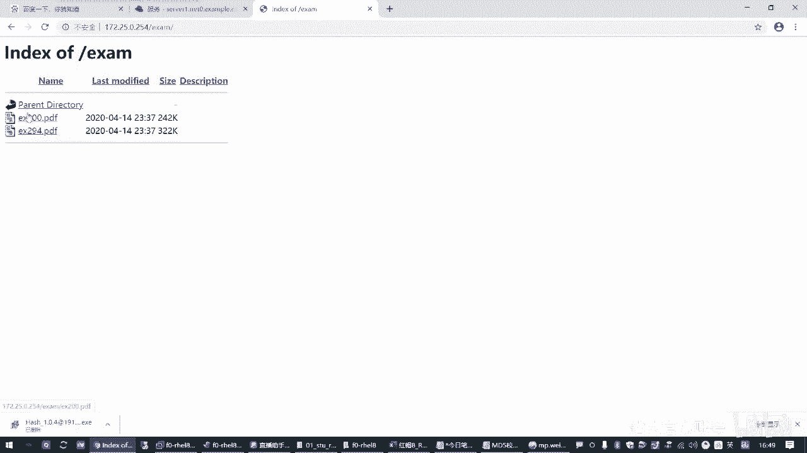
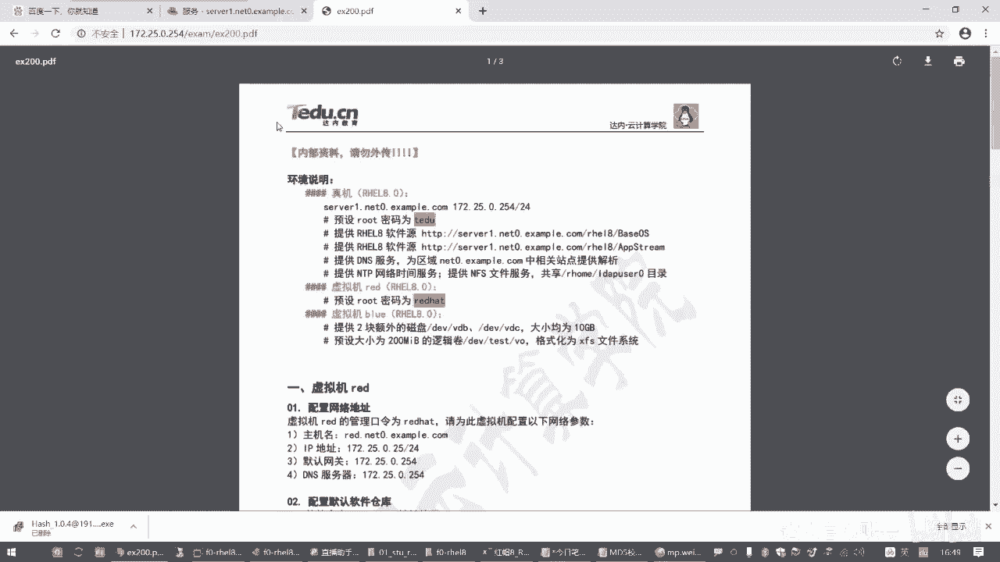
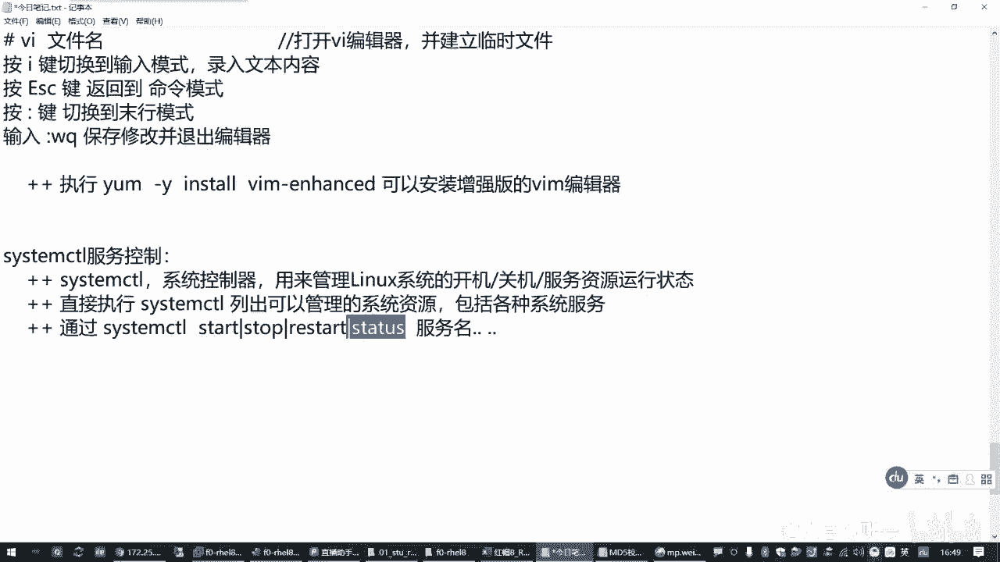
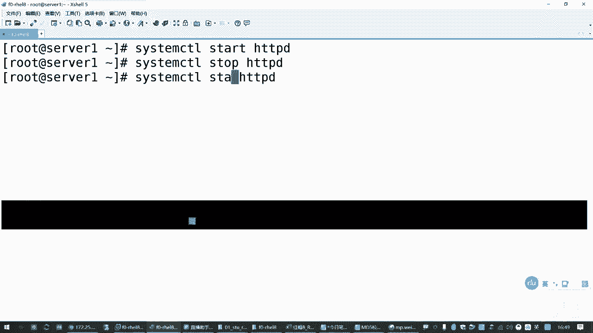
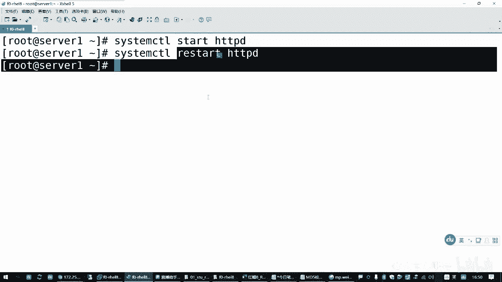
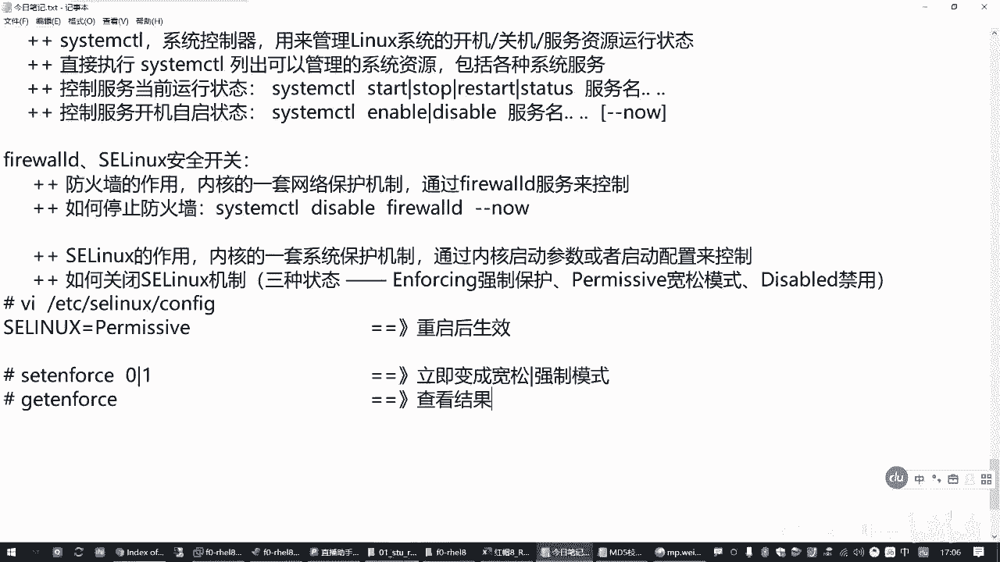
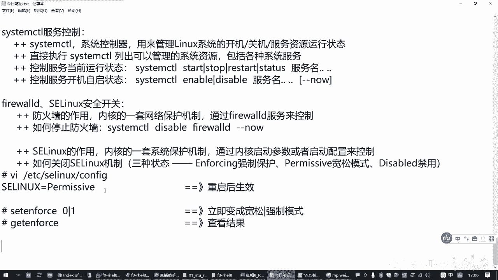
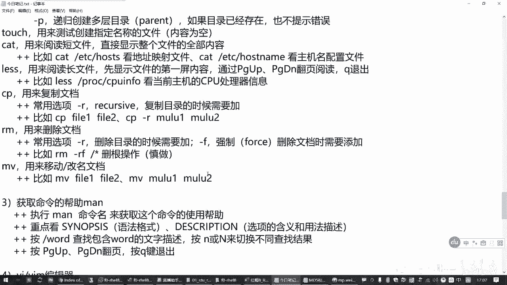
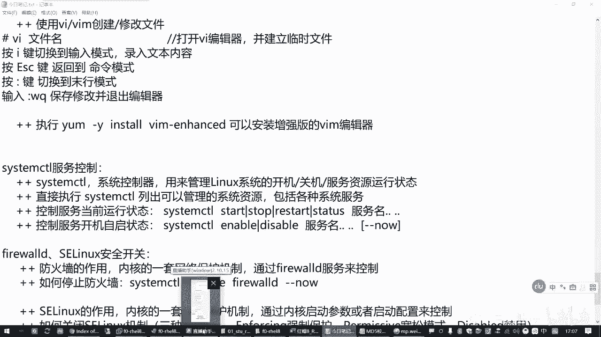

# Linux服务与安全：1.04：服务控制和安全开关 🔧

在本节课中，我们将学习Linux系统中两个重要的管理模块：服务控制和安全开关。服务控制主要使用 `systemctl` 工具来管理系统服务的运行状态。安全开关则涉及防火墙和SELinux，它们是保护系统安全的核心机制。我们将学习如何开启和关闭这些功能，为后续的深入学习打下基础。

## 服务控制：systemctl工具

上一节我们介绍了Linux的基础命令，本节中我们来看看如何管理系统服务。服务是计算机为提供特定功能（如网站、数据库）而运行的后台程序。在Linux中，我们使用 `systemctl` 工具来管理这些服务。

`systemctl` 是系统控制器，负责管理Linux操作系统的启动、关机以及各种系统服务的运行状态。





以下是 `systemctl` 命令的基本用法：





*   **列出可管理的资源**：执行 `systemctl` 命令可以列出当前系统能够管理的所有资源，包括各种系统服务。
*   **启动服务**：使用 `systemctl start <服务名>` 命令可以启动一个服务。
*   **停止服务**：使用 `systemctl stop <服务名>` 命令可以停止一个服务。
*   **重启服务**：使用 `systemctl restart <服务名>` 命令可以重启一个服务。此操作会先停止再启动服务，可能造成服务短暂中断。
*   **查看服务状态**：使用 `systemctl status <服务名>` 命令可以查看服务的当前运行状态（如是否活跃）。
*   **设置开机自启**：使用 `systemctl enable <服务名>` 命令可以让服务在系统启动时自动运行。
*   **禁止开机自启**：使用 `systemctl disable <服务名>` 命令可以禁止服务在系统启动时自动运行。
*   **启用并立即启动服务**：使用 `systemctl enable --now <服务名>` 命令可以同时设置服务开机自启并立即启动它。



例如，要启动一个名为 `httpd` 的Web服务器服务，可以执行：
```bash
systemctl start httpd
```
要查看其状态，可以执行：
```bash
systemctl status httpd
```

## 安全开关：防火墙与SELinux

学会了服务控制后，我们来看看系统安全相关的两个重要开关：防火墙和SELinux。它们都是内核级别的安全机制，但在初学阶段，我们可以先学习如何简单地开启或关闭它们。

### 防火墙 (firewalld)

防火墙（`firewalld`）是一套网络保护机制，用于控制进出系统的网络流量，防御外部攻击。它本身也是一个系统服务。

以下是控制防火墙状态的方法：

*   **关闭防火墙**：要关闭防火墙，需要停止其服务并禁止它开机自启。可以使用命令 `systemctl disable --now firewalld`。
*   **开启防火墙**：相应地，使用 `systemctl enable --now firewalld` 可以开启防火墙并设置开机自启。

在初学阶段，为了避免复杂的网络策略干扰实验，可以暂时关闭防火墙。

### SELinux

SELinux（安全增强式Linux）是另一套内核级别的强制访问控制安全机制，它比传统权限控制更为严格，主要保护操作系统本身。它不通过服务管理，而是通过内核参数和配置文件控制。

SELinux有三种运行模式：

1.  **`enforcing`**：**强制模式**。策略规则完全生效，违反规则的操作将被阻止并记录。
2.  **`permissive`**：**宽容模式**。策略规则生效，但违反规则的操作只会被记录而不会被阻止。常用于故障排查。
3.  **`disabled`**：**禁用模式**。完全关闭SELinux功能。

以下是控制SELinux状态的方法：

*   **永久修改模式**：编辑配置文件 `/etc/selinux/config`，修改 `SELINUX=` 后面的值为 `enforcing`、`permissive` 或 `disabled`。**此修改需要重启系统才能生效**。
*   **临时切换模式（仅限前两种）**：使用 `setenforce` 命令可以在 `enforcing` (1) 和 `permissive` (0) 之间临时切换，无需重启。例如，`setenforce 0` 可立即切换到宽容模式。
*   **查看当前模式**：使用 `getenforce` 命令可以查看SELinux的当前运行模式。




例如，要将SELinux临时设置为宽容模式，可以执行：
```bash
setenforce 0
```








## 总结


本节课中我们一起学习了Linux系统管理和安全的基础知识。我们掌握了使用 `systemctl` 工具来控制服务的启动、停止、重启和开机自启状态。同时，我们也了解了防火墙 (`firewalld`) 和SELinux这两个核心安全机制的基本概念，并学会了如何开启和关闭它们。这些是后续进行系统配置、服务部署和安全策略调整的重要基础操作。