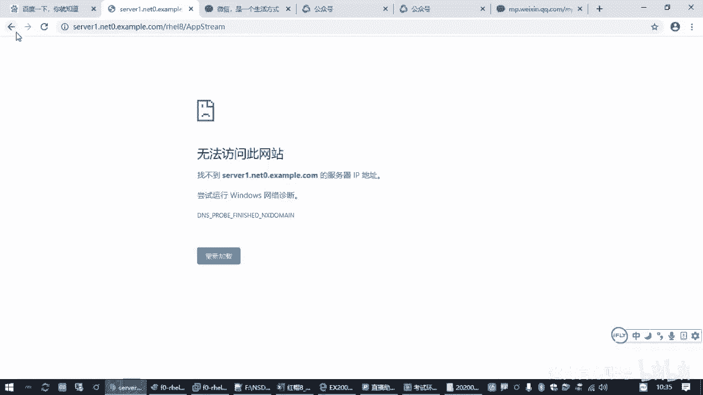
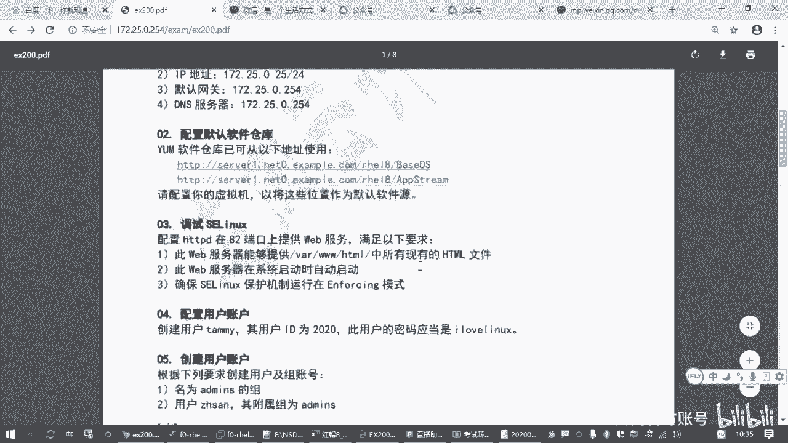
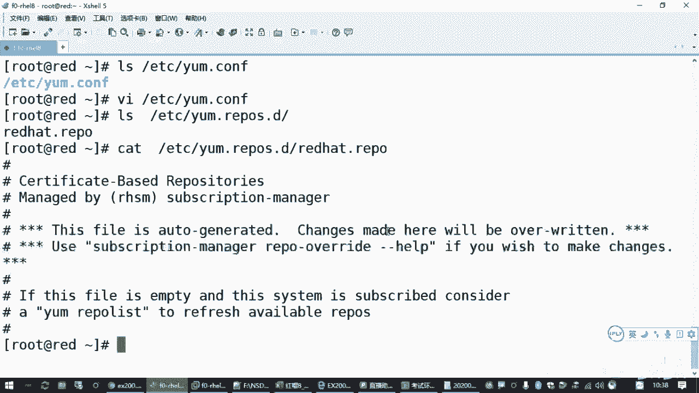
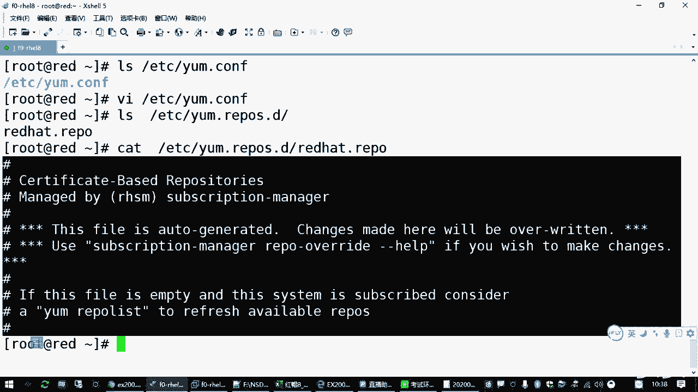
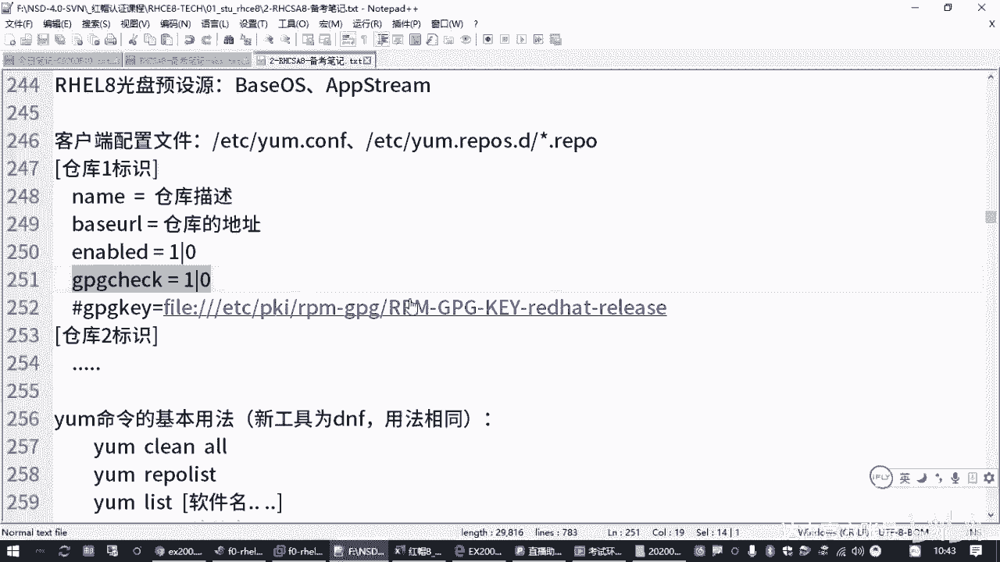
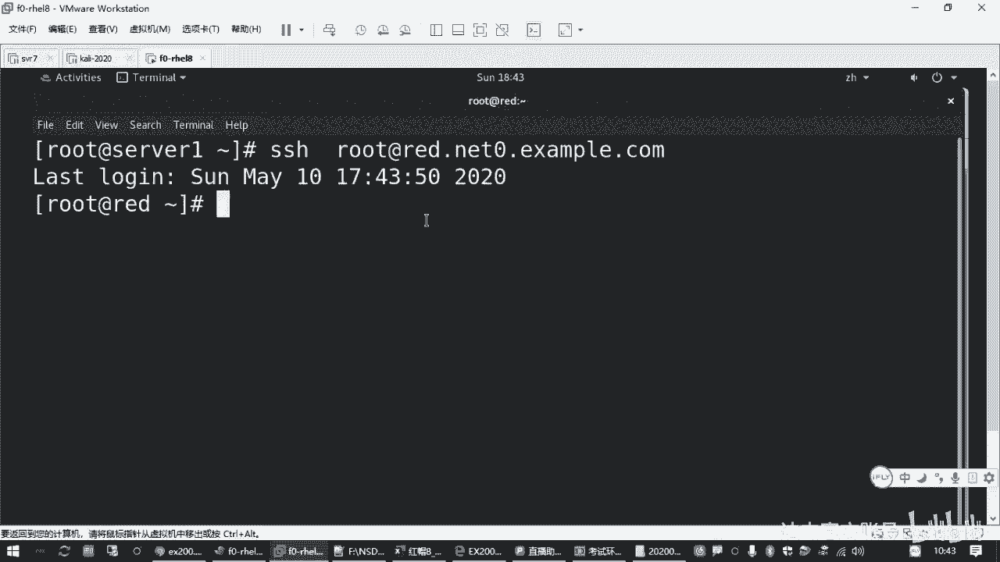
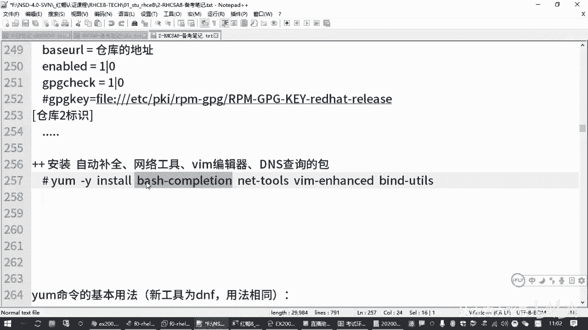

# Linux系统管理：2.02：配置YUM源 📦


在本节课中，我们将学习如何在红帽系Linux系统中配置YUM软件源。软件源是系统安装和更新软件包的来源，正确配置它是进行后续软件管理的基础。我们将从理解YUM的工作原理开始，逐步完成配置。

## 理解YUM与软件源

上一节我们介绍了网络配置，本节中我们来看看如何配置软件源。在Linux系统中，安装软件包通常需要一个“软件仓库”作为来源，这被称为软件源。对于红帽系统，管理软件包的核心工具是YUM（Yellowdog Updater, Modified）。从红帽8开始，系统默认使用其下一代工具DNF，但YUM命令依然兼容可用。



无论是使用`yum`还是`dnf`命令，系统都需要知道从哪里获取软件包。如果未配置源，执行安装命令时会收到类似 `There are no enabled repos` 的错误提示。



## YUM的配置文件

YUM的行为主要由其配置文件控制。我们需要了解两个关键位置：

1.  **全局配置文件**：`/etc/yum.conf`
    *   此文件控制YUM命令的全局行为，例如是否进行软件包签名校验（GPG check）。
2.  **仓库源配置文件目录**：`/etc/yum.repos.d/`
    *   此目录下存放着具体的软件仓库定义文件，文件扩展名必须是 `.repo`。管理员可以在此创建多个文件来定义不同的软件源。





系统可能已存在一个 `redhat.repo` 文件，但通常其内容被注释（以 `#` 开头），因此并未生效。我们需要创建自己的 `.repo` 文件。

## 创建仓库配置文件

以下是创建一个有效仓库配置文件所需的核心格式和选项：

一个仓库配置块以方括号 `[]` 开始，其中包含仓库的唯一标识（ID）。每个仓库可以包含以下关键设置：

*   **`[repository_id]`**：仓库的唯一标识，不能重复。
*   **`name=Some description`**：仓库的描述信息，便于识别。
*   **`baseurl=URL_to_repository`**：软件仓库的实际访问地址，这是最核心的配置项。
*   **`enabled=1`**：设置为1启用此仓库；设置为0则禁用。此选项可省略，默认为启用。
*   **`gpgcheck=1`**：设置为1启用GPG签名校验，确保软件包来源可信；设置为0则禁用。为了简化操作（尤其在考试环境中），通常设置为0。若启用，则需配合 `gpgkey=` 指定密钥地址。





## 实战：配置考试要求的YUM源

现在，我们根据题目要求，配置两个软件源。假设题目提供的地址是：
1.  `http://content.example.com/rhel8.2/x86_64/dvd/BaseOS`
2.  `http://content.example.com/rhel8.2/x86_64/dvd/AppStream`

以下是配置步骤：

1.  进入仓库配置目录并创建新的 `.repo` 文件（例如 `local.repo`）。
    ```bash
    cd /etc/yum.repos.d/
    vim local.repo
    ```
2.  按 `i` 键进入编辑模式，写入第一个仓库的配置。
    ```ini
    [BaseOS]
    name=BaseOS Repository
    baseurl=http://content.example.com/rhel8.2/x86_64/dvd/BaseOS
    gpgcheck=0
    ```
3.  接着，配置第二个仓库。
    ```ini
    [AppStream]
    name=AppStream Repository
    baseurl=http://content.example.com/rhel8.2/x86_64/dvd/AppStream
    gpgcheck=0
    ```
4.  按 `ESC` 键退出编辑模式，输入 `:wq` 保存并退出VIM编辑器。

## 验证与测试配置

配置完成后，必须验证其是否生效。

1.  **列出可用仓库**：执行以下命令，检查配置的仓库是否被正确识别。
    ```bash
    yum repolist
    ```
    如果配置正确，你将看到 `BaseOS` 和 `AppStream` 两个仓库及其描述信息。

2.  **安装测试软件包**：使用新配置的源安装几个常用软件包，这是一举多得的测试。
    ```bash
    yum -y install bash-completion net-tools bind-utils vim-enhanced
    ```
    *   `bash-completion`：提供命令自动补全功能。
    *   `net-tools`：提供 `ifconfig`、`netstat` 等传统网络工具命令。
    *   `bind-utils`：提供 `nslookup`、`host` 等DNS查询工具。
    *   `vim-enhanced`：提供功能更强的VIM编辑器。

    观察安装过程，若无报错且成功完成，则证明YUM源配置成功。安装 `bash-completion` 后，需要重新登录终端或开启新的Shell会话，自动补全功能才会生效。

## 课程总结



本节课中我们一起学习了YUM软件源的配置。我们首先理解了软件源的作用和YUM工具的基本概念，然后学习了其配置文件的结构与核心配置项。通过实战，我们逐步完成了创建仓库配置文件、填入题目要求的源地址、以及最终验证配置是否成功的全过程。正确配置YUM源是后续所有软件包管理操作的基础，请务必掌握。