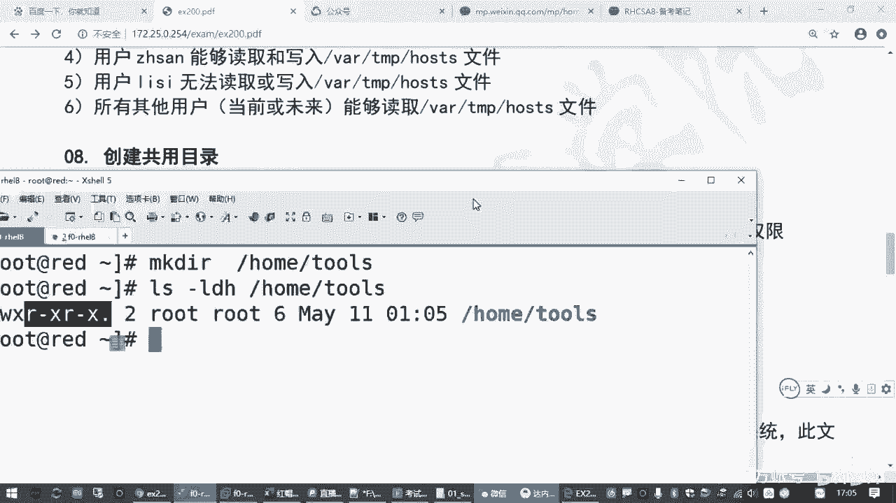

# 全新红帽认证／Linux云计算架构师／RHCE／RHCSA必备课_可零基础入门的教程 - P13：2.08-附加权限 - 达内教育 - BV19U4y1b7qQ

来，咱们接着来哈。😊，呃，然后大家你听咱们这几天课应该有有有所感觉哈。😊，我们讲的时间都挺长，但练习的时候呢，你发现这个题目哎就那么一两条两三条命令是吧？😊，呃，所以呢呃可能咱们原来有经验的同学啊。

你可能觉得这个呃讲的有点慢啊，但是没有经验的同学呢，你可能讲的时间挺长。那如果大家原来没有接触过linux的同学啊啊建议大家呢你回头好好看这个回放的视频，然后把这些相关的点再琢磨琢磨啊。呃。

因为中间我给大家讲这个知识点的时候呢，也做了很多的演示，对吧？大家把这个知识给吃透了。嗯，然后你在考试的时候，你哪怕考试题目有一点变化，你也不怕啊，OK吧。😊，呃，因为你如果只是考试的话。

那其实太太简单了。你哪怕背也背下这几条命令啊。啊，刚刚我跟他讲了快快快4040多分钟是吧？那结构答题就这么几条啊。😊，但是大家把这个关系搞明白了啊，其实你任何其他的那些呃点啊，这个权限呀、归属呀。

怎么变都无所谓啊，你换文件啊都都行嘛。😊，那刚才我们说过的。呃，文件权限和归属。呃，那刚才我们讲那个，特别是讲那个访控制列表的时候啊，它解决的是什么问题啊？解决的是我们。

文档的归属，它分类只分了用户组和其他人只分的这三类吧。所以这三类分的太笼统了是吧？所以不够用嘛，不够用，于是呢出了一个访问控制列表。对不对？是这个样子的啊，然后呢，那除了这种体制机制以外。

我们在看我们这个文档权限的标记的时候。嗯。哎，我们再看一下啊。LS杠LDH。我们刚才说你注意一下，我们说归属类别不够，然后加了一种访问控制列表，你会发现后边这个点是不变成了加号了啊。

这就说明这个文档它用额外的访问控制列表啊。所以大家用这个get FSL，你去看的时候，哎，你能看到不一样是吧？除了用户组其他人以外，还会多了个别的用户或者个别的组。😊。

啊，那除了这种操作以外。😡，现在是针对归属的啊，归属分类太笼统，所以加了访问控制列表。那我权限是不是也要分的太笼统了？只有读写执行，我有没有别的一些特殊的权限啊啊，答案是有的啊。因为在另一个系统里边。

你控制这个文档的访问的方式。然后我们说RWX就是就是在控制访问方式嘛。

就在决定你这个用户对这个文件能做什么样的一个操作嘛，是吧？你看我们说RWX虽然都叫R，但对目录和对文件它能做的操作是不是不一样的，含义不一样。那除了这些以外呢，那还有一些其他的特殊的权限啊。

还有一些特殊的权限。那特殊的权限有这么几种啊，来了解一下啊，这个笔记里写的比较多啊，所以我不能给你一个一个敲。😊，那有一种特殊权限，什么意思呢？😊，它可以让我们的一个程序文件。

如果这个程序文件是属于张三的那你是在用张三的这个文件的时候，也能够拿到张三的权限。就是我家的钥匙，我给你，你是不是就可以开我家的房子了，对吧？有点类似于这个。😊，啊，然后咱们古时候那个皇帝。

皇帝那买了一把宝剑，上面刻皇帝的那个印章，刻个标记上去说这就是上方宝剑。那别人拿到这这把上方宝剑，是不是就具有皇帝的一部分权利了？哎，那我们linux系统里边有一些程序，它也需要有这样的一个。

特殊的能力。那这个时候呢，我们有个有一个叫附加权限，这种特殊的附加权限啊，叫什么呢？叫sett UID啊，叫ett UID。它的一个特点就是因为它没地方表示了啊。那我们刚才讲过了这个。

表示权限的标记从左到右不是9个标记吗？都已经代满了。那你说你这个文件要让用这个文件的人有别的权限要怎么办啊？没地方加了就加到这个地方。😡，加入RWX，我让这个X变得不一样啊，变成啥呢？变成一个S。

就刚才我们说的，它可以把这个XV变成一个小写的S。

他就具有了一个特殊权限。这是可以扩展我们一个程序的一个功能啊。

举个例子，这个不考啊，一会另外第二种权限要考啊。呃这个特殊权限呢我给大家说一下什么意思啊。😊，比方说如果你是普通用户。我现在是李四。他是不可以去改自己的密码？😊，password。

你可以执行password，然后先输入你原来的密码。然后再根据提示输新的密码。对吧。😡，She。输入两次密码，如果正确，输入密码就改对了。那李四他为啥能改自己的密码呀？😡，有些同学说。

那为啥不能改自己密码，本来不就应该能改吗？哎，我告诉你，实际上不是的。😡，来我们检查一下，我开始给大家讲过。😊，用户账号的密码是不是存在一定C下的s里边？这个文件你看一下李四有权限吗？没有吧。😡。

你看路他自己都没权限是吧？😡，那李四他凭什么能有权限改密码了呢？因为他改过的密码要存到这个文件里面去的呀。😡，所以普通用户他是改不了的。😡，那为什么普通用户用pass word能改啊？

这是因为pass word这个程序。他就是一把上榜宝剑啊。那，我们来看一下。password程序呢？在这个地方，你看一下pass word这个命令程序的权限是什么样子，你会发现唉这个颜色都不一样，是吧？

你看它的权限，这个password这个命令属于root用户root组，但是海X位变成了一个S。啊，啥意思啊？就普通用户用这个程序的时候，他能够具有这一块对应的用户的权限啊，这叫具有。执行权限啊。

具有 rootot用户的可执行权限，对吧？那他获得了管理员的一部分能力，就好像皇帝把一把上方宝剑给一个一个大臣一样，说你拿到这把上方宝剑，除了不能杀皇帝是吧？你其他的人都可以杀。对吧斩各种贪官啊。

那为啥你为什么你有这个权限？因为管理员给了你这个权限。😡，因为管理员这个宝剑上有皇帝的标记。对吧所以这个叫S。要加到这个地方，那我们怎么加呢？那很简单啊，大家刚刚不学过吗？轻易墨的。😡。

你要给一个程序加S权限，就是U加S就完了。好，用户的权限加一个特殊标记。后面跟上user be passssword。当然这是默认的情况啊，系统里面默认有一个这个程序，有这个权限。😊，对吧这个好理解吧。

😡，那刚才说我们能验能不能验证一下，你把这个S去掉，我普通用户是不是就不能改密码，这好说嘛，是吧？咱们就把它的S去掉。😡，U减S，你看看这个。是不是变成了一个普通的可执行程序了？limux系统里面。

你LS看的时候，如果是个绿色的，就是一个普通的文件啊。你有X权限，也是一个普通的X权限。😊，那这个普通的程序它不能改我们的校载文件。然后不能改下毒文件。但没有权限，除非你管理员自己自己用。

那你你四去用来再来试一下。😡，输入他现在的密码。对吧再输新的密码。回收再输新的密码。你再看他能改成功吗？😡，不一样吧，你看上面那个改的是successfully啊，叫成功的。现在你改的时候是操作失败啊。

操作错误不行吧。😊。

这就是特殊权限的含义。啊，这个权限一般要慎用。你如果给1个VIM编辑器，给他1个SV，那么任何普通用户都能够使用VIM编辑器改你系统里的任何文件啊。所以这个权限咱们不考啊不考，因为是系统有特殊用途的。

但是我通过这个例子呢，是希望大家能理解这种特殊的标记权限。是可以通过修改这个文档的特殊的位置，把它改一下来实现的。那另令个系统里边呢有三种特殊标记。

刚才我们讲的是第一种。啊，叫附加到用户的那个X位上，叫set uID它的作用就是让用这个程序的人能够拿到这个程序的所有者的一部分权限。那如果我把这个权限不标记到用户这里，标记到主的这里边有什么权限。

有什么能力呢？😡。

那这个权限一般不标志不标记在程序文件上。

如果你是改组的XV，把它改成S，这个权限叫st GID。如果你要标记到程序上也行，那类类似的啊和色的UID是类似的。但是如果你把seGID标记到目录上。😡，那么它有个特殊的很神奇的功能。

如果这个目录属于。那个。比如麦当劳组是吧？如果这个目录属于麦当劳组，你给他加一个色tGID，那么在个这个目录下增加的任何的文件自动属于麦当劳组。😊，啊，就具有这样一个能力。所以。

使普通的目录的主的权限能够往下继承。就好像我们有家房子，那个房子是我的。那你把你的手机放在这个房子里边，你不管了那个那你的手那个手机就是我的对吧？具备这样一种能力。😡，当然这个能力你要标记一下。😡。

你不标记的话，你不能你带个手机进了一下我的屋子，你手机就归我了，那谁也说不过去啊，是吧？你管理员管管理员呢要声明一下啊，怎么声明呢？你只要给目录添加一个X权限就可以了。😊，啊，不是添加一个st权限啊。

就把原来的普通的X变成一个特殊的权限。

怎么操作呢？那就轻期末的G加S嘛，刚才我们讲的是又加S是吧？那就G加S，那就可以了啊，那就可以了。😡。

那这个有一道题目，就是咱们的创建共用目录啊，创建共用目录。那这个题目的话呢，来我们来看一下。😊，比方说home tos。是吧要创建一个目录，这个组的所有权要属于ad means。

然后这个目录呢要被ad means组的成员读取写入访问，不又来设权限了。最后这一条在这个目录下创建的文件，组的所有权自动属于ad means组。那这一条就得通过刚刚我们给大家讲过的这个stGID来完成。

来，我们看例子。She。

先看需求是吧，你要创建目录吧，这个没跑是吧？😡，对不对？你要创建一个这个目录啊，所以呢我们。来看一下make的DR创建一个目录吧，home下的tos。然后呢然后呢，这个目录你创建完成之后。

LS看一下它的权限，你管理原件的吧，属于路台用户，属于路ot组。

然后默认权限是这个样子的，来后你看他要怎么调整权限。😡。

来看一下，对照一下。呃，能被add means组的成员读取，要属于addmin组吧，是吧？

来先把它的归属改一下。要改吧是吧，你不改不行吗，chanown冒号ad means组啊，这个组是之前用户用户管理那道题做的啊，改成属于这个组。然后刚刚这个目录改完之后LS再确认一下。

现在属于ad means这个组。😊，啊，然后这个组的成员呢要能读能写，能访问，默认呢不能写入吧，你是吧给他加W权限。😡，然后除了录ot以外，其他的用户。😡，没有读没有写，没有访问权限吧。😡，对不对？

那你什么权限都没有啊，那你其他人的这三个权限要去掉。😡，没没事吧，还要去的。😊。

然后呢，那我们先把这两个搞定第二条啊。😊，亲金墨的。同组的人是不是要加上WG加W？你如果你懒得去验证原来的权限，那就是同组的人等于或者加都行啊。RWX。是不是这意思啊，能读能写能访问嘛。

然后其他人什么权限都不能有吧。😡，去掉RWX。再跟上这根目录。权限是不是应该是这个样子的？这样的话呢，add means组的用户才能读能显成访问吧。其他人除了管理员以外啊。管理员例外啊，这是特殊用户啊。

其他人不能读，不能写，不能执行。搞定了吧。然后第三条。这个目录下创建的文件要自动属于ad means组。那如果你不设置的话，它没有这个能力啊。比方说你管理员去home to这个目录下边呢去创建一个文件。

啊，叫root1点TMD。这个文件属于谁呢？来我们看一下属于谁呀，你管理员建的当然是属于管理员呢，谁建的属于谁呀，是吧，不符合题目要求吧。😊，题目要求你创建的文件呢，自动属于ad means这个组啊。

你现在看还是属于root组。对吧那如果希望他能够具备这个能力怎么办？😡，你要把这个home tools这个目录，这个X权限要加成S。怎么加呢？去期末的G加S啊，然后跟上这个目录。

让这个目录具备这种特殊的能力。你再来看。是不是RWX变成了RWS。你加完这个之后，是不是真的就有这个神奇的功能呢？咱们再他取一个文件。啊，用它起去创建一个文件。嗯，他行命令呢其实就是创建空文件的意思啊。

本身的意思呢就是摸一把就摸一下那个文件在不在。哎，这这个文件如果没在，自动创建这个文件啊。😊，来touchroot2点TXT。对吧然后我们再去看。😊，这个文件root2这个文件啊。能能看到吧？😊。

属于at means这个组啊，那么这个题就搞定了。OK吧，搞定了。那这是刚才我们给大家讲到的。创建公用目录。那这个题目的话呢呃其实刚才我们讲了几个操作啊，来整理一下。从前面的。给你处理一下。

我们直接把这个目录删除，重新来一遍。对吧那答这个题的时候呢，第一个首首先是创建目录。从这个开始的吧。啊，然后第二个改归属关系。近지。owner是吧，这第二条命令。第三条命令改权限。😊。

我们刚才给他演示的时候，是不是做了这几个？😊，啊这个吧，改权限。第四条。我们是不是改了一个。单独为G加了一条。这个好像不能在这里直接写RWS。😡，你可以试一下，然我给你试一下。

直接写一个等于RWS行不行？啊，这样好行是吧？就你可以做这一条这一条这一条。可以吧，三个操作。三条命令啊。创建目录，然后呢。改权限，然后改归属。下到命令码。确认一下结果就知道了哈。😊，你看还不对。

还不对，那还是得4条命令啊，就这4条命令。😊。

是吧。他这个大S不行啊，大S相当于没有X权限啊，不行，你还得分着来啊，建议大家分着来。😊。

所以这个S是在X的基础之上再加了一个S啊。

OK吧。那这是刚刚共用目录这个题目。

呃，然后关于权限这一块的话呢，有一个叫数字标记啊，八进制的数字标记。这个呢咱们考试的时候你不会也没关系。因为有些同学是刚接触lininux没多长时间。那如果大家已经会这个二进制标志呃，八进制标志的话呢。

可能你做题目更容易。但这个不太好理解啊，我在这里给大家说一下啊。😊。

说一下啥意思呢？就是我们说这个数字的标记啊。

其实说实话就是管理员偷懒啊，就管理员偷懒。就比方说我们在设置一个目录的权限的时候。你看像这种权限，我们要把它改一个权限，是不是有9个标记都要做呀？😊，把，用户的权限、组的权限，其他人的权限都改着麻烦嘛。

所以呢呃然后我们lininux机制里面有一种表示方式。就是我们把这个R用八进制的数字4来表示啊，W呢用八进制的数二来表示X用一来表示，所以RWX就是421。然后针对用户的权限。比方说所有的所有者的权限。

我们把它三个数可以加到一块。从左到右421，然后所属主的权限也是421是吧？然后other的权限也是421。那如果你有这个权限呢，这个数字就加上。如果没有这个权限，那就是0。😊，那你像这种的。啊。

RW减。是不是相当于4加2那X权限没有怎么加0啊，那这一块就变成6。中间这个权项呢叫R杠杠，只有读权项，那就是只加一个4。那其他什么权限都没有，那0加0加0嘛，这样的话呢简写的方法就是640。😡。

对吧就是640同样的，如果是这种方式，那RWX三个都加起来，就是4加2加1，就是7。那4嗯R杠X，那就4加0加1就是5。所以这种标记呢就可以用三个数字来表示755。对吧1755。

所以你像刚才我们说的这种权限，你要把它纠正的话，其实用权限表表示表示啊，用那个数值数字的方式表示，其实就是千阶末的。这个RWX。是不是就是7呀？然后同组的add means用户是不是也要有权限啊。

是不是也应该是RWX啊，也是7。然后最后阿的什么权限都没有，是不是一个零啊，对吧？你得表示成这样子。然后后面再跟上这个目录。这是表示基本权限就是这个样子的。啊，但是呢这个S我们刚才是不是没动，对吧？

那这个特殊权限是不是能也不能不能引用数字表示啊啊，答案是能啊。那刚才我们表示的是。基本权限啊就三种归属的基本权限是用这种三种数字表示。现在但是这个这个表示方式呢，你没有影响到这个S啊，没有影响到这个S。

所以如果你。😊，直接用数字表示呢，这个S你表示表示不上去，那要表示上去怎么办？😡，特殊的权限。刚才我们讲过两个。

共用的呃创建共用目录色tUID也是4GIDL啊。那怎么表示呢？要在刚刚这三个数字的基础之上，在前边。加一个数啊。第一个数，如果你想去掉这个权限。啊，你这个也去不了是吧，增加可以啊，减没减去。

我给你还原一下。先来一个G减S是吧？那它默认的权限呢是这个样子的。对吧那其实呢你要增加特殊权限，现在是没有的是吧？你要加到哪呢？要加到这三个数之前啊。怎么加呢？如果你要加到这个地方。

用户的这个XV要写个4。如果你要加的是这个位置，你要把它变成一个2。如果你要同时加呢，要写个6，对吧？这种方式去加，所以你要设置一个G加S，就是2770啊。你看加上了吧，对吧？你设一个这样的啊。😊，啊。

对吧？这是用数字表示啊，这不好理解啊，特别是初学的同学，就对这个地方呢就很难琢磨啊。😊，呃，然后刚才我们讲共用权限的时候。😊，还有个地方。我们不是讲了两组吗？

stUID还有一个stGID另外还有一个年制位嗯，年质位这一块的话呢。😊，这叫粘制味啊，什么叫年制味啊？就跟吃口香糖。那个口香糖那个嚼完之后，那个粘在你手上甩不掉一样的啊，那它可以拖住一个特殊权限。

让别人不能轻松的去用，拖住啥呢？比方说他可以附到一个目录的阿的X位上。把它变成一个T啊，英文单词叫ty啊，就这些爱碍手碍脚的，黏手撵脚的啊，就拖后腿的。怎么个拖后腿呢？

它可以让一个用户即使对这个目录有W权限。写助权限吗？用户如果对一个目录有写入权限，那么他可以改这个目录的内容是吧？什么叫改目录的内容？它可以删除目录底下的东西。删除目录底下东西就是改目录的内容。

改目录内容的一种嘛。但是如果你这个目录有替权限，他就不能删啊，啥意思啊？举个例子，这个咱也不考啊，再我跟你说一下，补充一下。

比方说咱们系统里头有个特殊的目录。根下的天MB。哎，这个目录现在没有那个权限了。什么都没有了，那现在不用了吗？啊，都没有了啊，我举个例子吧是吧？😊，那以前呢是TMB这个目录，它原来是所有人都能写的啊。

看错了。应该加个D是吧？这个看目录本身啊，有有有别给你误导了，就看这个目录本身啊，刚刚忘了加了个D啊，来加上。那TMP这个目录是不是所有人都能读，能写能执行啊？😊。

那么普通用户都能去这个目录下面去创建子目录，创建新的文件，他也能去这个目录下面去删除别人的东西。那这不是乱套了吗？你管理员刚跑一个程序里面建了一个临时文件，哎，张三跑过来，吧唧一下，把它给删了，不行吧。

所以虽然我给你公开这个权限，但是我要有序的去管理。啊，因此呢加了一个什么，加了一个T。所以你管理员。在TMB下面建一个文件，点TXT来写一个root。点data。那么你张删你是删不掉的啊，李四也删不掉。

你想去删除TMB下面的root这个文件。被拒绝了吧。但是。如果你把这个T去掉试试。哈哈如果你把这个T权限去掉，怎么去呢？亲寂末的。😊，other减T。TMP。再看。没有了吧。那现在失去这一层保护。

这个秩序就乱了啊。你看分分钟你是就把录制这个文件给干掉了。对吧这很危险吧。所以但凡lininux系统的TMP这些目录一般都会给它添加上。这个年质位权限意思就是说我管理员给你普通用户。

能让他在这个TMB下边有写入权限，但是你只能写你自己的文件。你写删root的文件不行啊。但是呢你可以去自己创建你的文件都没问题。你自己的文件你可以删，但是别人的文件你别想啊。😡。

嗯，这给大家补充了一个年质费。因为它都都是属于一类的啊，你看这叫附加权限，附加在哪？

就附加在一个文件或者目录的用户的XV或者主载XV或者阿着的XV。来实现一些特殊的功能。

咱们上午的考试就考下载GID。让这个目录的主权限能够往下继承。

OK吧。来，大家把我们的这个题做一下啊。

