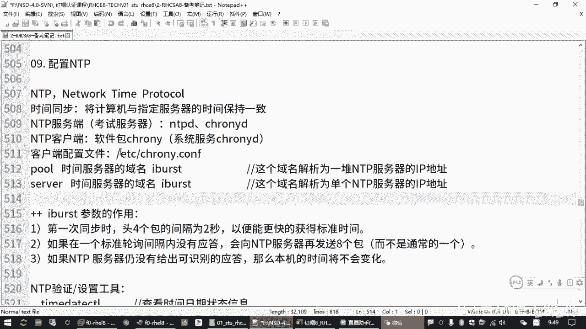

# 全新红帽认证／Linux云计算架构师／RHCE／RHCSA必备课_可零基础入门的教程 - P15：3.01-NTP时间同步 - 达内教育 - BV19U4y1b7qQ

Yeah。就是在咱们那个练习练习环境里面啊，大家可以访问我们的。呃，stuy点lab0点一个ja点com是吧？然后一个jam啊，你打开这个可以看到我们那个练习题，还记得吧？那打开之后呢。

会不会有个EX200啊。

你看到是这样的嘛，是吧？里边有个EX200是我们那个上午的练习题目。

那打开之后呢嗯再看根据这些题目，我们去练习就好了啊。呃，那上次前两次课我们分别是给大家讲了我们的。红帽八操作系统的一些基本环境啊，包括我们的一些基础命令。

那上一周的时候呢，我们讲过了。前面的这些部分吧是吧，就针对我们那个red这台主机。呃，应该是讲了我们的软件仓库配置啊，slinux调试啊，用户账号管理是吧，计划任务权限。

啊，等等等等啊。那今天呢我们继续往后看呗。啊，来啊然后有一道题目呢是。

配置NTP时间客户端啊。也到这个题目，那这道题目的话呢，它总共。

等大家考试的时候，你会发现他总共其实就一句话。呃，要求在你的虚拟机上去做相关的一个配置，让它成为我们serv一这台主机的NTB的一个客户端。啊，正式考试的时候呢啊这个域名可能会换啊。

反正呢大概意思就是说它会给你一个域名啊，这个域名呢是一台NTB服务器，它要配置你的系统，作为这台NTB服务器的一个客户端。对吧所以你要答这个题的话呢。大家要大概理解我们NTB是个什么东西。呃。

然后我们的客户端怎么去配置啊，把这个理解了，那这个题其实就很容易啊。

呃，那我们讲的NTP的话呢，呃其实它指的是叫nettwork time protocol啊，叫网络时间协议。呃，通俗一点说呢，就是通过这个协议，我们可以把一个标准的时间推送给一堆计算机。

那其中呢提供标准时间的这台机器叫NTB服务器端。然后使用这个标准时间的那些客户机呢，那就是NTB的客户端。对吧就这个。呃，那其中呢。我们通常说NTB把它叫做时间同步。

那指的就是说我们一堆机器都要和你提供时间的那台服务器的时间保持一致。啊，咱们有很多同学是工作过的啊，可能之前用过一个做时间同步的服务，叫NTPD对吧？啊，那其实从我们红包期开始啊。嗯。

他就换了一个服务啊，就下面这个叫克lony，软件包也换了一下啊，叫克lony。那我们考试的这个点呢，其实是要让大家呢要知道crolling这个包。它的一个配置。啊，这个盘你装完之后呢。

对应的一个系统服务叫crun D。那那这个服务的话呢啊其实它既可以作为NTP的服务端，也可以作为我们的客户端啊。都是可以的啊。啊，当然咱们考试的时候，当刚刚大家也看到了是吧？

它是要求我们作为NTB的时间客户端。

啊，做服务端咱就不用管啊，就你只要知道你作为客户端怎么去找这台服务器来要标准时间。

然后你能确认结果不就好了嘛，是吧？😡，呃，那如果我们作为。NTB客户端的话啊，那基本的配置过程其实就是装包配置起服务啊，三个步骤。呃，而且大多数情况下。

这个包默认是装好的啊啊克loning这个包默认是装好的那如果没有装的话，你装一下不就完了吗？啊，很简单啊，那它的配置文件呢是在ETC底下，有个叫克lonning点CONF啊，有个这个。😊。

对吧那比方说我们考试的时候，啊，我把环境连一下。

那考试的时候呢，从我们的真肌SSH的方式啊。用root账号连接到我们的要求配置的那台讯机。呃，然后前面我们不是已经把那个样么什么都配好了吗，是吧？😊，然我们可以ym杠为inst。去安装可only。呃。

那这个包的话呢，在考试的时候，90%以上的可能性他是已经帮我们装好的啊。这跟那个计划任务有点类似，就系统它需要与这个包啊来确保这个时间同步啊，但是呢它找哪一个地方去同步呢？那个默认的时间。

那个源啊来源可能不是我们要的是吧？那肯定要改啊。😊，所以这第一步一般情况下我们不用做啊，但是大家要去确认啊，那万一他给你埋个坑房子是吧？Thank。好，这里他告诉我已经装好了是吧？😊，🎼啊。

那我们再来去改它的配置。那在改配置文件的时候呢，是VIM去找我们的啊ETC下面的clonning点CONF。好，改这个文件。这个文件打开之后呢，你可以发现它里面有很多现成的配置。呃。

基本上呢就在第三行左右吧，它有个时间服务器的一个。地址池啊地址池的一个配置。这个是我们装好包之后啊，它默认是指向呃NTP点ORG有这样一个网站，它里面有一堆啊有一个域名是吧？它给我们设置的是一个这个。

啊，这是就是说你如果不配，但是你这个机器呢如果能联网的话。他也可以找我们互联网里的这台服器去同步时间啊，但是实际是实际上使用的时候啊。你访问这个服务器不一定速度很快呀，是吧？😊，这是国外的一个网站。

那工作当中呢，我们可能要把它改成我们自己的服务器。那考试的时候呢啊他就要求我们把它改成15一这个吧，是吧？

啊，要改这个。

呃，所以其实我们要达到效果的话，最简单的一个做法。🎼我们只要把这个中间这个域名改成题目要求的这个域名就可以了。啊，就是从效果上来说啊，从效果上来说，你只需要把它改成题目要求的。

正确的那个NTP服务器的域名。其实能够达到效果啊，但是不是特别规范啊，为什么呢？呃，因为我们这个p这个设置。

啊，就给你写了是吧？是际。啊，没有，我给你加一下啊。就是我们在配置这个配置文件的时候，有两种写法啊，一种呢就用那个server来写，还有一种呢是用p啊，叫POOL是吧？这相当一个地址池。

那这个设置呢它是针对一堆服务器啊。给你解释一下是吧？其实也能用，呃，就是说po后边它这个时间服务器一般指的是一般我们都设置的是域名啊。这个也是域名写的更准确一点是吧？那这种情况呢，后面这个域名。

Yeah。在DNS服务器上，它会解析为一堆IP地址。这样的话呢，那我们的客户端你只需要用这一个域名就行啊。你后面那个时间服器，它换了无所谓，他只要换了个解析记录就行。你反正这个域名呢始终是可用的。

这种情况下呢，一般才推荐大家用破是吧？你像他默认的NTB官方提供的是吧？那一个域米呢，那好像有七八个服务器。呃，但是像我们考试这种情况，更规更规范的做法是建议大家用搜啊，这个会户更靠谱啊。

那这种情况适用于。这个域名。解析为单个IP地址。

这个是要加个叫NTP服务器的是吧？不楚。所这个地方区分一下啊区分一下。啊，两种情况啊两种情况，一般建议大家用下面这种啊，咱们考试的时候就一个服务器吧，这也就1个IP是吧？改成搜我就行啊。😊。

那大家如果你要增加一行啊。😡，增加一行搜我也是可以的。第是请大家把之前那个破那一行给注释掉。为啥？因为他连不上是吧？他按照顺序来连不上，他先找了个连不上的符性，他连不上的时候呢，他就没有办法去同步时间。

😊，对吧这个你要知道啊，所以要把它去改一下啊，这最好的。改完之后呢，我们保存退出。其实，配置NTP服务器就这一行。那中间有个ios的，建议大家保留啊，建议大家保留。呃，这个是起什么作用呢？

这个是我们在同步时间的时候，客户端。

其实就是我们这个y一会要起一个服务。这个服务呢它有一个叫ibo的这个参数，在找我们的在在找我们这个时间服务器的时候，有个叫ibos啊。

啊，它的一个作用呢是在第一次同步的时候。他头四个包。啊，有个间隔是吧？是2秒钟。然后呢啊为为啥呀？就是说我在找那个服务器，我一开始我要更快的找这个服务器去同步时间，看这个服务器能不能联系上是吧？

它会有一个这个轮群的一个间隔啊，这个了解一下就行啊。然后在指定的一个标准间隔里面，如果没有获得应答，它会快速的再发一对勾。啊，再发一堆包，那发这一堆包是为了啥？😡，Okay。

是为了找我们这个服务器确认它能联系上。那如果联系不上的话呢。他觉得你这个。时间没有必要同步是吧？它本机的时间不会做更改的啊。就起这个作用的啊。嗯，所以咱们考试的时候，你不是就是为了要快速看到效果嘛？

那这个时候呢。就大家加上这个。所以大家如果你考试的话，其实你就不用改嘛，你也不用删是吧，你留着就行啊，就是关于这个参数的一个解释啊。

嗯，那一旦保存啊，改完这个配置，保存好之后，我们就可以把这个服务给启动一下。啊，sixem control啊，然后你可以re start。或者来那个。enable是吧，可ic地。有个刚刚闹。

是吧你把这个服务给重启啊，并且呢把它设置成开机之后自动运行。基本上就做完了。啊，当然你做完之后呢，你要去检查结果吧。那检查结果的时候呢，这个方法有很多啊。😊，呃，有一个名字呢叫做time date。

🎼간춰。啊，time datectl。那主要看哪里呢？看我们的这个NTPservs，看它是否是活动的。对吧如果是活动的，说明这个服务运行正常。那另外一方面呢，你看当前这个系统的时间是否已经做过同步。

那现在是不是个no啊啊，这就是你服务启动完成之后呢，还没有做完第一次同步啊。那你看到的是no是吧，那这个甭管。啊，那如果你大家想看到这个时间同步的话呢，一般是建议大家把这个时间你改成一个错误的时间。

然后你重启一次服务以后就就归他管了。那如果你这个时间差别不大的话，它其实没有必要做同步是吧？你可能没有那么快就看到他告诉你已经同步过了，是吧？😡，他可能没有那么快啊。对吧你看这个地方可能是一直是弄。啊。

这是第一种方式啊，用time date controlt。那另外一种方式呢，就你可以用date，你就去改一个时间，改个错误的。然后你重启服务之后，你看看它能不能同步嘛，或者你不重启服务已经重启过了。

你可能要等一段时间啊，它才能同步。因为这个同步的间隔是由你那个服务来控制的。OK吧是吧？啊，那改时间呢在考试的时候一般就比较麻烦，一般就不建议大家改。你要改的话也可以啊，有个叫daate杠S。

我可以临时把当前系统的时间呢啊，比方说我们改成一个。过去的时间。那dta命令杠S这是设置啊，就是临时设置。当前的系统时间是2002年2月2号。啊，那如果你想看一下当前时间设置多少呢，就敲一个date。

对吧然后你等一段时间之后，发现这个时间变成正常的2020年是不是就对了。那你服务启动过之后，你现在看没那么快啊，我们再试一下。重启一下服务，看看能不能快一点。服务的名字叫canonlyD啊，可only。

啊，一样，你把这个服务重新启动完成之后呢，可能也要等一小会是吧？啊，然后你再看时间是不是变成20200了，是吧？哎，这个也能验证你这个时间服务器好使。😊，那另外啊考试的时候呢，有时候你看这些方式啊。

改时间再来去验证呢，麻烦是吧？还有一个呢，你刚刚用那个time date去看。也是一种方式，这是刚刚我们讲的第一种嘛。如果你系统同步过时间，这里面是有一个yes。让你时间差别比较大，重启完服务。

它做过同步，这就会是一个yes啊。但是这个考试的时候，你都可以不做。都可以不做啊，这两个验证都可以不做啊，有一个最更简单的一个验证方法，就是检查你的配置对不对，可不可用啊，有个什么呢？

有个叫可 learningC。😊。

啊，conronic C就相当于实践那个客户端一样啊。刚才我们说cononD是服务端的一个工具是吧？那conronic C呢是用来检测。你的NTB服务器的一个设置的一个工工具啊。那这个工具的话。

你可以直接执行cloonic C后面有个命令叫做。Sources。可only say sources。那这个命令是检查你当前这台read这台主机，它设置的NTB的时间源是什么样一种情况？

那如果你设置好了正确的圆，你在下边这个列表里边应该能够看到。比方说你这里可以看到so一它的一个域名。对吧啊，当然这个时间的原这个域名啊，它有可能有多个名字。假设设会一还有好几个域名。

你这个显示的不一定是设尾一啊，就可能是另外一个别名。但是你要知道，其实就是你这台机器。你能确认这一点就OK。所以这这是你能看到这个服器地址，但这个服器地址能不能用呢？你要看前面有两个标记。

这两个标记正常的一个状态啊，应该是一个间号，一个星号。这两个表示什么意思呢？😡。

我们加一个杠V，它有解释啊。就是克on的 say宿舍是岗位。显示更详细的内容。那前面这个MS，你看M往上沿着它这个箭头找是吧？这叫圆的一个模式。这个S呢state嘛？圆的一个状态。啊。

那如果原来这个模式呢是个间号，表示你设置了一个正确的设置了一个指定的一个服器。啊，如果是一个星号的话呢，表示你当前已经同步过的是吧？那这就说明你这个NTB服务器是可用的。但是如果你是个间号，一个问号啊。

那就是有问题的啊。那可能代表你设置了一个圆，但是呢这个圆它连不上。连不上有可能有什么情况，有可能你当前这个主机，你的DNS设置是错误的，或者你的IP地址设置错误的，或者你指定了这个NTB的服务器的地址。

你写错了。

都可能导致这里出了一个问号，那就不管用，是吧？啊，还有如果你看这个结果的时候，下边根本就没有这一行记录。那你就没有指定任何源嘛，是吧？他找不着啊，这是验证的方法啊，这是验证的方法。😡。

那这就是我们NTB时间服务啊。

时间客户端啊啊，咱们因为上午的考试就是配置你的机器，找另外1个NTP服务器来同步时间。所以要求我们配置一下客户端，呃，基本的操作呢就是装包配置起伏。其他没了是吧？嗯，还有一个。😊。

硬件时间同步的这个有个工具啊，叫HWclock。你同步完时间之后呢，你可以把你刚才正确的时间去更改你的主板时间啊，一可以叫buS时间啊，那操作呢是HWclock杠W啊，这补充的啊，那考试的时候用不着。

就可以把你系统的时间，就是你觉得正确的。去更改你的主板的时间啊，叫硬件时间是吧？HWclock杠W，然后杠S的话呢是根据你的硬件时间来重新设置你的系统时间。这个工作当中呢，大家有时候会用到啊。

在考试的时候一般不用管这个。

OK吧，来，大家花几分钟时间啊，把我们刚才这道题目啊配置NTB时间客户端啊，把这道题目给做一下，好吧。😊，谢谢。

ibo的轮巡时间间隔。And。这个自定义可以自定义呀。但一般不建议自己去改呀。以十。嗯，大家如果你想了解那个配置文件的具体的一些说明的话，建议大家你可以。

执行一下那个慢，啊，你去看一下那个cononning。点CONF这个配置文件的一个帮助啊，这里有说明，就是你要是说配那种时间间隔的话，有好多参数就可以慢慢的去去调整。

你像这里有个什么MIM pro啊是吧？去指定它的一个间隔时间，对吧？有个最小的一个最大的啊。

这个咱们考试的时候不涉及到这么多啊，但是呢你刚刚有同学问到了是吧？啊，大家可以去了解一下啊，你包括那个ios是吧，包括那个serv啊，包括那个什么铺啊，这些都有解释。

嗯，默认情况下Ibo的话呢，它这个你看是2秒钟的一个间隔啊，2秒钟的一个间隔啊，如果你没有这个的话呢，它默认就是你那个最小的嘛，有个你看这不是有个意思吗？使用了代替这个了是吧？就是说你可以是可以控制的。

可以控制的。那咱考试的时候没有要求到这么细啊，考试的时候。不会要这要是这么多的啊。😊，看帮助的话呢，直接敲麦啊，跟上我们时间同步的这个配置文件。好吧。嗯，后来那个同学啊，3001。要改一下。

不是加搜我那一行，是把第三行打开这个文件之后，把第三行破原来有一个服务器地址，要把它改成我们搜我这一行啊。

嗯。う。来，那咱们接着来吧哈。😊，那刚才我们做的是NTB时间客户端啊，这道题目。那这道题目呢大家在配置的时候其实就是装包配置起服务啊，按这个思路去理解呃，装包的话呢。

因为大多数情况下那个包是默认装好的啊，所以这个大家要知道啊，那正常我们考试答题的时候，我们只需要去修改一下。ETC底下的cloy点CONF啊，然后我把这个文件里面就在开头的部分啊，它原来有个POOL。

然后是一个服务器的地址，再加一个ios。呃，是建议大家呢把前面那个POOL破啊，把它改成serv，然后中间这个域名改成题目要求的这个域名。对吧这个配置就做完了啊，然后保存退出。

重新启动我们的clo拉这个服务。考试的时候要节省时间啊，你重启完成之后把它设成开机自体。哎，其实这两个好像也是默认是好的哈，就你重启一下服务就好了。😊，呃，然后检查你的原设的是否正确啊。

是大家可以执行这个colony C后面有个指令叫sourceces啊。要看详细信息呢，你可以加个杠V。这样的话呢嗯注意标记啊，看它下面那个标记有一个间号，星号，那个星号表示你已经同步过，对吧？

间号的话呢表示你设置的是一个指定的一个服务嘛。

可拉力C。🎼说这次。岗位。对吧注意看这个这个部分啊。啊，如果你能看到，基本上你就心里就踏实了啊。你可以不用做做那些特别复杂的那些呃检查的一些操作，对吧？😊。

