# 全新红帽认证／Linux云计算架构师／RHCE／RHCSA必备课_可零基础入门的教程 - P16：3.02-find查找及grep过滤 - 达内教育 - BV19U4y1b7qQ

嗯，那上午的考试呢，还有一道题目是要求。我们在。指定了一个目录下，查找符合条件的某一个文件。呃，查找到的一个结果呢，要把这个文件保存到某一个目录。Yeah。啊，那这个题呢考试的时候，正常情况下。

那两个点，第一个你要知道怎么去找文件是吧？第二个点呢，这个找到的结果怎么去处理？是不是也要知道是吧？嗯，那当然发到一个目录，这个目录如果不存在，你肯定要先创建嘛，是吧？😊。

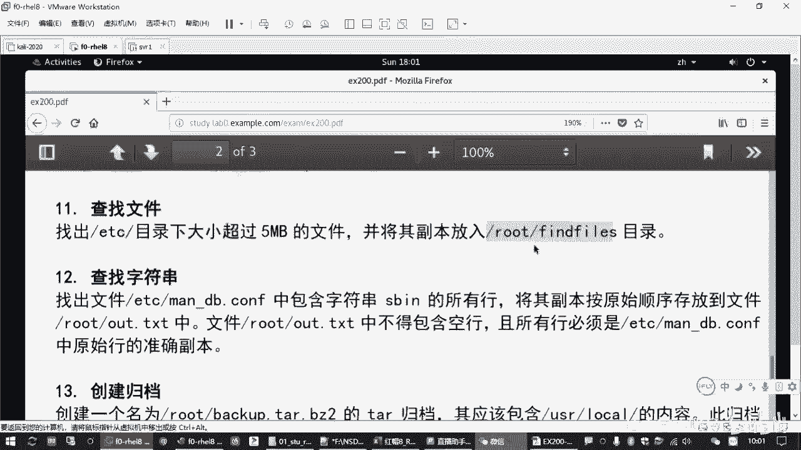

要创建这个目录啊。Make D IR。makeDIR创建这个目录。对吧要创建这个。呃，然后这个默认你建好之后呢，默认它下面是空的嘛，是吧？呃，然后你要去查找，那查找的时候呢，我们需要用到一个命令啊。

叫fd。😊，好，FIND那fend这个命令呢，我们在查找的时候，它原因文原意就叫查找啊。那查找的方式是在后边你要在哪一个目录去查找？然后再去指定条件。所以一开始是你要指定一个目录。

然后再后边呢是只查到了一个条件。啊，当然指定这个目录的时候，这个目录其实是可以不指定的。如果你没有说在哪一个目录去找东西。那么默认在你当前目录下去找东西啊。啊，你像当前是root管理员。

在他自己的主目录，那就是在主目录下去找东西。呃，查找条件，如果你没有说要找什么样的文件，那么就是找所有的文件啊。所有的文档。因此呢最基本的用法你直接敲一个fend。

就把你当前目录下边的所有东西都给你列出来。那如果你要在fin的后面跟上一个。目录，这就是把bot目录下的每一个层次，每一个子目录，子目录里面的子目录是吧，全都刨根问底给你列出来啊。啊，这是fd。

那基本的格式，fd跟上目录范围，再跟上你要找的那个条件。那条件怎么去指呢？那就有很多种方法了。那fd命令呢在用到的时候。大家具体的用法，你可以去卖啊，看f的这个命令啊，它下面有很多条件啊，很多条件。

一般我们把后面叫做这个表达式是吧？那条件的表示方式呢就往下翻啊啊有很多种比较常用的那些呢，那咱们要会的啊。往下走。范的命令啊，往下找有什么呢？你看啊啊这。一般呢我们指定一个条件，比方说按文件的大小呀。

按文件的修改时间呀是吧？按这个文件是属于哪个用户啊啊等等等等啊，都可以作为一个条件。😊，啊，那个查找的时候呢。你像这里这是访问的时间。然后改变的最近多少多少分钟是吧？他说的很复杂，这个大家慢慢去看啊。

那我们常用的有这么几个啊。😊，饭的命令。就如果按fd命令来指出来说的话啊，fd命令目录范围查找条件。那常用的查找条件可以按名称去找。就你知道这个文档的名称的一部分，我们可以写一个杠类目。

用这种方式来表示一个条件啊，这不是一个不是一个选项，是表示条件的一种方式。所以是杠类目空格，然后你要指定你想找什么样名字的一个文件。啊，再还有呢按文件的类型杠t。呃，文件的类型呢固定设置好有几种类型。

如果是常规的文件，指F就杠t空格F。如果是目录写D。链接文件L啊呃然后是那个快设备，就是B字符设备呢C。快设备指的是啥？快设备指的就是我们那个。嗯，整成块成块读取数据或者存存入数据的啊。

像磁盘呀啊内存啊，对吧？啊，那字符设备指的是一个字节，一个字节存纯设备的啊。那这个呃只去存那个数据的啊设备，像我们的键盘呀、鼠标呀是吧啊这种的啊。那这是按类型呃，如果是按大小的话呢，有个杠4S啊。

超过多大，然后呢，减号就是小于多大。可以带单位啊，超过多少K多少B多少字节是吧啊，多少兆是吧，都行。😊，啊，如果你没有加号，没有减号，那就是正好找这个文件是那个大小的。嗯，这个用的不多哈。

除非你确实知确实知道那个文件多大是吧？这个你一般正在找这个文件，你哪知道它确实多大是吧？一般都是加上一个大小，就是按大小去找。😡，还有呢杠M time指定修改时间，这个是找出。超过多久之前啊修改过的。

或者说在多少多少时间之内修改过的这个单位是天啊，以24小时为单位。所以如果你写一个一加一，那其实就是24小时之前的。它这个地方有一个不太好理解的啊，如果大家你要是慢慢去看的话，详细去看的话啊。

那一般我们说呢。呃，如果你没有加号减号，就写一个一，就是杠Mtime一，这个表示的是24小时之前啊，在后面有解释是吧？就写一个一，这个表示是24小时之前的那24个小时，就相当于一天之前的一天。

按咱们理解应该是。一天之前再一天应该是倒数第二天了是吧？这有点别扭啊啊，但是如果你写个加一呢，那就是再往前啊，就是48小时之前。那这个M time指的是修改的时间，就你找这个文件，最近被修改的时间啊。

😊，嗯，但是我们在找找这个文件的时候，如果是按时间去找。一般啊大家不要这么纠去纠结啊，你纠结这个时间的话呢，你要琢磨好久，你才能想透。啊，那一般说比方说我找最近一个月之前改过的，一般你写个加30就行了。

你反正一个月有些29天，有些是30天嘛，是吧？你写个330天左右啊，但是你如果你非得去纠结的话呢，那这个时间是你只写一个一，那是24小时到48小时啊。😊，对吧这个要区分一下嗯。

另外呢查找一个文件属于哪个用户杠user属于哪个组杠g，对吧？这是指条件啊指条件。来，咱们看几个例子。比方说我们查找bo目录下啊，我要找一个文件按名字去找，那就是杠类。啊，但是这个名字呢。

我如果能记住它的完整的名字，那你就把它写出来。假设有个文件叫VM06Z是吧？那假设真的有个文件叫这个名字，它是可以找出来的。但是呢我本身就在找这个文件是吧？大多数的情况下。

我是我是记不住它完整的名字的那这种情况下呢，我们还可以允许使用通碑服务。啊，你可以用引号引起来，在后边呢加一个星号。😊，这是查找以VM0Z开头的文件。是不是可以找到对吧？

那同样的你也可以找ETC目录下面啊去查找。干name。你可以查到一个，比方说叫RES开头的啊，然后呢点CONF结尾的。对吧这也要按名称去查中。那其他的条件是用法差不多啊。呃，然后呢你要查找一个设备。

比方说我们要找DV下面的一个设备文件。我们可以来一个。按类型杠t。我们找一下。那个快设备啊有哪些？那就是杠type有一个B是吧？B就是那个block啊，缩写啊BLOCK。

这是列出我们第一位设备下面的那啊，第一位目录下面的这些设备文件。那这些设备文件的一些特点啊，就为什么叫block是吧？😊，Yeah。我们看一下啊，能不能看到效果啊，VDA虚拟磁盘。

你看它第一个这个是不是一个blog设备啊，对吧？叫快设备啊，这是它一个标记。那这是按类型去查找啊，那如果是按大小去查找的话呢，那我们找一下。ETC目录下。杠ss啊，这是按大小去走。那杠sS呢超过5兆的。

加5大M。对吧能找出这些文件。啊，然后这个地方大家注意啊，好像我记得是区分大小写的，超过5兆这个M啊要用大写啊。呃，但是呢我们看那个如果是超过5KB。好像这个KB是小写。这饭的命令特别讨厌是吧？

用大写不行啊，所以这个要注意，就是你指定这个大小的时候呢，啊K是要要用小写啊，然后但那个多少兆呢是大写。😊，M嗯，多少GB好像是大写的啊。对吧，这个表示方式啊。嗯，如果大家记不住了。

你可以慢fin的是吧？去看他的帮助，去查找一下杠size。

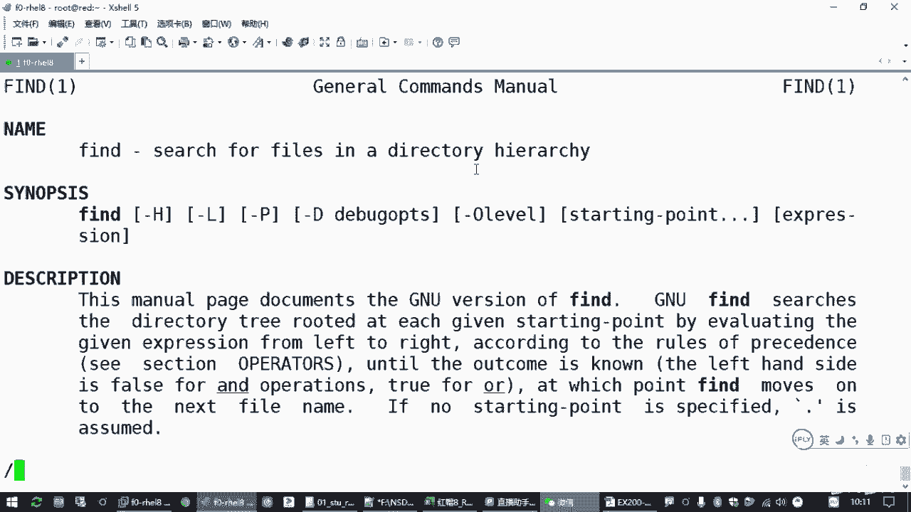

对吧这里有这些单位啊，具体的一些描述。

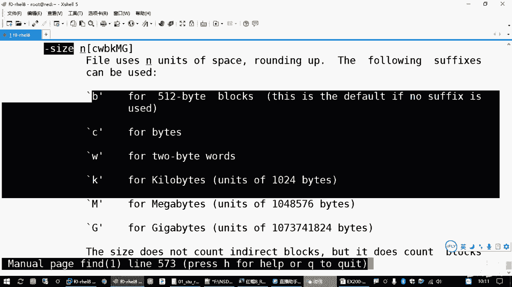

那所以这里快速给大家讲了一下我们f的一个条件一个用法啊。当然如果你有多个条件的话啊，怎么办呢？你需要需要把多个条件给组合到一起啊，比方说你查找超过5KB的啊，有好多文件是吧？

但是呢我只想找到这些文件里边。😊，文件名包含fill啊，开头的FILE开头的文件。对不对啊，那你可以加一个条件，加一个条件的话呢，你可以比方说叫类。😊，杠内啊是fi开头的这就是两个条件。

那如果有两个条件的话呢，你需要同时满足。中间可以加一个杠A，这个A呢就是and啊H的意思。じゃあ。那这两个文件就是即使名称以file开头，而且大小呢超过5KB。对吧多个条件组合。啊，如果你是或者的关系。

杠O啊表示OR或者。对吧这或者啊。那只要符合一个条件都列出来。对吧啊，当然啊。😊，呃，两个条件如果要同时满足，而且这个关系很多时候我们都不写。含义是一样的，就省着了啊。对吧这是多个条件一个组合。

那另外一方面，像我们刚才查找的这个结果。我很多时候我就想，哎，这两个文件到底是不是超过5KB啊，你文件名我可以看出来这个大小我是不是看不出来啊？😡，那我想验证一下的话，我们是不是应该再敲1个LS命令。

对不对？再去把这个文件路径再复制出来，我去检查一下呀。这个时候用起来不太方便。啊，为啥呢？因为你查找的结果可能不止一个两个，有可能有20个文件。我想验证一下这20个文件是不是都是超过5KB的。

那你让我一个一个去复制去粘贴，再来查看，再费脑劲了嘛，是吧？你如果再用泄道脚本编程，再写个for循环，那也费脑劲了吧。啊，所以fin命fd命令呢，它专门给我们提供了一个处理查找结果的一个操作。😊。

只要在犯罪命令最后边，你跟一个杠EXEC。就可以执行一条命令来处理你前面找到的这个每一个文件啊。找到一个处理一个找到一个处理一个啊，因此呢杠EXEC后边可以更一个命令。

拿什么样的命令来处理这个查找的一个结果啊，当然处理完毕之后呢，最后要加一个标记。其实是一个分号，表示一个结束。但是呢这个语句结束之后啊，结束这个表达方式在EXEC这里啊。

它这个分号为了避免和我们linux命令行的那个分号混淆起来啊，为了避免混淆，你要加一个反斜杠转移。他才会认识这是你要告诉EXEC这个操作的。说我这一条命令处理完毕了，是吧？啊，有这样一种方式。

那比方说我现在要用LS命令去查看一下找到的每一个结果啊，它那个文件的大小。那这个命令呢就是LS。杠LH啊。当然你不能直接这么写啊，你直接这么写的话呢，LS命令。😡，LS杠LH你本身不给任何文件。

它是不是也能执行啊？那如果这样的话，那其实跟你前面查找关查找结果呢没关系啊，就相当于你单独做了1个LS杠LH。对吧那没没意义啊啊，因此呢我们这个操作在执行的时候。

应该让LS杠LH这个命令去处理f的命令找到的每一个结果。那结果到底是哪一个文件呢？你得告诉他啊。那问题是我用f的命令在查找的时候，我哪知道是哪个文件是吧，不知道。所以这个杠EXEC有个特殊的用法。

我们可以用一对画括号。代替你前边fin的命令找到的每一个文件啊，因此呢LS杠LH哎，这一对话括号就代替前面找到的结果。第一个结果执行一次，找到第二个结果再执行一次。对吧用这种方式啊来执行，你就会发现哎。

是不是就对了啊，找到两个文件，然后把它的大小列出来。啊，这是我们给大家讲到的fin命令啊，在查找的时候，基本的一些用法。啊，就是你可以有多个条件组合，然后不同的条件的表示方式啊。

这些表示方式大家都要会啊。考试的时候，它可能是按中间的某一个条件要求你去查找。最后呢要处理结果，对吧？那这个会了之后呢啊那其实我们在用到的时候来看一下这个题目。

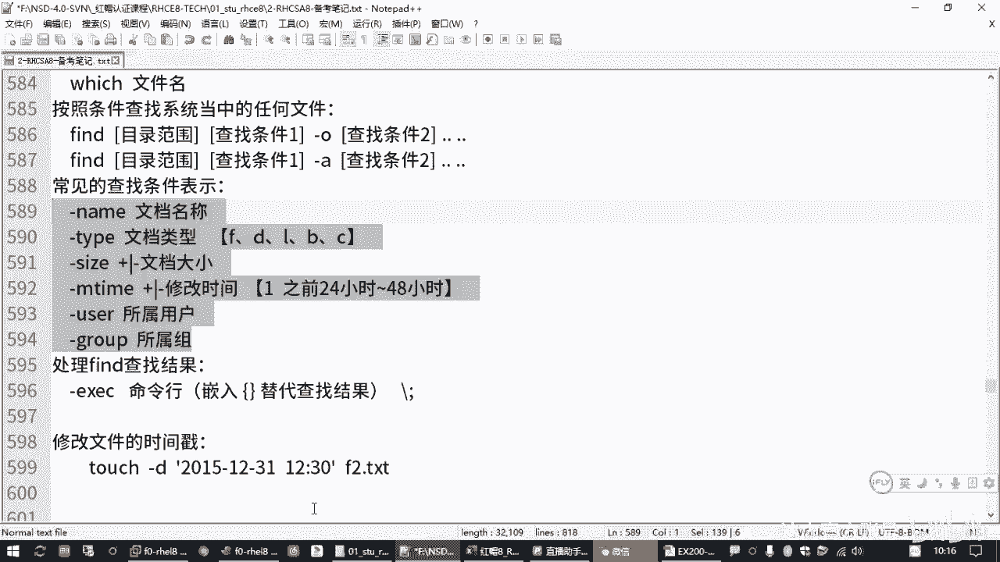

找出ETC目录下边大小超过5兆的。把它放到你提前建好了一个目录。

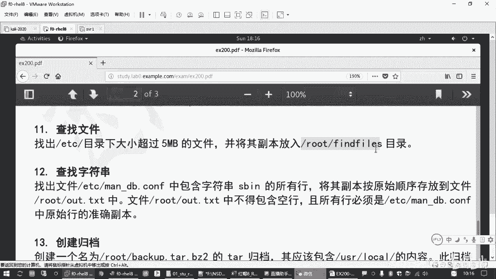

我们操作的时候。刚才不是是不是通过m叠雅创建了一个root下边的fd files这个目录，对吧？这个目录建好之后呢，然后我们就可以f去找ETC下的这个目录。然后条件呢。

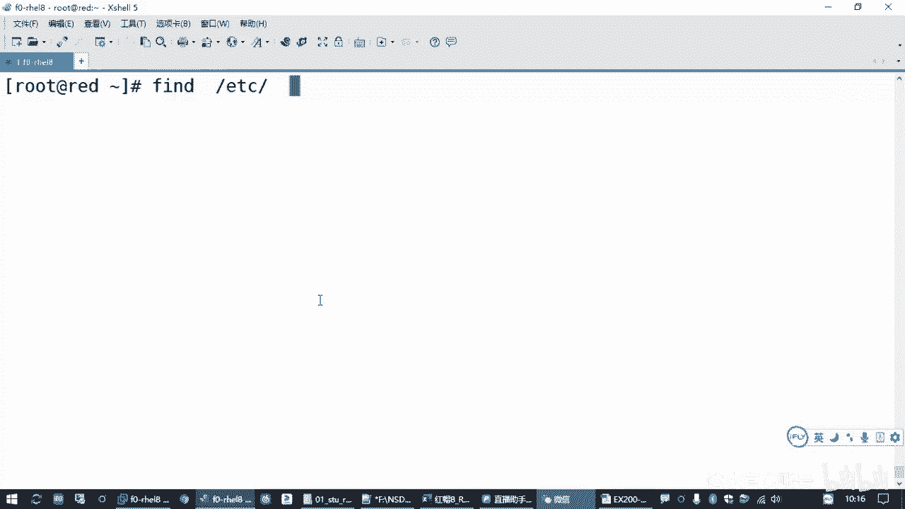

什么条件大小超过5兆的文件是吧？😡。

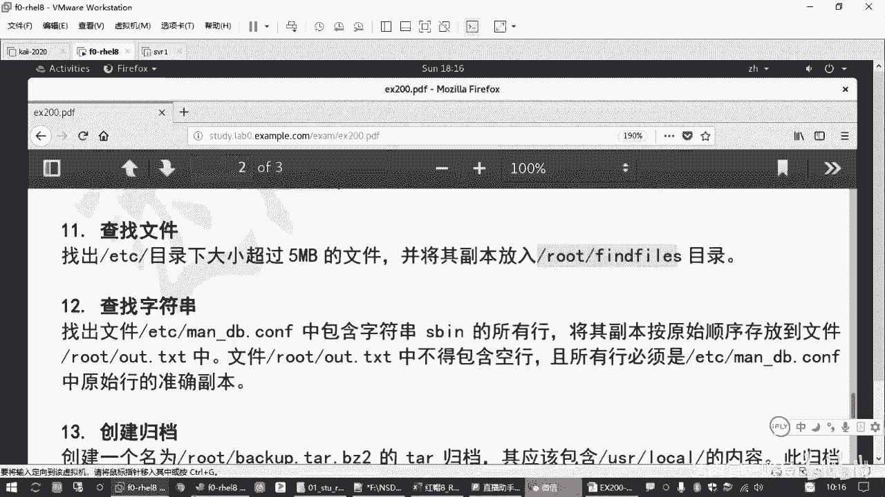

G。sence加5兆。其实文件的话呢，应该还有一个类型叫fi是吧？啊，fi杠tF啊，但是其实呢。基本上ETC下面都是文件是吧？这个这个一般你不加也行。然后目录的大小的话呢。

一般它只能看目录本身的那个大小，一般就是4KB，所以一般都不会啊。但你要写严谨一点，就是这个加一个杠type F说浓统一点的话呢，其实你就是一个杠s加5兆是吧？都行。然后后面来一个杠EXEC。😊。

复制过去啊，copy。保留他原来那个权限。被复制的文档目标目录，你建好的那个目录，然后反斜个分号表示结束。是不是就OK了？然后你确认结果呢，杠就LS命令杠。😡，LA。去看一下。

你在那个目录下面有哪些东西？加哥干啥去。你看两个8兆的文件找出来了吧，是吧，这是检查结果啊，去验证。来，大家把我们的查找文件这道题目做一下。Yeah。请。来，咱们接着来哈。😊，来再往下看。

还有一道题目呢，哎也是上午的考点啊，就是查找字符串。呃，查字不算什么意思呢？其实用到了一个就是一个命令啊。一个命字叫gra。对吧呃那fd命令呢是在我们的系统目录下面去找我们的文件。呃。

而这个grara命令呢是针对你给力的一个文本文件，去过滤你想要的一个关键词，对吧？去找出那个文件里的内容啊，所以这是找文件内容的。那gve这个命令本身。它既可以支持针对一个命令的结果去查询。

也可以针对我们一个文件的内容啊去查询啊都行。啊，大使用的时候呢有两种用法啊。呃，一种用法呢就是你直接给l命令，后边跟上一个关键词啊，比方说你找1个127。找这三个啊，找127作为关键词，去找哪个文件呢？

去找我们的ETC下的。🎼nogo要找我们ET试一下那个hos文件。对吧这就是一个最基本的一个用法。现在在红包八字系统里边呢，你会发现它关键词已经给我们加了一个颜色。啊。

本来grab命令它是有一个单独的什么什么刚刚开lo的是吧？它这个设了一个别名啊，设了一个别名。加了一个刚刚开了，等于outer是吧？所以它支持颜色显示，这个用起来更加方便啊。这第一种用法吧。

那另外一方面呢，它也可以啊针对我们命令行的显示结果去做过滤。打个比方，我们直接执行一个if con命令。来看一下IP地址。这个接口吧呃，那我们执行一个min令的时候呢，这个显示的信息是不是好多呀？😊。

但是我只想看IP地址这一行。对不对？我可能只想找我们的innet空格，有这个关键词的那如果找这个关键词的话呢，一方面我们现在找的不是文件。另一方面，你现在这个关键词里面呢有空格。对吧所以在这种情况下呢。

我们要用这样一种用法啊，就是在这个命令后边加一个树杠，这好讲过吧，是吧？一个管道啊。通过管道把前面这条命令的结果交给我们后边的给lo命令去过滤。就相当于你有一堆文字啊，我想从里面过滤出我想要的结果出来。

嗯，因此呢g up有很多时候也把它叫做文本过滤。过滤的时候会不会要加关键词。那这个时候你加关键词的时候呢，如果我们写一个andnet。这么alant嘛是吧？那你以alat空格作为关键词。

你如果这么写的话，你会发现你把那个al6是不是也写出来了，你末尾加的空格它不认识啊，它就当成你多数的。😊，如果你希望这个空格也是作为查找的关键词的一部分。请你用引号引起来。啊，一般用单引号就行啊。

这样的话是不是看到了只有一行啊，对吧？因为按net空格作为关键词了啊。没吧，这两种用法就你可以在命令行后边加管道交给grape去处理，也可以直接由grape命令。跟上一个关键词去找一个文件。啊。

两种最常见的用法。然后关键词呢，如果有些特殊字符，请大家用引号引起来。对吧用银行引起来。呃，还有我们在查找过滤这个结果的时候，它提取结果的显示单位。默认是行啊，啥意思啊？

就是说输出的是你提供的这个文本或者文件里边包含这个关键词的，就是符合这个条件的一整行啊都会列出来啊，都会列出来。啊，刚才给大家演示的是最简单的用法啊。啊。

当然我们在实际使用的时候呢啊大家要知道的是我们gl命令。这个关键词其实它可以用引号引起来，里边叫正则表达式。对吧叫正的表达式啊，就大家如果学过编程啊。

你可以知道你可以用更丰富的一些字符来表达你想查找的那个字符是什么样子的。比方说你从这个里边，你想查找以什么什么开头的，你可以加一个间号。对吧你可以查到1个12开头的也可以。这查到什么什么开头啊。😡。

或者咱们换一个。比方说我们找那个以RO开头的。啊，找我们的ETC下的password文件。也可以吧，那我们找什么什么结尾的。😊，就写一个关键词，后边加一个donden符号。啊，像我们找一个。嗯，闹个硬。

结尾。对吧这是查找以什么什么结尾的行啊。所以这个条件你可以有很灵活的方式去表示。啊，但是咱们考试的时候呢啊CSA的考试没有不会考这么复杂哈，它就考你用一个关键词就可以啊，就查找用关键词去做条件。😊，啊。

当然除了这个条件啊，可以有很丰富的表示方式。那另外还有什么呢？啊，另外还有就是给rap它有一些选项。比方说我要查到的一个条件是反过来的啊。来这讲它的一个选项。那我们在查找。就查这个吧。

🎼我们查找使用变下的拜喜啊，这个谢ll的用户的记录。那我们g up并 by系作为一个条件去查找password。可以查到吧，是吧，这就查到一个root。呃，那如果我想查找这个文件里边。

除了这个关键词以外的其他的行。我们可以加一个杠V。这个表示把条件反过来啊，取反啊取反。有个V，它来自于当词什么？来自于那个rever是吧？应该是这个啊，反过来啊，是杠V。

那刚才我们说的那个查host文件也是也也是啊。我们比方说我们查找一下local host。去找我们的ETC下的hos。对吧你看这种查找方式，就是查找这个文件里边不包含local host的行。

对吧那如果你没有这个岗位呢，这条件是正常包含这个关键词的行啊。😊，嗯，还有在查找的时候，我们可以区分大小节。正常情况下是区分大小写的。你如果写一个。大写的n host，你是查不着的。对吧那有些时候呢。

你不确定你要找的这个关键词是大写的还是小写的，你想忽略大小写就有一个杠A啊。Local。哎，不是刚癌是吧？啊，look克写错了，look克写错了。来再对比一下LOCAL啊，反正你关键词不匹配。

找不着是吧？来再测试杠I。如果你想忽略大小小的话呢，就加个杠I啊。这个杠II是来自于哪呢？是来自于这个单词叫e no啊，忽略是吧？忽略。所以这个可以忽略大小写去查找。呃，另外还有一个用法呢。

就是比方说是。港欧啊港欧。呃，杠O的话呢。执行一下，你就知道是它啥意思了啊，加O和不加杠O。对吧。😊，能看出来吧？如果你不加高欧的话呢，这是查找包含这个关键词的行啊，有多少？如果你不加啊。

如果你加一个高O，是把找到了每一个关键词，每行一个给你列出来。这个刚O代表的是那个only啊，only much。就只是要匹配你找的那个关键词。那这个用法呢。

其实很多时候你可以直接用这种方式去查找一个文件里边有多少个这样的一个单词是吧？有多少个这个关键词出现多少次，但你先把它列出来啊。然后你再统计行数呗，是不是这个道理是吧？那这是gl的一些基本用法啊。

刚才讲到的是后边这几种用法，考试的时候都用不着啊。这这就顺便啊给大家补充一下。啊，那grap查找，刚才我们讲基本的用法来总结一下。grab关键词跟上一个文件，可以同时查多个文件啊。

获者了gap跟正则表达式跟文件。那还可以用什么？还可以跟我们这个管道啊，那就是另外一种用法，是吧？命令行竖杠管道交给gorap就过滤也行。对吧你相当于再多一个用法嘛。

那广道是我们lininux mini令行机制里的一种使用的一种方法是吧？那好多命令都可以用啊，所以我们这里没有列出来了。嗯，然后刚才我们讲到的什么杠V呀，杠杠看了呀，还可以准确的去匹配单词。

还可以去匹配行数。大家工作当中的时候呢，都可以去用一用。具体用法你也可以慢给ra啊。呃简单的条件呢这都有啊。😊，如果你要支持扩支持那种扩展的正在表达式，啊，建议大家也可以用这个杠E大写的E。

或者你用era啊也行。就大家学到这里啊，也也都了解一下。比方说让我们要查两个条件，我们可以个rap。刚才我们查的是呃look host是吧？这是一个条件，我们去找我们的ETC下的。housese是吧？

那如果我还想查找啊，包含n host或者包含127。有两个条件做结个或者是吧？😡，是不是这样，但你这么查就查不着了。😡，啊，因为它会把你那个树杠不会理解成一个或者，因为你把它当成或者的这个理意思来理解。

这个是扩展正则表达式。那glve命令呢，它默认只支持简单的正则表达式。如果要支持扩展的怎么办？加个杠大写的E。这样的话呢，如果这个关键词是127或者n host的，都可以作为符合条件啊，都可以符合条件。

那g杠一有一个简写的用法，换成一个Eg也行啊，效果是一样的。对吧这是过滤啊过滤。那这是grara过滤的一个基本用法啊呃，然后我们看一下题目。

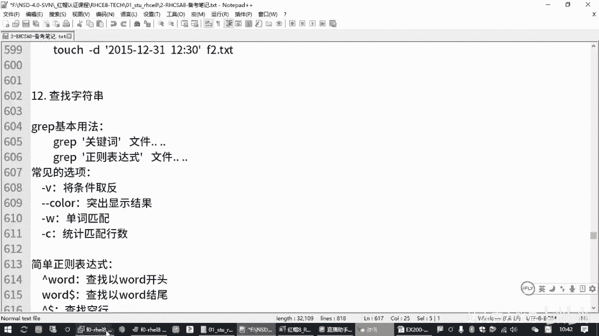

呃，那题目要求里边呢，我们要查找一个指定的一个文件，然后包含一个条件，就是一个关键词SB。找到所有的行，让他呢按照原来的。就找到的结果，按照原始的顺序存放到一个新的文件里面去。然后在这个结果里边呢。

不能有空行是吧？所有的行必须是你这个文件原始行的准确的副本。那我们给rapb命令查找的时候。是不是默认就是找找到符合一个条件的行整行输出啊。那你既然指定了一个关键词，那肯定不是空行嘛，是吧？

所以后面这个默认就满足了。😡，只要你不不去手动复制，就不会有这个问题啊。啊，那来看一下EDC慢DB是吧，找这个文件。

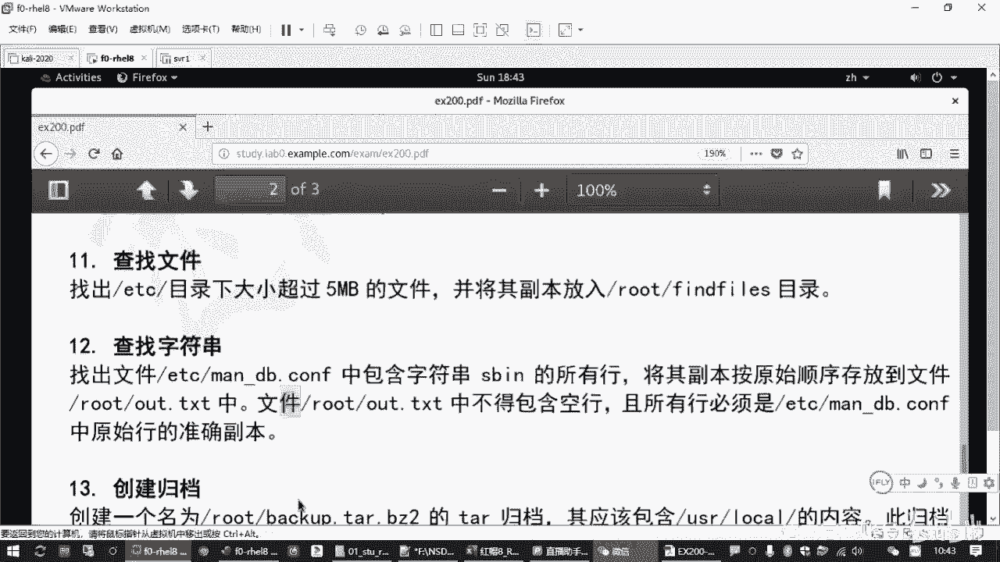

g查找SB作为条件。然后然后去找ETC下边的有个叫慢。BB是吧，这个文件。能找出来吧。嗯，那正常来说呃，为什么题目它会不会有加上这么一段话呢？说你这个里边不能包含空行是吧？

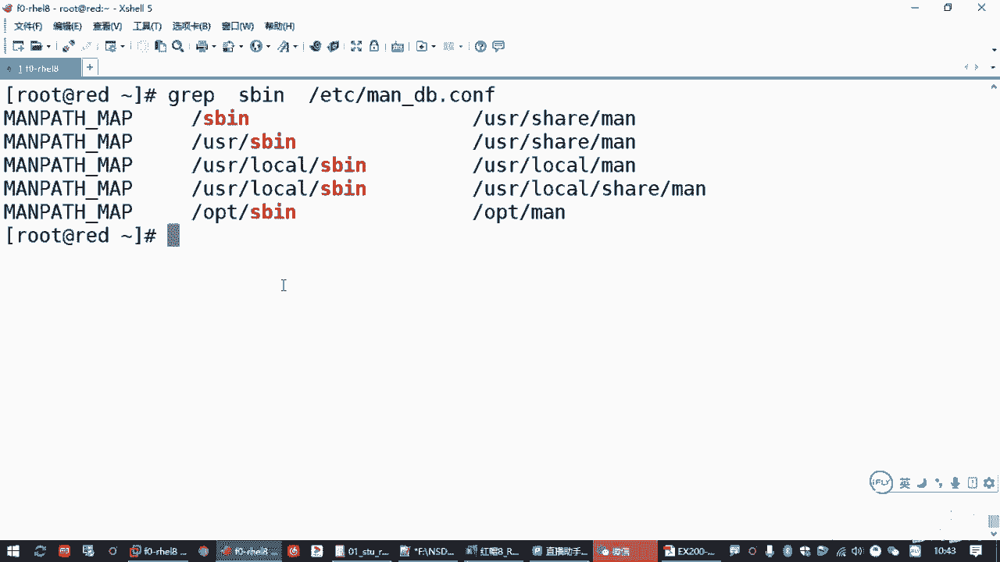

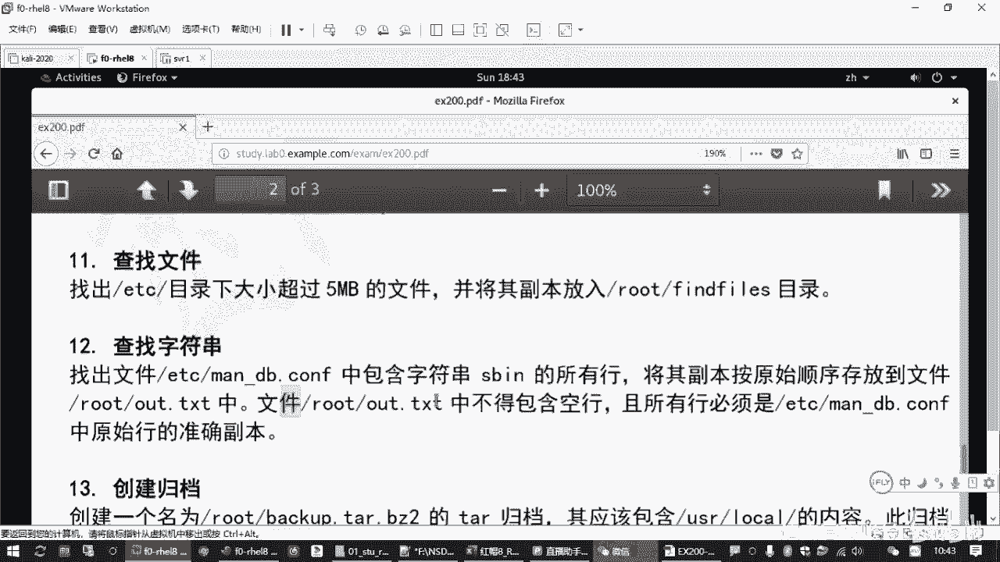

那是因为原来有很多同学呢，他找到的结果呢，他会复制。

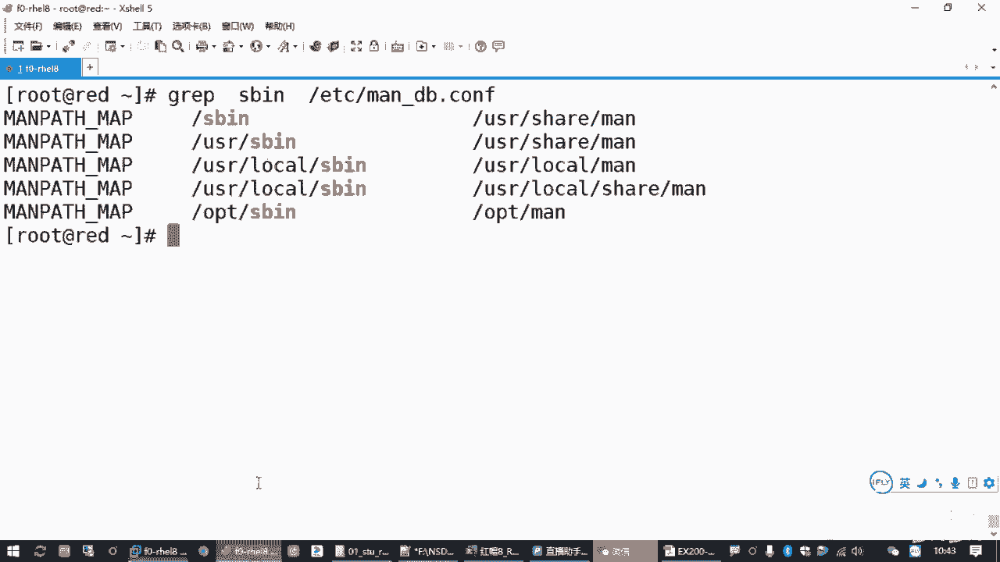

对吧复制，然后呢，我们新创建一个文件，就题目要求的。

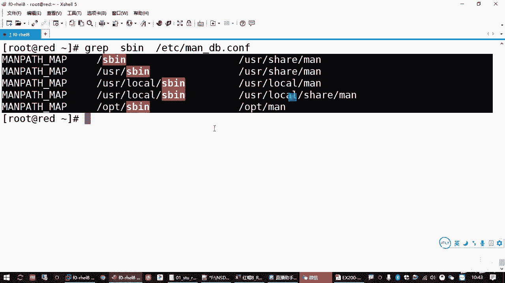

啊，root下有个alt点TXT。

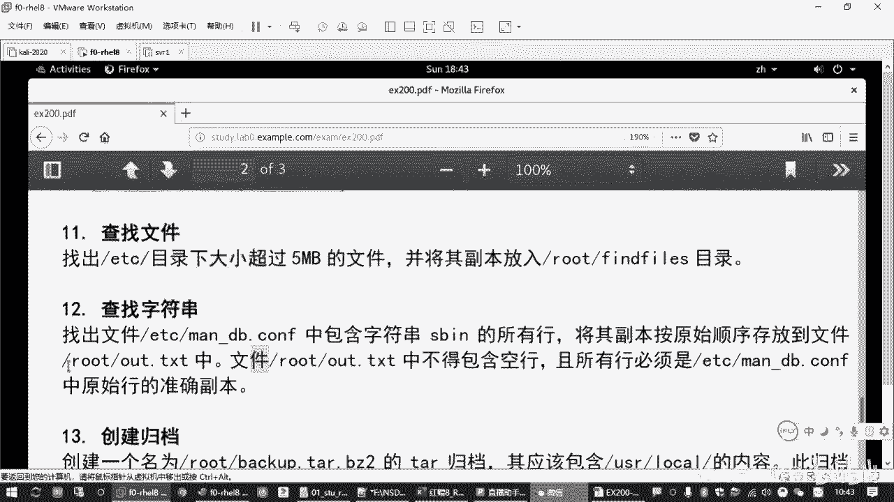

考试的时候按题目要求去做啊，他让你写哪个文件就写哪个文件。这样然后往里面去粘贴。那这个时候就会容易出问题。啊，就容易出问题，出什么问题呢？一个你末尾会多一个空行。你不小心复制的时候。

末尾加了一个划行符啊。另外呢在粘贴的时候，你可能没有切换到输入模式，然后前面在粘贴的时候会丢东西，本来是manpas的是吧？前面那个MA没了。

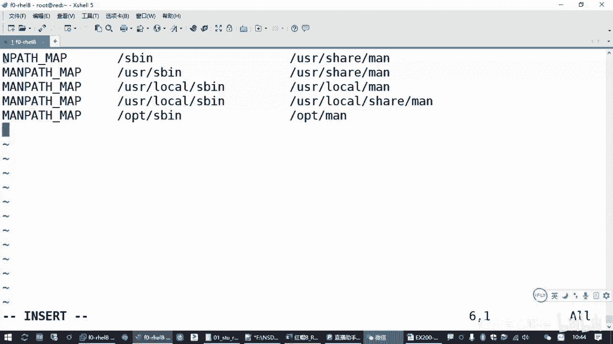

这个时候才会出现题目说的。有空行，然后那你复制的那一行呢，又不是原来的副本是吧，少东西了。

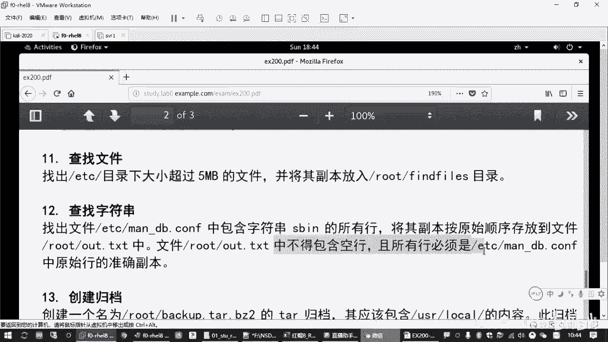

啊，因此做这个题目的时候呢，建议大家不要用VIM去编辑，然后再复制粘贴啊，为什么呢？因为lininux系统里面还有一种机制叫什么？叫重定向输出是吧？就是把你一条命令执行的结果。把它直接保存到一个文件。

刚我们前面也讲过一个管道，这个是把前面这条命令呢交给后边这一条命令去处理。但是今天我们要用的一个机子叫重定向输出一个大于号啊，这个可以把一个命令行的显示结果保存到我们指定的一个文件里面去。

这种方式可以快速保存命令行的显示结果。那保存的结果就是完整的。没有多余的任何东西的啊。

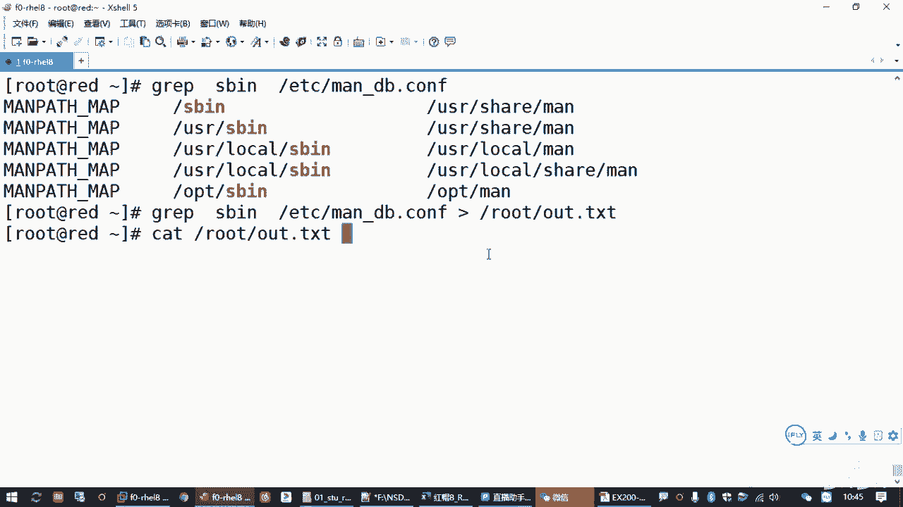

你原来正常结果显示是什么，那么保存下来就是什么，对吧？这叫从定向输出啊，为什么叫重定向输出呢？

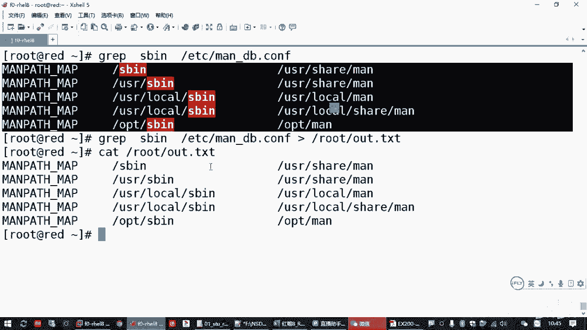

这个操作啊大于号。就是说它本来这条命令显示的结果应该是显示在屏幕上的。你现在呢不让它显示在屏幕上了，让它保存到一个文件里面去了，是吧？😡，所以它是重新指定了它显示的方向。叫从对向输出。Yes。呃。

从那向输出呢，如果你后边这个文件不存在，它会自动创建这个文件。如果后面这个文件存在，他会把后面这个文件清空，然后再把结果存进去。那如果你想保存保留原来的内容啊。这叫追加，你用两个大于号就好了啊。

那后面这个文件内容呢它会保留，然后把新的命令的执行结果加到最末尾啊。对吧就这个这可以和我们那个管道对比一下。管道操作呢是一个竖杠，竖杠前面后边是两条命令。从定向的操作呢是大于号分隔，后边是文件啊。

后边不是命令，对吧？那因此刚才我们这个题目要做的话，最简单的做法是不是就是刚才我们说的这一条命令？那咱们刚才家讲了这么多，其实就一条命令就搞定了哈。😊，就一条命令就搞定了。来，大家也把这个做一下，好吧。

就是查找字符串啊，并且把它保存到一个文件，体会一下grab这个命令的一个命令的一个用法，再结合我们的重击项输出去保存这个结果啊。The这。

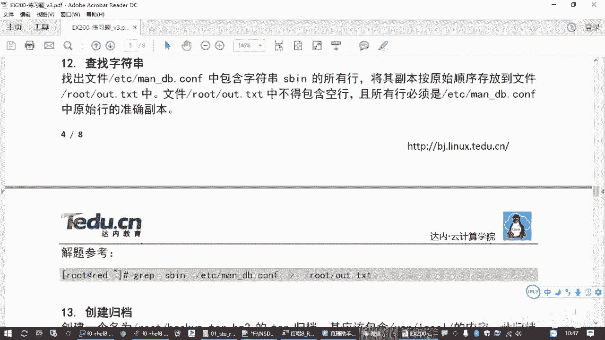