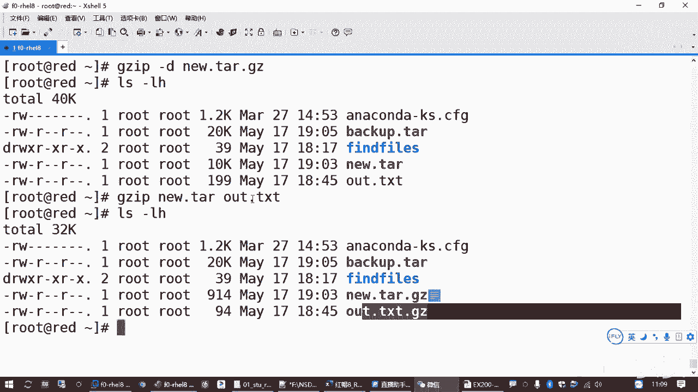

# 全新红帽认证／Linux云计算架构师／RHCE／RHCSA必备课_可零基础入门的教程 - P17：3.03-tar归档及压缩 - 达内教育 - BV19U4y1b7qQ

Thank。呃，创建归档这道题目呢呃涉及到的知识点啊，其实最核心的就是一个命令啊，就一个命令就是TA啊。😊，就答题的时候，一条命令就能搞定啊。那相关的知识的话呢，我们简单来说一下啊，呃。

那TR这个命令的话呢，呃在做在lining系统里面做归档压缩啊，一般我们都是用这一条命令来做。

呃，但是在lininux系统里边，归档和压缩这是两个概念。它是可以分成不同的命令来做的啊。呃，啥意思呢？归档啊，它指的是把很多文件归纳到一起啊，这叫归档。很多个文件可以把它合到一个文件。

但是这个归档呢它并不压缩空间。假设你有10个文件，每个文件是0兆，那你10个文件呢归纳到一起了就100兆。对吧就是十加在一起嘛。呃，但是归档为啥做归档是为了方便携带吧，是吧？

你像比方说我把一个网站的资源，网站的网页，你那不要打个包嘛？通常我们说打包。那其中就包含这个归档的意思。你一个网站的目录资源呢可能好几千个，你拿下来不方便，是不是我要拷到我的移动硬盘里边啊。

拷到我U盘里面，或者我邮件发给别人，那肯定打个包方便嘛。啊，但是你打包呢，它又并不减少空间。那你没有达到我们一个便携性的目的，只能达到一部分的便携性的目的是吧？不能不是特别完全，不是完全那种便携啊。

因为它占的空间比较大。那很多时候呢我们在备份的时候，也是把很多文件放到一起做成一个文件。而且呢你备份呢是保留备用的。那你把10个文件，10个100兆的文件做个备份，你还占用100兆，这个有点浪费空间。

所以计算机领域是不是有个有个东西叫做压缩呀？对吧。那么压缩的含义啊。它是减少文件占用空间的一个大小。这叫压缩。那在lininux系统里边呢，归于导航和压缩是分别有不同的工具来做的。

归档的操作就是TAR这个命令。😡，压缩的操作呢有专门的像GZ波呀，什么BZ波I呀，什么XZ呀是吧？有这些程序来做的。那压缩就是压缩啊，归档就是归档。那能不能把这两个组合到一起呀，是吧？啊，当然是能啊。

😊，呃，后来这个t命令呢就做了一些改进，加了一些相关的一些命令选项。你只要在使用t命令做归档的时候，直接给它相关的一个选项，它就能够自动调用这些压缩工具。去对文件对归档对对那个归档好的文件同时也做压缩。

所以叫归档压缩包或者叫压缩归档包，其实都是一样。所以很多时候呢我们基本上就是对一堆文件啊做备份的时候，就是既做归档又做压缩。你如果只对一个文件做呀做做那个备份的时候。一般我们就只做一个压缩就好了啊。

对吧那你没有必要做归档，你本身就一个文件，你们做归档干嘛也没必要，但你非要做也无所谓啊，也也是可以的。😡，但是大家从概念上你要理解啊，它做归档和做压缩，它是两个概念啊两个概念。呃。

那具体使用的时候怎么用呢？对他命令来说，你要创建一个新轨档，需要用一个选项叫杠C。啊，创建新的归档。然后你创建的这个归档叫什么文件名字，对吧？就是你创建的这个备份，你要是给他起个名字吧，要加一个杠F啊。

叫杠F。做一个杠F的一个选项。呃，那基本的用法我们看一下。如果我要做一个归档啊。来，我们这里不是有个under，还有一个什么out是吧？假设我把这两个文件作为一个归档的话，就用t meaning。

后面选项呢杠C表示创建，然后杠F。你要指定你新的这个文件叫什么名字？啊，来写一个6点贴R，扩展名是这个吧，是吧？No后。基本的格式啊。TR命令再跟上选项，然后是你要创建的这个文件叫什么名字。

后边呢跟上你要备份的这个文件是哪些，用空格分开就好了啊。啊，然后注意杠F指定归档文件名，这是一个整体啊，你不能分开，所以你不能把杠F放到杠C前面去啊。好，这个时候你看执行这个命令的时候呢，是包错了。

咱们这个练习环境啊，咱们的练习环境他这个命令这个包没装啊，所以我们呢要装一下这个包。考试的时候是装好的。来装一下贴啊。对吧就装上了啊，装上之后来重新再来看。再执行一下好了吧，是吧？归档做完之后。

你看多了一个6点贴啊。😊，这就是个归档文件。那这个归档文件如果你想了解一下它里边有什么东西啊，我们可以用TAR命令，要查看一个归档啊，一个杠T。刚T啊。T是以前老的一个格式里面叫type啊。

就打字这个意思啊，显示出来的意思是吧？啊，杠T那后面一样杠F6点他是吧？我看一下这个文件里面有哪些内容叫杠T啊，当然这些用法，大家用过lin命令应该都知道啊，这些操作都可以缩写啊。😊，杠TF也可以。

对于TR这个命令来说呢，对于这个命令来说，这个杠你都可以简写啊，就不用。嗯。偷懒无极制。怎么写好用就行啊。对吧这个作用是一样的啊，这是查看归档啊。但然如果你想还原啊，刚才我们讲了几个操作啊。

一个是杠C是吧，是创建杠T是查看啊。如果想还原的话，一个杠X啊，这是恢复归档。😊，啊，如果你想看效果的话呢，那我们先先把。😊，这两个你这两个文件先删除。没了吧，那恢复的时候呢，TR杠XF。这是恢复。

是不是又有了，那就恢复。啊，当恢复的时候，默认情况下是把把那个归档你的文件解压到你当前目录啊，释放到当前目录啊。如果你想释放到其他的一个目录，请在后面加一个刚刚大写的C。😊，我可以把它放到OPD下面去。

😊，然后你再看OBD下边是不是有两个文件啊，对吧？是这样的。啊，当然啊但是在做操作的时候，就是你在做备份的时候。刚才我们不是这样去备份的吗？在做备份的时候呢，如果你想同时看备份的哪些东西，可以加个杠V。

就显示执行的详细信息啊。就不会静悄悄的了，是吧？呃，你释放的时候也是一样的啊，你也可以加一个杠V。就是看详情啊，看详细信息。好，这是TER命令。啊，那另外一方面呢还有一个选项啊，还也给大家讲一下。😊。

呃，如果你是在做备份。而且你备份呢是包含了一个绝对路径的一个资料啊，让我们再创建一个新的备份。TAR。杠C。VF。来，我们做一个。back up点TN啊。啊，然后我们把那个根下的。

user localal装备份。对吧直接再往分分就可以。呃，原来还有一个选项叫什么呢？杠大写的P对吧？之前的时候呢做的时候。现在好像没区分的啊，我给你验证的好像是没区分了。😊，但是显示的没区分。

我不知道实际有没有区分啊呃加大写的P和不加大写的P有一点，它含义上有点区别啊啊，什么区别呢？是保留它原始的那个绝对路径啊，这个大写的P。😊，这小写P呢是保留原来的权限，这个是默认的啊，不写也行。

但是保持绝对路径。这个以前红帽七的系统里面不是默认的，就是你加和不加是有区别的啊。现在好像我试了一下吧里别好像没提示，对吧？😊，好看一下啊。看看用那个。这些细微的差别还真的是要去测试啊。港T。

VF查看一下。哎，实际上还是有区别的啊，显示上看不出来了。哎，这还是挺别扭的哈。😊，区别在哪呢？就大家如果我们在备份的时候。啊，看啊仔细听啊，如果你备份的时候。没有加杠大写的P。

我们这里没有加没有加保保留它原来的路径。那么前面这个根呢，它会帮我们删除。在7的系统里面，它直接会有一个提示。然后它下面显示的前面这个根也会看不见，但是在八里边，你发现这个还是能看见是吧？😊。

但是前面这个提示也有也能看到，你看它会把前面开头的那个根去掉。

所以相当于你本来给的是一个绝对路径，但是它没有绝对路径了，变成了一个相对路径。

所以我们用TF去查看的时候，你看它这个路径是不是把前面那个根去掉了。这个时候在恢复的时候不方便啊。恢复的时候，你必须指定你原来备份的这个文件在哪里。他才知道还原到哪去。

但是如果你保留绝对不镜有什么好处呢？你在恢复的时候不需要指定，你要还原到哪去。这个可以在恢复的时候会更简单啊。意思就是说，如果你在恢复杠X。你可以加一个杠大写的PF，那么你后边不需要去指定你还原到哪去。

那你原来备份的时候是在哪，我就回哪去，从哪来啊回哪去。但是前提条件你备份的时候必须加大写的P。你如果不加不加大写的P呢，你想这么恢复门门啊，恢复不了，它只能还原到你当前目录。

或者你手动去指定回到哪个目录。😡，他不知道他原来从哪来的是吧，他把那个根给去掉了嘛。😡，因此，如果大家是做备份，工作当中做归档，建议大家都用C大写的P。是吧CP这是个好搭档啊，你要把它放到一块用啊。

这是最好的一个建议的一个做法。😊，好，这是讲的规档啊。😊，啊，那么归档的文件呢，它是没有做压缩的。因此呢你像我们刚刚刚刚我们看一下对比一下哈，看有没有效果啊。呃，我们看一下我们的。1个。

alt点TXT加上这个under count KS是吧？然后你看一下我们这个6点叉，这个不光没压缩，我们对比一下好像大小是不是还变得更大了。😊，它加了一些硅档的一些控制头元素是吧？那就变成10KB了。

是不是有点大？那如果你想对它做压缩的话，怎么办呢？你压缩肯定要节省这些空间嘛，是吧？那如果要做压缩的话呢，就要用到压缩的工具。比方说记载组。😊，那记这个这个命令呢，它可以把一个文件变成一个压缩的格式。

我们只需要在后面跟上你想压缩的那个文件在哪里？回收。你再去看。这个维是不是变成了6点它点ECZ了？你对比一下，压缩之前是10KB，压缩之后呢，变成914字节。这个节省的空间不是一。半点是吧？

特别是这种文本文件啊，压缩的比例是很大的。😡，所以很多时候我们要做压缩啊，当然这个压缩呢，你压缩完成之后，原来那个文件就没了啊。😊，原来肯定就没了，它直接变成了这个压缩包啊。啊，如果你想还原的话。

还是Gz这个工具有个选项叫杠D。然后T呃然后new这个文件是吧？把扩展名式点击Z的这个文件呢啊用GZ杠D把它去解压。这个用法呢，它有一个替代的一个命令，叫G按这步啊。也是去解压啊，效果是一样的啊。

解压完成之后呢，你再看。是不是又回来了，还是6点踏。OK吧是吧，就是压缩和解压。😊，但是呢压缩的工具啊，你要记这步，假设你后面跟他两给他两个文件。给一个6点套，给一个out点点THC。😊。

这个结果是什么呢？来看一下。他是把这两个文件分别做压缩啊。不是把这两个文件打包到一起啊，不是打包到一起。😊，你把两个文件合成一个文件，这个操作我们把它叫做归档是吧？然后压缩呢，那就只是做压缩啊。

我们在windows里面用的那个什么winzip呀什么之类的是吧？啊，什么win乱呀，那些工具呢一般是把这两个活同时做了啊，把这两个活同时做了，你可以把一堆文件做成一个包啊啊，这压缩包是吧？😊。

那在我们的linux操作系统里边啊，也一样。很多时候大是大家都是又归档又打包的是吧？那如果不这么做的话呢，你会觉得很麻烦。你还让我做两个命令这多费劲啊，是吧？😊，来，我再把它还原一下啊。😊，解开之后。

那如果要把多个文件又打包啊，然后呢又做压缩，这个时候还是用了time命令。啊，还是用的他命令。比方说我想把这个文件啊和这个out这个文件啊，这两个文件。再打一个包做备份。杠CVF刚才我们是用的这个吧。

然后6点踏再跟上这个文件，再跟上被压缩的这个文件。但是我想在备份的同时也打个包。再压缩一下。那这个时候呢，我们不需要先做他min做这一步，然后再来用那个GC本来打包，你可以节省一步，只需要加一个什么呢？

加一个杠小写的。Z。杠Z的选项就表示调用。

我们的那个GZ命令来处理点击Z这种格式啊。就是打好包的同时，同时做压缩。如果创建的时候，你可以用干Z去调用，解压的时候也可以用干Z去调用啊，去解压都行啊。

所以呢如果是这样的话，我们把这个扩展名标记一下，后面加1个GC就可以一步到位。对吧就可以一步到位。能看到吗？那做完之后呢，大家看我们这个6点它点击Z是不是906K906字节啊。😊，这样就简单了啊。

啊，那其他的如果我们想去处理。在lininux系统里，lininux系统里边啊，压缩包的格式有好几种。有扩展名是点GZ的，还有那个BZR的，还有那个点XZ的，我们只需要分别用杠Z杠J和杠大写的J。

这是lininux系统里边啊比较常规的三种压缩包的格式，就用TAR这种方式的时候啊，你可以去加这三个选项去调用。它可以自动去找相关的一个工具。当然啊前提条件你对应的这些命令要存在，就压缩的这些命令。

你得有啊，它才能去调用，否则的话你调用不管用啊，是吧？比方说我想换另外一种格式。BZR换这种格式。那这个时候呢，你这个选项应该改成杠小写的J。你用刚小写的Z也行，但是呢它真正的格式并不是BZR啊。

文件能创建出来。但是你用fi去检查一下。它的类型呢。你看并不是用BZ2区压缩的吧，用的是GZep啊，所因为你用的是杠Z。他找的是GZ。所以这个选项要对。不光选项要对，而且你得有那个命令。

否则的话它就会报错。啊，我想用刚小写的介去调用BZR那个压缩工具，它会告诉你BZRBZ2在哪呢？没找着是吧？command not bound啊，因此在你当前系统里边呢，你要确认。安装Bz这个工具啊。

BZ82是吧。你要把这个命令，把这个对应的软件包装要装一下。呃，同样的，如果是万一考试题要求你做了个XZ是吧？那你可能XZ也要装一下。啊，这个默认是装的是吧？就GZ和SZ这两个应该是默认装好的。

但是BZ呢默认没有装TAR默认也没有装。所以大家答这个题目的时候要去安装一下。

对吧这是我们压缩的这道题目啊。

来，那我们做的时候呢，看一下题目啊，要求我们创建一个备注文件，放到root目录下，叫back up点t点BZR要应该包含userlook下边的内容。所以操作的时候呢，那其实就是t杠。

CCZV这个V加不加都无所谓是吧？大PF。然后root下的。back up点踏点BZ2。被备份的是userloc这个目录。这样就行了嘛，是吧？😡，做完你可以去检查一下，用fi去检查一下。

你看一下它对不对呗。看一下它的一个类型。对吧你得看它一个类型。然后如果你发现类型不对，好，看一下前面命令是不是敲错了。哎，果然是吧？这用的是Z。那这题目要求的呢是B这步吧是吧？B这被I压缩的啊。

所以那你就要去核实。😊，你要把这个选项改成小写的G。然后还要去验证，确认是这种格式的啊。就对了吧，OK吧。来硅档和压缩，就刚才我们讲过的这一堆啊，归档和压缩最核心的就是这个贴R这个命令。来。

大家把这个也敲一下。

第十三题啊。Okay。CP杠P是吧？杠P是保留原来的权限的意思，就保留那个文件的修改时间呀，呃属于哪个用户，属于哪个组，然后他的权限啊等等等等，保留这些属性。

啊，如果你想了解具体含义呢。慢一下啊，给你确认一下。

杠P查找。

相当于杠杠pre是吧？相当于这个啊保留它原始的权限归属，然后修改时间那个时间戳就这个意思。

你问的是前面那个范那道题目是吧？呃，f的题目呢为什么建议大家加杠P呢？因为它有时候考试题会让你去查找属于某一个用户的那些文件。那你查找到那些文件之后呢，再把它拷贝出来。你如果是管理员，你是root。

那你查找一个属于张三的文件，你拷贝出来之后就可能变成你root的文件了。那人家验证结果的时候，你咋知道这个文件是张三的呢？是吧？你没法没法说，所以你要保留原始的权限。就知道啊，这个文件就是张三的啊。

才好验证结果嘛。し。

啊，刚才有同学问到的使用TR命令杠CFGP这些选项。

顺序是吧。顺序画的顺序的话呢。就是我们在做备份的时候。杠CZVF或者PF是吧？这些选项呢顺序有一点点关系啊。就是你在做备份的时候，嗯，后面呢是back up，叫什么back。

up点踏点击Z假设你做一个这样的一个备份。顺序没有太大的关系，但是有一个地方你要知道的一点就是这个杠F。它是和后面指定一个文件名。这是个整体啊。这你挨你得挨这写。😡。

所以是这相当于是这样的那你前面的这个Z呃C杠C杠Z杠P，这个顺序无所谓。这个无所谓啊。但是你不能把这个F放前面去。😡，自然是不行的自然是不行的啊。对吧这样会报错。因为他找到这个杠F选项之后。

他就会认为后面是一个文件名。对那那肯定有问题了嘛。其他的选项无所谓，但是这个F呢，你在用的时候，如果你把它组合到一起，请把杠F这个F写成写成最后一个。

这下。上一题的压缩归档加杠大写的P是吧？保留决对路径啊。保留角色路线。不两。你如果不加杠大写的P的话呢。😡，它是没有保留绝对路径，会把你备份的文档，它前面那个根根目录给去掉。这样的话你被在恢复的时候呢。

😊，这要举例子才好理解。你要不我给你来来个例子。😊。

Yeah。来。😊，这个大家有着急吃饭的同学就可以去啊。然后刚才有同学问这个问题，我给你补充个案例啊。😊，因为这些东西说起来都是啊要花好多时间啊。来，我们讲一下这个大写的P是吧？😊。

举个例子啊啊举例子来理解大写的P的区别啊。🤧嗯。TRJC。如果你不加大小的P，直接F。备份一个文件，放到root下边。叫back up点踏点。B they啊。你先听我说哈。

你问这个刚大批水项的同学可以问听一下。😊，呃，然后呢我们备份的是user。Local。来，我们加个标记吧，back up杠1。这是没有加大写的P的，你看它是不是有个提示啊？😡，移除了前面的根。

然后我们再来加一个大写的P选项，我们后边呢加一个啊，改一个名字，做一个第二个备份。这是第二个备份文件。操作上能看到区别吧？😡，那使用的时候有什么区别呢？假设有一天我们用着loc这个目录给删除了。没了。

网是不是要恢复啊？😡，那如果要恢复的话呢。我们刚才讲过恢复了用的是XF是吧？😊，那XF恢复，如果你用第一个文件backake up杠1。点踏点必字啊。你你会不到哪去，你是不是得指定啊？😡。

那你如果不指定你恢复到去的话，你直接回收这个文件恢复到哪去了，恢复到你当前目录。😡，但是你找你的什么user，跟下的user notebook，你是找不着的。没有。😡，所以你要恢复的话。

你如果用第一种备份，你怎么办？你怎么办？你只能是恢复的时候，你还要加一个更大C根啊，才能还原回去，很麻烦吧。但是如果你用第二个备份文件。备份文件第二啊，如果你用这个备份文件的话呢。

你不用关心它的文件恢复到哪去。但是你只要在恢复的这个选项里面加一个杠大写的P。那么这个备份文件它从哪来的，回哪去？这个操作就已经恢复完成了，你看有了吧。O吧。😊，那刚才讲的这个地方。

刚刚同学问这个ta命令这个跟大B选项区别的啊，大家可以参考我们这个演示。

