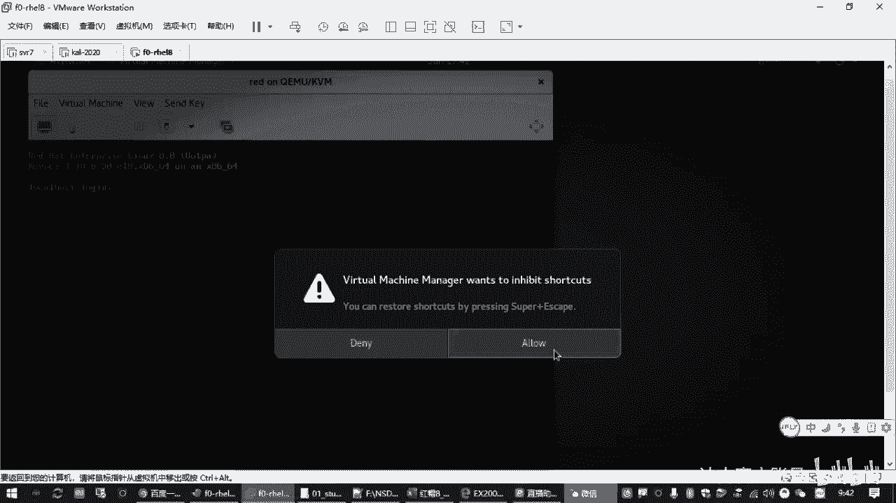

# 全新红帽认证／Linux云计算架构师／RHCE／RHCSA必备课_可零基础入门的教程 - P6：2.01-配置网络 - 达内教育 - BV19U4y1b7qQ

那IHCSA的考点的话呢，嗯上次我们就讲过是吧？那基本上考试的时候，上午它需要有两台机器，下午是6台机器。那上午的时候呢呃在我们的环境里边，这两台机器呢，一台机器用read来表示。就那个训拟机的名字啊。

叫red，因为考试都是在训拟机里面做嘛。嗯，有一台训拟机呢叫red啊，叫红色的。嗯，还有一台机器呢叫那个blue，叫蓝色的机器，对吧？啊，用这两台机器来表示啊，那我们正式考试的时候啊。😊。

那不一定叫readd，不一定叫blue啊啊，但是你知道反正是两个机器，这个是肯定的啊。那名字叫不叫read，那无所谓是吧？😊，呃，然后大体的考点的一个情况呢，嗯在第一个机器啊，re这个机器呢。

大概会考我们14个题左右。那这14个题目的话呢啊包括我们前面的网络设置啊，包括亚源啊，包括去调试slinux啊，还有创建账号啊，创建目录啊，配置NTB时间同步啊。

配置outFS自动自动文件系统改权限啊等等等等，是吧？啊，这些都是非常基础的一些操作啊。那我们今天会争取把它争取给大家呢把这些大部分的要点给大家过一遍。呃，因为咱们是社招班嘛。

相信大多数同学呢应该多多少少都有一点点基础是吧？所以我们过的时候啊，再加上我们上一次课讲了一些基础命令。所以会今天我们过的话呢，会比上一次稍微快一点啊啊，这个大家要先心里有点呃准备啊。呃。

然后blue这个机器的话呢，呃仍然需要我们去配软件仓库啊，也需要啊还需要做一些更加高级的一些设置啊。就比方说磁盘分区对吧？会涉及到磁盘存储的逻辑卷啊，然后添加交换分区，创建逻辑卷。

还有一个新的知识叫什么VDO券，对吧？😊，呃，这在这台机器上呢会有一个叫配置系统调优的一个操作。呃，这个操作的话呢。和我们想象中的可能会呃没有那么难啊，你看系统条又觉得很复杂是吧？啊，其实挺简单啊。

最起码考试的时候非常简单。所以这个一会我们今天就会给大家讲的这道题啊。😊，那这是我们考点的一个情况啊呃，那我们呃讲解的时候呢啊按照我们这个顺序啊，按照我们那个大纲排的顺序。

我们首先来看一下我们的这个网络配置啊。呃，那大家准备这个环境的时候呢，呃我们不是有一个这样的一个讯拟机嘛，是吧？啊，应该多多还多多少少还记得啊F0杠IHEL8。那大家在答题的时候呢。

嗯建议大家呢呃从我们的真机通过远程的方式去连接过去。😊。

所以后面呢呃除了配网络地址这一块啊，然后其他的命令我争取在这个征机这个命令行终端里边啊给大家去演示。因为这样看起来会比较清晰。嗯，但是个别题目呢如果网络不通的情况下，我们会在这个训机里面去演示，对吧？

呃，那其中呢大家拿到这个训机练习环境之后。😊。

大家在每一次练题之前啊啊建议大家呢先把这个瞬接重新还原一下。有一个工具叫HHTVM controll啊，可以reset red。这个就是哪怕你那个read的训机没了是吧？你可以执行一下这个命令。

可以把这个训机呢重新创建出来，恢复到它最初的干净的一个状态。这个大家再来做练习是吧？啊，这是一个好习惯啊啊，因为你考试的时候呢，进到考场考官给你准备好了训机也是啊，刚刚准备好的，对不对啊，全新的啊啊。

这是read训机。那不录训机的话呢，就执行不录啊，就可以了。😊，呃，然后你拿到这两个训机之后呢，呃咱们练习环境，你要去操作这个训机，需要通过activs往下找有一个9个点的是吧？

你要这下面有一个图标啊，你往往往下拉一下啊，就这个图标这个图标点开之后呢，右边有一个叫vitual machineine manager。啊，通过这个去打开。

啊，打开一个讯拟系统管理器，然后你可以找到reot讯机和blue讯机。啊，我这个环境是把下午的几几个训拟机也一起在这里了啊。那你们在没有重置这个虚拟机之前，如果是全新的环境啊，这虚拟机是都没有的啊。啊。

你从事哪一个人哪个就出来了，对吧？啊，这个大家要知道。那所以我我们如果要了要拿到这个readd的训机呢，你在这里双击。

是不是就可以打开这样一个界面啊，那这瞬期的一个显示界面。这个是显示界面呢，你要去控制它，它会有一个提示。所以想控制你的那个快捷键啊，鼠标啊是吧？啊，你单击右下角这个reno选择就可以啊。😊。

对吧这个要确认一下。啊，这是控制试机的一个方式。呃，那考试的时候呢呃我上次给大家讲过一个环境。

那再给大家看一下。就说我们在真实真实的考试环境啊，我们是通过左边这个红色帽子底下这个图标啊，有个VM controltl是吧？熏机控制器打开之后呢，你可以拿到中间这个小窗口。

然后你单击read这个按钮啊，出来一排啊，然后这一排按钮呢，你从左边的start就是开启训机，然后最后面这个rebut是重新还原训机。那你要看讯拟机的界面，是不是倒数第二个有个叫conl是吧？

read Ramm。所以这个就相当于我们练习环境。就刚才我们给大家讲过的哎这个界面。

你别到时候考试的时候，你找瞬机，显示界面你都找不着是吧？那就尴尬了哈啊，所以这个地方呢啊大家一定要知道啊。好，拿到这个环境之后呢，啊我们就可以把鼠标点进去，使用用户名和密码登录。😊，那上午的考试啊。

管理员的账号，那肯定瞬机，他要给你root账号嘛，是吧？然后管理员的密码他会告诉你啊，管理员员的密码他会告诉你就第一个机器。😊，啊，反正两个机器至少它有一个机器，它密码会告诉你的。如果他密码没有告诉你。

那么这个机器它会让你去破密码。那后面我们会有道题要讲在你不知道密码情况下，怎么去破密码，对吧？那咱们的。呃，readd这台机器呢在我们练习环境啊。

它的密码就是read hat啊嗯REDHAT啊回收这样的话就进来了是吧？那进来之后怎么办呢？😊，明办。首先呢要去设置IP地址，对吧？呃，这个上次我们也说了，在我们那个训机里边。

我们是可以去看看那个咱们那个练练习题目，对吧？你可以通过那个火狐浏览器。😊。

嗯，你如果真机和你那个瞬机是通的话啊，呃在你的增机里面也可以去访问。

有那个练习题目啊。来咱们这里访问一下172925。0。254。对吧那这里有1个EX200啊PDF文件，这就是我们上午的一个练习题。嗯，那其实对于我们re这台虚拟机来说呢，呃那第一个题目。

其实就是让你进去为他去配置。主机名啊配置IP地址，默认网关DNS服务器。对吧配这些基本的信息啊啊，那么这些信息的话呃，其实上次我们讲环境给大家讲过，对吧？那你是可以用我们的那个。😊，NMTUI去配置的。

呃，一般考试的时候呢，也建议大家用这个去配置啊。因为在那个界面里边，很可能你那个tabletable补齐啊，什么功能还不全啊啊，有可能啊有可能啊。那这个时候呢，你用我们另外一些命令。

什么N个MCALI呢可能不是特别方便。啊，所以建议大家用这个NMTUI。啊，那在这个工具界面里面啊，大家一般打开，我把过程再给它顺一遍啊，就大家配IP地址的时候，配主机名的时候。

你直接用NMTUI然后呢啊用进去之后第三个。😊。

第三个这个菜单项啊叫st systemem house name。这个就是用来配IP地址呃，配那个主机名的，你点进去啊，再用那个上下电轴切换，切换到你那个要的要要要去打开的那一项。然后呢。

哎回车回车之后呢，这就填空呗是吧？把主机名填好，对不对？😊，那那这个主机名呢啊就是按题目要求的啊，他让你设什么主机名就设什么主机名，设好之后，你按table键到OK这里再回车。

对吧我这里是方便给大家展示啊，我说我这是配好的啊。😊。

啊，那实际上大家考试的时候呢，应该是在我们这个训机那个界面。

就这个界面是吧，是在这个里边啊，NMTUI。所以那个界面呢那个字体啊什么显示可能会比较小，所以大家要要学会去切换啊，必要的时候呢，在这个训机右边这是有个拖动框的，是吧？可以上下去拉。😊。

你别到时候那个显示分辨率不对，那底下那个按钮你看不见，你不知道不知道咋办了，是吧？嗯，这个你要知道啊，然后在这个界面里边呢，切换的时候是用的我们那个t键和上下箭头以及回车键空格键啊这些。😊。

啊，所以这是设主机明啊，你要知道去哪设。呃，再一个呢就是。第一个啊有个叫edit connectionne，一般回车进去啊，大多数情况下呢。你要找到他那个网络设置，对吧？找那个网络设置。

那如果你已经配过啊，就不用管啊啊，但是没配过的话呢，你就要去配，对不对啊，当然我现在连接的是那个瞬机环境啊啊，但是我们在配的时候应该是配哪里啊？😊。

应该是被我们的。

这个乱的这个熏机啊，说你别配配错机器了啊。😊，那进去之后，editconnection。😊，然后你右边往上。找到这，那大多数情况下，就我们考试的时候也是一样，你别管它这个链接链接叫什么名字。

一般情况下就一个连接啊，上午的考试就一个连接。😡，进去之后呢，直接回收就是就是改第一个连接。那打开之后怎么办？😡，你往下找到IPV4啊，configuration是吧？然后默认它是一个自动啊自动获取的。

你要回车。就移动到这个IPV4，右边有个automatic，然后回车回车之后呢啊下面有个manu吧，是吧，选中manu。这是不是就是手动啊？选了手动配置，意味着我们要给它一个固定的地址。

然后你要往右移动一下箭头到SHOW啊秀这个地方再回车，你才能够看到它的IP地址设置这一段。那在这一段里面呢。然干嘛，我们在addresss这里啊要ADD啊添加再回收。然后呢，添加1个IP地址。啊。

这个IP地址呢就按照题目的要求去啊，你不能随便乱设啊，题目要求就是你到时候看题目。

那题目说你这道IP地址要设172。25。0。25，对不对？你要把它给设好啊。

啊，所以我们这里是是IP呃，然后呢网光啊下面有个get way。要把ge位也设好啊，我们这里是172。25。0。254。呃，再往下移一下啊，是DNS服务器ADD是吧？也一样设成172。25。0。254。

啊设好之后再往下。这相当于上次是复习了哈呃找到requireIPV4Hdress是吧？只要需要IPV4地址啊，针对这个连接这个地方呢按空格选中。😊，啊，要要记得选啊，然后再往下有个自动连接，也要选中啊。

autoconnect啊也要选中啊。😊，呃，然后呢再往下找到我们的okK回车。是不是设好了，设好之后呢，再往下，你可以按t键啊，往下你这个下面挡住了看不见是吧？最底下有个bike啊，返回。

所以按一下t键。😊，到bag这里边啊。就这个地方啊，最底下这个地方红色back是吧？然后再回车就返回到这个界面，就刚进了这个界面啊啊，然后呢，到这个界面之后呢，这IP是不是配好了，配好之后呢。

你要激活一下啊。😊，然后再activact啊 a connection。回车进去。来右边滚动条往上拖呃，然后呢呃这个连接的前面有个星号，表示这个是激活的。但是你刚刚改过地址了是吧，要重新激活一下啊。

所以table键移动到右边的这个Dactive好，DD activity这叫禁用是吧？😊，回收一下就禁用了，然后再重新再回车。就它现现在你看它是activate啊。

所以再回车呢就变成Dactivate是吧？啊，你注意观察左边这个状态，前面是信号表示又重新激活了啊。😊，好，再次tableple键到那个b啊，再返回。呃，网络地址。IP地址呃，那个掩码网光DNS是吧？

这一套呢就配好了。呃，然后主机名这一块的话呢，下边st system host name。那我们也把这个改一下。嗯，改成叫red点net0点examp点com啊，可能有些同学这个屏幕小的话。

你看不清啊啊，我这么一边说一边给他给大家操作啊，给大家听我说的啊，然后你一会儿练习的时候呢因为上次大家也练过是吧？应该没什么太大问题啊啊，那这个主机名确认不要敲错啊。😊，然后到OK这里OK回车确定。

之后quiit退出。是不是就搞定了呃，然后怎么办呢？然后你考试的时候也是这个套路。那做完之后呢，你就可以从你考试环境的命令行。😊，怎么着，明天好。

就是找我们考试环境那个真机activities下边有个终端，找到这个终端，然后打开你就可以从你的真机用SSH的方式去连接到你的虚拟机。

啊，一般情况下，你输那个写了个简写的主机名也可以。你要是怕出错了，你写IP地址也可以啊，后面写主机名啊，写了个王者的名字也可以。这种方式呢表示我们从增肌。从考试环节的征记啊。

你每一个同学不也有这台电脑嘛？是吧？从那个真机呢远程连接到我们的你要答题的这台讯机啊，用root账号连过去。如果你这台讯机IP地址、主机名啊、网关DNS都配的是对的，是吧？那你远程连接是没问题的。😊。

啊，当正式考试的时候呢，他会问你要密码是吧？啊你肯定要输入一下啊。😊，嗯，然后第一次连接呢家输入1个YES是吧，接受密钥，然后再输密码啊，就有那一套过程啊，这个大家要熟悉一下啊。

然后之后的操作就在这个read下边啊去做就好了啊。😊，对吧就这样一个过程。啊，这是第一个题目PIP地址啊。呃，那当然其咱们今本既然讲这个题目，就是IB地址设置相关的呢，有一些知识哎。

我们也给大家过一下啊，因为咱们要是要应付你们考试的各种意外情况，所以还是多多少少要了解一些知识啊，要了解一些知识。

呃，然后相关的知识的话呢，我们给大家准备在那个备考笔记里面都有啊。那其中需要我们去了解的知识会包括什么呢？来，我们来看一下。那第一个啊在我们的红帽的八的系统里边啊。

管理管理lininux主机网络它相关的这个设置啊。是一个服务叫做network manager，叫这个服务。那么这个服务的话呢。那我们切换到这个。白底的屏幕啊给大家展示啊。

上次我们讲过stem control啊，控制这个服务的对吧？呃，那其实呢呃咱们社交的应该有很多同学是在工作的是吧？嗯，我们之前在用的什么七的系统啊，六的系统啊啊，大家可能用的都是这个什么network。

这个服务吧，是吧？这个服务在7的系统里面有，但是在8的系统里面已经没有了啊。😊，啊，为啥呢？从红帽七的系统开始，其实它就是推荐我们用的是。这样一个服务啊。叫ntherwork manager。啊。

名字不一样啊，注意大小写第一个N大写第一那后面那个M也是大写，叫网络管理器。所以系统服务这一块啊，大家要有一个认识。因为以前还有很多同学就习惯上用这个小小的letwork服务。

但是你会发现在8个系统里面不好用的。😊，没有这意思吧。😡，所以你不要指望那个。😡，当然啊这个大家了解啊。😡，正常情况下，这个服务应该是默认开机之后自动运行的。咱们一般情况下也不用去管它啊。

除非万一啊真的是万一啊，好像大多数情况下都没有这种万一情况啊，因为你一个主机你网络得通话是吧？所以这个服务呢一般都是开机之后自动运行的，但是大家要你要知道这个知识，对吧？你别去找那个nwork服务了。

😊，呃，然后关于这个服务控制，上次我们讲过是吧，主要用到的就是这个stem controltr，跟上start启动服务。如果你跟的是stop，就是停止服务。

那类似的操作re start重启ts呢是用来检查你这个服务是否正在运行。如果你看状态的时候呢，他告诉你这个服务是editiverun。那就表示正在运行，对吧？那如果你把服务给停止了，那就是停止了，是吧？

一般就是一个呃inactive就不激活的啊，括号里面可能是一个叫dead啊，DEAD死了是吧？啊，服务就是停止的。😊，啊，这是关于这个服务的一个控制。呃，然后呢我们如果希望这个服务开机之后自动运行。

是不是一个叫enable啊，对吧？enableable可以把一个服务呢设置在下次开机的时候自动启动。啊，还有一个二合一的操作，就是你既设置它下次开机之后自动启动。同时呢也让它马上启动。杰哥刚刚闹啊。

上次好像讲过是吧？啊，反正就是一套的这个操作啊，我们用到的一个工具，主要的就是一个system control啊，上次给大家提过是吧？叫叫叫叫这个叫系统控制器。😊，呃。

如果你想检查一个服务是否是自动启动的，是否是正在运行的是吧？它有个叫is enabled啊，is active，对不对？啊？这个大家如果等你支持那个table补齐的时候啊。

你可以tabletable补出来的啊。😊，这是关于服务控制。嗯，那其实在红帽7和8的系统里边呢，系统管理器也不是我们之前的那个init了啊，它改了一个名字叫system D。

那可能它有链接指向stem D对吧？但是呢它的真正的那种控制程序核心啊叫sstem D。所以它的配置的话呢有个叫配置单元的一个概念。😊，啊，什么叫配置单元啊？

就是在我们一台红帽的系统上面准备一套资源啊啊，有一个单位啊，这叫单元。那大多数情况下呢，我们用的最多的就是服务嘛，是吧？比方说你要开启一个网站，你需要准备端口，准备服务程序，准备它的网页目录，对不对？

这一套资源啊，组合到一起，组成一个叫服务。😊，那后面我们搭网站的时候呢，起一个服务就是1个HTTBD对不对？😊，那其他的呢还有一个叫比方说叫tart，叫目标模式。对吧啊然后像我们图形模式呀，然后那个呃。

没有图形的那种文本模式啊嗯，还有上次我们。啊，还有其他的一些类型啊等等等等，对吧？嗯，这是系统控制器啊，它能控制的一种方式。😊，呃，然后我们配置网络这一块的话呢。有些什么？就是大家要熟悉一些命令啊。

有一些命令呢是马上就能用的啊，临时配置的啊，但是这些命令呢可能要装好包之后才有啊啊，你们要装软件包的时候呢，这些命令可能没有。😊，🎼呃，比方说呢嗯相信很多同学会会比较熟悉的什么if跟we，对吧？

但你会发现这个明题不在啊，没有啊。😊，呃，if confi的命令呢是用来看IP地址的，对不对？😊，啊，还有什么hos name呀，看主机名的吧，是吧？啊，上次我们讲过啊，其实看主机名呢在红帽期开始。

有一个命名叫host name controll。😊，可以显示的更加完整。啊，这也是看主机名的。呃，那大家主要观察我们第一行。

如果有一个stistic host name表示你已经设置好了静态的固定的主机名。那如果你要单独的去设置一个主机名呢，啊一般建议大家在我们7期以后的系统，建议大家用这个用这个工具啊。

这个工具呢它可以直接设置你当前的主机名，也可以把它保存下来，让下次下次开机之后，仍然用这个主机名。对吧这是它的好处。嗯，大家之前有些同学应该用过这个host name，但是这个是临时的。😊。

你如果没有把它保存下来，那以后一重启，那你原来是主机名是啥哈，还是啥，对吧？这个大家要了解。那hos name control呢，如果你想用来设置主机名的时候，那我们用来用来干嘛？

用一个后后边有个叫st host name啊。有个这个操作，后面然后跟上你的主机名。这个可以去设置啊，设置新的主机名。呃，设置好的新的主机名呢，它会保存在ETC下面的hos name啊，这个大家注意啊。

是存在这。不像我们之前的老的系统啊，是存在什么ETC下的ss confi，什么network是吧？不是这里啊，换了个位置，ETC下的host name啊。😊，是这个命。对吧那这是呃主机名的一个设置。

那其他的还有一些指令呢，像我们的。嗯。啊，roote杠N啊这些是吧，也可以看看啊。😊，root杠N啊，你会发现这个命令也没有啊，还有用来检查DNS查询的是吧？啊，host去检查一个域名能不能通啊。

像read点net0。1个点com啊，你会发现呢host的命令也没有。所以咱们这个环境啊，这些命令，它没有装包啊，缺一个包缺一个包叫net to。装了这个包之后，它才会有。啊，但是呢我们用到的时候啊。

一会儿我们后边做练习，会把这个给大家把这个包装上。嗯，大家考试的时候呢，因为应该这个包是装上的啊，这个大家你可以稍微心里踏实一点啊呃就算你那个。😊，呃，样品员还没配啊，是吧？

但这些基本的包好像应该是装上的啊，但我不能给你保证啊，所以你要做好这种应对的一个准备啊，万一没有也没关系是吧？只要你知道去配源配好源之后呢啊然后再把它给装上就好了。😊，对吧。😊，呃，那我们在配置的时候。

假设这些工具没有，那我们怎么配IP啊，那就是NMTY。对不对？就这个。就开始我们给他讲过的这个工具啊。所以这个是最靠谱的好，当然还有1个NMCLI这个命令也很靠谱啊，但是不好的地方在哪里呢？

就咱们练习环境，它不能特步键补齐。😊，啊，你也得去装一个包，我们上次讲过吧，是吧，要装一个拜。😊，Compilation。如果你装了这个包之后，能够补齐的话，那么用刚才我们讲过的NMCLI这个命令。

那非常容易啊非常容易。那这个命令呢嗯我们大家给给给大家说一下这个用法啊。啊，就一会我们后边装上那个补脐带包之后，呃，你就就可以去试一下，对吧？呃，那用法怎么用呢？一般情况下有这么几种啊。

这是给大家补充的啊，因为你们可以用啊，对吧？嗯等等你们工作当中有时候要写脚本啊什么的，肯定是要利用这些命令行的工具的。你在脚本里面，你要去用那个N个MTY这不方便嘛，对不对？😊，呃。

那NMCLR呢这个命令代表的是啊network。啊，command line啊in啊，就是那个网络管理器的命令行界面。那他的操作呢呃如果你这位就补齐的话。现在它补不出来是吧？

他后面会告诉你后面有几个操作，最常见的操作呢，一个就是这个device啊。😊，device的话呢就是用来管理设备的。他可以用来查看。网络连接设备的一个状态啊，这个是用的最多的啊，他可以告诉你。

你现在有哪一块网卡，比方说这个设备啊，device就是网卡的名字啊，然后哪一个连接配置在用你这个网卡，有个叫connection对吧？啊，ENEMPES0啊，就是查看你网卡的一个状态。

不管你这个网卡有没有配置啊，有没有一个连接给他配个IP是吧？无所谓这个操作都能看到啊，都能看到。嗯，还有一个操作呢是。叫connection。So。对吧。这个是以连接的方式来看，就看你有哪些连接。

那刚才如果大家没有给你的网卡配过IP地址配置的话啊，你可能这个地方你看不到。但是上边这条命令你可以看到这个设备。😊，但是你看连接的时候呢，下面这条没有啊，就像我们这里一样。

比方说你回环接口LO你是有这个虚拟的网卡的，但是呢我们并没有给回还接口配IP地址吧，是吧？它是默认的啊，没有给它建立配置啊，所以下面没有LO来一个连接。😊，OK吧是吧，所以这是两个操作。嗯。

当然像这个连接这个配置啊。😊，大家肯定觉得这个敲起来太长了是吧？如果能table见补齐，这一补就出来了，还真是好处。但是没有的时候呢，这个地方大家可以简写成CON。😊，作用是一样的啊。

所以这是用来管理连接的。那管理连接的这个操作呢，大家可以稍微扩展一下后面有哪些操作啊。比方说我们要改连接啊，用modify。你可以叫MODIFY啊，叫modify。那简写的话呢，就是MOD对吧？

这叫修改啊。😊，那修改的时候，后边你要改哪一个链接？比方说叫ENPES0，跟上连接的名字。那你改连接配置怎么改啊？😡，可以改它的配置网网络地址的一个参数的一种方式。比方说IPV4叫med啊。对吧改这个。

然后后面呢呃配置的方式是什么？如果是自动获取，就是auto。如果是手动配置MAN。这其实叫manu啊手动。那如果你是手动给他配IP地址，那你要怎么办？你需要去指定IPV4address啊。

这个完整的是这个，但一般我们可以简写成IPV4点ADD。等一有T不见你就T不出来了啊啊是这样的啊。😊，addresses啊IPV4地址，然后后面呢172。25。0。25斜杠24是吧？这是配IP地址。

然后IPV4点get way。Yeah。就是配套的默认网关。对吧是这个样子的。呃，然后配DNS的话就是IPV4的DNS172。25。0。254。呃，后面还有一个呢自动激活，就这个玩法要自动连接啊。

每次开机之后自动连接啊，那个有个有个操作很长啊所以一定大家呃等你用那个NMTUI配好之后，如果你还想用用这些工具啊，就大家你得要要用那个什么。😊，有抓那个不知动补权那个包啊啊，那个配置叫什么呢？叫。

Connection。这叫连接，然后后边点分隔有个叫alto。AUTO connect。A connectect。这叫连接自动激活。空格yes对吧？这是一个正常的网络连接的一个配置。

就你用NMTUI的一串啊，其实就是相当于这一串。这一串大家用的时候呢，如果你觉得麻烦，可以分好几条啊。就你可以配到啊IP地址这个地方基本上就可以一条，然后下面再来一条。😊，修改这个链接。

然后加上网关DNS是吧？也行呃，然后单独再来一套配这个自动激活也行啊，无所谓啊。所以这是如果大家要配这个连接的时候啊，我们用到了一种方式，就这里有一堆用法啊，大家一会后边呢可以去参考一下。OK吧啊。

因为咱们练习环境呢这个答题啊，包括考试环境答题啊，这个操作大师大家都是会的啊，这个相当于是给大家另外补充的一个备用的一个方法啊啊，大家工作当中也能用得到，对吧？嗯，那配置好IP地址之后。

这就刚才我们所说的，你分开去做啊，你可以单独的敲这些一条一条命令啊，去分开去设置它相关的一个地址。😊，呃，但是你配置好地址之后呢，你还需要做什么？😡，你还需要激活，那激活的操作呢？

🎼叫NMCLI connectionne connectionne啊，然后up。再跟上你的连接的名字。啊，大家记住啊，等你做好那个自动补全的那个包之后啊，其实这些这些都可以补出来啊。

都可以按tablel键啊，只要你前面敲的是对的，都可以补出来。嗯，那现在我们给大家展示的这个操作呢，叫激活一个网卡连接。呃，如果你改过一个配置之后呢，你直接激活就好了。

不需要像我们刚刚用那个MMTUI先禁止激活是吧，然后再重新激活，不需要。除非你个别情况下啊极个别情况下。啊，要不然正常你直接up就行啊。😡，你先 down，然后再up也可以啊，也是可以的啊。

就刚才我们讲过的这两个啊，一个是停止，一个是激活是吧？呃，然后呢这个操作呢，其他的用法我就不跟大家多说了啊，就包括如果你原来没有连接。就是你用那个NMconnection秀，你看不到连接也无所谓。

你可以去增加一个连接啊，这个具体的用法呢在这。用ADD添加一个连接啊，通过connnection name指定连接的名字，然后呢if name去指定它的一个接口的名字，typepe指定以太网有线连接。

对吧？你不想要的连接，你加错了，可以dele删除啊，都是可以的啊，都是可以的对吧？这是网络地址配置这一块相关的一些知识啊。今天应该是个M。欧地。这修改连接啊，修改连接应该是mod。呃，简写成那个。

MOT也可以啊。好，我给你纠正一下啊。嗯，那其实呢。啊，不管这一块知识有没有讲啊，这是额外补充的啊，咱们要对我们考点相关的知识要做充分的了解。嗯，但是如果大家考试的时候呢，啊比咱们这个简单，对吧？😊。

啊，就是开始我们给大家讲的，你在那个练习环境呢，你只要。

进到这个界面里面，用NMTUI给它配好就行。配好之后，你测试的时候，从你的考试的这个真机啊，再再去远程能连过来就搞定了是吧？就搞定了啊，然后你搞定这个之后呢，然后下一道题是吧，我们要做的是什么？

就是你得配那个样本源嘛。配好样本源之后，然后你再去装软件包嘛，对不对？

Yeah。呃，上面那个同学问的瞬机用NMTUI添加完IP之后，怎么看本机IP地址是吧？呃，如果看IB地址的话呢。呃，有一个命令就是你没装包也可以的，有个叫IP。address list啊。

这个大家可以参考一下。有个这个命令。这个默认都有的1个IP命令啊，这也是看看IP地址的。呃，if can那个命令的话呢啊就大家可能需要装那个net to那个包啊，之后才会有。

