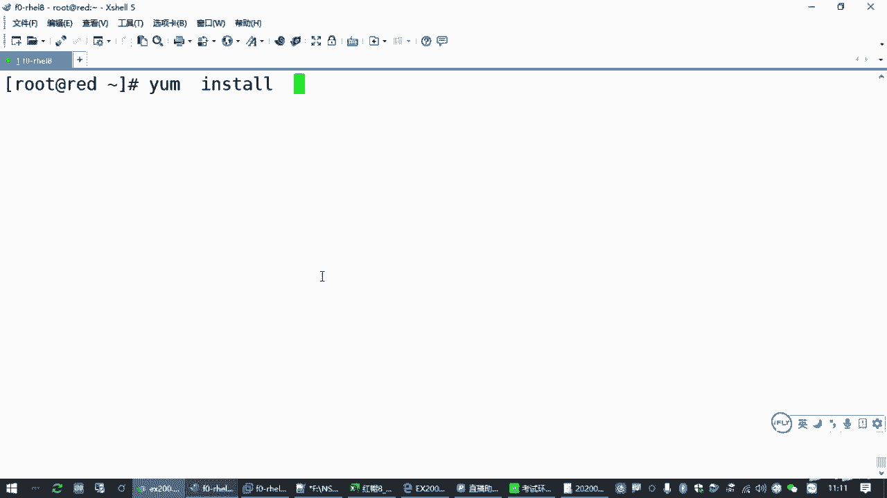
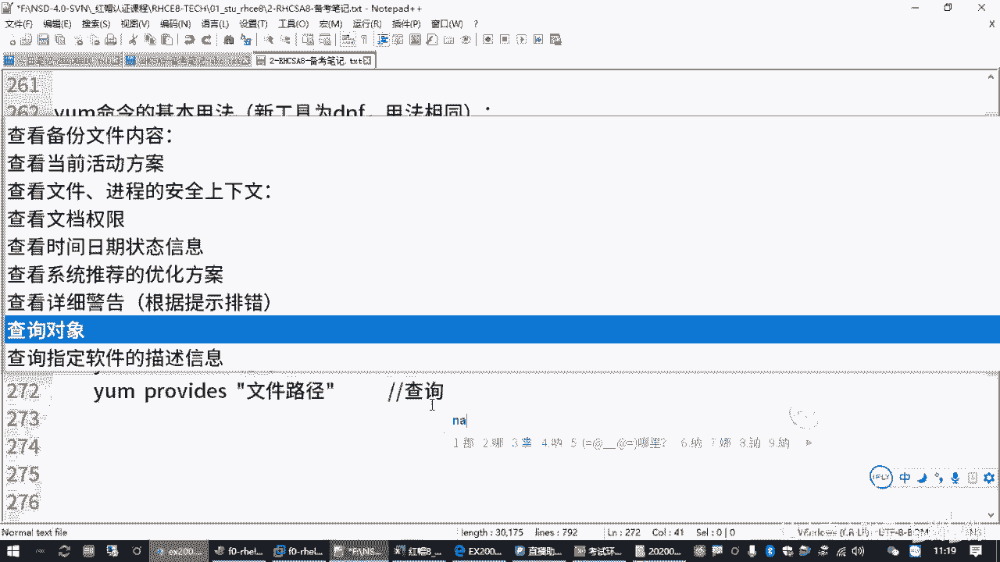

# 全新红帽认证／Linux云计算架构师／RHCE／RHCSA必备课_可零基础入门的教程 - P8：2.03-yum-dnf软件管理 - 达内教育 - BV19U4y1b7qQ

Okay。呃，那我们继续刚才我们讲到的啊亚母原。

嗯，那这个做好之后呢，其实关于这个亚目源的话，你配好之后，我们还有其他的题目呢，大家也了解一下。呃，其他题做啥？就你配好这个软件仓库之后，我们是用来用的吧。

是不是用来用的，对不对？那怎么用呢？我们要了解软件包管理的相关的一些操作啊，要了解软件包管理的一些操作。

那接下来呢我们看一下我们的这个y母工具的一个使用啊。

呃，ym命令的话呢，这个本身在8的系统里边啊，它换了一个名字叫DNF啊，叫DNF所以大家用DNF也行啊，用法跟我们ym的基本基本上是一样的。咱们大多数同学应该用的还是熟悉这个ym。

所以我们笔记里面讲的也是ym。那大家如果你想用DNF没问题啊。😊，但是新工具用DNF其实包括我们下午的考试，用那个安ible中间有些模块啊不一定都换成DNF。所以暂时在红猫8。0这个阶段啊。

建议大家还是多用这个ym，你会你会发现用的更顺手啊，对啊，就就这个目的啊，那用yM的时候，用那个用用那个DNF也好，用样美盒都行啊。包括刚刚我们讲过的那个。

呃，yrap list。是吧就是查看你当前的仓库，那大家也可以换成DNFre list是吧？一回事啊一回事。啊，你要觉得哎，你看我们学过扒了，我们就用DNF啊，是不是也行啊，那没毛病哈，没毛病啊。😊。

好，那后边我们讲例子的时候呢，嗯就还是用这个亚姆啊啊那用亚母命令在管理软件包的时候，这个大家必须会。因为咱们后边有些题目就是要装软件包的，你不装软件包，那没没法干活呀，是吧？😊。

啊，所以ym这个工具呢，我们要了解几个方面的用法。那一个呢就是查询软件包，还一个就是安装卸载软件包。那包括刚才我们讲过的啊，reb list是吧？这是列出有哪些仓库啊，列出有哪些仓库。嗯呃。

类似的这些操作呢呃大多数情况下我们都是用yam开头，然后空格跟上它的一个指令。根据这个指令的作用啊不同，它的名称也不同。

那，比较常用的呢，让我们了解一下。有这么几个。我给你在后边再补充一下吧，咱们讲的时候就给你讲完善一点。那要么肯定哦这是清除缓存啊。清除缓存。就是你的这台机器连到圆之后，它会把那个圆里边有哪些包那些数据。

给你下载到本地，对吧？那如果你清楚的话呢，就是就没了，对不对？你又得重新重新去获取。呃，然后呢。下面这一条啊rap list这是刚刚我们给大家讲过的是吧？嗯，这个呢是。

用来干嘛呢？是列出可用的仓库信息啊。

啊，有哪些信息或者叫源啊。圆嘛，仓库。那我们指的一个意思是吧？可以。这用来做这个用的啊。呃，那我们刚才还讲过的安卓软件包是不是用了一个ym杠Yinstore啊，对吧？这是安装指定的。软件包。Yes。

那大家在安装软件包的时候呢，嗯注意它的一个用法啊，正常来说最核心的就是这个样这就是这个inststore啊inststore嗯，那inst store呢它后边你要装一个软件包，就把一个软件包的名字写上。

如果装多个用空格分开写多个。😊，呃，而且安装的时候呢，如果你那个软件包。

你名字记得不全，你可以用双引号引起来，里边用通配符啊。比方说lashCOMP新号，啊，有时候大家可以用这个方式。对吧你这种方式你去装，你可能会啊也能找到那个包啊，不是raplist的。

是那个intall。对吧用这种方式。Yeah。She。呃，然后呢yint bash comparison。啊，没找着是吧啊啊，找到了他找到这个包，他告诉我已经装了吧，是吧？所以这就是偷懒的一种方法啊。

这是安装软件包的时候，安装软件包的时候啊，那这么看。😊。

那呃我们换一个包啊。😊，来再讲一下另外一个用法。那如果你能记住这个包啊，一般大家呢就记住直接写包的名字。如果你记不住了，有时候这个包的核心的命令，你敲了个命令也是可以的。比方说我们说那个VIM对吧？

现在红帽八的系统里面越来越完善了啊，有时候你写一个包写的不完整，写了个命令，它也能给你找到那个包，对吧？也能装上。所以刚才我们讲了个装那个VIM in has。😊，其实大家在用的时候。

你就写个VIM也是可以的啊，也是可以的。因为你那个包的名字很长，你万一写错了要装不上，对不对？😊，OK吧呃，然后呢我们换一个包，就大家看一下杠Y那个含义。比方说我们在装一个软件包的时候呢，如果新的包。

哎，这里默认是装过的是吧？啊，再换一个吧。我换一个没装过的包啊，这个扫描的一个包。

那比方说呢我们装一个新的软件包，那你在装的时候。他会问你。😡，这个软件包呢一共啊要下载多大，装完之后要占多大是吧？问你是否确认。那如果你做了很多波，他其实都是会为你确认。😡，你要输一个Y啊才能去安装。

如果你输一个N呢，咱那就是不安装啊。

是有这样一个过程。所以大家就在装软件包的时候呢，有时候咱们管理员就是为了偷懒嘛。😡，我都已经明确的告诉你了，我要装这个包，你干嘛还要问我确认。😡，所以呢啊很多人就偷懒，直接敲一个杠Y。

那杠Y的作用就是告诉你这个亚门命令说你就装就行了。你别要别要我确认了。如果问is this ok，你就自己回答yes。对吧就起这个作用的啊。😊，那我们后面在删除软件包的时候，也可以用这个。

对吧也是一个告文啊，自动回答yes。😊，那么他就会自动去找啊，找了个包，自动确认最后装上了对吧？就这叫装软件包啊。那除了装软件包以外呢。😡，我们还可以去查询软件包。那查询软件包的话呢，一般我们用到的是。

呃，list啊list。这是列出软件包的安装情况。列出软件的。安装情况。那包括你软件的版本。

对吧比方说呢。y样list我想查一下HTTBD这个包有没有装，那你在后口杯后边呢打1个HTTBD就行了。如果这个包已经装过了，它下边会有一个列表，告诉你这个包的名字。

和它适用于64位的系统是吧？然后中间是它的一个版本。后边呢是它的来源啊，如果前面有个艾符号，表示这个包是已经装过的。对吧如果没有按特符号，它后面有一个软件来源，说明这个包还没装。另一方面。

你怎么制道这个包装过了，它前面不是有一个叫instled packages嘛，是吧？列在这这一栏下面的也是装过的包。啊，前面这一堆一嘛，大家就不用管啊，都是一些这种提示信息。😊，对吧这是列出一个包啊。

列出一个包。当然你可以列好几个包啊，不一定列一个包。这查询。啊，如果你列包的时候呢，你会不会啥都不跟。😡，这是列出所有的包。包括已经装的，包括没有装的。

对吧那比方说最后这一块。就是从APP stream这个圆和贝斯OS这个圆能给我们提供的这些包。那现在没有装的是吧，都在这里边。

OK吧是吧，那前面这就好长啊，你可能要加一个。😊，这个大家学过就学过了，没学过，我就这一提了啊，你加一个分屏的去看啊。一开始有很多包都都是装过的。😊。

这是installed packages是吧？

对吧然后包的名字、版本安装情况啊，已经装过的啊，这个arna啊是安装向导程序，就装系统的时候装的啊。对吧。那我们说出来啊，刚才我们讲过的是y list啊。😊，这个可以列出所有的包。

也可以呢列出某一个包或者某几个包都行。这可以了解它的一个安装情况。那如果有一个包没有装怎么办？😡，他是什么样一个情况？来我们看一下。如果这个包没有装。

它的列出来的情况呢叫available packages。

啊，就aventable package可用的软件包啊，那就是没有装的那后面会有一个来源的名字，但是前边没有这个ad符号。

啊，大家做这个命令操作的时候，列出信息会很多啊，但是呢。😊，嗯，大家要看要点，要看关键点啊。那我们查软件包为了啥，就看这个包有没有装嘛。那通过这些信息，你就可以知道这个软件包有没有装。

另外呢你可以知道它的一个版本。

对不对？这是列出软件包，查看软件包的信息，你可以了解他了解到它有没有装。那除了已经装的包是这种样子啊，然后呢，第二种情况就是这个包没有装。但是我们的软件源呢能提供。

就是这个样子啊available packages。

那还有一种情况。可能你这个包没有，你也找不着。😡，啊，不仅仅你现在这个包没有装，而且呢你在原里边也没有给你提供这个包。这个时候他的提示是报错。啊。

会告诉你alno matching package to list。就找不着这样的包是吧？啊，那要么你的园里面没有，要么你的包名字写错了是吧？就都找不到。比方说IIR这个压缩压缩包啊。

这个红包这个园里面就没有，对不对？你得单独去下载啊，所以这是查看人家包的时候需要了解的。😊，啊，那当我们知道一个软件包的名字和它的版本以后，如果我想知道这个软件包软件包更多的信息怎么办呢？

那这个有一个操作叫EM info。

info就是information嘛，是吧？

这是了解或叫查询。查询。

某个软件的。它的描述信息啊。这个就是有时候我们想装一个软件包的时候，我在装之前我能不能先查一下？

或者我装了之后，我想查一下这个包又能干嘛的呀。😡，比方说刚才不是让大家装了个balash杠comple嘛，是吧？😊，这个是我告诉你们的，我说这个包能够自动完齐自动自动完成，做table补齐。

那到底是不是这样的呢？哎，咱们y informationin是吧？y info看一下这个包。到底是干嘛的？他就会出来一大堆啊，都都是英文的哈。😊，他会告诉我这个软件包叫什么名字，然后呢，它的版本是吧？

呃，然后什么发布平台呀啊然后。😊，往下看呗，来源。从哪个原来的是吧，装的是吧？然后下面看哪个地方是描述吧。😊，呃，一个地方summary这叫摘要是吧？简短的描述。

还有一个呢description详细的描述，对？就这个。你可以借助一些翻译工具啊，他告诉你这是干嘛的，是吧？😊，这叫可编程的自动完成的命令行工具是吧？那翻译过来，其实就是一个集合啊。

针对我们Cll命令行的功能啊，能够提高这个很灵活的一个自动完成功能的特性的一个集合。对吧因为这个自动补漆也不是万能的嘛，它有些功能它给你设置了，那就有没有设置，那就没有。😡，啊。

所以刚才我们重点啊顺便讲了一下这个例子。那亚门in是来了解一个软件包用来干嘛的，你也可以去fi看FF box呀。

他告诉你finfox。

是么在了公司啊火狐浏览器。

啊，这是一个开源的网页浏览器。啊，设置了针对标准兼容性是吧？然后性能非常优秀和什么便携性啊什么一堆嘛。

对不对？这是了解软件包的一个信息。那另外还有一种情况呢？还有一种情况是什么呢？就是我们那个。

啊，查看一个命令是哪一个软件包我提供的？这有一个叫prorovise。这两个呢咱们考试的时候用的不大啊，用用不大到啊，但是给大家提一下。就有时候你缺一个命令，我不知道哪个包能提供。

所这个呢是用来查询哪一个软件包能提供。

某某不。或者说某某文件更准确。

那有时候我缺一个缺一个文件。比方说我缺一个那个VM命令，但是我忘记是哪个包能给我提供了。或者我缺一个什么root命令，开始不是没有吗？是吧？那我咋知道是这个root命令。😡。

我咋知道这个root命运是由nett two是这个包提供的，我不知道，那这个这种情况下是是不是大家是要去查询啊？对吧你要去验证，那怎么查呢？就是yplwise啊。这英文单词provis就是提供的意思。

就谁能给我们提供root这个命令。但是这种用法不是标准的用法啊，但是大家习惯上能想到的一般就是这么去用，对吧？在以前的系统里面，你这么用是不行的。但是八的系统呢，它有个好处。

就他能够自己给你去找这个命令，看能不能找到。在以前的老的系统里面呢，我们是应该把这个命令，把这个路径写全的。😊。

对吧是应该规范的用法，应该是。这么去用的。这么去用的啊，咱就说那这个路径我哪记得住啊，我都我都不知道这个命令是哪个包提供的，我也不知道这个命令在哪装都没装，我哪知道是吧？😡，那还可以用什么？

还可以用星号。通佩服。所以这是一种方法啊，大家可以了解一下。对啊你可以找一个文件，但有时候你装包的时候，不是缺一些什么库文件啊什么的是吧？只要那个软件包在你的原里边，大家可以用这种方式去找啊，可以去找。

😊，嗯，在8的系统里面呢啊有时候。一个简便的方法就是我们直接输命令。我就缺个命令，我直接要ympro去查。那他会告诉你他就找命令啊，就告诉你哪个包能提供这个命令。😡，那普通的文件都不算是吧？😡。

那他会告诉你看有个net to，是不是这个。那包括比方说。大家一看if can make的命没有找一下呗。那告诉你们是不是还是net to，对不对？所以这是给大家讲过的。😊。

y命令的pro这个用法啊，查询哪一个软件包能提供什么什么文件。啊，你可以就写一个命令啊，就提供哪个命令。那其他的还有针对关键词去搜索软件包的。因为你不一定知道每一个软件包的网整的名字啊。😡。

搜索呢主要针对那个软件包的名字，软件包的描述啊去搜索啊，这是根据。根据关键词搜索。可用的或者叫搜索相关的。软件对吧？他去找嘛。😡，好，这是比较常用的啊。那其他的呢还有几个大家就看一下就知道了啊。

其中有一个inst，刚才我们讲过是安装，然后和它相反的卸载软件包。就是雷木啊。卸载指定的软件包。你也可以卸载很多个啊。😊，然后升级。这是当你的软件源里边有更新版本的软件的时候啊，这叫升级软件包。

怎么样算你软件不ok吧。😊，update就更新升级嘛。啊然后还有一个reint。😊，呃，瑞银斯多呢叫重装啊，重新安装。重装指定的软件包。那，重装啥意思啊？就是。相当于先把这个软件包卸载，然后再重新装啊。

但是呢这个重装的过程它可以有个什么好处，可以找回。丢失的文件。或者你被你改坏的文件，你把它可以删了，然后再重新装就可以找回来。但是如果你直接是改坏的，你没有删不行啊。😡，他认为你管理员改的优先啊。

他会给你保留。所以一般需要重新装一个软件包的时候，会把你改错的文件包那些文件呢要先删除。然后再重装。嗯，为啥要用这个？我直接轮我再in store不行吗？😡，Yes。它也有它的好处啊。

因为我们在卸载软件包的时候，软件包之间软件包不是有那个。😊，依赖关系嘛，所以我们在卸载指定的软件包的时候，会同时。卸载。相关联的那些依赖包是吧？依赖包啥意思啊？就你卸载软件包A的时候。

如果有个软件包B离开你A就活不了了，那么它会把软件B一起卸载。对吧同时卸卸载啊依赖词软件包的其他软件包。就这是副作用。Yeah。那同样安装软件包的时候呢，会同时安装。此软件包依赖的其他软件包。

建你去买一个全聚仔烤鸭。全球的烤鸭要吃的要更爽的话呢，那个那个那个烤鸭店是不是会给你配的些什么鸭饼啊、葱啊、黄瓜丝啊什么的。对不对？那些调料这叫依赖的那你不用专门说嗯，你去全球的那个烤鸭店呢。

你跟他一说上一套烤鸭。它自动就给你上来了，对不对？所以安装的时候呢，其实你安装一个包可能会装很多包。你卸载的时候，你卸载一个包可能也会卸载很多包啊。😊，明白这意思吧，是吧？啊，那重装的话。😡。

他只是把那一个包的东西给重新。把丢失的文件找回来，依赖包呢不影响啊，因为你走了还要回来的嘛，是吧？它不影响依赖包啊。😊，不影响依赖不。这个大家如果对这个不太熟悉的话啊，你回头。根据我们写的这个笔记。

好好。😊，理解一下。那其实我们要命令安装软件包啊，或者用DNF啊，基本的操作就是这么几个啊，就这么几个。

