# RHCE红帽认证全套入门教程：P10：2.05-SELinux调试

在本节课中，我们将要学习如何调试SELinux，以解决因SELinux安全策略导致的服务（如Web服务器）无法启动的问题。我们将从检查Yum源配置开始，逐步深入到SELinux的基本概念、模式切换、策略管理，并最终完成在非标准端口（82端口）上启动HTTPD服务的实战任务。

## Yum源配置检查与排错

上一节我们介绍了Yum源的基本配置，本节中我们来看看如何检查和排除Yum源的配置错误。

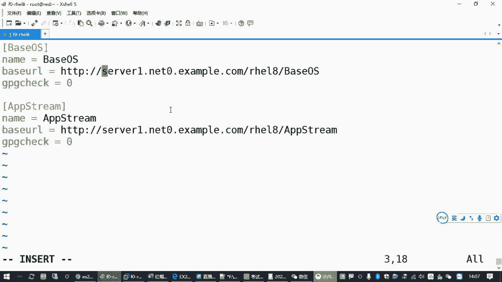

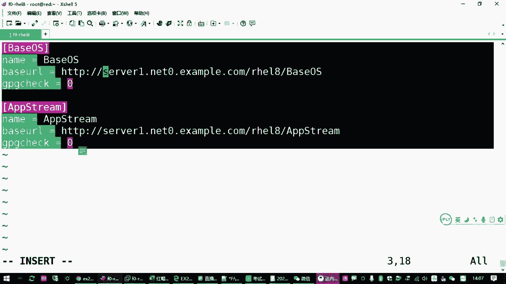

执行 `yum repolist` 命令是检查Yum源是否可用的最直接方法。如果命令执行成功并列出仓库信息，则说明配置正确。如果配置有误，命令会报错，例如提示“无法同步缓存”或找不到仓库。

Yum源无法访问通常有三种原因：
1.  服务器端不可用（例如提供的源地址服务未开启）。
2.  客户端网络配置错误（例如IP地址、子网掩码、DNS或默认网关配置不正确）。
3.  Yum源配置文件本身存在语法或内容错误。

以下是检查客户端网络配置的常用命令：
*   `ip address list`：检查IP地址和子网掩码。
*   `route -n`：检查默认网关（需先安装 `net-tools` 包）。
*   `cat /etc/resolv.conf`：检查DNS服务器配置。

如果确认是配置文件错误且难以排查，最快捷的方法是删除并重建配置文件。可以删除 `/etc/yum.repos.d/` 目录下所有以 `.repo` 结尾的文件，然后重新创建正确的配置文件。

在重建或修改配置文件后，可以执行 `yum clean all` 命令清理缓存，再执行 `yum repolist` 查看是否修复成功。务必注意配置文件的细节，例如方括号 `[]` 内及行首不应有空格，URL地址中不能有空格或中文字符。

## SELinux基础与模式管理

在解决了基础环境问题后，我们进入本节课的核心：SELinux调试。首先，我们需要理解SELinux的基本概念和工作模式。

SELinux（Security-Enhanced Linux）是一套由美国国家安全局（NSA）贡献的、基于内核的安全增强机制。它为Linux系统中的进程和文件对象提供了强制访问控制，例如限制Web服务只能监听特定端口。

SELinux有三种运行模式：
*   **enforcing**：强制模式，策略规则被强制执行。
*   **permissive**：宽容模式，策略规则仅被记录而不强制执行，用于审计和调试。
*   **disabled**：关闭模式，SELinux被完全禁用。

永久修改SELinux模式需要编辑 `/etc/selinux/config` 文件，将 `SELINUX=` 的值改为上述模式之一，然后重启系统生效。

若想临时查看或切换模式（重启后失效），可以使用以下命令：
*   `getenforce`：查看当前SELinux模式。
*   `setenforce 0`：临时切换为宽容模式（permissive）。
*   `setenforce 1`：临时切换为强制模式（enforcing）。

## 服务端口与SELinux冲突

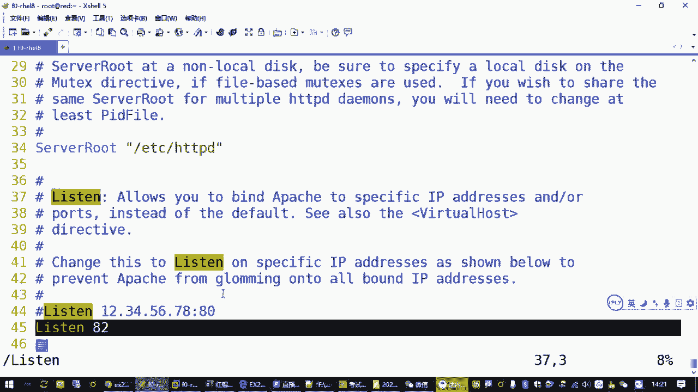

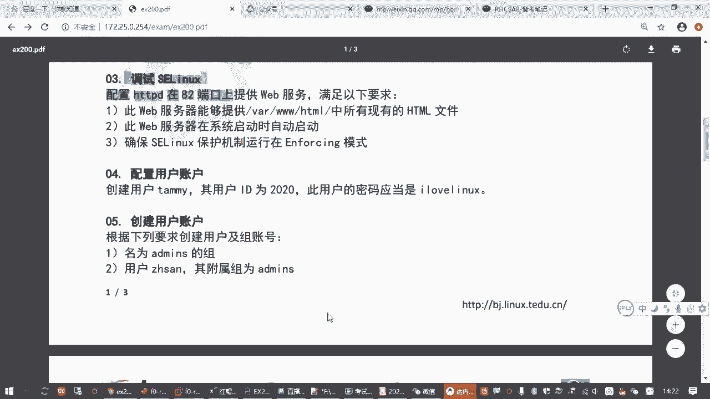

我们的实战场景是：配置HTTPD（Apache）Web服务在82端口运行，但默认SELinux策略禁止HTTPD监听非标准端口（如80、443、8080等），导致服务在 `enforcing` 模式下启动失败。

HTTPD服务的主配置文件是 `/etc/httpd/conf/httpd.conf`，其扩展配置位于 `/etc/httpd/conf.d/` 目录。监听端口的配置通常在一个独立的配置文件中，例如可能存在 `Listen 82` 的指令。考试要求不能修改这个端口号。

因此，解决问题的思路不是关闭SELinux，而是修改SELinux策略，允许HTTPD绑定到82端口。

## SELinux排错方法与工具

当服务因SELinux策略启动失败时，我们需要借助工具来诊断和修复。红帽系统提供了便捷的排错工具链。

首先，安装SELinux故障排除工具：
```bash
yum install setroubleshoot -y
```
安装此包后，SELinux相关的拒绝信息会被更详细地记录到系统日志中。

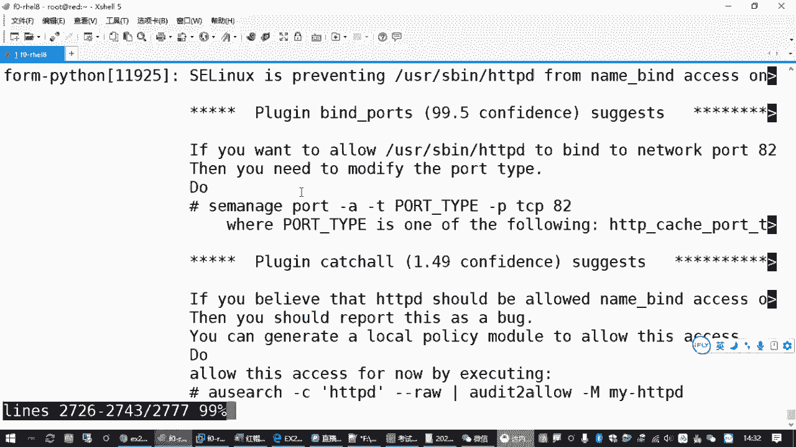

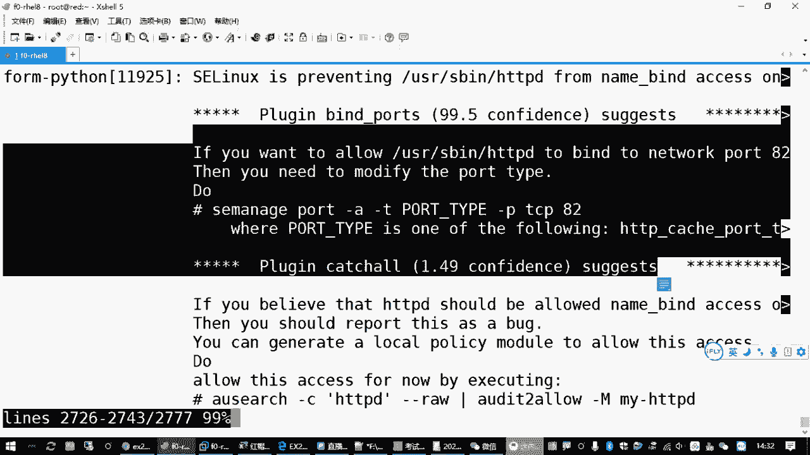

然后，触发错误以生成日志。尝试启动HTTPD服务（此时应会失败）：
```bash
systemctl restart httpd
```
接着，查看系统日志以获取具体的错误信息和修复建议。推荐使用 `journalctl` 命令查看最新日志：
```bash
journalctl | grep -i sealert
```
或者直接使用 `sealert` 命令查看最新的SELinux警报。在输出的信息中，系统通常会直接给出修复命令，例如：
```bash
semanage port -a -t http_port_t -p tcp 82
```
这条命令正是我们解决问题的关键：它向SELinux策略中添加一条规则，允许 `http_port_t` 类型的服务（即HTTPD）使用TCP协议的82端口。

## 管理SELinux端口策略

上一节我们通过排错工具找到了解决方案，本节中我们详细了解一下用于管理SELinux端口策略的命令 `semanage`。

`semanage` 命令用于管理SELinux策略的多种元素，其中 `port` 子命令专门管理端口策略。
*   **添加端口规则**：`semanage port -a -t http_port_t -p tcp 82`
    *   `-a`：添加。
    *   `-t http_port_t`：指定端口类型为HTTP服务端口。
    *   `-p tcp`：指定协议为TCP。
    *   `82`：指定端口号。
*   **查看现有端口规则**：`semanage port -l | grep http`
    此命令可以列出所有已定义的SELinux端口策略，通过grep过滤可以查看HTTP相关的端口是否包含82。
*   **删除端口规则**：`semanage port -d -t http_port_t -p tcp 82`
    *   `-d`：删除。

执行添加命令后，再次启动HTTPD服务，此时应该可以成功启动。

## 配置HTTPD与防火墙设置

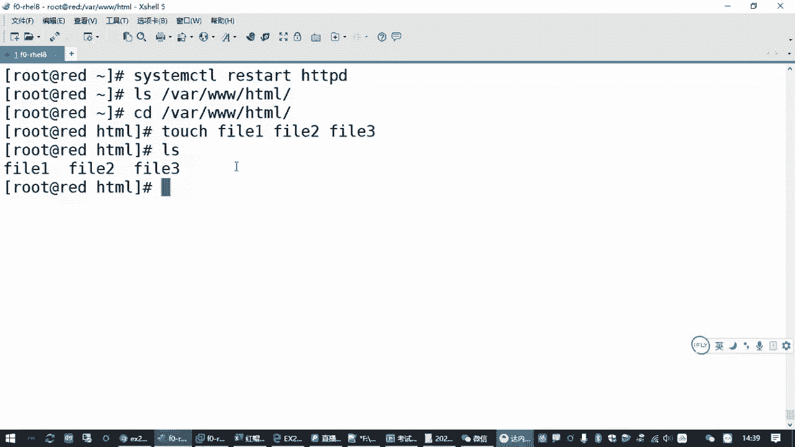

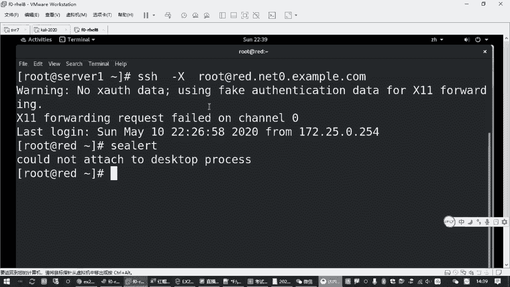

服务启动后，还需要确保能够通过浏览器访问。这涉及Web服务器本身的目录索引功能和系统防火墙设置。

默认情况下，如果Web目录（`/var/www/html/`）下没有 `index.html` 文件，HTTPD会尝试列出目录内的所有文件。但在RHEL 8中，默认启用了一个“欢迎页面”配置，它会阻止目录列表，转而显示一个测试页。

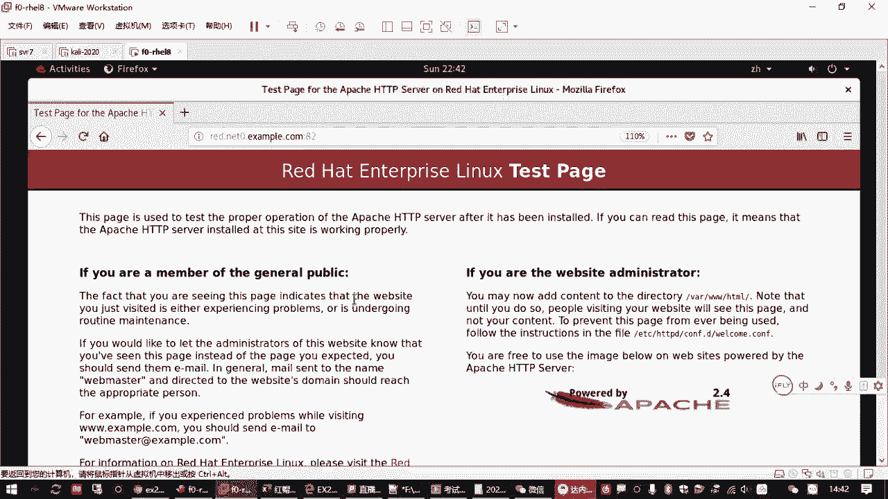

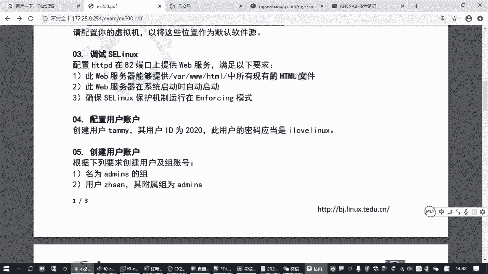

这个欢迎页的配置文件是 `/etc/httpd/conf.d/welcome.conf`。为了满足题目要求“能够提供该目录下所有现有的HTML文件”，我们需要禁用这个欢迎页：
```bash
mv /etc/httpd/conf.d/welcome.conf /etc/httpd/conf.d/welcome.conf.bak
```
或者直接删除它。然后重启HTTPD服务。

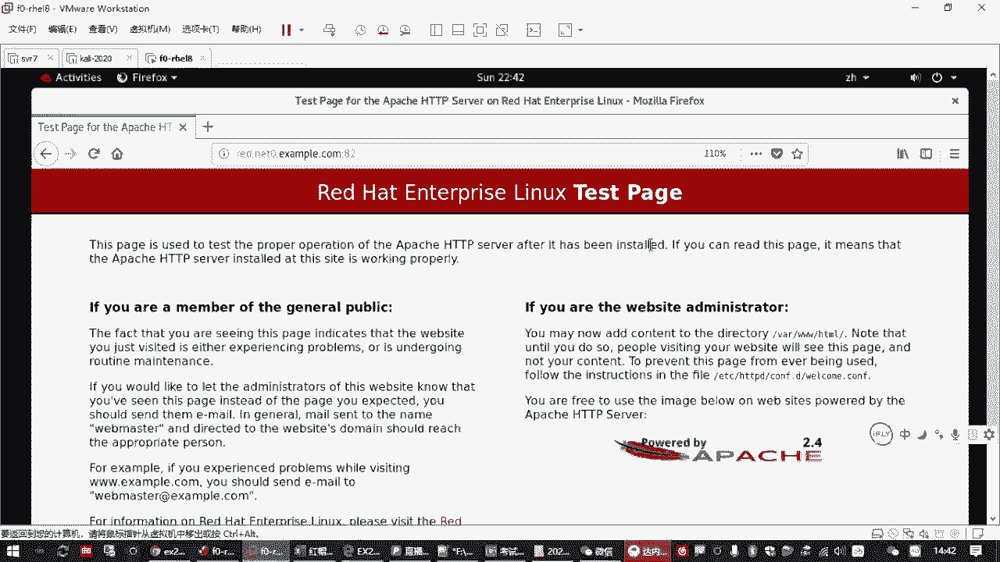

此外，系统防火墙（firewalld）默认会阻止外部对82端口的访问。我们需要确保防火墙服务已停止并禁用：
```bash
systemctl stop firewalld
systemctl disable firewalld
```
完成以上步骤后，即可通过浏览器访问 `http://<服务器IP地址>:82`，应该能看到 `/var/www/html/` 目录下的文件列表。

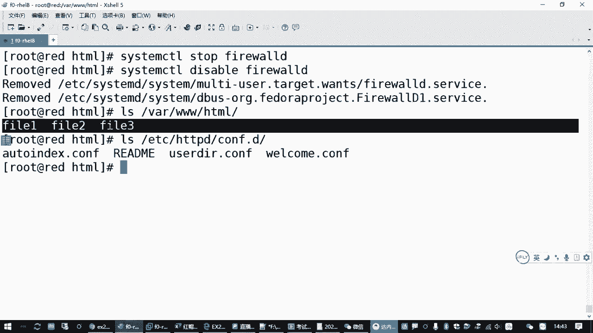

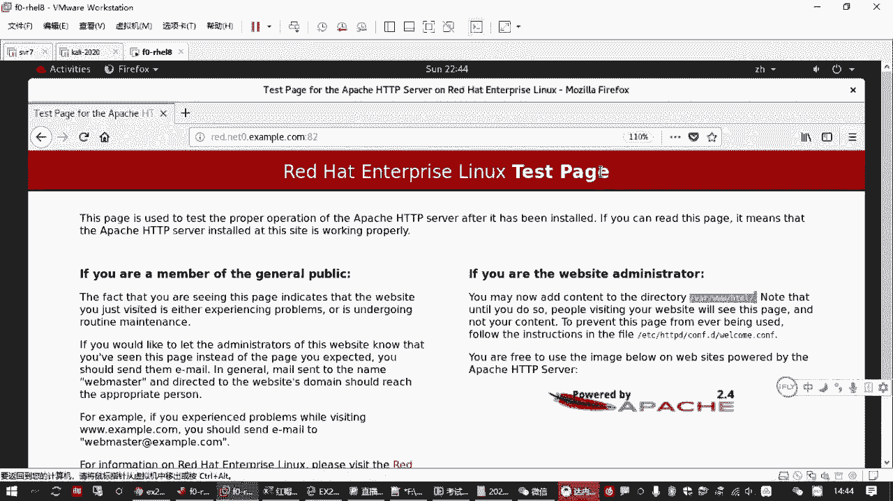

最后，别忘了将HTTPD服务设置为开机自启，以确保重启后配置依然有效：
```bash
systemctl enable httpd
```

## 课程总结

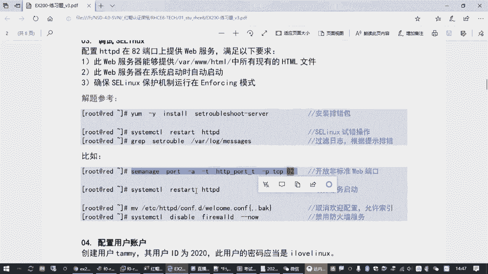

本节课中我们一起学习了SELinux的调试流程。我们从Yum源排错入手，回顾了SELinux的三种模式及其管理命令。核心内容是解决SELinux策略导致HTTPD无法在82端口监听的问题：通过安装 `setroubleshoot` 工具获取详细的错误日志和修复建议，使用 `semanage port -a` 命令修改SELinux端口策略。此外，我们还通过移除欢迎页配置和关闭防火墙，确保了Web服务的正常访问。整个过程涵盖了服务配置、SELinux策略调整和系统防火墙管理等多个RHCE认证考试的关键知识点。