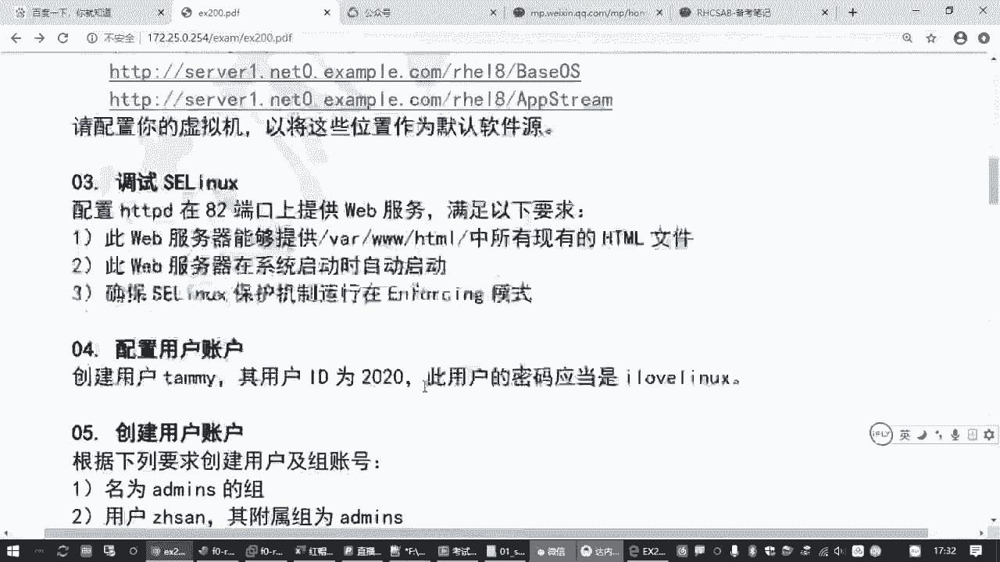
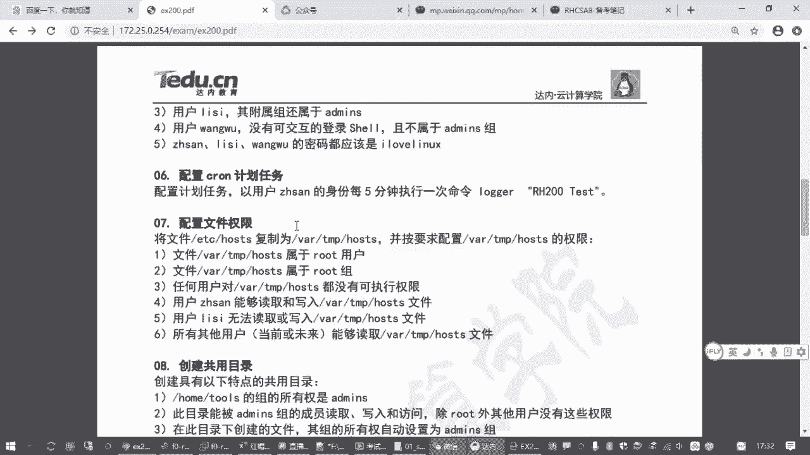
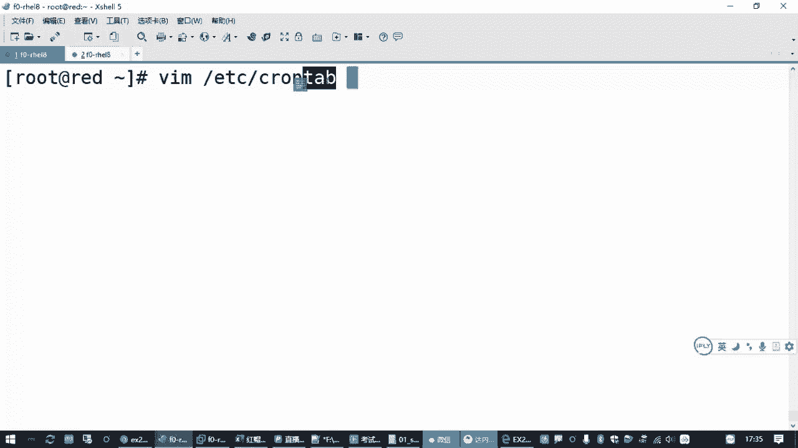
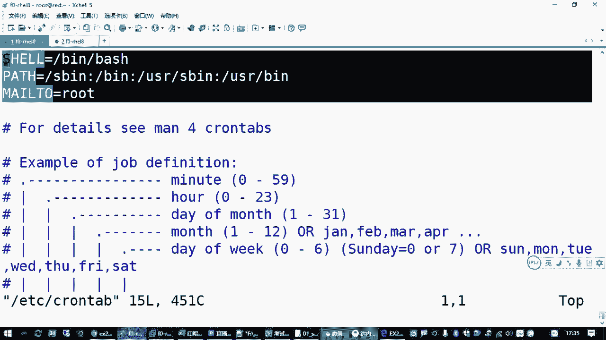
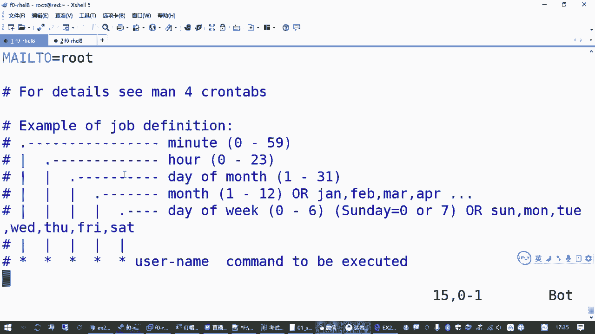
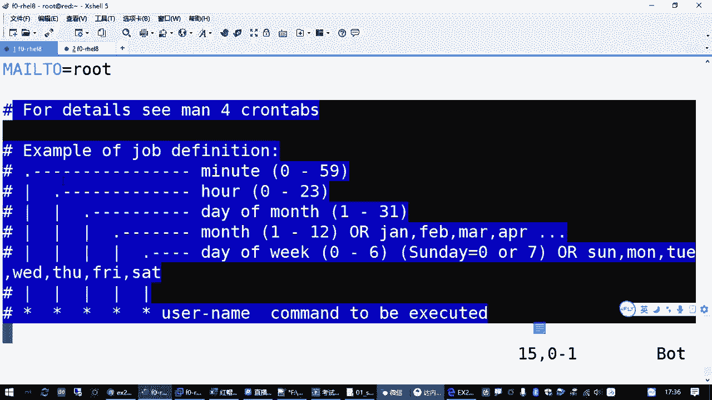
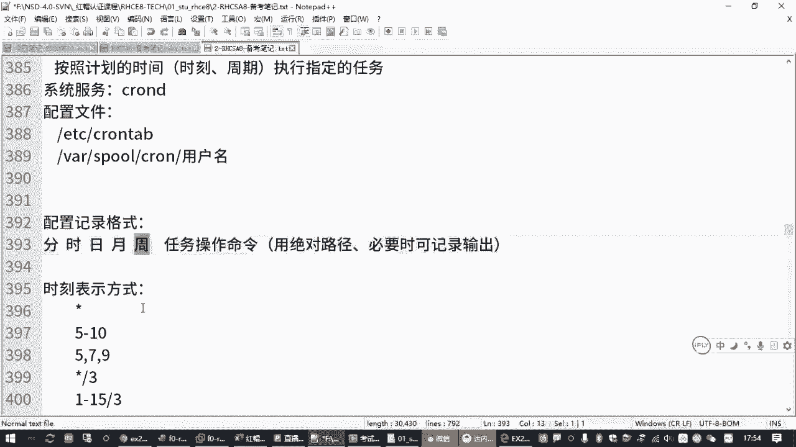

# RHCE红帽认证全套入门教程：P14：2.09-cron计划任务 📅





在本节课中，我们将要学习Linux系统中一个非常实用的功能——计划任务。我们将了解什么是计划任务，如何配置它，并掌握相关的核心命令和配置格式，以便在考试和实际工作中能够熟练运用。

## 什么是计划任务？ 🤔

计划任务，顾名思义，就是按照管理员预先规划好的时间点，在指定的时刻自动执行某个任务。例如，每周六晚上自动备份数据，或者工作日早上自动开启防火墙策略等。在红帽系统中，实现这一功能的核心服务是 `crond`。

## 核心服务与配置文件 🔧







`crond` 服务是实现计划任务的基础。它通常随系统自动安装并默认开机自启。我们可以通过以下命令检查其状态：
```bash
systemctl status crond
```



计划任务的全局配置文件位于 `/etc/crontab`。这个文件定义了系统级别的任务，其格式包含时间字段和执行命令的用户。文件中的注释部分提供了配置示例，是很好的学习参考。

## 计划任务的时间格式 ⏰

上一节我们介绍了计划任务的基本概念，本节中我们来看看如何精确地指定任务执行的时间。计划任务的时间由五个字段组成，其顺序和含义如下：

**分 时 日 月 周**

以下是每个字段的详细说明：
*   **分**：分钟 (0-59)
*   **时**：小时 (0-23)
*   **日**：一个月中的第几天 (1-31)
*   **月**：一年中的第几个月 (1-12)
*   **周**：一周中的星期几 (0-7，其中0和7都代表星期日)

时间字段支持多种特殊符号来表示复杂的周期：
*   `*`：代表该字段的所有有效值（例如，在“分”字段使用 `*` 表示每分钟）。
*   `,`：指定一个列表（例如 `1,3,5` 表示第1、3、5分钟）。
*   `-`：指定一个范围（例如 `9-17` 表示9点到17点）。
*   `/`：指定间隔频率（例如在“分”字段使用 `*/5` 表示每5分钟）。

**重要提示**：`日`和`周`字段是“或”的关系。如果同时指定，只要满足其中一个条件，任务就会执行。为避免混淆，通常只使用其中一个字段来定义日期。

## 管理计划任务的工具 🛠️

了解了时间格式后，我们来看看如何具体地创建和管理计划任务。系统提供了 `crontab` 命令工具，它比直接编辑配置文件更安全、更方便。

以下是 `crontab` 命令的常用操作：
*   `crontab -e`：编辑当前用户的计划任务列表。
*   `crontab -l`：列出当前用户的计划任务。
*   `crontab -r`：删除当前用户的所有计划任务。

**管理员操作**：如果需要为其他用户（例如用户 `zhangsan`）管理计划任务，可以在命令后加上 `-u` 选项，例如：
```bash
crontab -e -u zhangsan  # 编辑zhangsan的计划任务
crontab -l -u zhangsan  # 查看zhangsan的计划任务
```

使用 `crontab -e` 命令会调用默认的文本编辑器（如 `vi`）打开一个临时文件。编辑完成后保存退出，系统会自动安装新的计划任务表并通知 `crond` 服务。

## 实战演练：配置计划任务 🎯

现在，让我们通过一个实际例子来巩固所学知识。假设我们需要完成以下题目要求：
> 以用户 `zhangsan` 的身份，每5分钟执行一次命令 `/bin/echo “hello”`。

操作步骤如下：
1.  以管理员身份，为用户 `zhangsan` 编辑计划任务：
    ```bash
    crontab -e -u zhangsan
    ```
2.  在打开的编辑器中，按 `i` 键进入插入模式，输入以下内容：
    ```
    */5 * * * * /bin/echo “hello”
    ```
    **格式解析**：`*/5` 表示每5分钟，后面四个 `*` 表示每天、每月、每周的任何时间都匹配，最后是要执行的命令。
3.  按 `ESC` 键退出插入模式，输入 `:wq` 保存并退出编辑器。
4.  系统会提示 `crontab: installing new crontab`，表示任务已成功添加。
5.  可以使用 `crontab -l -u zhangsan` 命令来验证任务是否已正确列出。

**检查执行情况**：计划任务执行后，其日志会记录在 `/var/log/cron` 文件中。我们可以使用 `tail -f /var/log/cron` 命令来实时查看日志，确认任务是否按计划执行。

## 要点总结与注意事项 📝

本节课中我们一起学习了Linux计划任务 `cron` 的配置与管理。我们来回顾一下核心要点：

1.  **服务是基础**：确保 `crond` 服务处于运行状态。
2.  **格式是关键**：牢记时间字段的顺序 **分 时 日 月 周**，并熟练使用 `*`， `,`， `-`， `/` 等符号。
3.  **工具要熟练**：掌握 `crontab -e`， `-l`， `-r` 命令来编辑、查看和删除计划任务。为其他用户操作时使用 `-u` 选项。
4.  **路径建议用绝对路径**：在计划任务中执行的命令，**强烈建议使用绝对路径**（如 `/bin/echo`），以避免因环境变量问题导致命令执行失败。
5.  **排错有方法**：编辑时如果时间格式错误，`crontab` 会拒绝保存并给出提示。可以通过查看 `/var/log/cron` 日志文件来验证任务的实际执行情况。



通过本课的学习，你已经掌握了配置和管理计划任务的基本技能，这对于系统自动化运维至关重要。